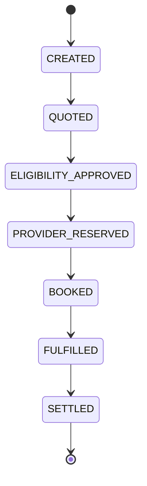

# Access Transaction State Machine

ACCESS Wave 3 / Prompt 37 — authoritative transaction orchestration for SunRey Access.

## Purpose

The `AccessTransactionOrchestrator` connects entitlement reservation, funding reservation, provider quote/booking, user co-pay, virtual-card provider settlement, fulfillment evidence, cancellation, refund, and reconciliation without duplicating Wave 1–2 owners.

Canonical implementation: `packages/access-economy/src/transaction/`.

## State vocabulary

Extended `ACCESS_TRANSACTION_STATUSES` in `packages/access-economy/src/domain/taxonomy.ts` includes:

| Phase | States |
|-------|--------|
| Discovery / quote | `CREATED`, `DISCOVERED`, `QUOTED`, `REQUOTE_REQUIRED` |
| Eligibility / holds | `ELIGIBLE`, `ELIGIBILITY_APPROVED`, `ENTITLEMENT_RESERVED`, `FUNDING_RESERVED`, `RESERVED` |
| Payments | `USER_PAYMENT_AUTHORIZED`, `PROVIDER_RESERVED`, `PROVIDER_PAYMENT_AUTHORIZED` |
| Booking | `BOOKING_PENDING`, `BOOKED` |
| Fulfillment | `FULFILLMENT_PENDING`, `FULFILLED` |
| Settlement | `SETTLEMENT_PENDING`, `SETTLED` |
| Cancellation | `CANCEL_PENDING`, `CANCELLED` |
| Refund | `REFUND_PENDING`, `PARTIALLY_REFUNDED`, `REFUNDED` |
| Recovery | `RECONCILIATION_REQUIRED`, `REVIEW_REQUIRED`, `FAILED`, `DISPUTED` |

Illegal transitions are rejected by `AccessTransactionStateMachine` (`state-machine.ts`). The in-memory store enforces transitions on every write.

## State diagram (happy path)

## Orchestrator commands

| Command | Role |
|---------|------|
| `start` | Create transaction anchor (idempotent) |
| `quote` | Provider quote + `AccessCoverageEngine` checkout split |
| `approveEligibility` | Compliance/eligibility gate |
| `reserve` | Entitlement hold, funding hold, user auth, provider virtual-card auth, provider reservation |
| `book` | Provider booking + capture user/provider payments |
| `confirmFulfillment` | `AccessFulfillmentEvidence` + policy-driven consumption |
| `settle` | Mark settlement complete |
| `cancel` | Provider cancel + restoration/compensation |
| `refund` | Proportional refund allocation |
| `reconcile` | Provider booking status recovery after timeout |
| `requote` | Price-change handling → `REQUOTE_REQUIRED` |

## Saga compensation

On provider booking failure after holds, `compensateTransaction` (`saga.ts`) releases entitlement and funding reservations and voids uncaptured payment authorizations. Stranded holds are not left behind.

## Booking timeout

When provider booking succeeds but the HTTP response times out, state moves to `RECONCILIATION_REQUIRED`. `reconcile()` calls `ConfigurableSimulationProvider.getBookingStatus()` with the booking idempotency key — never blindly re-books.

## Entitlement consumption

`AccessFulfillmentPolicy` (`fulfillment-policy.ts`) defines per-category consumption timing:

- **Mobility / lodging / food**: consume at fulfillment
- **Experiences**: consume at irreversible issuance
- **AI compute / energy**: consume at usage

## Idempotency

- Transaction `start` keyed by client idempotency key
- Provider book/payment capture/webhook handlers deduplicate by idempotency key
- Store versioning prevents concurrent double-spend on the same transaction

## Webhooks

`AccessWebhookOrchestrator` verifies signatures, deduplicates events, and applies only legal transitions (never arbitrary state sets).

## Financial invariants (orchestration layer)

At checkout quote issuance:

`providerTotal = accessPool + userContribution + tokenConversion` (token conversion remains `0` at launch).

Committed funding and entitlement reservations are enforced by Wave 1 `AccessSolvencyService` stores before booking proceeds.
