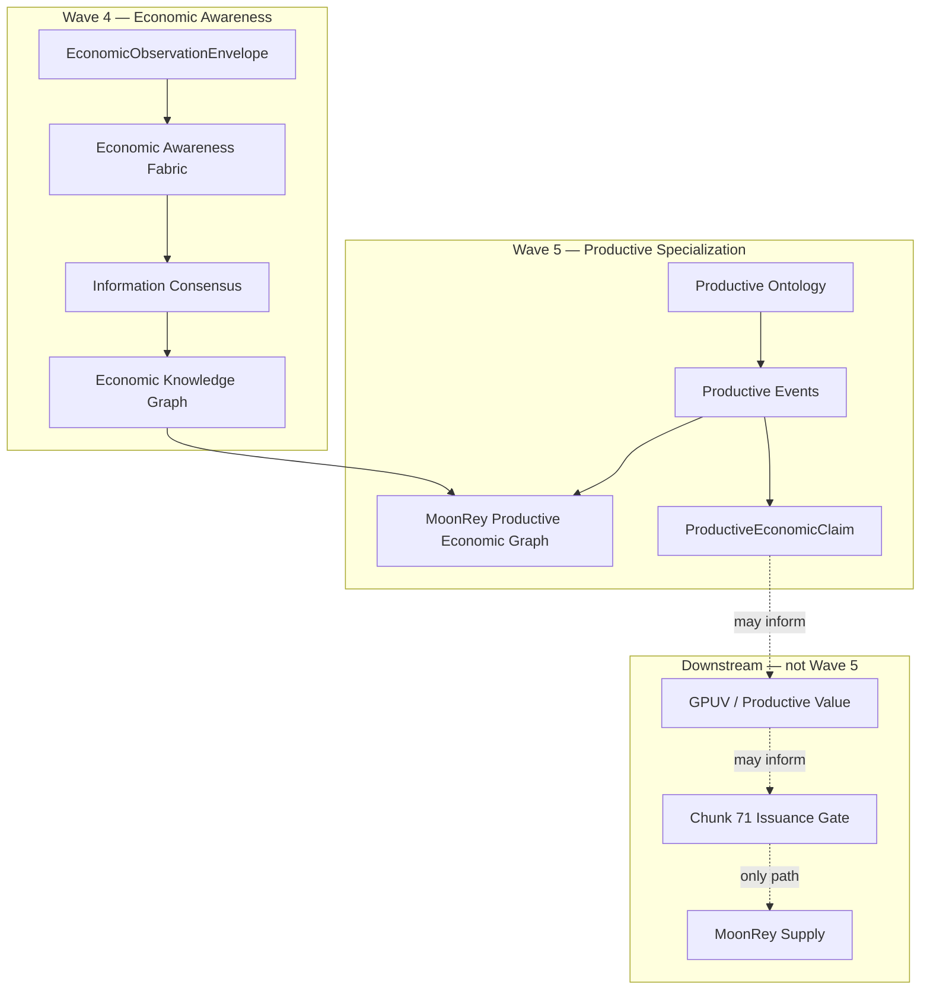
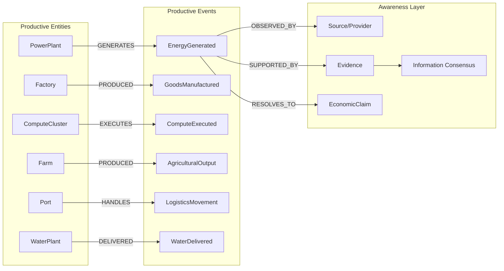

# MoonRey Productive Economic Graph

**Program:** SunRey Sovereign Architecture — Wave 5  
**Status:** Simulation projection layer  
**Owner:** `packages/economic-asset-registry/src/knowledge-graph` (graph) + `packages/sunrey-chain/src/productive/ontology/graph.ts` (projection)

The MoonRey Productive Economic Graph is a **specialized projection** of the Wave 4 Economic
Knowledge Graph for productive-economy relationships. It is rebuildable, non-authoritative,
and cannot mint MoonRey or issue Execution Authority.

Chunk 44 `buildProductiveCapacityGraph` remains the capacity-oriented productive projection.
Wave 5 adds **event-centric** relationships aligned with the productive ontology.

---

## Position in the stack

---

## Node classes (productive domain)

Uses Wave 4 knowledge graph node classes scoped to `PRODUCTIVE_ECONOMY`:

| Node class | Role |
| --- | --- |
| FACILITY | Power plants, factories, ports, farms, water plants |
| PRODUCTIVE_ASSET | Compute clusters, accelerators, fleets |
| ECONOMIC_EVENT | Bounded productive event (generation, execution, movement) |
| PROVIDER | Observation source |
| EVIDENCE | Supporting evidence digest |
| ECONOMIC_CLAIM | Canonical productive claim reference |
| VERIFIED_FACT | Information-consensus output (linked, not duplicated) |

---

## Relationship kinds

Wave 5 extends Wave 4 productive templates with:

| Relation | Pattern | Example |
| --- | --- | --- |
| GENERATES | Entity → Event | PowerPlant → EnergyGenerated |
| DELIVERED | Entity → Event | GridResource → EnergyDelivered, WaterPlant → WaterDelivered |
| PRODUCED | Entity → Event | Factory → GoodsManufactured, Farm → AgriculturalOutput |
| EXECUTES | Entity → Event | ComputeCluster → ComputeExecuted |
| HANDLES | Entity → Event | Port → LogisticsMovementCompleted |
| OBSERVED_BY | Event → Source | ProductiveEvent → Provider |
| SUPPORTED_BY | Event → Evidence | ProductiveEvent → Evidence |
| RESOLVES_TO | Event → Claim | ProductiveEvent → CanonicalEconomicClaim |

Authorization-gated relations (`OWNED_BY`, `AUTHORIZED_BY`) remain unchanged from Wave 4.

---

## Graph diagram (productive economy)

---

## Projection API

`projectProductiveEventToGraph` in `packages/sunrey-chain/src/productive/ontology/graph.ts`:

1. Validates event material through ontology controls
2. Builds entity and event nodes
3. Materializes asset→event edge using `PRODUCTIVE_EVENT_RELATIONS`
4. Links sources (`OBSERVED_BY`) and evidence (`SUPPORTED_BY`)
5. Optionally links claim (`RESOLVES_TO`)

The projection is **idempotent on node material** and safe to rebuild from authoritative fixtures.

---

## Event vs capacity in the graph

Capacity and stock observations **do not** receive productive event nodes.

| Observation | Graph treatment |
| --- | --- |
| INSTALLED_MW on SolarInstallation | Entity metadata only; no GENERATES edge |
| ENERGY_GENERATED in bounded interval | Full event subgraph |
| reservoir_level_ml | Entity stock state; no DELIVERED edge |
| WATER_DELIVERED volume | Full event subgraph |
| CPU_TEMPERATURE telemetry | Rejected — no graph materialization |

---

## Stock vs flow in the graph

Stock-level observations may appear as entity payload or RESOURCE nodes but must not
generate repeated FLOW event nodes for the same stock fingerprint.

`refuseDuplicateStockMonetization` guards against treating recurring stock readings as
new production when building claim linkages.

---

## Integration with Information Consensus

Productive events carry `consensusReceiptRef` in claim extensions. The graph stores the
receipt reference on the event→claim path; consensus evaluation remains in
`packages/sunrey-chain/src/economic-awareness-fabric/information-consensus`.

Single-source observations may link to providers but do not satisfy consensus requirements
for claim promotion (`SINGLE_SOURCE_IS_NOT_CONSENSUS`).

---

## What the graph must not do

| Prohibited | Reason |
| --- | --- |
| Mint MoonRey | Monetary authority is Chunk 71 only |
| Store balances | Balances are ledger-derived |
| Replace productive registry | Chunk 44 objects remain authoritative |
| Replace oracle facts | Oracle engine remains separate owner |
| Conflate GPUV with events | GPUV is methodology output, not observation |
| Place raw credentials on graph | Privacy / purpose firewall |

---

## Persistence

Wave 4 PostgreSQL adjacency backend (`economic_knowledge_graph` schema, migration V041)
stores nodes and edges. Productive projections use the same backend; no second graph database.

---

## Tests

- `packages/sunrey-chain/src/productive/ontology/productive-ontology.test.ts` — projection unit tests
- `packages/economic-asset-registry/src/knowledge-graph.test.ts` — Wave 4 graph service (extended relations)
- `tests/wave-5-productive-economy-ontology.test.ts` — cross-package integration

---

## Related documents

- [`WAVE5_PRODUCTIVE_ECONOMY_ONTOLOGY.md`](./WAVE5_PRODUCTIVE_ECONOMY_ONTOLOGY.md)
- [`WAVE4_ECONOMIC_KNOWLEDGE_GRAPH.md`](./WAVE4_ECONOMIC_KNOWLEDGE_GRAPH.md)
- [`WAVE4_INFORMATION_CONSENSUS.md`](./WAVE4_INFORMATION_CONSENSUS.md)
- [`WAVE3_ECONOMIC_CLAIMS_AND_DEDUPLICATION.md`](./WAVE3_ECONOMIC_CLAIMS_AND_DEDUPLICATION.md)

---

*End of MoonRey Productive Economic Graph specification.*
