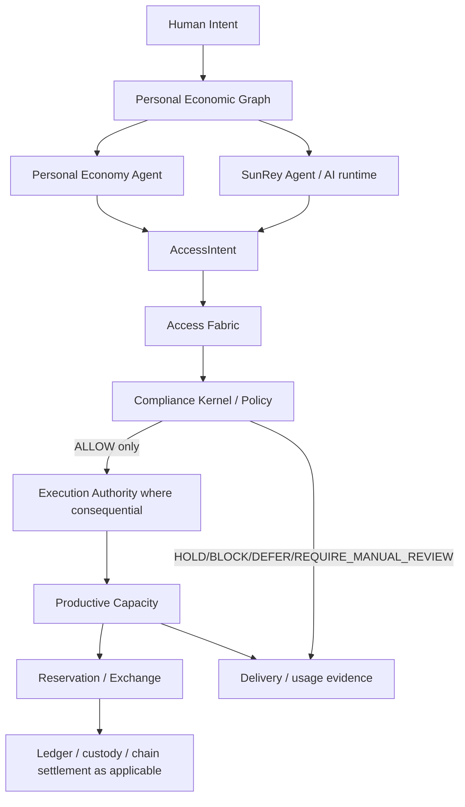

# SunRey Access Fabric / Human Access Economy

**ACCESS-01 — Architecture freeze, domain boundary, and canonical ownership**

Engineering status: `IMPLEMENTED` (foundation only)  
Legal / regulatory confidence: `RESEARCH_REQUIRED` — not legal advice  
Production posture: `simulation` — `LIVE_*` remains disabled

## Purpose

The SunRey Access Fabric lets humans obtain **time-bounded, quantity-bounded,
location-bounded, or usage-bounded** access to productive capacity such as:

- vehicle-hours
- housing / room-nights
- transportation
- travel
- food
- energy
- compute
- robots
- manufacturing
- goods
- services
- experiences

It integrates with the existing SunRey + MoonRey dual-economy architecture.
It does **not** create a parallel monetary, compliance, custody, exchange,
oracle, blockchain, or intelligence authority.

Canonical owner: `packages/access-economy`  
Capability: `sunrey-access-fabric`  
Public interface: `packages/access-economy/src/index.ts`

## AccessRight (conceptual)

An **AccessRight** is a governed, non-ownership economic right over an
existing economic object or productive capacity.

An AccessRight:

- is **not** ownership
- is **not** money
- is **not** a security (by architectural assumption)
- does **not** authorize minting
- does **not** imply settlement
- does **not** value a human being
- does **not** create productive capacity
- does **not** override legal rights
- does **not** bypass policy

ACCESS-01 defines the type contract and in-memory orchestration skeleton only.
Reservation, Exchange matching, Kernel submission, Execution Authority, ledger
posting, custody movement, and delivery evidence binding are owned elsewhere
and are out of scope until later ACCESS chunks.

## Canonical ownership matrix

| Authority | Canonical owner | Authoritative path | Access Fabric role |
| --- | --- | --- | --- |
| Money (minor units) | `packages/money` | `packages/money/src/money.ts` | none — no balances |
| Identity truth | `packages/identity` | `packages/identity/src/service.ts` | consumes subject refs only |
| Personal Economic Graph | `packages/personal-economic-graph` | `packages/personal-economic-graph/src/service.ts` | upstream intent context |
| Personal Economy Agent | `packages/agent` | `packages/agent/src/service.ts` | proposes; cannot execute |
| SunRey Agent (ProposalGate) | `packages/sunrey-agent` | `packages/sunrey-agent/src/engine.ts` | bounded proposals only |
| AI runtime | `packages/ai-runtime` | `packages/ai-runtime/src/runtime.ts` | analysis/proposal only |
| Access domain orchestration | `packages/access-economy` | `packages/access-economy/src/service.ts` | **owns AccessRight / AccessIntent records** |
| Compliance Kernel | `packages/kernel` | `packages/kernel/src/kernel.ts` | downstream policy gate |
| Execution Authority | `packages/permissions` | `packages/permissions/src/execution-authority.ts` | issued only by Kernel on ALLOW |
| Evidence Vault | `packages/evidence` | `packages/evidence/src/vault.ts` | seals all consequential outcomes |
| Regulatory Digital Twin | `packages/regulatory-twin` | `packages/regulatory-twin/src/service.ts` | simulation counterfactual only |
| Ledger (fiat journal) | `packages/ledger` | `packages/ledger/src/journal.ts` | settlement when applicable |
| Custody | `packages/custody` | `packages/custody/src/index.ts` | custody balances when applicable |
| Exchange | `packages/sunrey-exchange` | `packages/sunrey-exchange/src/service.ts` | reservation / market when applicable |
| Payments / FX | `packages/payments` | `packages/payments/src/service.ts` | rail settlement when applicable |
| SunRey Chain | `packages/sunrey-chain` | `packages/sunrey-chain/src/chain/service.ts` | chain settlement when applicable |
| SunRey Coin supply | `packages/sunrey-chain` | `packages/sunrey-chain/src/economics/supply.ts` | human-economic native asset |
| MoonRey Coin supply | `packages/sunrey-chain` | `packages/sunrey-chain/src/economics/supply.ts` | productive-economy native asset |
| Oracle consensus | `packages/sunrey-chain` | `packages/sunrey-chain/src/oracle/engine.ts` | verified productive facts |
| Productive capacity / MoonRey | `packages/sunrey-chain` | `packages/sunrey-chain/src/productive/` | capacity objects and claims |
| Economic asset metadata | `packages/economic-asset-registry` | `packages/economic-asset-registry/src/registry.ts` | descriptor index, not access truth |
| Consumer BFF | `services/api` | `services/api/src/consumer/orchestrator.ts` | HTTP orchestration only |

## Canonical flow (ACCESS-01 freeze)

Narrative:

1. **Human Intent** enters the Personal Economic Graph as structured context.
2. The **Personal Economy Agent** or **SunRey Agent** may propose an
   `AccessIntent`. An `AccessIntent` is **not** an `ActionIntent`.
3. **Access Fabric** validates access-domain structure and records the intent
   or resulting `AccessRight` proposal. It does not approve compliance or
   issue Execution Authority.
4. Consequential movement routes through the **Compliance Kernel**. Only
   **ALLOW** may issue scoped **Execution Authority**.
5. **Productive capacity** objects remain owned by the productive economy on
   SunRey Chain. Access Fabric references capacity; it does not mint capacity.
6. **Reservation / Exchange** handles market or contract placement when needed.
7. **Ledger / custody / chain** settle only through their canonical owners when
   a governed path requires it.
8. **Delivery / usage evidence** is recorded as evidence, not as money.

## Explicit non-goals (ACCESS-01)

The Access Fabric does **not** create:

- Access Coin or any new cryptocurrency
- a fixed SunRey/MoonRey peg
- a human-worth or social-credit score
- a second Ledger, blockchain, Exchange, custody system, Compliance Kernel,
  Execution Authority, oracle network, monetary issuance authority, Personal
  Economic Graph, Productive Economy, or Regulatory Digital Twin

## Package boundary

`packages/access-economy` may orchestrate access-domain logic but **must not**
own:

- monetary supply
- financial settlement
- fiat balances
- custody balances
- exchange balances
- compliance approval
- Execution Authority
- oracle consensus
- legal eligibility truth
- human identity truth

Machine-readable boundary: `ACCESS_ECONOMY_ISOLATION` in
`packages/access-economy/src/isolation.ts`.

## Related records

- ADR: [`adr/ADR-0034-sunrey-access-fabric.md`](./adr/ADR-0034-sunrey-access-fabric.md)
- Chunk: [`chunk-169-access-fabric-foundation.md`](./chunk-169-access-fabric-foundation.md)
- Productive capacity market (Exchange): [`productive-capacity-market.md`](./productive-capacity-market.md)
- Authority map: [`../productization/sunrey-authority-map.json`](../productization/sunrey-authority-map.json)

This document is not `CONFIRMED_BY_COUNSEL`.
