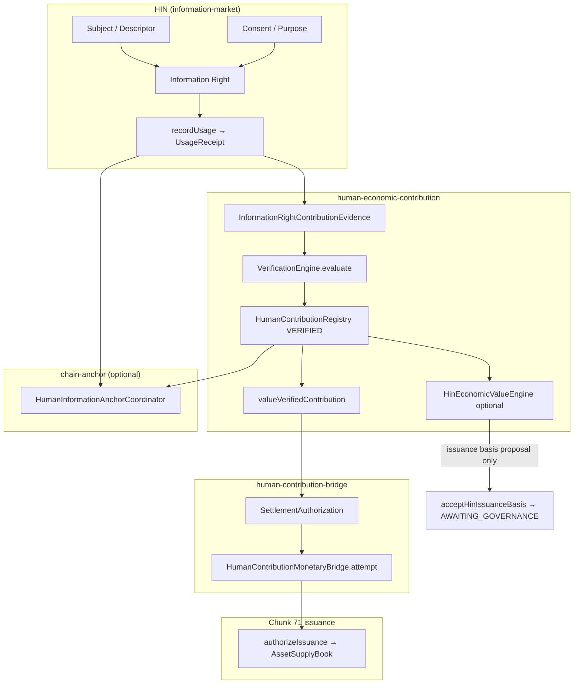
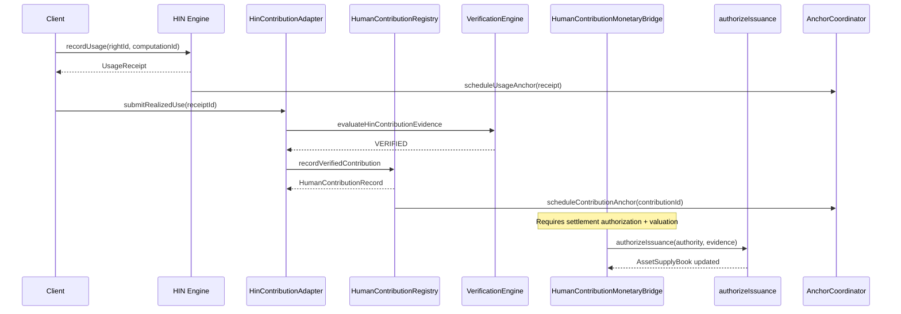
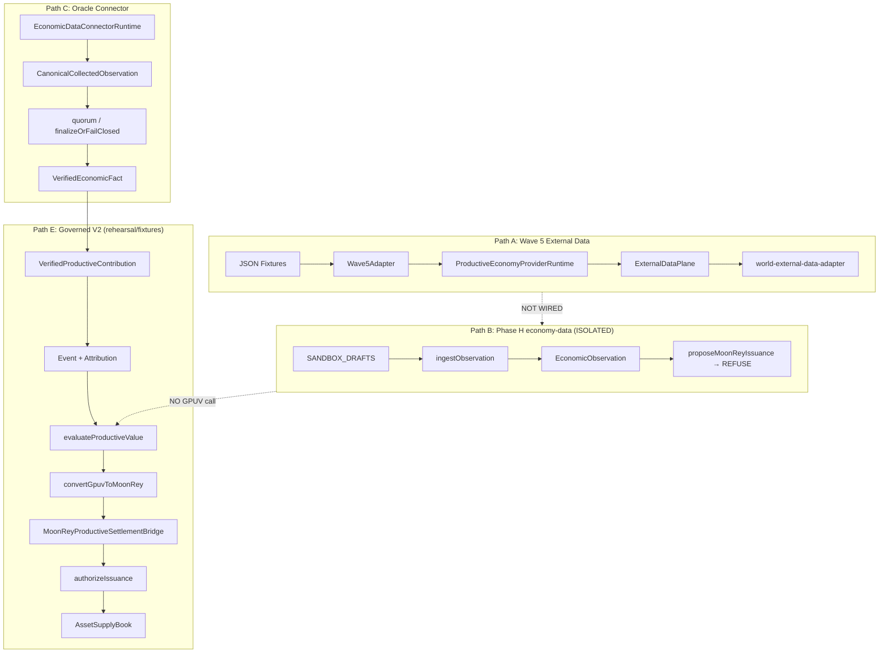
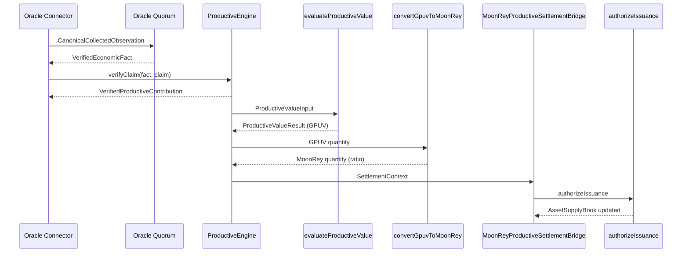
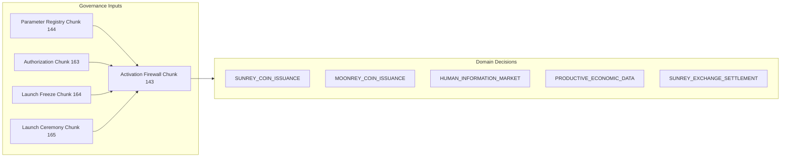
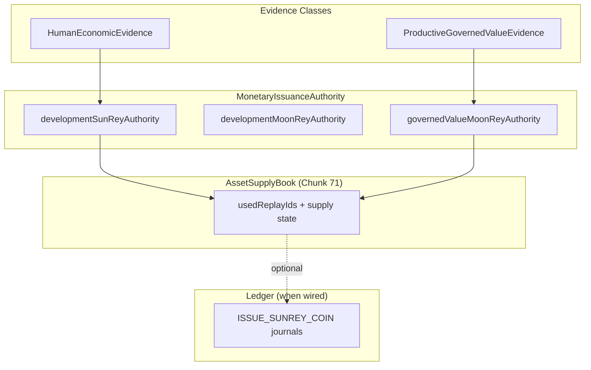
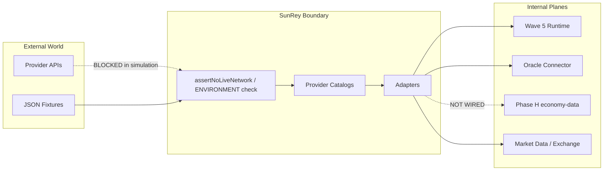
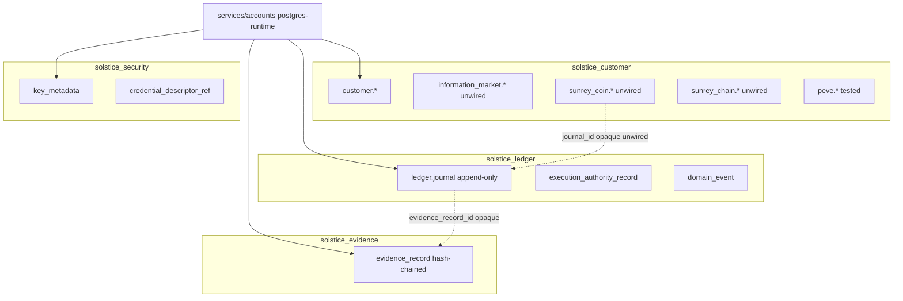
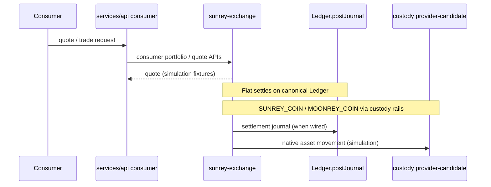

# SunRey Economic Information Flow — Wave 1 Audit

**Status:** Wave 1 documentation only. No production behavior changes.  
**Date:** 2026-09-02  
**Environment:** `ENVIRONMENT=simulation`; all `LIVE_*` flags `false`.

This document traces every major information flow that can eventually influence **SunRey Coin** or **MoonRey Coin**. It maps what exists today against the future target model:

```
REAL-WORLD INFORMATION
  → OBSERVATION
  → EVIDENCE
  → VERIFIED ECONOMIC FACT
  → CANONICAL ECONOMIC CLAIM
  → ECONOMIC VALUATION
  → MONETARY POLICY
  → GOVERNANCE
  → BLOCKCHAIN STATE TRANSITION
```

Many stages are **collapsed** in the current repository. This audit documents real implementation, not aspirational architecture.

---

## Table of Contents

1. [Stage Presence Matrix](#stage-presence-matrix)
2. [A. SunRey Human Economy](#a-sunrey-human-economy)
3. [B. MoonRey Productive Economy](#b-moonrey-productive-economy)
4. [C. Shared Governance Layer](#c-shared-governance-layer)
5. [D. Shared Native Asset Layer](#d-shared-native-asset-layer)
6. [E. External Information Boundary](#e-external-information-boundary)
7. [F. Database Persistence](#f-database-persistence)
8. [G. Exchange Boundary](#g-exchange-boundary)
9. [Collapsed Concepts](#collapsed-concepts)
10. [Replay and Double-Counting Risks](#replay-and-double-counting-risks)
11. [Persistence Gaps](#persistence-gaps)
12. [Trust Gaps](#trust-gaps)
13. [Future Architectural Distinctions (Wave 3 Prep)](#future-architectural-distinctions-wave-3-prep)

---

## Stage Presence Matrix

| Future Stage | SunRey Human Economy | MoonRey Productive Economy | Notes |
|---|---|---|---|
| Real-world information | HIN subjects, rights, usage receipts; PDV/clean-room refs (hashed) | Wave 5 fixtures, oracle connector drafts, sandbox economy-data | No live provider network under simulation |
| Observation | `HumanInformationUsageReceipt`, `HinSubmitInput` | `ExternalObservation`, `EconomicObservation`, `CanonicalCollectedObservation` | **Three parallel observation types**; not unified |
| Evidence | `InformationRightContributionEvidence`, `HumanContributionEvidenceBundle` | Oracle observations, productive claim evidence | Evidence ≠ observation in HEC; partially collapsed in economy-data |
| Verified economic fact | `HumanContributionRegistryRecord` (VERIFIED) | `VerifiedEconomicFact` (oracle quorum), verified productive contribution | Separate registries; no cross-link |
| Canonical economic claim | `HumanContributionEvent` + fingerprint | `ProductiveClaim` / `ProductiveClaimCandidate` | Fingerprint dedup on both paths |
| Economic valuation | `ValuationResult` (`sunReyQuantity: null`), `HinEconomicValueInput` | `ProductiveValueResult` (GPUV) | Valuation explicitly cannot mint alone |
| Monetary policy | `NativeAssetConstitution`, conversion policies | `MoonReyProductiveSettlementConversionPolicy`, epoch caps | Simulation fixtures only |
| Governance | `ProductionEconomicActivationFirewall`, settlement authorizations, `acceptHinIssuanceBasis` | Same firewall + `MoonReyProductiveSettlementAuthorization` | Evaluator-only; no `activateProduction()` |
| Blockchain state transition | `HumanInformationAnchorCoordinator`, `SunReyChainService` | Chain commitments via productive engine; unwired PG | Chain ≠ issuance authority |

---

## A. SunRey Human Economy

### A.1 Architecture Overview



### A.2 End-to-End Transition Table

| # | Input Type | Output Type | Module | Function/Class | Persisted | Authority | Trust Assumption | Replay Protection | Idempotency | Environment |
|---|---|---|---|---|---|---|---|---|---|---|
| 1 | Right + computation request | `HumanInformationUsageReceipt` | `information-market/network/engine.ts` | `HumanInformationNetworkEngine.recordUsage` | In-memory (`HumanInformationNetworkStore`) | HIN engine (no EA) | Active right, allow-listed computation | New `receiptId` per call; digest binds `rightId:requesterId:computationId` | Per-call unique ID | simulation |
| 2 | `HumanInformationUsageReceipt` | `HinAnchorRequest` | `information-market/network/chain-anchor/schedule.ts` | `scheduleUsageAnchor` | In-memory anchor store | Non-authoritative attestation | Chain simulation only | `findBySource(kind, sourceRecordId)` dedupes | Source-key dedup | simulation |
| 3 | `receiptId` | `HinContributionContext` | `information-market/network/contribution/invariants.ts` | `evaluateHinContributionInvariants` | — | Read-only gate | HIN store truth | Receipt digest tamper check | — | simulation |
| 4 | receipt + engine | `InformationRightContributionEvidence` | `information-market/network/contribution/evidence.ts` | `toInformationRightContributionEvidence` | — | Normalization only | Privacy-safe refs/hashes only | — | — | simulation |
| 5 | evidence | `{contributionId, decision:'VERIFIED'}` | `information-market/network/contribution/registry.ts` | `evaluateHinContributionEvidence` | — | Chunk 109 verification | `ENGINEERING_VERIFICATION_POLICY` | Fingerprint from `fingerprintEconomicEvent` | — | simulation |
| 6 | `receiptId` | `HumanContributionRecord` | `information-market/network/contribution/adapter.ts` | `HinContributionAdapter.submitRealizedUse` | Registry port + projection maps | Adapter orchestration | Registry port is SoR | `getByUsageReceiptId` / `DUPLICATE_USAGE_RECEIPT` | `byReceipt` index | simulation |
| 7 | evidence | `HumanContributionRegistryRecord` | `human-economic-contribution/registry.ts` | `submit` / `verify` | In-memory Map (+ optional `HumanContributionRegistryStore`) | Registry SoR | Fingerprint uniqueness | `DUPLICATE_FINGERPRINT`; `activeVerifiedHolder` | Fingerprint-scoped | simulation |
| 8 | `contributionId` | `HumanInformationAnchor` | `information-market/network/chain-anchor/coordinator.ts` | `prepare` / `submit` | In-memory | Chain write intent | SunRey Chain simulation | `bySource` map | Source-key dedup | simulation |
| 9 | `HinSubmitInput` | `HinContributionRecord` | `human-economic-contribution/hin-value/engine.ts` | `HinEconomicValueEngine.submitFromAuthorizedSource` | In-memory product index | Authorized source / governance | Category registry | `hinReplayKey` → `REPLAYED_EVENT` | Replay key map | simulation |
| 10 | verified record + methodology | `HinEconomicValueInput` | `human-economic-contribution/hin-value/value-input.ts` | `computeHinEconomicValueInput` | In-memory value maps | Methodology registry | Caps applied | One value input per contribution | Per-contribution | simulation |
| 11 | value input | `HinIssuanceBasisProposal` | `human-economic-contribution/hin-value/issuance-basis.ts` | `createHinIssuanceBasisProposal` | — | Proposal only | `mintRequested: false` | — | — | simulation |
| 12 | proposal | `NativeIssuanceProposal` (draft) | `sunrey-chain/economics/human-contribution-bridge/hin-issuance-basis.ts` | `acceptHinIssuanceBasis` | — | Phase G governance gate | `hinCannotMint()` | — | `amount: 0n`, `AWAITING_GOVERNANCE` | simulation |
| 13 | verified contribution + policy | `ValuationResult` | `human-economic-contribution/valuation/engine.ts` | `valueVerifiedContribution` | — | Reference value only | `sunReyQuantity: null` | Valuation digest SHA-256 | `REVALUATION_DOES_NOT_REMINT` | simulation |
| 14 | valuation + contribution | `HumanContributionSettlementAuthorization` | `sunrey-chain/economics/human-contribution-bridge/authorization.ts` | `createValuationSettlementAuthorization` | — | Human/protocol/fixture | Quantity separately authorized | Binds fingerprint, valuationId, conversion policy | Authorization ID scoped | simulation |
| 15 | verified + authorization | `HumanEconomicEvidence` | `sunrey-chain/economics/human-contribution-bridge/evidence.ts` | `toHumanEconomicEvidence` | — | Privacy-safe hash | No raw PDV/clean-room | `evidenceHash` over bound fields | — | simulation |
| 16 | `HumanContributionSettlementRequest` | issuance result | `sunrey-chain/economics/human-contribution-bridge/gate.ts` | `HumanContributionMonetaryBridge.attempt` | In-memory `HumanContributionSettlementBook` | Gate before mint | Verified + authorization required | `replayKeyOf`, settled sets | `settledReplayKeys`, `settledContributionIds` | simulation |
| 17 | `MonetaryIssuanceAuthority` | updated `AssetSupplyBook` | `sunrey-chain/economics/issuance.ts` | `authorizeIssuance` | In-memory supply book | **Chunk 71 sole mint** | Constitution policy | `book.usedReplayIds` | `assetId:issuanceClass:replayIdentifier` | simulation |

### A.3 Consumer Wiring

`services/api/src/consumer/phase-h/surface.ts` — `payAndMeterLicense` calls `recordUsage` then `hinAdapter.submitRealizedUse`.

### A.4 Sequence Diagram



### A.5 Explicit Non-Collapses (Enforced)

| Attempt | Refusal |
|---|---|
| Ownership as contribution | `OWNERSHIP_IS_NOT_CONTRIBUTION` |
| Consent as contribution | `CONSENT_IS_NOT_CONTRIBUTION` |
| HIN receipt alone | `refuseStandaloneAttempt` |
| Valuation alone | `VALUATION_RESULT_CANNOT_MINT` |
| PEVE as quantity | `peveScoreUsedAsQuantity` rejected |
| Verification as Execution Authority | `authorizeExecution` always refuses |
| Chain finality as consent | `CHAIN_FINALITY_IS_NOT_LEGAL_CONSENT_AUTHORITY` |

---

## B. MoonRey Productive Economy

### B.1 Parallel Paths (Not Unified)

The repository implements **six parallel planes** that do not all connect:

| Path | Name | Termination |
|---|---|---|
| A | Wave 5 external data (BFF/PEG) | Reference snapshots; **no mint** |
| B | Phase H `economy-data` (sandbox) | Analytics; `proposeMoonReyIssuanceFromObservations` **always refuses** |
| C | Oracle production connector | Draft observations → quorum → `VerifiedEconomicFact` |
| D | Legacy V1 productive engine | Claim → formula issuance (in-memory) |
| E | Governed V2 rehearsal | Full chain → `MoonReyProductiveSettlementBridge` → Chunk 71 |
| F | Native-asset issuance pipelines | `evaluateOracleSafety` always refuses oracle-only mint |

**Critical gap:** Wave 5 provider output does **not** feed Phase H `economy-data`. GPUV evaluation lives in `policy-governance/value-function`, not in `economy-data`.

### B.2 Architecture Overview



### B.3 Governed V2 Transition Table (Canonical Rehearsal Path)

| # | Input Type | Output Type | Module | Function/Class | Persisted | Authority | Trust | Replay | Idempotency | Environment |
|---|---|---|---|---|---|---|---|---|---|---|
| 1 | Source fixture | `ProductiveClaimCandidate` | `productive/claim-candidate/builder.ts` | `buildProductiveClaimCandidate` | In-memory | Simulation fixtures | Full lineage required | Fingerprint on contribution | Fingerprint set | simulation |
| 2 | Claim + oracle facts | `VerifiedProductiveContribution` | `productive/engine.ts` | `verifyClaim` | In-memory maps | Chain simulation engine | Oracle facts + policy | `fingerprints` set | `DUPLICATE_CONTRIBUTION` | simulation |
| 3 | Contribution + event context | Attribution decision | `productive/policy-governance/attribution/` | attribution engine | In-memory | Policy registry | Cross-domain policy | Event-scoped | Attribution ID | simulation |
| 4 | `ProductiveValueInput` | `ProductiveValueResult` (GPUV) | `productive/policy-governance/value-function/engine.ts` | `evaluateProductiveValue` | Optional `ProductiveValueResultStore` | Engineering simulation | `productionActivated` check | Value ID + digest | Value ID scoped | simulation |
| 5 | GPUV bigint | MoonRey quantity bigint | `productive/policy-governance/value-settlement/conversion.ts` | `convertGpuvToMoonRey` | Policy object only | Simulation conversion (e.g. 2/5 ratio) | `GPUV_EQUALS_MOONREY_FORBIDDEN` | Epoch ceilings | Per contribution/event/epoch | simulation |
| 6 | `SettlementContext` | monetary evidence | `productive/policy-governance/value-settlement/bridge.ts` | `MoonReyProductiveSettlementBridge.attempt` | In-memory `ProductiveSettlementBook` | Only bridge prepares V2 evidence | Refuses standalone attempts | `replayKeyOf` + settled sets | `REPLAY_REJECTED` | simulation |
| 7 | `MonetaryIssuanceAuthority` | `AssetSupplyBook` | `economics/issuance.ts` | `authorizeIssuance` | In-memory | Chunk 71 monetary authority | `VERIFIED_PRODUCTIVE_CONTRIBUTION` evidence class | `usedReplayIds` | `DUPLICATE_ISSUANCE` | simulation |

### B.4 Phase H economy-data Path (Analytics Only)

| # | Input | Output | Module | Function | Persisted | Mint? |
|---|---|---|---|---|---|---|
| 1 | `ObservationDraft` | `EconomicObservation` | `productive/economy-data/ingestion.ts` | `ingestObservation` | In-memory array | `mintsMoonRey: false` |
| 2 | Draft context | `VerificationStatus` | `productive/economy-data/verification.ts` | `verifyObservation` | Ephemeral on observation | No |
| 3 | Observations[] | `ProductiveAggregate[]` | `productive/economy-data/aggregation.ts` | `aggregateObservations` | Derived in-memory | No |
| 4 | Observations + methodology | refusal | `productive/economy-data/issuance-interface.ts` | `proposeMoonReyIssuanceFromObservations` | None | **Always `minted: false`** |

Constants in `productive/economy-data/types.ts`:
- `PRODUCTION_ACTIVE = false`
- `OBSERVATION_CANNOT_MINT = true`
- `GPUV_IS_NOT_MOONREY = true`
- `CONFIGURED_PROVIDER_IS_NOT_AUTOMATICALLY_TRUSTED = true`
- `SINGLE_SOURCE_IS_NOT_CONSENSUS = true`

### B.5 Sequence Diagram (Governed V2)



---

## C. Shared Governance Layer



### C.1 Key Components

| Component | Path | Role | Activates Production? |
|---|---|---|---|
| `ProductionEconomicActivationFirewall` | `economics/production-activation/firewall.ts` | Evaluates readiness snapshot | **No** — no `activateProduction()` |
| Parameter registry | `economics/production-activation/parameter-package/` | Typed parameter values | `CONFIGURED` ≠ `PRODUCTION_ACTIVE` |
| Authorization orchestration | `economics/production-activation/authorization/` | Governed parameter authorization | `AUTHORIZED_CANDIDATE` ≠ `PRODUCTION_ACTIVE` |
| Launch freeze | `release-candidate/mainnet/launch-freeze/` | Immutable candidate freeze | Freeze ≠ approval |
| Launch ceremony | `production-ceremony/launch-candidate/` | Multi-party authorization rehearsal | `LAUNCH_AUTHORIZATION_CANDIDATE` ≠ `MAINNET_ACTIVE` |
| Staged activation | `post-genesis/staged-activation/` | Canary rehearsal | Rehearsal only |
| Launch abort | `governance-ops/launch-abort/` | Emergency restrictions rehearsal | No global kill switch |

### C.2 Human Economy Governance Gates

| Gate | Location | Effect |
|---|---|---|
| `acceptHinIssuanceBasis` | `human-contribution-bridge/hin-issuance-basis.ts` | Proposal → `AWAITING_GOVERNANCE`; `amount: 0n` |
| `createValuationSettlementAuthorization` | `human-contribution-bridge/authorization.ts` | Human/protocol authorization required before bridge |
| `refuseStandaloneAttempt` | `human-contribution-bridge/gate.ts` | Blocks HIN/PEVE/PDV/valuation-alone mint |

### C.3 MoonRey Governance Gates

| Gate | Location | Effect |
|---|---|---|
| `refuseStandaloneAttempt` | `value-settlement/bridge.ts` | Blocks oracle/fact/claim/event/attribution/GPUV-alone mint |
| `evaluateOracleSafety` | `native-assets/issuance-pipelines.ts` | Always `ORACLE_OBSERVATION_CANNOT_MINT` |
| `runMoonReyIssuancePipeline` | `native-assets/issuance-pipelines.ts` | `oracleOnly` always refused |
| Epoch caps | `productive/issuance.ts` | Per-category/object/controller limits (V1) |

---

## D. Shared Native Asset Layer



### D.1 Sole Mint Path

`packages/sunrey-chain/src/economics/issuance.ts` — `authorizeIssuance` is the **only** path that mutates `AssetSupplyBook`.

| Asset | Issuance Action (ledger) | Evidence Class |
|---|---|---|
| SunRey Coin | `ISSUE_SUNREY_COIN` | `HumanEconomicEvidence` |
| MoonRey Coin | No `ISSUE_MOONREY_*` action type in permissions | `VERIFIED_PRODUCTIVE_CONTRIBUTION` via governed bridge |

### D.2 In-Memory vs Durable Issuance

| Component | Storage | Wired to PostgreSQL? |
|---|---|---|
| `AssetSupplyBook` | In-memory (simulation) | No |
| `SunReyCoinStore` | In-memory `Map` | Schema exists (`sunrey_coin.*`); **no writer** |
| `EconomicsStack` (MoonRey) | In-memory | **No schema** in bounded DBs |
| `packages/sunrey-coin` service | In-memory + optional evidence seals | Not on postgres accounts runtime |

---

## E. External Information Boundary



### E.1 Environment Guards

| Guard | Location | Effect |
|---|---|---|
| `ENVIRONMENT = 'simulation'` | `packages/config/src/flags.ts` | All live paths blocked |
| `LIVE_HIN_BASED_ISSUANCE_ENABLED = false` | flags.ts | HIN issuance disabled |
| `LIVE_MOONREY_PRODUCTIVE_ISSUANCE_ENABLED = false` | flags.ts | MoonRey issuance disabled |
| `LIVE_CONNECTIVITY_ENABLED = false` | flags.ts | External connectivity disabled |
| `assertNoLiveNetwork` | productive-economy-providers | Blocks HTTP in simulation |
| `REAL_EXTERNAL_PROVIDER_CONFIGURED = false` | oracle production | Fixture/injected transport only |
| `DEFAULT_CONNECTOR_RUNTIME_MODE = 'FIXTURE'` | oracle/production/runtime.ts | No live mainnet connectivity |

### E.2 Provider Catalog Sources

| Catalog | Location | Count | Purpose |
|---|---|---|---|
| `WAVE1_PROVIDER_CATALOG` | `provider-runtime/universal/observability/catalog.ts` | 8 | Ops metadata (market data, oracle, sim payments/FX/cards) |
| `WAVE5_CATALOG_ENTRIES` | `config/providers/wave5-energy-resource-catalog-entries.yaml` + `fred-commodity` | 7 active adapters | Productive economy energy/resource |
| `free-api-catalog.yaml` | `config/providers/free-api-catalog.yaml` | ~102 merged | Master provider registry (partial of 126 target) |
| Oracle external-provider-candidate | `oracle/production/external-provider-candidate/` | 5 fixture profiles | Conformance sandbox |
| Wave 2–6 YAML catalogs | `config/providers/wave*.yaml` | Various | Domain-specific provider metadata |

See `WAVE1_DATA_DEPENDENCY_MATRIX.md` for the machine-readable provider inventory appendix.

---

## F. Database Persistence



### F.1 Write Path Summary

| Database | Primary Writer | Append-Only Tables | Economic Role |
|---|---|---|---|
| `solstice_customer` | `persistCustomerUnit` via accounts runtime | None (UPSERT model) | Identity, PEVE refs; SunRey/MoonRey schemas **unwritten** |
| `solstice_ledger` | `persistLedgerUnit` via accounts runtime | `journal`, `posting`, `action_intent`, `execution_authority_record`, `domain_event` | Fiat + native asset journals when flushed |
| `solstice_evidence` | `insertEvidenceRecord` | `evidence_record` (hash-chained) | Kernel decisions, money movement seals |
| `solstice_security` | `PostgresKeyMetadataStore`, operational store | Mutable | EA signing keys, provider credential refs |

### F.2 Cross-DB Reference Pattern

Opaque TEXT IDs only; **no foreign keys across databases**.

| Customer Column | Intended Target | Status |
|---|---|---|
| `sunrey_coin.issuance_record.journal_id` | `ledger.journal.id` | Schema only; no writer |
| `sunrey_coin.issuance_record.contribution_id` | contribution vector | Schema only |
| `sunrey_chain.operation.transaction_id` | chain state | Adapter exists; **never called** |
| `ledger.journal.evidence_record_id` | `evidence.evidence_id` | **Wired** via accounts runtime |

### F.3 Missing Durable Links

| Gap | Severity |
|---|---|
| `sunrey_coin.*` tables never written | Critical |
| `persistSunReyChainState` never invoked | Critical |
| MoonRey issuance has no bounded-DB home | Critical |
| HEC registry (`hec_*`) not in any bounded DB | High |
| External observation IDs not durably stored | High |
| `persistInformationMarketState` / `persistCleanRoomState` unwired | High |
| SunRey coin service not on postgres accounts runtime | High |
| Fragmented contribution ID namespaces (`ccc_`, `dcr_`, `hec_`, HIN) | Medium |

---

## G. Exchange Boundary



### G.1 Exchange ↔ Native Asset Boundary

| Concern | Implementation | Minting? |
|---|---|---|
| Market quotes | `sunrey-exchange/src/consumer/`, market-data fixtures | No |
| Portfolio positions | Consumer APIs | No — reads ledger/custody |
| Capacity/access markets | `sunrey-exchange/src/access-fabric/` | No coin issuance |
| Native asset settlement | Custody operational tables (`SUNREY_COIN`, `MOONREY_COIN` in V027) | Moves existing supply; does not mint |
| Exchange price | Market data providers | `OBSERVATION_CANNOT_SET_MARKET_PRICE` |

### G.2 Key Invariants

- No fixed SunRey/MoonRey ratio
- No coin issuance from Exchange
- Fiat settles on canonical Ledger
- Entitlement/reward credit consumed at owning port

---

## Collapsed Concepts

Places where distinct future stages are represented as the same value/object/state today.

### SunRey Human Economy

| Concept A | Concept B | Where Collapsed | Risk |
|---|---|---|---|
| Usage receipt | Contribution evidence | `InformationRightContributionEvidence` bundles receipt refs | Receipt treated as evidence input, not separate claim |
| Verified contribution | Issuance eligibility | `issuanceEligible: false` always on event | Correctly refused, but field suggests eligibility concept exists |
| Valuation result | SunRey quantity | `sunReyQuantity: null` enforced | Low — explicit separation |
| Economic value input | Issuance basis | `HinIssuanceBasisProposal` with `mintRequested: false` | Medium — adjacent types |
| Chain anchor | Consent authority | Same coordinator path | Low — explicit refusal constants |
| Compensation instruction | Mint request | `mintRequested: false` | Low |

### MoonRey Productive Economy

| Concept A | Concept B | Where Collapsed | Risk |
|---|---|---|---|
| `ExternalObservation` (Wave 5) | `EconomicObservation` (economy-data) | Parallel packages, no converter | **High** — duplicate observation planes |
| `CanonicalCollectedObservation` | `EconomicObservation` | Different provenance models | High |
| `VerifiedEconomicFact` | Verified observation | Oracle vs economy-data verification | High |
| GPUV | MoonRey quantity | `convertGpuvToMoonRey` with explicit ratio | Medium — conversion exists but types adjacent |
| GPUV | Exchange market price | Same numeric domain in BFF snapshots | Medium |
| Observation verification | Oracle quorum consensus | `SINGLE_SOURCE_VERIFIED` ≠ consensus | High |
| `ProductiveEconomyEngine` supply | `AssetSupplyBook` | V1 local supply vs Chunk 71 | **High** — two supply books |
| `evaluateIssuance` (V1 formula) | `evaluateProductiveValue` (GPUV V2) | Parallel issuance philosophies | High |
| BFF productive snapshot | MoonRey issuance | `wave5-bridges.ts` read-only | Medium |

### Shared

| Concept A | Concept B | Where Collapsed | Risk |
|---|---|---|---|
| `AUTHORIZED_CANDIDATE` parameters | Production active | Activation types | Low — explicit labels |
| Evidence vault seal | Economic observation | Kernel seals vs observation ingest | Medium |
| Market price | Economic valuation | Exchange quotes vs GPUV/PEVE | Medium |

---

## Replay and Double-Counting Risks

### SunRey Human Economy

| Layer | Risk | Protection | Gap |
|---|---|---|---|
| HIN usage receipt | Same receipt submitted twice | `DUPLICATE_USAGE_RECEIPT` | HIN store allows multiple receipts per right |
| Contribution fingerprint | Same event twice | `DUPLICATE_FINGERPRINT`, `activeVerifiedHolder` | Cross-process only with `HumanContributionRegistryStore` |
| HIN product replay | Same source ref resubmitted | `hinReplayKey` → `REPLAYED_EVENT` | Not Sybil defense |
| Valuation replay | Revaluation remints | `REVALUATION_DOES_NOT_REMINT`, `settledValuationIds` | Book in-memory |
| Settlement replay | Same contribution settled twice | `replayKeyOf`, settled sets | Book in-memory |
| Native issuance replay | Double mint | `usedReplayIds` on supply book | Supply book in-memory |
| Chain anchor | Duplicate anchor | `findBySource` dedup | Coordinator store not durable |

### MoonRey Productive Economy

| Layer | Risk | Protection | Gap |
|---|---|---|---|
| economy-data ingest | Same `observationId` pushed twice | **None** | **High** — analytics double-count |
| `aggregateObservations` | Sums duplicate rows | Filters status/freshness only | No ID dedup |
| Wave 5 adapter | No cross-fetch dedup | Wave 6 dedup exists but unwired | Medium |
| Oracle safety gate | Mistaken oracle mint | Always refuses | Intentional |
| Settlement bridge | Replay on full chain | `replayKeyOf`, settled fingerprints/values | Strong |
| `authorizeIssuance` | Double mint | `usedReplayIds` | Strong when book persisted |
| V1 productive engine | Duplicate contribution/issuance | `fingerprints`, `issuedFingerprints` | In-memory only |
| Quorum window | Re-finalizing same window | Window semantics | Medium |

### Key Distinction

**Multiple observations ≠ multiple economic events.** The codebase enforces this at the contribution fingerprint and settlement replay layers, but **not** at the Phase H economy-data ingestion layer.

---

## Persistence Gaps

| Component | Default Storage | Impact |
|---|---|---|
| HIN store (subjects, rights, receipts) | In-memory | Process restart loses HIN state |
| Human contribution registry | In-memory (store optional) | Contributions not durable by default |
| HinEconomicValueEngine | In-memory | Product overlay lost |
| HumanContributionSettlementBook | In-memory | Replay guards lost on restart |
| AssetSupplyBook | In-memory | Issuance replay guards lost |
| ProductiveEconomyDataPlatform | In-memory array | Observations lost; no dedup |
| MoonReyProductiveSettlementBridge.book | In-memory | Settlement replay guards lost |
| EconomicDataConnectorRuntime | `payloadPersisted: false` | Collected payloads not stored |
| Evidence vault (economic paths) | Hash-chained when flushed | economy-data outcomes not sealed |
| `sunrey_coin.*` / `sunrey_chain.*` PostgreSQL | Schema only | No production write path |

---

## Trust Gaps

| Gap | Description |
|---|---|
| Single-source verification | economy-data `SINGLE_SOURCE_VERIFIED` treated as verified; not oracle quorum |
| Configured provider trust | `CONFIGURED_PROVIDER_IS_NOT_AUTOMATICALLY_TRUSTED` documented but no runtime trust scoring |
| Fixture-as-truth | Simulation fixtures used as authoritative data in BFF/analytics |
| No cross-plane observation reconciliation | Wave 5, economy-data, and oracle connector observations not linked |
| Chain anchor ≠ legal consent | Anchors are commitments only; no regulatory binding |
| PEVE isolation | PEVE scores cannot be quantity source; but `peve.*` tables exist separately from HEC |
| Explorer DB outside bounded fabric | MoonRey/oracle projections in `sunrey_explorer` not wired to four DBs |
| Agent proposals | Agent-originated Kernel decisions never issue EA; but agent evidence may feed analytics |

---

## Future Architectural Distinctions (Wave 3 Prep)

The following terms describe **future** architectural objects. They are **not implemented** in Wave 1. Wave 3 should introduce them as distinct types with explicit boundaries.

### EconomicObservation

A normalized, time-stamped measurement from a single provider source at a single point in collection. Carries provider ID, source class, measurement kind, unit, geographic scope, and collection metadata. **Does not** imply economic truth, verification, or mint eligibility. Multiple observations may describe the same underlying real-world phenomenon.

### EconomicEvidence

A privacy-safe, subject-bound package of references and digests supporting an economic claim. Includes hashed subject references, consent scope digests, rights references, and provenance anchors. **Does not** constitute a verified fact or authorize valuation. Evidence is necessary but not sufficient for downstream stages.

### VerifiedEconomicFact

A quorum-governed or policy-verified assertion that a specific economic measurement or event occurred, with bounded confidence and freshness. Produced only after verification policy evaluation (potentially multi-source). **Does not** authorize issuance or set market price. Distinct from a single observation or evidence bundle.

### CanonicalEconomicClaim

A fingerprinted, registry-recorded claim that a verified fact represents a contribution to the human or productive economy. Carries contribution class, subject binding, measurement binding, and lifecycle state. **Does not** include valuation quantity or mint authorization. One claim per economic event fingerprint.

### HumanEconomicContribution

A canonical economic claim in the human contribution ontology (Chunk 104). Subclasses include information-right realized use, labor, creativity, and other governed classes. Verified through `HumanContributionVerificationEngine`. **Does not** imply SunRey issuance eligibility without separate settlement authorization.

### ProductiveEconomicContribution

A canonical economic claim in the productive ontology. Requires verified economic facts, productive category binding, object/controller attribution, and event identity. **Does not** imply MoonRey quantity without GPUV evaluation and settlement authorization.

### EconomicValuation

A governed conversion of a verified contribution into a denomination-neutral economic value (reference settlement value, GPUV, or simulation PEVE). Carries methodology version, policy binding, and valuation digest. **Does not** equal native asset quantity. `sunReyQuantity` and direct GPUV→MoonRey mapping must remain explicit separate steps.

### MonetaryProposal

A governance-facing proposal to issue, burn, or adjust native asset supply based on a valued contribution. Includes asset ID, issuance class, proposed quantity, evidence binding, and replay identifier. **Does not** execute supply transition. Examples today: `HinIssuanceBasisProposal`, `NativeIssuanceProposal` (draft).

### GovernanceAuthorization

A human or multi-party governed decision that authorizes a specific monetary proposal to proceed to execution. Binds proposal ID, authorized quantity, conversion policy version, and authorization replay key. **Does not** mutate supply. Examples: `HumanContributionSettlementAuthorization`, `MoonReyProductiveSettlementAuthorization`, Chunk 163 parameter authorization.

### MonetaryStateTransition

An append-only, Execution-Authority-gated mutation of native asset supply recorded on `AssetSupplyBook` and (when wired) ledger journals and evidence vault. Requires verified `MonetaryIssuanceAuthority`. **Does not** retroactively change observations, evidence, or claims. Corrections are compensating transitions.

---

## Related Documents

- `WAVE1_DATA_DEPENDENCY_MATRIX.md` — component dependency matrix and provider inventory
- `docs/architecture/persistence.md` — bounded database architecture
- `docs/architecture/moonrey-issuance-model.md` — MoonRey issuance design
- `docs/architecture/chunk-108-human-contribution-monetary-bridge.md` — SunRey bridge design
- `docs/architecture/native-asset-authority-boundary.md` — Chunk 71 authority boundary
