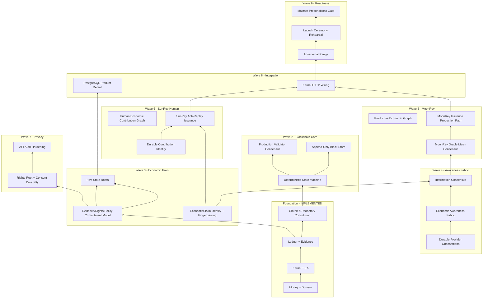

# SunRey Sovereign Architecture Upgrade Plan

**Status:** Wave 1 authoritative blueprint for Waves 2–9  
**Scope:** Architecture and sequencing only — no Wave 2+ implementation in this document  
**Environment:** `simulation`; all `LIVE_*` flags remain `false`  
**Legal posture:** `RESEARCH_REQUIRED`; not `CONFIRMED_BY_COUNSEL`

This document consolidates Wave 1 repository analysis into the canonical
target architecture for evolving SunRey toward a production sovereign
blockchain, dual protocol-native economic assets (SunRey Coin / Human
Economy and MoonRey Coin / Productive Economy), separate information and
monetary consensus planes, and a privacy-preserving Economic Awareness
Fabric.

Canonical companions:

- [`constitution.md`](./constitution.md)
- [`manifest.json`](./manifest.json)
- [`sunrey-chain-authority-matrix.md`](./sunrey-chain-authority-matrix.md)
- [`chunk-31-sunrey-blockchain-production-architecture.md`](./chunk-31-sunrey-blockchain-production-architecture.md)
- [`../economics/chunk-71-monetary-constitution.md`](../economics/chunk-71-monetary-constitution.md)
- [`../productization/sunrey-authority-map.json`](../productization/sunrey-authority-map.json)

---

## 1. Current-State Executive Summary

SunRey on `main` is a **simulation-first, constitution-governed financial
platform** with a mature Kernel → Execution Authority → Ledger path for
fiat and application SunRey Coin, a simulation chain trust layer, extensive
productive-economy and human-contribution scaffolding, and explicit
production activation firewalls.

**What is real today:**

| Domain | Maturity | Canonical owner |
| --- | --- | --- |
| Money, Ledger, Kernel, Evidence | Production-grade simulation | `packages/money`, `packages/ledger`, `packages/kernel`, `packages/evidence` |
| Application SunRey Coin | Kernel-gated ledger journals | `packages/sunrey-coin` → `Ledger.postJournal` |
| Native asset constitution | Schema + simulation issuance | `packages/sunrey-chain/src/economics` (Chunk 71) |
| MoonRey development issuance | 10-step pipeline, V1/V2 paths | `packages/sunrey-chain` (`moonrey-issuance-engine`) |
| Chain trust layer | Simulation adapter, scoped commitments | `packages/sunrey-chain` (`SimulationChainAdapter`) |
| External data plane | Wave 1–7 provider infrastructure (fixtures) | `packages/provider-sdk`, `provider-runtime`, `external-data` |
| PostgreSQL persistence | Four bounded DBs, integration tests | `packages/persistence` |
| Production blockchain | **Not implemented** | ADRs 0016–0033 accepted for engineering direction only |

**What is not real today:**

- Production validator consensus, P2P, block store, or mainnet
- Production MoonRey or SunRey native-chain supply migration
- Economic Awareness Fabric (information consensus mesh)
- Evidence / Rights / Policy state roots on sovereign blocks
- Production oracle mesh consensus
- Human Economic Contribution Graph or Productive Economic Graph as durable production systems
- Any `LIVE_*` activation or external regulated connectivity

**Authority resolution (Wave 1 verified against source):**

- **One mint path:** Chunk 71 `MonetaryIssuanceAuthority` in `packages/sunrey-chain/src/economics/issuance.ts`
- **Two supply stores (distinct, not migrated):** `CURRENT_APPLICATION_AUTHORITY` (ledger) vs `NATIVE_BLOCKCHAIN_AUTHORITY` (development chain state)
- **Ledger wins** over chain for fiat and application SunRey Coin until a Kernel-gated migration ADR executes
- **Providers, oracles, AI, PDV, consent, and raw observations cannot mint** — enforced in issuance rejection codes

---

## 2. Current Architecture Diagram

```text
                    EXTERNAL REALITY (providers, banks, oracles — simulation fixtures)
                                        |
                                        v
              +---------------------------------------------------+
              |  Economic inputs: ExternalObservation, oracle facts |
              |  packages/provider-sdk, sunrey-chain/oracle         |
              +---------------------------------------------------+
                                        |
          +-----------------------------+-----------------------------+
          |                             |                             |
          v                             v                             v
   Human contribution            Productive objects            Macro/FX/markets
   packages/human-economic-      packages/sunrey-chain/        packages/external-data
   contribution, information-     productive/, oracle/          payments/, exchange/
   market                        units/, GPUV path              market-reference
          |                             |                             |
          +-----------------------------+-----------------------------+
                                        |
                                        v
              +---------------------------------------------------+
              |  Intelligence / valuation (non-authoritative)      |
              |  PEG, PEVE, GPUV, regulatory twin, surveillance     |
              +---------------------------------------------------+
                                        |
                                        v
              +---------------------------------------------------+
              |  Compliance Kernel (six proofs)                    |
              |  packages/kernel → Execution Authority             |
              +---------------------------------------------------+
                                        |
                    +-------------------+-------------------+
                    |                                       |
                    v                                       v
         CURRENT_APPLICATION_AUTHORITY          NATIVE_BLOCKCHAIN_AUTHORITY
         packages/ledger + sunrey-coin          packages/sunrey-chain simulation
         (fiat, app SunRey Coin)                (dev native SUNREY/MOONREY units)
                    |                                       |
                    v                                       v
         services/accounts, payments,            SimulationChainAdapter,
         exchange settlement via ports           ChainWriteIntent, commitments
                    |                                       |
                    +-------------------+-------------------+
                                        |
                                        v
              +---------------------------------------------------+
              |  Consumer APIs / Agent proposals (no EA)         |
              |  services/api, packages/sunrey-agent             |
              +---------------------------------------------------+
```

Evidence Vault (`packages/evidence`) seals every Kernel outcome in parallel.
PostgreSQL persists customer, ledger, evidence, and security metadata in
four bounded databases.

---

## 3. Current Limitations

### Blockchain

- No production BFT consensus, validator bonding, or P2P network
- `SimulationChainAdapter` is the implemented facade; Rust node direction exists but is not production runtime
- `blockchain-runtime` is PARTIAL (WASM/EVM deliberately unimplemented)
- No sovereign block/state roots (Transaction, Monetary, Evidence, Rights, Policy)
- Reorg handling marks `REORG_OBSERVED`; ledger and vault are never rewritten

### Monetary / dual economy

- Application SunRey Coin and native chain units are **separate supplies**
- `production_migration_performed` is always `false`
- MoonRey public ticker `NOT_ASSIGNED`; `PRODUCTION` issuance path unavailable
- GPUV / Productive Value cannot mint (`PRODUCTIVE_VALUE_ENGINE_CAN_CREATE_MONETARY_AUTHORITY = false`)

### Information / evidence plane

- No canonical **Information Consensus** mesh — oracle facts exist but lack production multi-source consensus
- No durable **Canonical Economic Claims** registry with anti-double-count at production scale
- External observations are cached in simulation; durable provider observation consensus is incomplete

### Persistence

- PostgreSQL is not the default public API path — in-memory simulation remains default for tests/demo
- Known crash window: ledger may commit before evidence (accepted until coordinated outbox)
- Exchange V025 schema exists but application writes are unwired
- Explorer DB migrations exist but are not in canonical `DATABASES` env list
- Holds, agent mandates, SDK gateway state, RPC idempotency remain ephemeral

### API / productization

- Inventory reports `persistenceGaps: 10`, `apiGaps: 10`, `p0Blockers: 8`
- Consumer HTTP auth accepts weak non-empty `Authorization` on some routes
- Kernel-gated financial mutation path is disconnected from some productization HTTP surfaces

### Governance / activation

- Chunk 143 production activation firewall blocks fixture-driven activation
- `PRODUCTION_CANDIDATE` ≠ `PRODUCTION_ACTIVE`; `AUTHORIZED_CANDIDATE` ≠ `MAINNET_ACTIVE`
- Mainnet fails closed without configured governance ceremony (Chunks 164–167)

---

## 4. Canonical Target Architecture

Ten conceptual layers define the future sovereign system. Each layer lists
responsibility, permitted authority, prohibited authority, inputs, outputs,
persistence expectations, and security boundary.

### Layer 1 — External Economic Reality

| Aspect | Definition |
| --- | --- |
| **Responsibility** | Capture real-world economic signals from regulated and open providers without treating them as SunRey truth |
| **Permitted authority** | Emit signed, schema-validated `ExternalObservation` envelopes with provenance metadata |
| **Prohibited authority** | Mint, settle, approve compliance, alter ledger balances, vote in consensus, store raw PDV payloads |
| **Inputs** | Provider APIs (simulation fixtures today), device telemetry, public macro/market feeds |
| **Outputs** | Normalized observations, provenance hashes, provider health signals |
| **Persistence** | Durable observation cache with TTL/SWR; raw payloads hashed, not authoritative |
| **Security boundary** | Untrusted external network; SSRF guards, size limits, credential refs via Chunk 149 |

### Layer 2 — Economic Awareness / Information Fabric

| Aspect | Definition |
| --- | --- |
| **Responsibility** | Federated-information-style aggregation inspired by useful Genisys/TIA principles, implemented as privacy-, rights-, and purpose-preserving economic information architecture |
| **Permitted authority** | Correlate, reconcile, and rank observations; propose candidate facts; enforce purpose and consent filters |
| **Prohibited authority** | Direct monetary supply change; bypass consent; place sensitive raw data on-chain |
| **Inputs** | Layer 1 observations, catalog coverage, trust scores, purpose tokens |
| **Outputs** | Candidate economic facts, coverage maps, reconciliation reports, fabric audit trails |
| **Persistence** | Append-only fabric journals; rebuildable projections |
| **Security boundary** | Clean-room and purpose-firewall enforced; no financial Execution Authority |

### Layer 3 — Evidence, Provenance, Rights and Consent

| Aspect | Definition |
| --- | --- |
| **Responsibility** | Bind evidence to subjects, rights, and policy versions; maintain off-chain authoritative stores |
| **Permitted authority** | Seal evidence in Evidence Vault; record consent grants/revocations; encrypt PDV payloads |
| **Prohibited authority** | Mint; replace Kernel decisions; publish raw personal data on-chain |
| **Inputs** | Fabric outputs, identity context, consent permits, attestation sources |
| **Outputs** | `EconomicEvidence`, consent receipts, rights attestations, vault seals |
| **Persistence** | `solstice_evidence`, Consent Ledger, PDV — insert-only at runtime |
| **Security boundary** | Vault wins over chain anchor; consent wins over chain receipt |

### Layer 4 — Information Consensus / Canonical Economic Claims

| Aspect | Definition |
| --- | --- |
| **Responsibility** | Determine whether sufficient authorized evidence exists to treat a real-world economic claim as verified (**Information Consensus**) |
| **Permitted authority** | Promote evidence to `VerifiedEconomicFact` and `CanonicalEconomicClaim`; enforce anti-double-count fingerprints |
| **Prohibited authority** | Modify monetary supply; issue Execution Authority; treat unverified observations as claims |
| **Inputs** | Layer 3 evidence, oracle quorum policies, source taxonomy (Chunk 116/117) |
| **Outputs** | Verified facts, canonical claims, claim fingerprints, information-consensus receipts |
| **Persistence** | Durable claim registry with idempotent fingerprints; rebuildable dispute state |
| **Security boundary** | Quorum and quality gates fail closed; facts are not money |

### Layer 5A — Human Economic Contribution Engine

| Aspect | Definition |
| --- | --- |
| **Responsibility** | Model verified human economic contribution for SunRey Coin eligibility (Human Economy) |
| **Permitted authority** | Register contributions, lifecycle states, verification decisions; emit privacy-safe `HumanEconomicEvidence` |
| **Prohibited authority** | Mint SunRey Coin directly; score human worth; bypass Chunk 71 gate |
| **Inputs** | HIN network signals (anchored), Human Contribution Registry, verification policy (Chunks 104–111) |
| **Outputs** | `HumanEconomicContribution`, bridge evidence for Chunk 108 gate |
| **Persistence** | Contribution registry, verification audit, HIN anchor receipts |
| **Security boundary** | Raw personal data stays in PDV; bridge emits content hashes only |

### Layer 5B — Productive Economic Value Engine

| Aspect | Definition |
| --- | --- |
| **Responsibility** | Model verified productive output for MoonRey Coin eligibility (Productive Economy) |
| **Permitted authority** | Register productive objects, claims, GPUV results, attribution policies |
| **Prohibited authority** | Mint MoonRey Coin directly; treat GPUV as MoonRey; conflate capacity with realized usage |
| **Inputs** | Oracle mesh facts, productive taxonomy, attribution policy (Chunks 120–126) |
| **Outputs** | `ProductiveEconomicContribution`, `VerifiedProductiveContribution`, GPUV results |
| **Persistence** | Productive registry, oracle fact store, attribution reconciliation journals |
| **Security boundary** | Order/invoice/payment are not productive output; DATA_RATE ≠ DATA_VOLUME |

### Layer 6 — Economic Valuation

| Aspect | Definition |
| --- | --- |
| **Responsibility** | Compute economic value for policy and issuance proposals — distinct from market price and supply |
| **Permitted authority** | Produce `EconomicValuation` and issuance quantity proposals under versioned policy |
| **Prohibited authority** | Activate supply; set exchange prices; override Kernel |
| **Inputs** | Layer 5A/5B contributions, valuation constitution (Chunk 110), GPUV conversion candidates |
| **Outputs** | Valuation results, `IssuanceProposal` (non-binding until governance) |
| **Persistence** | Versioned valuation policy artifacts; simulation fixtures marked non-production |
| **Security boundary** | Valuation ≠ authorization; PEVE/GPUV cannot create monetary authority |

### Layer 7 — Monetary Policy and Governance

| Aspect | Definition |
| --- | --- |
| **Responsibility** | Govern monetary constitution, parameter packages, authorization ceremonies, and activation firewalls |
| **Permitted authority** | Evaluate Chunk 143 firewall; bind parameter packages (Chunks 144–146); orchestrate governance ops (Chunks 163–167) |
| **Prohibited authority** | Silent activation; fixture-driven mainnet; AI governance votes |
| **Inputs** | Issuance proposals, readiness gates, launch freeze hash, multi-party ceremony transcripts |
| **Outputs** | `GovernanceAuthorization`, `MonetaryIssuanceAuthority`, policy height activations |
| **Persistence** | Governance transcripts, parameter registry, authorization records — immutable after seal |
| **Security boundary** | Mainnet fails closed without configured governance; human ceremony required |

### Layer 8 — Sovereign Blockchain State Machine

| Aspect | Definition |
| --- | --- |
| **Responsibility** | Deterministic protocol state transitions under **Monetary Consensus** |
| **Permitted authority** | Finalize native asset transfers, issuance receipts, commitment anchors, `app_hash` updates |
| **Prohibited authority** | Import `Ledger.postJournal`; issue Execution Authority; store raw PDV |
| **Inputs** | Signed transactions, governance-authorized issuance, commitment batches |
| **Outputs** | Blocks, state roots, finality certificates, native supply state |
| **Persistence** | Append-only block store; authenticated state tree; crash-safe WAL |
| **Security boundary** | BFT `f < n/3`; RPC untrusted; consensus keys separated from application custody |

### Layer 9 — Ledger / Wallet / Exchange / Settlement

| Aspect | Definition |
| --- | --- |
| **Responsibility** | Customer-facing money movement, custody, matching, and fiat settlement |
| **Permitted authority** | Kernel-gated journals; exchange matching; DVP settlement via CoinPort/FiatPort |
| **Prohibited authority** | Second ledger; chain as open-order store; provider API as books |
| **Inputs** | Execution Authority, exchange matches, custody events |
| **Outputs** | Journals, balances (derived), trade records, settlement receipts |
| **Persistence** | `solstice_ledger`; exchange operational state; custody provider-candidate state |
| **Security boundary** | Balances always derived from postings; no `Account.balance` column |

### Layer 10 — Consumer APIs / Agents / Applications

| Aspect | Definition |
| --- | --- |
| **Responsibility** | Orchestrate user experiences; surface proposals and read models |
| **Permitted authority** | BFF orchestration; agent proposals via ProposalGate |
| **Prohibited authority** | Mint; post journals; bypass Kernel; independent financial execution |
| **Inputs** | Authenticated ActorContext, mandates, read projections |
| **Outputs** | HTTP responses, agent proposals (not ActionIntents until gated) |
| **Persistence** | Session state, idempotency keys; no authoritative balances |
| **Security boundary** | Agent package cannot import Execution Authority; ALLOW means "fit for human review" |

---

## 5. Human Economy Architecture

**Asset:** SunRey Coin (`SUNREY_COIN`) — Human Economy native asset

**Current path:**

1. Human contribution ontology and registry (Chunks 104–106)
2. Evidence verification and valuation constitution (Chunks 109–111)
3. HIN → contribution adapter (Chunk 107); HIN → chain anchor (Chunks 139–140)
4. Privacy-safe bridge evidence (Chunk 108) → Chunk 71 `MonetaryIssuanceAuthority`
5. Application issuance via `packages/sunrey-coin` → ledger journals
6. Future native issuance via sovereign chain under `NATIVE_BLOCKCHAIN_AUTHORITY`

**Future Human Economic Contribution Graph:**

- Non-authoritative intelligence layer above verified contributions
- Rebuildable from registry + vault seals
- Must not become a balance store or mint path

**Invariants:**

- No human-worth score, social credit, or raw PDV mint path
- SunRey Coin remains economically distinct from MoonRey Coin
- Valuation (PEVE, contribution valuation) remains separate from supply authorization

---

## 6. Productive Economy Architecture

**Asset:** MoonRey Coin (`MOONREY_COIN`) — Productive Economy native asset

**Current path (10-step pipeline — verified in `moonrey-issuance-model.md`):**

1. `ProductiveEconomicObject` → rights → oracle facts → `ProductiveClaim`
2. Verify → `VerifiedProductiveContribution`
3. Anti-double-count via `ContributionFingerprint`
4. `MoonReyIssuancePolicy` → `MoonReyIssuanceAuthorization`
5. Native issuance transaction → `MoonReyIssuanceReceipt`

**Path classes:**

- `LEGACY_ENGINEERING_SIMULATION_V1` — preserved for replay
- `GOVERNED_VALUE_SIMULATION_V2` — GPUV → conversion → Chunk 71 (GPUV is not MoonRey)
- `PRODUCTION` — unavailable

**Future Productive Economic Graph:**

- Derived projection from authoritative chain objects (Chunk 44)
- Graph is rebuildable; blockchain objects are source of truth for capacity claims

**Future MoonRey Oracle Mesh:**

- Multi-source provider families (Chunks 129–138)
- Information consensus quorum before monetization
- Observations never directly mint

---

## 7. Information Consensus

**Purpose:** Determine whether sufficient authorized evidence exists to treat a real-world economic claim as verified.

**Scope:**

- Oracle fact finalization with quorum and quality gates
- Source taxonomy compatibility (Chunks 116/117)
- Canonical Economic Claim promotion with fingerprint anti-replay
- Economic Asset Registry verification layer (Chunks 113–115)

**Must not:**

- Directly modify monetary supply
- Issue Execution Authority
- Treat raw `ExternalObservation` as verified fact without validation pipeline
- Place sensitive raw data on-chain

**Current state:** Partial — oracle engine and source taxonomy exist in simulation; production multi-source consensus mesh does not.

---

## 8. Monetary Consensus

**Purpose:** Determine and finalize valid protocol state transitions under monetary policy and governance.

**Scope:**

- BFT block finality (future Wave 2)
- Native asset conservation checks
- Governance-height policy activation
- `MonetaryIssuanceAuthority` execution on-chain
- State root updates including Monetary State Root

**Must not:**

- Treat raw observations as monetary authorization
- Import ledger posting APIs
- Activate without Chunk 143 firewall + governance ceremony passage

**Current state:** Development consensus engine exists (`blockchain-consensus` IMPLEMENTED as simulation); production validator set does not.

### Where the two planes meet

```text
Information Consensus                Monetary Consensus
        |                                    |
        v                                    v
 VerifiedEconomicFact              GovernanceAuthorization
 CanonicalEconomicClaim            MonetaryIssuanceAuthority
        |                                    |
        +──────── IssuanceProposal ──────────+
                     (policy-bound)
                           |
                           v
              Chunk 71 gate validates evidence
              class, replay id, quantity ceilings
                           |
                           v
              Native issuance tx OR ledger journal
              (per authority matrix row)
```

The meeting point is **policy-bound issuance authorization**, not observation ingestion. Information consensus produces verified claims; monetary consensus executes authorized state transitions only after Layer 7 governance and Chunk 71 validation.

---

## 9. Economic Claim Architecture

### Core object boundaries (future)

See Section 10 for commitment objects. Each object below states what it **MUST NOT** be allowed to do.

| Object | Responsibility | MUST NOT |
| --- | --- | --- |
| `EconomicObservation` | Raw or normalized provider reading with provenance | Be treated as verified fact; mint; bypass schema validation |
| `EconomicEvidence` | Sealed evidentiary bundle bound to source and purpose | Replace vault authority; contain raw PDV on-chain |
| `VerifiedEconomicFact` | Observation promoted after quorum/quality gates | Directly authorize mint; override taxonomy compatibility |
| `CanonicalEconomicClaim` | Idempotent, fingerprinted claim eligible for policy evaluation | Double-count; mutate after seal; serve as wallet balance |
| `HumanEconomicContribution` | Verified human-economy contribution record | Mint SunRey; encode human-worth scores |
| `ProductiveEconomicContribution` | Verified productive-economy contribution record | Mint MoonRey; conflate capacity with realized output |
| `EconomicValuation` | Policy-computed value for proposals | Set supply; set exchange price |
| `IssuanceProposal` | Non-binding quantity/class proposal | Execute without governance + Chunk 71 gate |
| `GovernanceAuthorization` | Signed, height-scoped policy activation | Auto-activate mainnet; bypass ceremony |
| `MonetaryStateTransition` | Deterministic chain/ledger state delta | Rewrite history; bypass replay protection |

**Anti-double-count:** `ContributionFingerprint` and issuance `replayIdentifier` must be durable before production multi-source monetization.

---

## 10. Evidence / Rights / Policy Commitments

Future sovereign blocks commit to five roots. **Not implemented in Wave 1.**

### Transaction Root

| Aspect | Definition |
| --- | --- |
| **Commits to** | Merkle root of canonical transaction envelopes in the block |
| **Off-chain** | Full transaction bodies in block store; PII never in tx payload |
| **Proofs** | Inclusion proofs for light clients |
| **Privacy** | Public metadata only; confidential amounts via future ADR-0030 paths |
| **Determinism** | Canonical binary encoding (ADR-0021); same tx set → same root |

### Monetary State Root

| Aspect | Definition |
| --- | --- |
| **Commits to** | Native asset supply state, issuance receipts, conservation checksum |
| **Off-chain** | Full issuance audit trail in durable store |
| **Proofs** | State transition proofs linking prior `app_hash` |
| **Privacy** | Account identifiers may be pseudonymous commitments |
| **Determinism** | Integer minor units; replay-protected issuance ids |

### Evidence Root

| Aspect | Definition |
| --- | --- |
| **Commits to** | Batch hash of Evidence Vault seals and economic claim fingerprints promoted in epoch |
| **Off-chain** | Full evidence payloads in vault; raw observations in fabric cache |
| **Proofs** | Vault inclusion + claim fingerprint membership |
| **Privacy** | Content hashes only; no raw attestations |
| **Determinism** | Ordered seal sequence → deterministic batch hash |

### Rights Root

| Aspect | Definition |
| --- | --- |
| **Commits to** | Rights/access/consent commitment deltas (ACCESS-08 compatible) |
| **Off-chain** | Consent Ledger authoritative state; PDV encrypted payloads |
| **Proofs** | Consent receipt Merkle paths |
| **Privacy** | Purpose and scope hashes; no raw consent documents |
| **Determinism** | Append-only consent history → deterministic root update |

### Policy Root

| Aspect | Definition |
| --- | --- |
| **Commits to** | Active policy pack versions, governance parameters, activation heights |
| **Off-chain** | Full policy documents in Kernel policy engine store |
| **Proofs** | Policy version hash pin against governance authorization |
| **Privacy** | Public policy hashes; counsel-restricted annexes off-chain |
| **Determinism** | Height-activated policy snapshot → deterministic root |

**Prerequisite:** Evidence/Rights/Policy commitment model must exist **before** state roots commit to them (Wave 3 before Wave 2 state root integration).

---

## 11. Sovereign Blockchain Requirements

Derived from Chunk 31 ADRs and Wave 1 gap analysis:

| Requirement | Current | Target |
| --- | --- | --- |
| BFT consensus (`f < n/3`) | Simulation engine only | Production validator set with bonding |
| Deterministic state machine | Partial (`app_hash` design) | Canonical replay identical to live |
| Append-only block store | Simulation in-memory | Crash-safe production storage (ADR-0022) |
| P2P authenticated gossip | Not implemented | ADR-0023 compliant network |
| Native module execution | Direction frozen | No EVM; constrained WASM later |
| Cryptographic agility | Algorithm IDs defined | No homegrown crypto |
| Genesis / network_id separation | Simulation IDs | Explicit production genesis hash |
| Reorg safety | `REORG_OBSERVED` without ledger rewrite | Same invariant in production |
| Light client support | Protocol spec exists | Verifiable state + tx proofs |
| Recovery / reconciliation | Chunk 154 rehearsal | Production crash recovery gates |

---

## 12. Database Responsibilities

| Database | Role | Wave 2–9 implications |
| --- | --- | --- |
| `solstice_customer` | Identity, policy, PEG projection, mandates | Add durable agent mandate migration (Wave 8) |
| `solstice_ledger` | Authoritative journals (no balance columns) | Remains sole fiat/app-SunRey authority until migration ADR |
| `solstice_evidence` | Hash-chained Kernel/evidence seals | Coordinate with Evidence Root batches (Wave 3) |
| `solstice_security` | Key metadata only | HSM/KMS refs remain inactive until credential plane activated |
| Future block store | Chain blocks, state | New bounded DB or node-local store — not a second ledger |
| Future claim registry | Canonical economic claims | New schema; insert-only; fingerprint uniqueness |
| Explorer index | Derived | Remains non-authoritative; wire to canonical DATABASES |

**Rules preserved:**

- No cross-database SQL joins
- No database may mint
- Journals and evidence insert-only at runtime
- Deterministic replay from persisted journals

---

## 13. API Responsibilities

| Surface | Role | Constraints |
| --- | --- | --- |
| `services/api` Platform API | Orchestration over canonical owners | No ledger bypass; Kernel on mutations |
| Consumer BFF | Product read models and flows | Weak auth must be hardened before production |
| `services/accounts` | Kernel-gated money movement | Human review required |
| SunRey SDK | Developer and consumer adapters | No financial authority |
| Agent proposals | ProposalGate only | Never ActionIntent without signed capability token |

**Wave 8 integration:** Connect disconnected Kernel → postJournal HTTP paths; enforce ActorContext on all mutations.

---

## 14. Exchange Responsibilities

- Matching engine owns orders and trades — not the chain
- Settlement posts via CoinPort/FiatPort to canonical Ledger
- Capacity/access markets (ACCESS-09) consume entitlements at owning ports
- Exchange must not mint SunRey or MoonRey
- Market price ≠ valuation ≠ issuance quantity

---

## 15. AI / Agent Authority Boundary

Structural isolation (verified):

1. `packages/agent` has no dependency on `packages/platform` ledger/kernel paths
2. `AgentRuntimePorts` contains only `context`, `claims`, `mandates`
3. `ExecutionAuthority` not importable from agent source
4. `AgentProposal` ≠ `ActionIntent` until ProposalGate conversion
5. Agent-originated Kernel ALLOW never issues Execution Authority
6. `AI_MONETARY_AUTHORIZATION_REJECTED` in issuance rejection codes
7. `LIVE_AGENT_FINANCIAL_EXECUTION_ENABLED = false`

---

## 16. External Provider Boundary

- Providers emit observations only (`ExternalObservation` envelope)
- Transport: SSRF guards, fixture-only in CI, no live HTTP in tests
- Trust engine ranks and flags — does not authorize
- Provider risk monitor informs compliance — does not mint
- 126-provider catalog target; Wave 6 gaps documented, not fabricated

---

## 17. Privacy Principles

1. Sensitive raw information stays off-chain (PDV, consent docs, travel/health/preferences)
2. Chain stores hashes, schema ids, revocation state — not raw payloads
3. Purpose firewall default DENY on data use
4. Clean-room results are receipts; raw views ephemeral
5. Human economic bridge emits content hashes only
6. Explorer privacy policy limits index exposure
7. Information fabric must be rights- and purpose-preserving (not bulk surveillance)

---

## 18. Migration Strategy

### Financial history

- Append-only journals and evidence — **no destructive migration**
- Corrections are compensating entries only
- Idempotency keys survive restart

### Application → native SunRey Coin

- Requires future Kernel-gated `AssetMigrationManifest` ADR
- `production_migration_performed` remains `false` until ceremony
- Silent dual-authority forbidden

### Simulation → production

- Staged capability activation (Chunk 166) — domain-scoped canary
- Launch freeze hash binding (Chunk 164)
- Multi-party ceremony (Chunk 165)
- Abort/recovery gates (Chunk 167)
- No auto-resume after incident

### Schema migrations

- Versioned SQL per bounded database
- Exchange and explorer unwired schemas activated only with explicit wave gates

---

## 19. Wave 2–9 Roadmap

### Wave 2 — Production Blockchain Core

| Field | Content |
| --- | --- |
| **Prerequisites** | Chunk 31 ADRs; deterministic state machine spec; crypto suite registry |
| **Components** | `packages/sunrey-chain` node, consensus, storage, P2P, validator ops |
| **Database** | Block store schema; validator state; crash recovery |
| **API** | RPC admission hardened; no financial bypass |
| **Migration** | Simulation chain_id ≠ production genesis |
| **Security gates** | BFT assumptions tested; key separation; no ledger import in chain |
| **Tests** | Deterministic replay; equivocation detection rehearsal; reorg without ledger rewrite |
| **Definition of done** | Validators finalize blocks; `app_hash` replay matches; light client verifies tx root |
| **Must NOT activate** | Mainnet; LIVE flags; production issuance; asset migration |

### Wave 3 — Economic Proof Architecture

| Field | Content |
| --- | --- |
| **Prerequisites** | Wave 2 state commitment interface; Evidence Vault stable |
| **Components** | Evidence/Rights/Policy commitment model; claim fingerprint registry |
| **Database** | Claim registry; commitment batch tables |
| **API** | Claim query endpoints (read-only) |
| **Migration** | Backfill simulation claim fingerprints |
| **Security gates** | Roots commit only to sealed batches; no raw payload in roots |
| **Tests** | Root determinism; fingerprint anti-replay; vault↔root reconciliation |
| **Definition of done** | Five roots spec implemented in simulation; proofs verifiable |
| **Must NOT activate** | Production monetization from claims |

### Wave 4 — Economic Awareness Fabric

| Field | Content |
| --- | --- |
| **Prerequisites** | Wave 1–7 provider infrastructure; Wave 3 claim model |
| **Components** | Fabric reconciliation, purpose-preserving correlation, trust engine integration |
| **Database** | Durable observation journals; fabric audit trail |
| **API** | Fabric coverage and reconciliation read APIs |
| **Migration** | Provider cache → durable fabric store |
| **Security gates** | Purpose/consent enforced; clean-room separation |
| **Tests** | Multi-source reconciliation; conflict detection; no mint side effects |
| **Definition of done** | Fabric promotes observations to candidate facts deterministically |
| **Must NOT activate** | Bulk personal surveillance; live ungoverned HTTP |

### Wave 5 — MoonRey Productive Intelligence

| Field | Content |
| --- | --- |
| **Prerequisites** | Wave 4 durable observations; Wave 3 claims; oracle mesh design |
| **Components** | Productive Economic Graph projection; oracle mesh consensus; GPUV path hardening |
| **Database** | Oracle fact durability; productive registry production schema |
| **API** | Productive claim submission (gated) |
| **Migration** | Simulation V1/V2 coexistence preserved |
| **Security gates** | Quorum before fact promotion; anti-double-count durable |
| **Tests** | Mesh disagreement handling; issuance replay rejection |
| **Definition of done** | Production-candidate MoonRey path end-to-end in simulation |
| **Must NOT activate** | `LIVE_MOONREY_PRODUCTIVE_ISSUANCE_ENABLED`; public ticker |

### Wave 6 — SunRey Human Economic Intelligence

| Field | Content |
| --- | --- |
| **Prerequisites** | Human Contribution Registry; Wave 3 claims; Chunk 108 bridge |
| **Components** | Human Economic Contribution Graph; HIN integration; valuation policy candidates |
| **Database** | Durable contribution identity; anchor reconciliation |
| **API** | Contribution verification surfaces |
| **Migration** | HIN anchor → claim registry linkage |
| **Security gates** | No raw PDV in claims; no human-worth scoring |
| **Tests** | Anti-replay issuance; bridge privacy checks |
| **Definition of done** | SunRey issuance proposal path from verified human contribution in simulation |
| **Must NOT activate** | `LIVE_HIN_BASED_ISSUANCE_ENABLED`; production valuation |

### Wave 7 — Privacy / Identity / Policy

| Field | Content |
| --- | --- |
| **Prerequisites** | PDV, consent, identity stable; Wave 3 rights root |
| **Components** | Purpose registry hardening; credential plane; operating scope (Chunk 161) |
| **Database** | Consent/policy durability gaps closed |
| **API** | Auth hardening on consumer routes |
| **Migration** | Ephemeral mandate → durable store |
| **Security gates** | `PRODUCTION_HSM_KMS_CONFIGURED` still false until counsel + ops |
| **Tests** | Purpose violation rejection; auth regression suite |
| **Definition of done** | Production-candidate privacy boundary enforced on all mutation paths |
| **Must NOT activate** | Live KYC vendors; live connectivity |

### Wave 8 — Product Integration

| Field | Content |
| --- | --- |
| **Prerequisites** | Waves 2–7 simulation complete; API gaps closed |
| **Components** | BFF, Exchange, custody, agent ProposalGate wired to canonical paths |
| **Database** | PostgreSQL default for staging; exchange writes wired |
| **API** | Kernel → postJournal connected on all financial mutations |
| **Migration** | In-memory → PostgreSQL for product paths |
| **Security gates** | No frontend mint; surveillance remains proposal-only |
| **Tests** | E2E demo on PostgreSQL; persistence integration expanded |
| **Definition of done** | Product flows use durable persistence without authority leaks |
| **Must NOT activate** | LIVE flags; mainnet |

### Wave 9 — Adversarial Testing / Mainnet Readiness

| Field | Content |
| --- | --- |
| **Prerequisites** | Waves 2–8; Chunks 164–167 ceremony rehearsal |
| **Components** | `packages/sunrey-range`; launch rehearsal; readiness gates |
| **Database** | DR rehearsal; reconciliation under fault injection |
| **API** | Pentest scope validation |
| **Migration** | Launch freeze candidate verified |
| **Security gates** | External audit package; incident response rehearsed |
| **Tests** | Adversarial economic tests; CHUNK_71 authority tests; chaos regression |
| **Definition of done** | Mainnet readiness gate passes — still does not activate mainnet |
| **Must NOT activate** | Mainnet without explicit human ceremony authorization |

---

## 20. Dependency Graph



**Critical sequencing (repository-verified):**

| Before | After | Rationale |
| --- | --- | --- |
| Deterministic state machine | Production validator consensus | `app_hash` replay requires frozen state rules (ADR-0019) |
| EconomicClaim fingerprinting | Multi-source monetization controls | `ContributionFingerprint` + `replayIdentifier` in issuance.ts |
| Evidence/Rights/Policy commitment model | State roots commit to them | Roots without batch model would be undefined |
| Durable provider observations | Production MoonRey oracle mesh | Simulation cache insufficient for quorum disagreement |
| Durable contribution identity | Production SunRey anti-replay issuance | Bridge replay protection requires persistent mapping |
| Chunk 71 gate | Any native issuance on chain | Only `MonetaryIssuanceAuthority` path in economics/issuance.ts |
| Wave 2 block store | Evidence root anchoring in blocks | Anchors require finalized block height |
| Privacy/consent durability | Rights root production | Consent Ledger wins over chain receipt |
| PostgreSQL product wiring | Mainnet readiness | Inventory persistenceGaps block production |

---

## 21. Risk Register

| ID | Risk | Severity | Mitigation | Owner |
| --- | --- | --- | --- | --- |
| R1 | Silent ledger/chain dual-authority | Critical | Authority matrix + ADR-0031; migration ADR required | `sunrey-chain` |
| R2 | Provider/oracle observation → mint | Critical | Chunk 71 rejection codes; adversarial range tests | `economics/issuance` |
| R3 | AI agent financial execution | Critical | Structural isolation; LIVE flag false | `sunrey-agent` |
| R4 | Fixture-driven production activation | Critical | Chunk 143 firewall; ceremony gates | `production-activation` |
| R5 | Ledger/evidence crash window | High | Coordinated outbox (future); idempotent replay | `persistence` |
| R6 | Weak consumer HTTP auth | High | Wave 7 hardening | `services/api` |
| R7 | Disconnected Kernel HTTP path | High | Wave 8 wiring | `services/api` |
| R8 | Ephemeral financial-adjacent state | Medium | Wave 8 durable migration | multiple |
| R9 | Exchange schema unwired | Medium | Explicit wave gate before activation | `sunrey-exchange` |
| R10 | Legal/regulatory confidence gap | High | `RESEARCH_REQUIRED`; no auto-promotion | governance ops |
| R11 | GPUV confused with MoonRey | Medium | Documentation + issuance class guards | `productive/policy-governance` |
| R12 | Reorg ledger rewrite temptation | Critical | `REORG_OBSERVED` invariant | `sunrey-chain` |

---

## 22. Do-Not-Break Invariants

Future Cursor prompts **must preserve**:

### Monetary authority

1. One canonical supply authority — Chunk 71 `MonetaryIssuanceAuthority`
2. No database may mint
3. No Exchange may mint
4. No frontend may mint
5. No AI may independently mint or approve issuance
6. No oracle observation may directly mint
7. No raw human data may directly mint
8. SunRey and MoonRey remain protocol-native distinct assets
9. SunRey and MoonRey remain economically distinct
10. Valuation remains separate from supply
11. Valuation remains separate from market price
12. Evidence remains separate from monetary authorization

### Environment and activation

13. Do not change `ENVIRONMENT` away from `simulation` without explicit authorized wave
14. Do not turn on any `LIVE_*` flag without governance ceremony
15. Mainnet fails closed without configured governance
16. `PRODUCTION_CANDIDATE` ≠ `PRODUCTION_ACTIVE`
17. Fixture packages cannot authorize production

### Data and history

18. Sensitive raw information stays off-chain
19. Append-only financial/evidence history is preserved
20. No destructive migration of financial history
21. Deterministic replay must produce identical protocol state
22. Balances read from ledger — no `Account.balance` column
23. Money is integer minor units — never floating-point
24. Growth is genuine economic improvement only — not deposits/transfers

### Kernel and ledger

25. Do not open an account except via `openAccount` with verified Execution Authority
26. Do not write a ledger journal except through `Ledger.postJournal`
27. Do not catch a Kernel refusal and proceed anyway
28. Registered mutators must remain Kernel-gated (CI enforces)

### Agent isolation

29. Agent package cannot import Execution Authority issuer
30. AgentProposal ≠ ActionIntent until ProposalGate
31. Agent-originated ALLOW never issues Execution Authority

### Architecture ownership

32. Do not create parallel ledger, Kernel, Agent, Exchange, chain, or compliance plane
33. Library packages must not import services
34. Domain code must not talk to disks, networks, or databases directly
35. Extend canonical owners — do not fork protected components

### Repository-specific (Wave 1 discovered)

36. Ledger wins over chain for fiat and application SunRey Coin until migration ADR
37. Consent Ledger wins over chain consent receipts
38. Evidence Vault wins over chain anchors
39. Reorg marks `REORG_OBSERVED` — never rewrite journals or vault
40. GPUV is not MoonRey; Productive Value cannot create monetary authority
41. Order, invoice, and payment are not productive output
42. DATA_RATE is not DATA_VOLUME; capacity is not realized usage
43. Access Economy entitlement ledgers do not call `postJournal` or mint
44. Human review required for `services/accounts` mutations
45. No country-specific regulatory logic in application services — ask the Kernel
46. Protected deposits do not move to investments without explicit account agreement
47. Cost-avoided is never income; unrealized is never withdrawable
48. No percentage-return, blended-yield, or growth-rate fields on balances

---

## 23. Mainnet Activation Preconditions

Mainnet activation requires **all** of the following — none are satisfied today:

1. Wave 9 adversarial range passed with no critical findings open
2. Chunk 164 launch freeze hash bound and verified
3. Chunk 165 multi-party ceremony completed (LAUNCH_AUTHORIZATION_CANDIDATE → authorized transition only via human gate)
4. Chunk 166 staged capability activation rehearsal passed per domain
5. Chunk 167 abort/recovery/resumption rehearsal passed
6. Chunk 143 production activation firewall explicitly allows target capability
7. Chunk 163 governed parameter authorization for production economics
8. Operating scope matrix configured (Chunk 161)
9. Legal/regulatory statuses promoted from `RESEARCH_REQUIRED` by counsel — not by engineering
10. `PRODUCTION_HSM_KMS_CONFIGURED` and credential plane activated under ops control
11. PostgreSQL durability on all financial mutation paths
12. Kernel → Execution Authority → postJournal wired on all HTTP mutations
13. No silent dual-authority between ledger and native chain supplies
14. External provider LIVE connectivity counsel-approved per corridor
15. Disaster recovery and incident response rehearsed
16. Deterministic state replay verified on production candidate build
17. Public tickers assigned by governance — not engineering
18. Explicit human decision documented — AI cannot activate

**Until then:** `ENVIRONMENT=simulation`, all `LIVE_*=false`, `production_migration_performed=false`.

---

## 24. Definition of Production Readiness

Production readiness means the system can **fail closed** under adversarial
conditions while preserving all Do-Not-Break invariants — not that mainnet
is active.

| Criterion | Measurement |
| --- | --- |
| Authority integrity | No path from observation/AI/frontend/DB to mint without Chunk 71 + governance |
| Determinism | Replay produces identical `app_hash` and ledger state |
| Durability | Financial mutations survive process crash with idempotent recovery |
| Consensus safety | BFT assumptions hold under range tests |
| Privacy | No raw sensitive data on-chain or in logs |
| Evidence integrity | Vault chain contiguous; roots reconcile |
| Operational readiness | DR, incident response, validator ops runbooks rehearsed |
| Legal readiness | Counsel-confirmed corridors and product classifications |
| Activation discipline | Ceremony transcripts sealed; freeze hash matches binary |
| CI integrity | Seven-stage CI + persistence job green |

**Production readiness ≠ production activation.** Activation is a separate
human-gated ceremony after readiness is demonstrated.

---

## Wave 1 Consolidated Findings Reference

Wave 1 intermediate documents (`WAVE1_REPOSITORY_BASELINE`,
`SUNREY_MONETARY_AUTHORITY_CONTRACT`, etc.) were not found committed on
`main`. This plan synthesizes their intended scope from:

| Intended document | Canonical source used |
| --- | --- |
| WAVE1_REPOSITORY_BASELINE | `constitution.md`, `manifest.json`, `integrity-baseline.json`, inventory |
| SUNREY_MONETARY_AUTHORITY_CONTRACT | Chunk 71, `issuance.ts`, `native-asset-authority-boundary.md` |
| WAVE1_AUTHORITY_AUDIT | `sunrey-chain-authority-matrix.md`, `sunrey-authority-map.json` |
| SUNREY_ECONOMIC_INFORMATION_FLOW | `SUNREY_EXTERNAL_DATA_ARCHITECTURE.md`, oracle/oracle docs |
| WAVE1_DATA_DEPENDENCY_MATRIX | `chunk-dependencies.md`, `persistence.md` |
| WAVE1_PRODUCTION_READINESS_AUDIT | Chunk 31, readiness gates, inventory gaps |
| SUNREY_COMPONENT_STATUS_MATRIX | `manifest.json`, `chunk-dependencies.md`, inventory JSON |

Contradictions resolved by source inspection:

| Topic | Resolution |
| --- | --- |
| MoonRey package owner | `moonrey-coin` SUPERSEDED; owner is `sunrey-native-assets` + `moonrey-issuance-engine` in `sunrey-chain` |
| Blockchain consensus status | `blockchain-consensus` IMPLEMENTED as development/simulation engine; production BFT not deployed |
| Two SunRey supplies | Confirmed distinct: `CURRENT_APPLICATION_AUTHORITY` vs `NATIVE_BLOCKCHAIN_AUTHORITY` |
| GPUV minting | Confirmed forbidden; MoonRey requires full productive path through Chunk 71 |

---

*End of SunRey Sovereign Architecture Upgrade Plan — Wave 1 blueprint only.*
