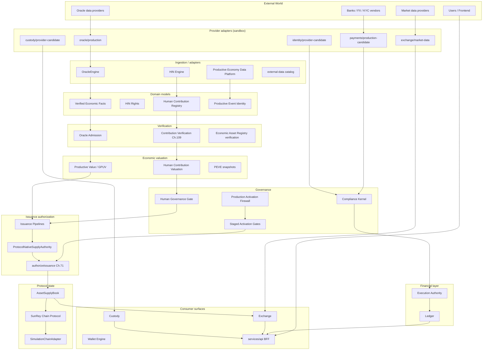
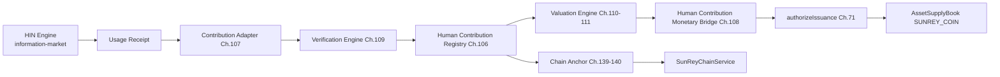
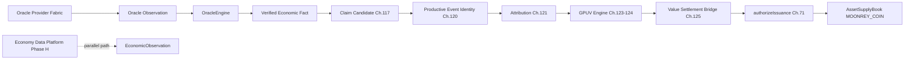
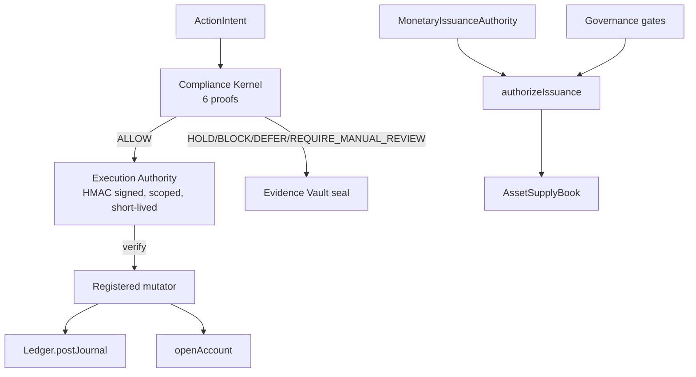

# Wave 1 Repository Baseline

**Status:** Authoritative inspection baseline for SunRey blockchain and economic architecture upgrade  
**Date:** 2026-09-02  
**Scope:** Inspection, mapping, documentation, and validation only — no redesign, no production activation, no monetary behavior changes  
**Evidence hierarchy:** Source code > machine manifests (`manifest.json`, `sunrey-authority-map.json`, `sunrey-blockchain-protocol.json`) > narrative docs

---

## 1. Executive Summary

SunRey is a TypeScript/Rust monorepo implementing a **simulation-first** digital banking and dual-economy platform. The repository enforces a strict constitutional model: the **Compliance Kernel** decides consequential actions via six proofs; only signed **Execution Authority** may mutate fiat ledger state; native coin supply flows through **AssetSupplyBook** and **Chunk 71 monetary issuance** (`authorizeIssuance`); all outcomes are sealed in the **Evidence Vault**.

**What "SunRey blockchain" means today in implementation:**

| Layer | Reality |
|-------|---------|
| **TypeScript trust layer** | `SunReyChainService` + `SimulationChainAdapter` — in-memory intents, anchors, finality simulation. Primary application integration surface. |
| **Transaction protocol** | Deterministic envelope v1 (TS + Rust), Ed25519 signatures, domain-separated hashing. **IMPLEMENTED**. |
| **Rust dev node** | BFT consensus (Tendermint-family), redb storage, P2P node. **IMPLEMENTED** for development/testnet rehearsal. |
| **Production mainnet** | **NOT IMPLEMENTED**. `mainnetEnabled: false`, `productionBlockchainImplemented: false`. |
| **Chain balances** | **Never authoritative** for financial state. Ledger wins over chain native units per ADR boundary. |

**Two protocol-native economic assets** (single sovereign chain design intent):

| Asset | Economy | Canonical supply authority | Current implementation posture |
|-------|---------|--------------------------|--------------------------------|
| **SUNREY_COIN** (proto ID 1) | Human Economy | `AssetSupplyBook` + Chunk 71; application layer also uses Kernel-gated ledger via `packages/sunrey-coin` | Dual authority: `CURRENT_APPLICATION_AUTHORITY` (ledger) vs `NATIVE_BLOCKCHAIN_AUTHORITY` (chain dev units). Migration schema exists; `production_migration_performed: false`. |
| **MOONREY_COIN** (proto ID 2) | Productive Economy | `AssetSupplyBook` + productive issuance pipelines | `moonreyIssuanceActivated(): false` at protocol. Development issuance from verified productive contributions only. Production issuance **NOT IMPLEMENTED**. |

**Safety gates preserved:** `ENVIRONMENT=simulation`, all `LIVE_*` flags `false`, production economic activation is evaluator-only, Kernel gating enforced in CI, no automatic mint from HIN data, AI valuation, or oracle observations.

**Primary authority conflicts identified (documented, not fixed):**
1. SunRey Coin ledger journals (`packages/sunrey-coin`) vs `AssetSupplyBook` (no production bridge wired).
2. Exchange `InMemoryNativeChain` / custody positions vs canonical supply.
3. Two observation pipelines under `packages/sunrey-chain` (OracleEngine vs Productive Economy Data Platform).
4. HIN simulation registry vs canonical `HumanContributionRegistry` binding.

---

## 2. Repository Architecture Map

### A. Applications

| Path | Responsibility | Upstream | Downstream | Authoritative state | Read-only | Can mutate | Posture |
|------|----------------|----------|------------|---------------------|-----------|------------|---------|
| `apps/explorer/` | Static blockchain explorer UI (HTML/JS/CSS) | `packages/sunrey-explorer` APIs | Browser users | No | Yes (client) | No | **Simulation** |

### B. Services

| Path | Responsibility | Upstream | Downstream | Authoritative state | Read-only | Can mutate | Posture |
|------|----------------|----------|------------|---------------------|-----------|------------|---------|
| `services/api/` | Canonical `/api/v1` Platform API + Consumer BFF (Lovable) | packages/*, services/accounts | Frontend, SDK, agents | No (orchestration) | No | Yes (via Kernel-gated ports) | **Simulation** |
| `services/accounts/` | Kernel-gated open, deposit, withdraw, transfer, balances | kernel, ledger, domain | api, consumer-platform | No (delegates to ledger) | No | Yes (EA required) | **Simulation** |
| `services/identity/` | Identity application facade | packages/identity | api | No | No | Yes (identity metadata) | **Simulation** |
| `services/economic-graph/` | PEG application facade | packages/personal-economic-graph | api | No | No | Yes (graph projections) | **Simulation** |
| `services/consumer-platform/` | Consumer workflow orchestration | accounts, identity, packages | api preview paths | No | No | Yes (EA required) | **Simulation** |
| `services/cards/` | Card hold gateway / consumer card ops | packages/cards | api | No | No | Yes (EA required) | **Simulation** |
| `services/compliance/` | Compliance application facade | kernel | internal ops | No | No | Evaluates only | **Simulation** |
| `services/treasury/` | Treasury service facade | packages/treasury | internal | No | No | Yes (EA required) | **Simulation** |
| `services/investments/` | Investments service facade | packages/investments | api grow | No | No | Yes (EA required) | **Simulation** |
| `services/strategy-lab/` | Strategy lab facade | packages/strategy-lab | internal | No | No | Simulation only | **Simulation** |

### C. Packages (48 workspace packages — grouped by domain)

#### Core financial constitution

| Path | Responsibility | Authoritative? | Mutates? | Posture |
|------|----------------|----------------|----------|---------|
| `packages/money/` | `bigint` minor-unit Money type | Type authority | No | **IMPLEMENTED** |
| `packages/domain/` | Customer, Account, Brand, LegalEntity, Result | Domain models | `openAccount` (with EA) | **IMPLEMENTED** |
| `packages/permissions/` | ActionIntent, Execution Authority (HMAC) | EA signing | Issues EA (kernel-only) | **IMPLEMENTED** |
| `packages/kernel/` | Six proofs, monotonic combine, Kernel submit | Policy decisions | Seals evidence; issues EA on ALLOW | **IMPLEMENTED** |
| `packages/ledger/` | Append-only journals | **Yes** — fiat journal | `postJournal` (EA required) | **IMPLEMENTED** |
| `packages/evidence/` | Hash-chained Evidence Vault | **Yes** — evidence | Append-only seal | **IMPLEMENTED** |
| `packages/config/` | ENVIRONMENT, LIVE_* flags, clock, product identity | Config authority | No (flags frozen) | **IMPLEMENTED** |
| `packages/security/` | KeyProvider, envelope encryption, credential plane | Key metadata | No raw credentials in domain | **IMPLEMENTED** |
| `packages/identity/` | SunRey Identity, sessions, ActorContext | **Yes** — identity | Session/actor metadata | **IMPLEMENTED** |
| `packages/persistence/` | PostgreSQL adapter | Persistence (not second ledger) | DB writes | **IMPLEMENTED** |
| `packages/events/` | Domain events, outbox/inbox/replay | Event envelope | Durable event writes | **IMPLEMENTED** |

#### Blockchain and native assets

| Path | Responsibility | Authoritative? | Mutates? | Posture |
|------|----------------|----------------|----------|---------|
| `packages/sunrey-chain/` | Chain protocol, consensus (Rust), economics, oracles, productive economy, wallet, testnet | **Yes** — native supply (`AssetSupplyBook`), chain protocol state (non-financial) | Issuance/burn/transfer (gated) | **SIMULATION** (trust layer) + **IMPLEMENTED** (dev node) |
| `packages/sunrey-coin/` | SunRey Coin simulation service (ledger-backed) | Ledger custody books (not supply book) | issue/transfer/burn (Kernel-gated) | **Simulation** |
| `packages/sunrey-explorer/` | Explorer read models and CLI | No | No | **Simulation** |

#### Human economy

| Path | Responsibility | Authoritative? | Mutates? | Posture |
|------|----------------|----------------|----------|---------|
| `packages/information-market/` | HIN rights, consent, usage receipts | **Yes** — HIN rights | Rights/consent/usage | **Simulation** |
| `packages/human-economic-contribution/` | Contribution registry, verification, valuation | **Yes** — contributions | Registry lifecycle | **Simulation** |
| `packages/consent/` | Consent domain | **Yes** — consent records | Consent grants/revocations | **Simulation** |
| `packages/personal-data-vault/` | Subject-bound encrypted store | **Yes** — PDV records | Vault CRUD (encrypted) | **Simulation** |
| `packages/clean-room/` | Clean-room computation | No (orchestration) | Computation requests | **Simulation** |
| `packages/economic-asset-registry/` | Cross-domain asset metadata index | **No** (`REGISTRY_IS_SOURCE_OF_TRUTH: false`) | Metadata only | **Simulation** |

#### Productive economy

| Path | Responsibility | Authoritative? | Mutates? | Posture |
|------|----------------|----------------|----------|---------|
| `packages/sunrey-chain/src/productive/` | Productive claims, GPUV, attribution, issuance | Event identity, GPUV results | Observations → value (not mint) | **Engineering simulation** |
| `packages/sunrey-chain/src/oracle/` | Oracle observations → verified facts | **Yes** — oracle facts | Observations (no mint) | **Simulation** |
| `packages/sunrey-economics/` | Dual-economy simulation laboratory | No | Stress/rehearsal only | **Simulation** |

#### Exchange, custody, payments

| Path | Responsibility | Authoritative? | Mutates? | Posture |
|------|----------------|----------------|----------|---------|
| `packages/sunrey-exchange/` | Canonical Exchange | Order book (sim), native clearing | Trades, settlement ports | **Simulation** |
| `packages/custody/` | Provider-neutral custody | Custody positions (sim) | Deposits/withdrawals (Kernel-gated) | **Simulation** |
| `packages/payments/` | Cross-border payments, FX, rails | Payment intents | Routes (sandbox) | **Simulation** |
| `packages/market-surveillance/` | Deterministic alerts | No | Case proposals | **Simulation** |

#### Intelligence, agents, platform

| Path | Responsibility | Authoritative? | Mutates? | Posture |
|------|----------------|----------------|----------|---------|
| `packages/platform/` | PEVE, growth orchestrator | **Yes** — PEVE snapshots | PEVE (not mint) | **Simulation** |
| `packages/personal-economic-graph/` | Personal Economic Graph | PEG projections (non-authoritative intelligence) | Graph nodes | **Simulation** |
| `packages/sunrey-agent/` | Agent mandates, ProposalGate | No execution | Proposals only | **Simulation** |
| `packages/ai-runtime/` | AI inference (S3M-primary) | No | Inference only | **Simulation** |
| `packages/agent/` | Personal Economy Agent (isolated) | No ledger/kernel access | Proposals only | **Simulation** |
| `packages/regulatory-twin/` | Regulatory digital twin | No | Counterfactual sim | **Simulation** |
| `packages/external-data/` | External data provider catalog | No | Ingestion adapters | **Sandbox** |
| `packages/sunrey-sdk/` | Developer SDK, gateway, developer platform | No | API adapter | **Simulation** |
| `packages/sunrey-range/` | Adversarial cyber-economic test range | No | Test scenarios | **Simulation** |

#### Access economy

| Path | Responsibility | Posture |
|------|----------------|---------|
| `packages/access-fabric/`, `packages/sunrey-access-fabric/`, `packages/sunrey-access/`, `packages/access-economy/`, `packages/human-access-economy/` | Access rights, capacity markets, human access economy | **Simulation** |

#### Other packages

| Path | Responsibility | Posture |
|------|----------------|---------|
| `packages/cards/`, `packages/investments/`, `packages/treasury/`, `packages/risk/`, `packages/risk-evidence/`, `packages/strategy-lab/`, `packages/agentic-capital-mesh/`, `packages/model-registry/`, `packages/provider-sdk/` | Domain-specific simulation modules | **Simulation** |

### D. Databases

| Path | Database | Responsibility | Authoritative for | Posture |
|------|----------|----------------|-------------------|---------|
| `db/customer/` | `solstice_customer` | Identity, customer, PEG, exchange, chain, coin, consent, PDV, agent, grow, cards, etc. (40 migrations) | Customer domain projections | **Simulation** (PostgreSQL) |
| `db/ledger/` | `solstice_ledger` | Journals, postings, events, banking core, digital asset journals | **Fiat ledger journals** | **Simulation** (insert-only) |
| `db/evidence/` | `solstice_evidence` | Evidence Vault hash chain | **Evidence** | **Simulation** (insert-only) |
| `db/security/` | `solstice_security` | Key metadata, credential descriptor refs | Security metadata (not keys) | **Simulation** |
| `db/explorer/` | Explorer index | Block/tx index for explorer | Explorer views (derived) | **Simulation** |

**Invariant:** No `account.balance` column. Balances derived from postings.

### E. Infrastructure

| Path | Responsibility | Posture |
|------|----------------|---------|
| `scripts/ci.sh` | Full CI pipeline (integrity → architecture → tests → typecheck → secrets → Rust) | **Active** |
| `scripts/postgres-*.sh`, `scripts/postgres-*.mjs` | Local PostgreSQL lifecycle | **Dev** |
| `scripts/check-kernel-gating.mjs` | Kernel gating enforcement | **Active** |
| `scripts/check-production-safety.mjs` | LIVE_* / ENVIRONMENT guards | **Active** |
| `scripts/sunrey-testnet-*.mjs/sh` | Testnet cluster/manifest validation | **Testnet rehearsal** |
| `scripts/sunrey-release.mjs` | Supply-chain audit, SBOM, signing | **Release tooling** |
| `packages/sunrey-chain/node/` | Rust networked node binaries | **Dev/testnet** |
| `packages/sunrey-chain/rust/` | Rust workspace (protocol, consensus, state, storage) | **Dev** |
| `.github/workflows/` | GitHub Actions CI | **Active** |

### F. Blockchain / Protocol Components

| Component | Path | Status |
|-----------|------|--------|
| Transaction protocol (TS) | `packages/sunrey-chain/src/protocol/` | **IMPLEMENTED** |
| Transaction protocol (Rust) | `packages/sunrey-chain/rust/crates/protocol/` | **IMPLEMENTED** |
| Native asset registry | `packages/sunrey-chain/src/native-assets/registry.ts` | **IMPLEMENTED** |
| Supply authority | `packages/sunrey-chain/src/economics/supply.ts` | **IMPLEMENTED** |
| Mint gate | `packages/sunrey-chain/src/economics/issuance.ts` | **IMPLEMENTED** |
| Protocol supply wrapper | `packages/sunrey-chain/src/native-assets/economic-controls.ts` | **IMPLEMENTED** |
| Trust layer service | `packages/sunrey-chain/src/service.ts` | **SIMULATION** |
| BFT consensus | `packages/sunrey-chain/rust/crates/consensus/` | **IMPLEMENTED** (dev) |
| Chain storage | `packages/sunrey-chain/rust/crates/storage/` | **IMPLEMENTED** (redb) |
| P2P node | `packages/sunrey-chain/rust/crates/node/`, `node/` | **IMPLEMENTED** (dev) |
| Testnet genesis | `packages/sunrey-chain/src/testnet/genesis.ts` | **IMPLEMENTED** (fixtures) |
| Mainnet genesis | `packages/sunrey-chain/src/runtime/genesis.ts` | **BLOCKED** (fails closed) |
| Production activation | `packages/sunrey-chain/src/economics/production-activation/` | **EVALUATOR ONLY** |

### G. Economic Engines

| Engine | Path | Mints? |
|--------|------|--------|
| Chunk 71 monetary constitution | `packages/sunrey-chain/src/economics/constitution.ts` | Gate only |
| AssetSupplyBook | `packages/sunrey-chain/src/economics/supply.ts` | Supply mutations |
| Human contribution bridge | `packages/sunrey-chain/src/economics/human-contribution-bridge/` | SunRey via governed chain |
| Productive issuance | `packages/sunrey-chain/src/productive/issuance.ts` | MoonRey dev path |
| GPUV engine | `packages/sunrey-chain/src/productive/policy-governance/value-function/` | **No** (GPUV ≠ MoonRey) |
| GPUV settlement bridge | `packages/sunrey-chain/src/productive/policy-governance/value-settlement/bridge.ts` | MoonRey via full chain |
| Human contribution valuation | `packages/human-economic-contribution/src/valuation/` | **No** |
| PEVE | `packages/platform/src/value/` | **No** |
| SunRey Coin service | `packages/sunrey-coin/src/service.ts` | Ledger journals (sim) |

### H. API / BFF Layers

| Layer | Path | Notes |
|-------|------|-------|
| Platform API | `services/api/src/` | `/api/v1` canonical HTTP runtime |
| Consumer BFF | `services/api/src/consumer/` | Lovable integration; orchestration only |
| Phase H economy surface | `services/api/src/consumer/phase-h/` | Productive observations (no mint) |
| SDK gateway | `packages/sunrey-sdk/src/gateway/` | Developer platform |
| OpenAPI specs | `api/` | Contract definitions |

**Consumer economy routes:** `GET /api/v1/economy*` — **read-only**. No issuance endpoints. Documented in `services/api/src/consumer/resources.ts`.

### I. External Provider Integrations

| Domain | Path | Posture |
|--------|------|---------|
| Banking / FX / rails | `packages/payments/src/production-candidate/` | **Sandbox fixtures** |
| Custody | `packages/custody/src/provider-candidate/` | **Sandbox fixtures** |
| KYC / compliance | `packages/identity/src/provider-candidate/`, `packages/kernel/src/compliance/provider-candidate/` | **Sandbox fixtures** |
| Oracle providers | `packages/sunrey-chain/src/oracle/production/` | **Injected/fake transports** |
| Market data | `packages/sunrey-exchange/src/market-data/` | **Fixture adapters** |
| External data catalog | `packages/external-data/` | **Catalog + sandbox** |
| Blockchain analytics | `packages/kernel/src/compliance/provider-candidate/blockchain-analytics.ts` | **Fixture** |
| AI (S3M) | `packages/ai-runtime/src/providers/s3m/` | **Inference only** |

**Rule:** No real network calls to banks, FX, payment providers, or live chains (`AGENTS.md`).

### J. Security / Governance Components

| Component | Path |
|-----------|------|
| Compliance Kernel | `packages/kernel/src/kernel.ts` |
| Execution Authority | `packages/permissions/src/execution-authority.ts` |
| KeyProvider | `packages/security/` |
| Production economic firewall | `packages/sunrey-chain/src/economics/production-activation/firewall.ts` |
| Production parameter authorization | `packages/sunrey-chain/src/economics/production-activation/authorization/` |
| Launch freeze | `packages/sunrey-chain/src/release-candidate/mainnet/launch-freeze/` |
| Launch ceremony | `packages/sunrey-chain/src/production-ceremony/launch-candidate/` |
| Staged activation | `packages/sunrey-chain/src/post-genesis/staged-activation/` |
| Launch abort / recovery | `packages/sunrey-chain/src/governance-ops/launch-abort/` |
| Operating scope | `packages/sunrey-chain/src/mainnet/operating-scope/` |
| Architectural linter | `tools/architectural-linter/` |
| Constitution | `docs/architecture/constitution.md` |

### K. Tests

| Location | Scope |
|----------|-------|
| `tests/` | 188+ integration/e2e/phase/chunk tests |
| `packages/*/src/*.test.ts` | Package unit tests |
| `tests/persistence/` | PostgreSQL integration (requires `db:up`) |
| `packages/sunrey-chain/src/assurance.test.ts` | Property/invariant tests |
| `packages/sunrey-chain/rust/` | Rust unit + differential + fuzz tests |
| `tools/architectural-linter/src/constitution.test.ts` | Architecture constitution tests |

### L. Scripts / Tooling

See `package.json` scripts and `scripts/` directory (73 files). Key commands: `npm test`, `npm run ci`, `npm run typecheck`, `npm run integrity:check`, `npm run gate`, `npm run demo`, `npm run db:migrate`, `npm run test:persistence`.

---

## 3. Authoritative State Matrix

Tracing actual writes (not naming alone):

| State domain | Authoritative owner | Write path | Read consumers | Duplicate risk? |
|--------------|--------------------|-----------|--------------------|-----------------|
| **Customer identity** | `packages/identity` | `packages/identity/src/service.ts` | api, accounts, kernel proofs | Low — `services/identity` is facade only |
| **Consent** | `packages/consent` + HIN engine | `packages/consent/`, `information-market/src/network/engine.ts` | api `/data`, HIN | Medium — consent in both consent package and HIN |
| **Rights (HIN)** | `packages/information-market` | `network/engine.ts` | api `/hin`, contribution adapter | Low |
| **Contribution records** | `packages/human-economic-contribution` | `registry.ts` (`submit`, `verify`, `reject`, …) | HIN adapter, valuation, monetary bridge | **Yes** — HIN in-process simulation registry vs canonical bind |
| **Ledger journals** | `packages/ledger` | `Ledger.postJournal` (EA required) | accounts service, sunrey-coin, persistence | Low — single journal API |
| **Evidence** | `packages/evidence` | `EvidenceVault.seal` | kernel, all gated mutators | Low — hash-chained |
| **Provider observations** | `packages/sunrey-chain/src/oracle/engine.ts` | `submitObservation` → `admitObservation` | claim-candidate, productive paths | Low for oracle path |
| **Productive observations (Phase H)** | `packages/sunrey-chain/src/productive/economy-data/` | `ingestObservation` | api phase-h, issuance-interface | **Yes** — parallel to OracleEngine |
| **SunRey supply (canonical)** | `packages/sunrey-chain/src/economics/supply.ts` | `AssetSupplyBook` via `authorizeIssuance` | native-assets client, api economy reads | **Yes** — `sunrey-coin` ledger path separate |
| **MoonRey supply (canonical)** | Same `AssetSupplyBook` | `authorizeIssuance` + productive pipelines | productive engine, exchange | **Yes** — `productive/supply.ts` engine ledger + exchange clearing |
| **Wallet balances (fiat)** | Derived from ledger | N/A (read) | accounts, api | Low |
| **Wallet balances (native)** | Multiple sim layers | FeeEngine, WalletEngine, custody, exchange clearing | api `/wallets`, exchange | **Yes** — multiple non-canonical holders |
| **Exchange balances** | `packages/sunrey-exchange` | In-memory order book + native clearing | api `/exchange` | **Yes** — not `AssetSupplyBook` or fiat ledger |
| **Blockchain state (protocol)** | `packages/sunrey-chain` | Rust `ChainStore` / TS `ProtocolState` / simulation adapter | explorer, wallet sync | Medium — TS in-memory vs Rust redb |
| **Governance decisions** | Kernel + production-activation evaluators | `kernel.submit`, firewall evaluators | staged-activation gates | Low — evaluators don't mint |
| **Monetary policy** | Chunk 71 constitution | `economics/constitution.ts`, parameter registry | issuance, production-activation | Low |
| **Transaction history (fiat)** | Ledger-derived | postings | accounts activity projection | Low |
| **Transaction history (chain)** | Chain store / simulation | adapter receipts | explorer | Simulation only |
| **PEVE** | `packages/platform/src/value/` | `PersonalEconomicValueEngine` | grow, personal-economy api | Low — explicitly not mint |
| **GPUV** | `packages/sunrey-chain/.../value-function/` | `evaluateProductiveValue` | settlement bridge | Low — GPUV ≠ MoonRey enforced |

---

## 4. Dependency Graph

### Overall system flow



### Human Economy path



**Hard stops:** HIN data does not auto-mint. AI valuation does not auto-mint. Verification decisions cannot carry `sunReyQuantity` or mint authority.

### Productive Economy path



**Hard stops:** `moonreyIssuanceActivated(): false`. Observations do not mint. GPUV ≠ MoonRey. Multiple observations of same event must not become multiple economic events (event identity registry).

---

## 5. State Mutation Matrix

| Surface | Path | Function | Mutates | Authority gate | Bypass risk |
|---------|------|----------|---------|----------------|-------------|
| Fiat journal write | `packages/ledger/src/journal.ts` | `Ledger.postJournal` | Journals, balances (derived) | Execution Authority | **No** — sole journal API |
| Account open | `packages/domain/src/account.ts` | `openAccount` | Account object | Verified EA | **No** |
| Accounts open | `services/accounts/src/open-account.ts` | `AccountsService.open` | Account + register | Kernel → EA | **No** |
| Deposit/withdraw/transfer | `services/accounts/src/money-movement.ts` | `deposit`, `withdraw`, `transfer` | Journals | Kernel → EA | **No** (fiat) |
| Kernel decision | `packages/kernel/src/kernel.ts` | `ComplianceKernel.submit` | Evidence; EA on ALLOW | Is the gate | **No** |
| EA issue | `packages/permissions/src/execution-authority.ts` | `AuthorityIssuer.issue` | Signed EA | Kernel-private | **No** |
| Canonical mint | `packages/sunrey-chain/src/economics/issuance.ts` | `authorizeIssuance` | `AssetSupplyBook` | MonetaryIssuanceAuthority | **No** — canonical |
| Protocol supply apply | `packages/sunrey-chain/src/native-assets/economic-controls.ts` | `ProtocolNativeSupplyAuthority.applyIssuance` | AssetSupplyBook | Monetary + actor + MAINNET block | **No** |
| SunRey pipeline | `packages/sunrey-chain/src/native-assets/issuance-pipelines.ts` | `runSunReyIssuancePipeline` | SunRey book | Governance + contribution checks | **No** |
| MoonRey pipeline | same | `runMoonReyIssuancePipeline` | MoonRey book | Productive + oracle safety | **No** |
| Supply credit/debit | `packages/sunrey-chain/src/economics/supply.ts` | `creditCirculating`, `debitCirculating` | Supply buckets | Low-level (caller-gated) | Low if only called from gates |
| Burn | `packages/sunrey-chain/src/economics/operations.ts` | `burn` | burned, circulating | BurnClass policy | **No** |
| Transfer (native) | same | `transfer` | Positions (no supply change) | Caller policy | **No** |
| SunRey Coin ledger | `packages/sunrey-coin/src/service.ts` | `issue`, `transfer`, `burn` | Ledger custody books | Kernel → EA | **Yes** — not AssetSupplyBook |
| Productive engine supply | `packages/sunrey-chain/src/productive/supply.ts` | `applyIssuance`, `applyBurn` | `NativeAssetSupplyState` | Engine policy | **Partial** — converges via bridge |
| Human bridge | `packages/sunrey-chain/src/economics/human-contribution-bridge/gate.ts` | `HumanContributionMonetaryBridge.attempt` | SunRey AssetSupplyBook | Full governed chain | **No** |
| GPUV settlement | `packages/sunrey-chain/src/productive/policy-governance/value-settlement/bridge.ts` | settle path | MoonRey AssetSupplyBook | Full governed chain | **No** |
| Exchange native chain | `packages/sunrey-exchange/src/native-clearing/chain.ts` | `InMemoryNativeChain.issue` | Sim holdings | None | **Yes** — sandbox |
| Exchange faucet | `packages/sunrey-exchange/src/native-clearing/engine.ts` | `faucetToCustody` | Sim holdings | None | **Yes** — dev only |
| Custody credit | `packages/custody/src/service.ts` | `creditExternalDeposit` | Custody positions | Kernel → EA | **Yes** relative to supply book |
| Fee faucet | `packages/sunrey-chain/src/fees/engine.ts` | `FeeEngine.faucet` | Fee-account SUNREY | None | **Yes** — dev labeled |
| Wallet submit | `packages/sunrey-chain/src/wallet/engine.ts` | `WalletEngine.submit` | Fee transfers | Wallet signatures | **Yes** — fee sim |
| SDK faucet | `packages/sunrey-sdk/src/gateway/platform.ts` | `faucet` | FeeEngine | None | **Yes** — dev |
| Chain intent | `packages/sunrey-chain/src/service.ts` | `createIntent`, `submit` | Chain intents/anchors | Policy gate + KeyProvider | **No** financial rewrite |
| Contribution registry | `packages/human-economic-contribution/src/registry.ts` | `submit`, `verify`, `reject` | Contribution lifecycle | Verification engine | **No** mint |
| HIN rights | `packages/information-market/src/network/engine.ts` | consent/rights methods | HIN state | HIN policy | **No** mint |
| Oracle observation | `packages/sunrey-chain/src/oracle/engine.ts` | `submitObservation` | Observations/facts | Admission policy | **No** mint |
| Production activation | `packages/sunrey-chain/src/economics/production-activation/firewall.ts` | `evaluateProductionEconomicActivation` | Nothing (evaluator) | N/A | **No** |
| Staged activation | `packages/sunrey-chain/src/post-genesis/staged-activation/gates.ts` | `evaluateDomainGates` | Nothing (evaluator) | N/A | **No** |
| Rust native apply | `packages/sunrey-chain/rust/crates/native-assets/src/apply.rs` | `apply_transfer` | Rust chain state | Protocol validation | Simulation layer |
| API economy | `services/api/src/consumer/phase-h/dispatch.ts` | `POST .../observe` | Observations only | No issuance | **No** |
| API issuance | — | — | — | **No endpoints** | N/A |

---

## 6. Blockchain Runtime Capability Matrix

| Capability | Status | Evidence |
|------------|--------|----------|
| **Transaction model** | **IMPLEMENTED** | `protocol/envelope.ts`, `protocol/validation.ts`, Rust `transaction.rs` |
| **Block model** | **IMPLEMENTED** | Rust `block.rs`, simulation adapter fake blocks |
| **State machine** | **IMPLEMENTED** | `protocol/state.ts` (`ProtocolState`), Rust `state` crate |
| **State persistence (TS)** | **SIMULATION** | `store.ts` — in-memory only |
| **State persistence (Rust)** | **IMPLEMENTED** | `rust/crates/storage/` — redb `ChainStore` |
| **Block persistence** | **PARTIAL** | Rust redb + WAL/snapshots; TS simulation only |
| **Validator implementation** | **IMPLEMENTED** (dev) | `src/validators/`, four-validator harness |
| **Validator implementation (production)** | **NOT IMPLEMENTED** | `productionValidatorSetImplemented: false` |
| **Consensus implementation** | **IMPLEMENTED** (dev) | `rust/crates/consensus/` — Tendermint-family BFT |
| **Consensus (production)** | **NOT IMPLEMENTED** | `productionConsensusImplemented: false` |
| **Finality implementation** | **IMPLEMENTED** (deterministic sim) | `SimulationChainAdapter.advanceBlocks`, Rust commit |
| **Signatures** | **IMPLEMENTED** | Ed25519 — `protocol/authentication.ts`, `packages/security` |
| **Transaction signatures** | **IMPLEMENTED** | Envelope signing, validator block signatures (Rust) |
| **State roots** | **PARTIAL** | Protocol state hashing; migration Merkle commitment schema |
| **Merkle structures** | **PARTIAL** | Migration manifest; not full state trie |
| **Nonces / sequences** | **IMPLEMENTED** | `ProtocolState` actor sequences, replay protection in validation |
| **Replay protection** | **IMPLEMENTED** | `protocol/validation.ts` stateful checks |
| **Peer/network layer** | **IMPLEMENTED** (dev) | `rust/crates/node/`, `node/` binaries |
| **Synchronization** | **PARTIAL** | Node sync paths exist; production sync **NOT IMPLEMENTED** |
| **Genesis** | **IMPLEMENTED** (testnet fixtures) / **BLOCKED** (mainnet) | `testnet/genesis.ts`, `runtime/genesis.ts` fails closed |
| **Snapshots** | **IMPLEMENTED** (Rust) | `storage/snapshot.rs` |
| **Recovery** | **IMPLEMENTED** (Rust WAL) | `storage/wal.rs`; Chunk 154 operational recovery separate |
| **Forks / reorganization** | **SIMULATION** | `observeReorg()` — `financialStateRewritten: false` |
| **Development network** | **IMPLEMENTED** | `net_sunrey_simulation`, devnet binaries |
| **Testnet** | **IMPLEMENTED** (fixtures) | `src/testnet/`, deterministic genesis, faucet |
| **Mainnet** | **NOT IMPLEMENTED** | `mainnetEnabled: false`, genesis blocked |
| **Production blockchain** | **NOT IMPLEMENTED** | `productionBlockchainImplemented: false` |
| **Trust layer (TS)** | **SIMULATION** | `SunReyChainService` + `SimulationChainAdapter` |
| **Native asset protocol IDs** | **IMPLEMENTED** | SUNREY_COIN=1, MOONREY_COIN=2 |
| **MoonRey protocol issuance** | **NOT ACTIVATED** | `moonreyIssuanceActivated(): false` |
| **Chain balance authority** | **EXPLICITLY FALSE** | Architecture invariant, ADR-0031 |
| **Resource metering / fees** | **IMPLEMENTED** | `src/fees/`, unsigned integer only |
| **Light client** | **INTERFACE ONLY** | `docs/architecture/sunrey-light-client-protocol.md` |
| **Interchain** | **SIMULATION** | `src/interop/` fixtures |

---

## 7. Human Economy Architecture

### Purpose
SUNREY_COIN originates from governed, verified human economic contribution. Human data, AI valuation, and rights metadata must never automatically mint.

### Canonical components

| Layer | Owner | Key path |
|-------|-------|----------|
| HIN rights & usage | `packages/information-market` | `src/network/engine.ts` |
| HIN → contribution adapter | `packages/information-market` | `src/network/contribution/adapter.ts` |
| Contribution registry | `packages/human-economic-contribution` | `src/registry.ts` |
| Verification (Ch.109) | `packages/human-economic-contribution` | `src/verification/engine.ts` |
| Valuation (Ch.110-111) | `packages/human-economic-contribution` | `src/valuation/engine.ts` |
| HIN product layer | `packages/human-economic-contribution` | `src/hin-value/engine.ts` |
| Chain anchor | `packages/information-market` | `src/network/chain-anchor/coordinator.ts` |
| Monetary bridge (Ch.108) | `packages/sunrey-chain` | `src/economics/human-contribution-bridge/` |
| Mint gate (Ch.71) | `packages/sunrey-chain` | `src/economics/issuance.ts` |
| Application SunRey Coin | `packages/sunrey-coin` | `src/service.ts` (ledger sim, Kernel-gated) |

### Invariants (code-enforced)
- Verification decisions cannot carry valuation or SunRey quantity (`registry.ts`)
- Registry `authorizeMint()` always refuses
- Valuation results: `peveUsedAsTokenFormula: false`, `sunReyQuantity: null`, `simulationOnly: true`
- Human governance gate required for mainnet-class issuance (`evaluateHumanGovernanceGate`)
- PEVE (`packages/platform/src/value/`) is separate from contribution valuation

### Documentation vs implementation
| Topic | Docs say | Code shows |
|-------|----------|------------|
| SunRey authority | Dual: application ledger vs native chain (`native-asset-authority-boundary.md`) | Both exist; no production migration executed |
| SunRey owner in protocol JSON | `packages/sunrey-coin` for application authority | Matches `sunrey-blockchain-protocol.json` |
| Automatic mint from HIN | Forbidden | Enforced in adapter and registry firewalls |

---

## 8. Productive Economy Architecture

### Purpose
MOONREY_COIN originates from governed, verified productive economic contribution. Oracle observations, GPUV, and market price must remain separate from coin quantity.

### Canonical components

| Layer | Owner | Key path |
|-------|-------|----------|
| Oracle engine | `packages/sunrey-chain` | `src/oracle/engine.ts` |
| Oracle provider fabrics | `packages/sunrey-chain` | `src/oracle/production/provider-families/*` |
| Claim candidates (Ch.117) | `packages/sunrey-chain` | `src/productive/claim-candidate/` |
| Source taxonomy (Ch.116) | `packages/sunrey-chain` | `src/productive/source-taxonomy/` |
| Event identity (Ch.120) | `packages/sunrey-chain` | `src/productive/policy-governance/attribution/store.ts` |
| Attribution (Ch.121) | `packages/sunrey-chain` | `src/productive/policy-governance/attribution/engine.ts` |
| GPUV / PVF (Ch.123-124) | `packages/sunrey-chain` | `src/productive/policy-governance/value-function/engine.ts` |
| Value settlement (Ch.125) | `packages/sunrey-chain` | `src/productive/policy-governance/value-settlement/bridge.ts` |
| Productive economy data (Phase H) | `packages/sunrey-chain` | `src/productive/economy-data/` |
| MoonRey issuance (dev) | `packages/sunrey-chain` | `src/productive/issuance.ts`, `issuance-pipelines.ts` |
| Mint gate | `packages/sunrey-chain` | `authorizeIssuance` + `moonreyIssuanceActivated(): false` |

### Invariants (code-enforced)
- `VerifiedEconomicFact` does not mint MoonRey (oracle engine checks)
- Claim candidates: `automaticIssuance: false`
- GPUV engine refuses production activation and AI economic judgment
- Settlement bridge refuses standalone issuance from observations, facts, claims, events, attribution, or GPUV alone
- Attribution accounting book: `isAssetSupplyBook = false`

### Documentation vs implementation
| Topic | Docs say | Code shows |
|-------|----------|------------|
| GPUV is not MoonRey | Repeated in AGENTS.md, authority map | Enforced in value-function and bridge |
| Production valuation inactive | AGENTS.md | `productionActivated: false` throughout |
| DATA_RATE ≠ DATA_VOLUME | AGENTS.md | Enforced in bandwidth provider family |
| facility_hour vs machine_h | AGENTS.md | New feeds use `facility_hour` |

---

## 9. Database Architecture

### Bounded databases (4 + explorer)

```
db/customer/   → solstice_customer   (40 migrations, V001–V040)
db/ledger/     → solstice_ledger     (9 migrations)
db/evidence/   → solstice_evidence   (1 migration)
db/security/   → solstice_security   (2 migrations)
db/explorer/   → explorer index      (1 migration)
```

### Schema highlights (customer DB — economic/blockchain related)

| Migration | Domain |
|-----------|--------|
| V002 | Identity |
| V020 | Consent |
| V022 | SunRey Coin |
| V024 | SunRey Chain |
| V025 | SunRey Exchange |
| V026 | Exchange controls |
| V038 | Consent data rights |
| V039 | PDV productization |

### Ledger DB

- V001: Core ledger (journals, postings — insert-only)
- V004–V009: Banking core, digital asset journals, async fabric, operation execution

### Rules
- No ORM auto-sync
- Applied migrations immutable (checksum CI)
- Balances derived from postings, never stored on Account

### Authority
- **Fiat financial truth:** `db/ledger` via `packages/persistence` → `packages/ledger`
- **Evidence truth:** `db/evidence` via `packages/evidence`
- **Customer projections:** `db/customer` — not a second ledger
- **Native supply:** NOT persisted as single DB table; authoritative in `AssetSupplyBook` (in-process) with persistence adapters for operational recovery (Chunk 154)

---

## 10. API Architecture

### Layers

```
Frontend (Lovable) 
  → services/api (Consumer BFF + Platform API)
    → services/accounts, packages/* ports
      → Kernel → EA → Ledger / AssetSupplyBook / Chain
```

### Consumer BFF (`services/api/src/consumer/`)

- **Orchestration only** — not a ledger, Exchange, Agent runtime, or Kernel
- Resource catalog: `resources.ts` — documents availability, domain dependencies, provider requirements
- Economy routes: **read-only** (`GET /api/v1/economy*`)
- Phase H: `POST /api/v1/economy/productive/observe` — observations only, no mint
- Wallets/Exchange: simulation sandbox with `EXTERNAL_PROVIDER_REQUIRED` for live paths
- Agent: proposals only; BFF cannot execute or issue EA

### Internal API
- `services/api/src/internal/` — provider ops, production gates (read/evaluate)

### SDK
- `packages/sunrey-sdk/` — developer platform, gateway, agent tools (restricted)

### OpenAPI
- `api/` — versioned specifications

---

## 11. External Data Architecture

### Posture
All external connectivity disabled: `LIVE_CONNECTIVITY_ENABLED: false`, individual `LIVE_*` flags `false`.

### Provider categories

| Category | Package path | Transport |
|----------|--------------|-----------|
| Banking / payment rails | `packages/payments/src/production-candidate/` | Injected fixtures |
| FX | same | Sandbox quotes |
| Custody | `packages/custody/src/provider-candidate/` | Simulation |
| KYC / AML | `packages/identity/src/provider-candidate/`, `kernel/.../provider-candidate/` | Fixtures |
| Oracle economic data | `packages/sunrey-chain/src/oracle/production/` | Fake/injected only |
| Market data | `packages/sunrey-exchange/src/market-data/` | Phase D contract, fixtures |
| Blockchain analytics | `kernel/.../blockchain-analytics.ts` | Fixtures |
| External data catalog | `packages/external-data/` | Wave 3–7 provider catalogs |
| AI inference | `packages/ai-runtime/src/providers/s3m/` | S3M-primary |

### Certification
- `scripts/provider-certify.ts`, `scripts/providers-certify-live.ts` (live certify scripts exist but production remains inactive)
- Oracle certification: `packages/sunrey-chain/src/oracle/production/certification/`

### Safety
- SSRF/TLS/allowlist policies in `oracle/production/security-policy.ts`
- No real network calls in CI or default runtime

---

## 12. Security / Governance Architecture

### Control planes



### Production governance chain (evaluator-only)
1. Chunk 65 mainnet readiness → evaluator
2. Chunk 71 monetary constitution → issuance rules
3. Chunk 143 production activation firewall → evaluator (cannot flip LIVE_*)
4. Chunk 144 parameter registry → typed candidates
5. Chunk 163 authorization → AUTHORIZED_CANDIDATE (not PRODUCTION_ACTIVE)
6. Chunk 164 launch freeze → immutable candidate hash
7. Chunk 165 launch ceremony → LAUNCH_AUTHORIZATION_CANDIDATE
8. Chunk 166 staged activation → domain-scoped canary
9. Chunk 167 launch abort → emergency restrictions

### CI enforcement
- Kernel gating registry: `scripts/check-kernel-gating.mjs`
- Architectural linter: `tools/architectural-linter/`
- Deployment posture: `scripts/check-deployment-posture.py`
- Production safety: `scripts/check-production-safety.mjs`
- Secret scan: `scripts/secret-scan.py`

### Key flags (`packages/config`)
- `ENVIRONMENT` = `simulation`
- All `LIVE_*` flags = `false`
- `PRODUCTION_HSM_KMS_CONFIGURED` = `false`

---

## 13. Areas of Ambiguous Authority

| # | Conflict | Modules | Current behavior | Risk |
|---|----------|---------|------------------|------|
| 1 | SunRey supply dual authority | `packages/sunrey-coin` (ledger) vs `AssetSupplyBook` (chain) | Documented in `native-asset-authority-boundary.md`; ledger wins until migration ADR | Supply reconciliation gap in simulation |
| 2 | Native wallet balances | FeeEngine, WalletEngine, custody, exchange clearing, AssetSupplyBook | Each owns its own position map | User-visible balance divergence |
| 3 | Two observation stores | OracleEngine vs Productive Economy Data Platform | Same owner package, different stores | Caller must know which is authoritative |
| 4 | HIN contribution binding | `information-market/.../registry.ts` (sim) vs canonical `HumanContributionRegistry` | `canonical-bind.ts` exists; sim binding for in-process | Wrong wiring in production integration |
| 5 | Chain state persistence | TS in-memory vs Rust redb | Different runtimes, different stores | Cross-runtime state divergence |
| 6 | Productive engine supply | `productive/supply.ts` vs `economics/supply.ts` | Engine ledger converges via bridge in integrated flows | Partial bypass if bridge skipped |
| 7 | Exchange settlement ports | `InMemoryCoinPort` / `InMemoryFiatPort` vs Ledger | By design for sandbox | Not production-safe without port swap |
| 8 | Economic Asset Registry | Metadata index vs domain truth | `REGISTRY_IS_SOURCE_OF_TRUTH: false` | Misinterpretation as verification authority |
| 9 | PEVE vs contribution valuation | `platform/value` vs `human-economic-contribution/valuation` | Firewalls block cross-use | Conceptual confusion for integrators |
| 10 | Protocol JSON owner for SunRey | `packages/sunrey-coin` (application) vs `economics/supply.ts` (native supply) | Intentional split per dual authority model | Naming suggests single owner |

---

## 14. Immediate Architectural Risks

1. **Dual SunRey supply without production bridge** — `sunrey-coin` ledger journals and `AssetSupplyBook` can diverge in simulation; no wired migration execution.
2. **Multiple native balance surfaces** — Exchange clearing, custody, fee engine, and supply book all hold SUNREY/MOONREY positions independently.
3. **MoonRey production issuance disabled but dev paths exist** — `moonreyIssuanceActivated(): false` at protocol; productive engine and pipelines could be mis-wired to skip gates.
4. **TS trust layer is not production blockchain** — `SunReyChainService` simulation adapter is the primary app integration; Rust node is parallel dev stack.
5. **Mainnet genesis fails closed but extensive mainnet rehearsal code exists** — Risk of operator confusion about what "launch" means vs activation.
6. **HIN simulation registry** — In-process binding may be used instead of canonical registry in integration tests/demos.
7. **Parallel observation pipelines** — Economy-data platform and OracleEngine could produce conflicting observations without reconciliation fabric.
8. **No API issuance endpoints** — Correct for safety, but BFF adapters must never gain mint routes during Wave 2+.
9. **Kernel gating does not cover monetary issuance** — `authorizeIssuance` is on separate MonetaryIssuanceAuthority plane; both gates required for complete safety.
10. **48 packages + 10 services complexity** — High surface area for accidental parallel authority creation despite CI guards.

---

## 15. Questions Requiring Resolution in Later Wave 1 Prompts

1. **Single supply reconciliation model** — When and how will `sunrey-coin` ledger path reconcile with `AssetSupplyBook`? Is `AssetMigrationManifest` the only approved path?
2. **Runtime selection** — Which blockchain runtime is target for Wave 2+: TS simulation adapter, Rust node, or unified bridge?
3. **Observation authority** — Should Productive Economy Data Platform observations flow through OracleEngine, or remain a separate governed store?
4. **Wallet balance canonical source** — For native assets, is the wallet read model `AssetSupplyBook` positions, custody, or chain state?
5. **Exchange native clearing production path** — What ports replace `InMemoryNativeChain` for production without creating a second supply authority?
6. **Persistence of AssetSupplyBook** — What is the durable persistence model for native supply across crash recovery (Chunk 154 interaction)?
7. **Ticker assignment** — `NOT_ASSIGNED` for both assets; when does ticker assignment interact with governance gates?
8. **MoonRey activation sequence** — What is the ordered gate chain from `moonreyIssuanceActivated(): false` to production issuance?
9. **Human economy production verification** — `ENGINEERING_VERIFICATION_POLICY` only; what policy replaces it and who owns activation?
10. **Cross-runtime state root** — How will TS protocol state and Rust chain state share a single state root for light clients?
11. **Consent authority unification** — Should `packages/consent` and HIN consent be a single write path for production?
12. **Testnet vs development network** — What distinguishes `net_sunrey_simulation`, testnet genesis, and public testnet (Chunk 53)?

---

## Baseline Validation Results

**Validation date:** 2026-09-02  
**Branch:** `cursor/wave1-repository-baseline-5762`  
**Node:** >=22 (npm 10.9.7)  
**Method:** `npm install` followed by repository validation scripts (not full `npm run ci`, which additionally runs Rust workspace checks, persistence integration, supply-chain audit, and ceremony rehearsals).

| Step | Command | Result | Exit code | Notes |
|------|---------|--------|-----------|-------|
| Install | `npm install` | **PASS** | 0 | 193 packages audited, 0 vulnerabilities |
| Integrity | `npm run integrity:check` | **PASS** | 0 | JSON, merge, YAML, case-collision, catalog validation |
| Typecheck | `npm run typecheck` (`tsc --noEmit`) | **FAIL** | 2 | **1,104 TypeScript errors** across packages and `tests/` (pre-existing; not fixed in this baseline) |
| Architecture lint | `npm run lint:architecture` | **PASS** | 0 | Constitutional / freeze guards |
| Kernel gating | `npm run gate` | **PASS** | 0 | `scripts/check-kernel-gating.mjs` |
| Deployment posture | `python3 scripts/check-deployment-posture.py` | **PASS** | 0 | `ENVIRONMENT=simulation`, `LIVE_*` false |
| Unit/integration tests | `npm test` | **PASS** | 0 | **0 failures**, 1 skipped, duration ~286s |
| End-to-end demo | `npm run demo` | **PASS** | 0 | Phase 1 exit demo: Kernel, EA, ledger, evidence chain |
| Secret scan | `python3 scripts/secret-scan.py` | **PASS** | 0 | No secrets detected |
| Rust node tests | `npm run test:sunrey-node` | **PASS** | 0 | `cargo fmt --check`, `clippy`, `test` in `packages/sunrey-chain/node` |

### Typecheck failure summary (recorded, not remediated)

Representative error categories (baseline snapshot only):

- Missing exports in `packages/access-economy/` (`EligibilityPort`, `TokenBalanceReaderPort`)
- Test files using stale types: `BffResponse | Promise<BffResponse>` property access (`tests/wave-3-prompt-12-crypto-market.test.ts`)
- Crypto algorithm type mismatches (`"Ed25519"` vs allowed union in `tests/wave-3-prompt-8-blockchain-security.test.ts`)
- Branded type violations (`UtcInstant`, `EconomicActivity.sourceType`) in wave-5/6/7 tests
- `ProviderResult` narrowing errors in external-data trust engine tests

**Interpretation:** Runtime test suite passes despite typecheck failures, indicating tests execute via Node's experimental TypeScript strip-types path while `tsc --noEmit` enforces stricter static checking. This is a baseline debt item for later waves.

### Not executed in this baseline run

| Step | Command | Reason |
|------|---------|--------|
| Full CI | `npm run ci` | Superset of above; includes Rust workspace, persistence DB, supply-chain audit (~30+ min) |
| Persistence integration | `npm run test:persistence` | Requires `npm run db:up` + PostgreSQL |
| Production safety script | `npm run check:production-safety` | Included in full CI; posture check passed |
| Build artifacts | `npm run build:backend-rc-artifacts` | Not a standard baseline gate |

### Safety gate confirmation

All inspected deployment flags remain in simulation posture:

- `ENVIRONMENT` = `simulation` (per `packages/config`, `sunrey-authority-map.json`, `sunrey-blockchain-protocol.json`)
- `mainnetEnabled` = `false`
- `productionBlockchainImplemented` = `false`
- `moonreyIssuanceActivated()` = `false` (protocol)
- `LIVE_*` flags = `false`
- No production activation mutators invoked during validation
