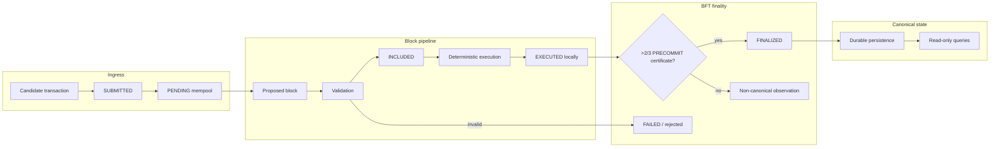

# Wave 2 — Blocks, Finality, and Canonical State

Status: Wave 2 Prompt 5 — canonical block lifecycle on `packages/sunrey-chain`

Owner: `packages/sunrey-chain/src/blocks`

Consensus model: **development Tendermint-class BFT** (deterministic finality). Local block
production and execution are **not** network finality. Only a quorum **commit certificate**
makes history irreversible monetary truth.

Wave 3 will add `EVIDENCE_ROOT`, `RIGHTS_ROOT`, and `POLICY_ROOT` extension commitments.
Wave 2 intentionally leaves `extensionCommitments` empty but versioned.

---

## Block structure (`CanonicalBlockHeader` v1)

| Field | Purpose |
|-------|---------|
| `version` | Header schema version (`1`) |
| `networkId` | Replay-binding network identity |
| `chainId` | Replay-binding chain identity |
| `height` | Monotonic block height |
| `round` | BFT round when applicable |
| `parentBlockHash` | Previous canonical block hash |
| `transactionRoot` | Merkle commitment to ordered tx ids |
| `previousStateCommitment` | Monetary/protocol state before execution |
| `resultingStateCommitment` | Monetary/protocol state after execution |
| `validatorSetHash` | Active validator set fingerprint |
| `consensusParameterHash` | Consensus parameter fingerprint |
| `protocolVersion` | Supported protocol version string |
| `moduleRegistryHash` | Module registry fingerprint |
| `codecRegistryHash` | Codec registry fingerprint |
| `cryptoPolicyHash` | Crypto policy fingerprint |
| `timestampUnixMs` | UTC milliseconds; must not regress parent |
| `proposer` | Block proposer validator id |
| `cryptoSuiteId` | Signing suite used for consensus messages |
| `consensusCertificateHash` | BFT commit certificate hash (zero before commit) |
| `extensionCommitments` | Reserved map for Wave 3 roots |

Block hash: domain-separated `sunrey.blockid.v1` over canonical header bytes.

---

## Lifecycle



### Transaction status semantics

| Status | Meaning | Canonical monetary truth? |
|--------|---------|---------------------------|
| `SUBMITTED` | Accepted by node ingress | No |
| `PENDING` | Admitted to mempool | No |
| `INCLUDED` | Present in a proposed block | No |
| `EXECUTED` | Deterministic execution computed | No |
| `FINALIZED` | BFT commit certificate applied | **Yes** |
| `FAILED` | Rejected or evicted | Terminal, not truth |

### Block pipeline stages

`CANDIDATE → PROPOSED → VALIDATED → EXECUTED → COMMITTED → FINALIZED`

Invalid blocks produce **zero canonical state mutation**.

---

## Commitments

### Transaction root

- Domain: `sunrey.txroot.v1`
- Leaves: transaction id hashes (`sunrey.txid.v1` over canonical bytes)
- Binary Merkle tree (duplicate last leaf when odd)
- Same ordered set → same root; permuted order → different root

### Monetary state commitment

- Domain: `sunrey.stateroot.v1`
- Leaves: sorted key/value entries from `MonetaryStateStore`
- Includes native asset balances, nonces, and per-asset supply snapshots
- Integrated into `resultingStateCommitment` on every finalized block

Validators re-execute transactions and **reject** blocks whose commitment diverges.

---

## Finality model

SunRey uses **deterministic BFT finality**, not proof-of-work confirmation depth.

| Observation | Final? |
|-------------|--------|
| Mempool admission | No |
| Local block production | No |
| Local execution (`EXECUTED`) | No |
| Commit certificate (`FINALIZED`) | **Yes** |

`COMMIT_CERTIFICATE` is the only `FinalitySource` that marks network finality.

`BlockLifecycleEngine.commitWithCertificate` verifies:

1. Block header and execution match canonical parent state
2. Transaction root and state commitments recompute identically
3. Voter set reaches `⌊2n/3⌋ + 1` weighted power
4. Native supply invariants hold for **both** `SUNREY_COIN` and `MOONREY_COIN`

---

## Fork and conflict behavior

- Competing blocks at the same height without a certificate remain non-canonical.
- Two **incompatible finalized** histories at the same height are **rejected** (`REJECT_INCOMPATIBLE_FINALIZED`).
- There is no longest-chain reorg after a valid commit certificate.
- Non-finalized execution results must not be exposed through canonical query APIs.

---

## Canonical query surface

Read-only queries (`createChainQueries` / `BlockLifecycleEngine.queries()`):

- Network status
- Latest finalized block
- Block by height / hash
- Transaction by id / status
- Account balance and nonce (finalized state only)
- Native asset supply per asset
- Protocol version
- Validator / consensus status (quorum metadata)

Queries are separate from mutation paths (`submitTransaction`, `proposeBlock`, `finalizeBlock`).

---

## Reconciliation

After each finalized block, `reconcileFinalizedBlock` checks per native asset:

```
issued - burned == circulating + locked
```

Failure is **fail-closed**: the engine refuses to commit the block as canonical.

---

## Implementation map

| Component | Path |
|-----------|------|
| Block model | `src/blocks/types.ts` |
| Merkle commitments | `src/blocks/commitments.ts` |
| Monetary state | `src/blocks/monetary-state.ts` |
| Lifecycle | `src/blocks/lifecycle.ts` |
| Validation | `src/blocks/validation.ts` |
| BFT finality | `src/blocks/finality.ts` |
| Fork rules | `src/blocks/fork.ts` |
| Queries | `src/blocks/queries.ts` |
| Reconciliation | `src/blocks/reconciliation.ts` |
| Orchestrator | `src/blocks/engine.ts` |
| Rust protocol (wire) | `rust/crates/protocol/src/block.rs` |
| Rust BFT engine | `rust/crates/consensus/` |

---

## Tests

```bash
node --experimental-strip-types --disable-warning=ExperimentalWarning \
  --test packages/sunrey-chain/src/blocks/blocks.test.ts

node --experimental-strip-types --disable-warning=ExperimentalWarning \
  --test tests/wave-2-prompt-5-blocks-finality.test.ts
```

Coverage includes: valid block production, transaction root, state commitment,
invalid parent/height/chain, modified transaction/root, state divergence, no partial commit,
finality transitions, restart from finalized snapshot, non-finalized state isolation, and
independent native-asset reconciliation.

---

## Related architecture

- `docs/productization/PHASE_G_03_SUNREY_CHAIN_RUNTIME.md`
- `docs/architecture/chunk-37-bft-consensus-core.md`
- `docs/architecture/adr/ADR-0021-sunrey-blockchain-transaction-block-encoding.md`
- `packages/sunrey-chain/rust/crates/consensus/ALGORITHM.md`

Do not begin Prompt 6 from this document.
