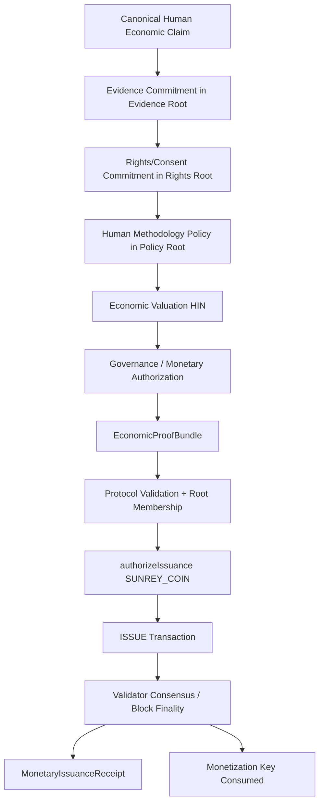
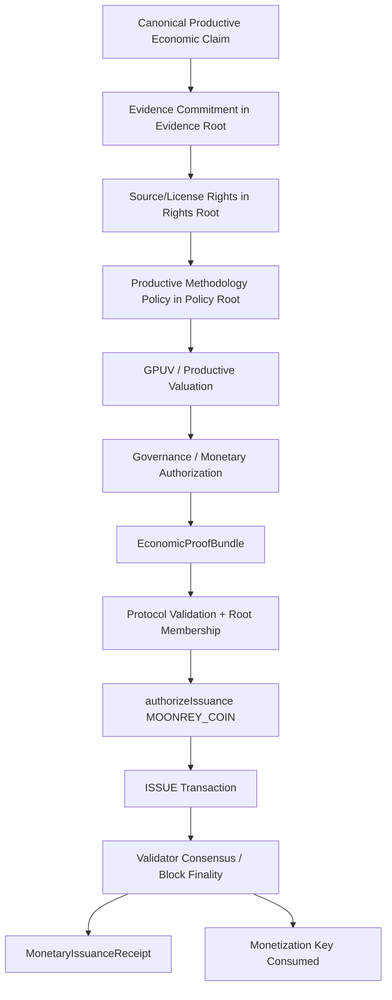

# Wave 3 — Proof-Bound Monetary Transitions

**Status:** Implemented in simulation (Chunk 71 extension)  
**Environment:** `simulation`; all `LIVE_*` flags remain `false`  
**Owner:** `packages/sunrey-chain/src/economics/proof-bound`

Wave 3 introduces the cryptographic bridge between **information authorization** and **monetary authorization** without allowing proof objects themselves to mint native supply.

Canonical mint gate remains unchanged:

```
MonetaryIssuanceAuthority → authorizeIssuance → AssetSupplyBook
```

Proof bundles are **inputs** to issuance proposals, not mint authorities.

---

## Core Equation

```
Economic Claim
+ Evidence Proof
+ Rights Proof
+ Policy Proof
+ Governance Authorization
+ Economic Valuation
= VALID MONETARY PROPOSAL INPUT
```

Then:

```
Monetary Proposal
+ Protocol Validation
+ Validator Consensus
= FINALIZED MONETARY STATE TRANSITION
```

---

## Distinctions

| Layer | Role | Can mint? |
| --- | --- | --- |
| **Information Proof** | Evidence, rights, and policy commitments prove that authorized information exists | No |
| **Economic Valuation** | Methodology-bound reference value (HIN, GPUV) | No |
| **Monetary Authorization** | Human governance + `MonetaryIssuanceAuthority` | Yes (only layer) |
| **Consensus Finality** | Block inclusion + state commitment | Finalizes transition |

**Information authorization ≠ monetary authorization.**

---

## Proof Bundle Architecture

`EconomicProofBundle` (`sunrey.economic-proof.v1`) binds:

| Field | Purpose |
| --- | --- |
| `economicClaimId` | Canonical claim registry reference |
| `claimCommitment` | Privacy-safe claim digest |
| `economicDomain` | `HUMAN_ECONOMY` or `PRODUCTIVE_ECONOMY` |
| `evidenceCommitmentHash` + `evidenceRoot` | Verified evidence membership |
| `rightsCommitmentHash` + `rightsRoot` | Consent/license/source-rights membership |
| `policyCommitmentHash` + `policyRoot` | Active methodology/policy membership |
| `valuation` | Methodology version + digest (not market price) |
| `governanceAuthorization` | Human governance reference (AI rejected) |
| `monetizationKey` | One-time consumption nonce |

No raw sensitive evidence is included in the bundle.

---

## SunRey Issuance Path (Human Economy)



**Safety gates preserved:**

- Raw user data cannot mint
- Unverified contribution cannot mint
- AI valuation cannot mint
- PDV / Clean Room cannot automatically mint
- Contribution eligibility cannot automatically mint

---

## MoonRey Issuance Path (Productive Economy)



**Safety gates preserved:**

- Oracle cannot mint
- Single source cannot mint
- Observation cannot mint
- GPUV cannot mint
- GPUV ≠ MoonRey quantity
- GPUV ≠ market price
- Market price cannot determine supply

Full production Oracle Mesh is Wave 5. Wave 3 uses verified/simulation claim inputs only.

---

## One-Time Claim Consumption

When a claim is legitimately monetized:

1. `authorizeIssuance` succeeds (supply changes)
2. `monetizationKey` is recorded in the durable consumption store
3. Claim lifecycle transitions to `MONETIZED`

The consumption store:

- Persists to disk (atomic rename)
- Replays deterministically from append log
- Survives process restart, node restart, snapshot restore, state sync, and transaction replay

Reusing a consumed `monetizationKey` fails with `DUPLICATE_MONETIZATION_KEY`.

---

## Root Verification

Before monetary execution, `verifyProofBundle`:

1. Recomputes commitment hashes from canonical fields (no client string trust)
2. Verifies Merkle membership in `evidenceRoot`, `rightsRoot`, `policyRoot`
3. Checks rights active + unexpired + correct purpose
4. Checks policy active + methodology version match
5. Rejects AI governance attempts

---

## Monetary Proof / Receipt

`MonetaryIssuanceReceipt` (`receiptKind: MONETARY_ISSUANCE`) exposes:

- Transaction ID, native asset, quantity
- Economic claim reference
- Evidence / Rights / Policy commitment hashes and roots
- Governance authorization reference
- Finalized block height
- Resulting monetary state commitment

Answers **WHY DID SUPPLY CHANGE?** without exposing private records.

Burn receipts use `receiptKind: MONETARY_BURN` and are distinct from issuance proofs.

---

## Normal Transfers

Already-issued SunRey/MoonRey transfers require only normal transaction/account authorization. Economic-origin proofs apply to supply-changing transitions only.

---

## Burn Semantics

Per existing `packages/sunrey-chain/src/economics/operations.ts`:

| Burn Class | Authorization Required |
| --- | --- |
| `VOLUNTARY_USER_BURN` | Owner authorization only |
| `FEE_BURN` | Protocol fee market path |
| `PROTOCOL_ECONOMIC_PENALTY` | Governance/policy authorization |

No new burn economy was invented.

---

## Failure Atomicity

If any required proof fails — claim, evidence, rights, policy, valuation, governance, or transaction authorization — then:

- **ZERO supply change**
- No claim marked consumed
- No monetization key recorded

Consumption is recorded only after successful `authorizeIssuance`.

---

## Module Layout

```
packages/sunrey-chain/src/economics/proof-bound/
  types.ts          — EconomicProofBundle, claims, receipts
  commitments.ts    — Evidence/Rights/Policy/Claim commitments
  roots.ts          — Merkle roots + membership proofs
  claims.ts         — Canonical claim registry + anti-double-count
  bundle.ts         — Bundle construction
  verification.ts   — Root verification before mint
  consumption.ts    — Durable monetization consumption
  pipeline.ts       — Proof-bound SunRey/MoonRey issuance
  receipt.ts          — Monetary issuance receipt
  proof-bound.test.ts
```

---

## Related Documents

- [`SUNREY_SOVEREIGN_ARCHITECTURE_UPGRADE_PLAN.md`](./SUNREY_SOVEREIGN_ARCHITECTURE_UPGRADE_PLAN.md) — Wave 3 scope
- [`SUNREY_MONETARY_AUTHORITY_CONTRACT.md`](./SUNREY_MONETARY_AUTHORITY_CONTRACT.md) — Chunk 71 mint gate
- [`SUNREY_ECONOMIC_INFORMATION_FLOW.md`](./SUNREY_ECONOMIC_INFORMATION_FLOW.md) — Information vs monetary layers
- [`../economics/chunk-71-monetary-constitution.md`](../economics/chunk-71-monetary-constitution.md)
