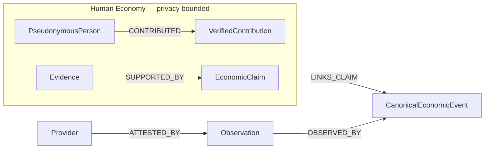
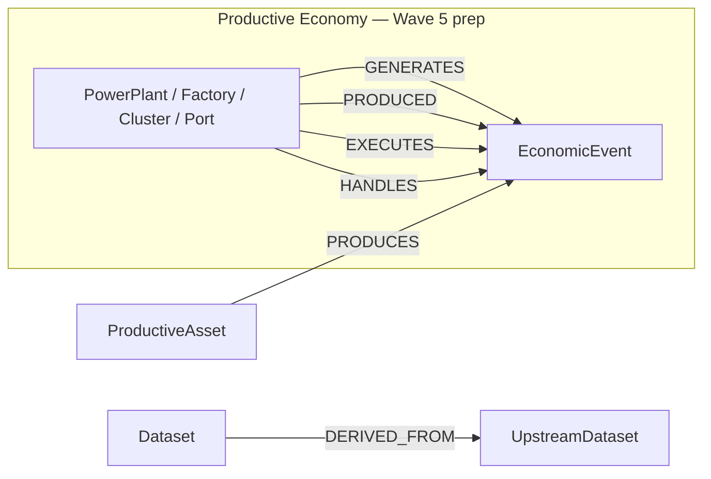

# Wave 4 — Economic Knowledge Graph

Relationship intelligence layer for the sovereign Economic Awareness Fabric.
The graph understands relationships between economic entities, resources,
events, observations, and evidence. It feeds Information Consensus.

The graph is **not** the blockchain. It is **not** monetary authority.

## Architecture

| Layer | Owner | Role |
| --- | --- | --- |
| Personal Economic Graph | `packages/personal-economic-graph` | Subject-bound financial projection |
| HIN rights graph | `packages/information-market` | Consent, purpose, and usage rights |
| Productive capacity graph | `packages/sunrey-chain/src/productive/graph.ts` | Rebuildable productive projection |
| Economic Asset Registry | `packages/economic-asset-registry` | Cross-domain metadata and lineage index |
| **Economic Knowledge Graph** | `packages/economic-asset-registry/src/knowledge-graph` | Cross-domain relationship intelligence |

The knowledge graph **reuses** canonical IDs and lineage semantics from existing
owners. It does **not** duplicate PEG node kinds, HIN rights semantics, or the
productive registry.

## Apache AGE decision

SunRey standardizes on PostgreSQL. Apache AGE is the preferred **future** graph
storage technology when the extension is available in CI and production cells.

| Factor | Assessment |
| --- | --- |
| PostgreSQL alignment | Strong — same ops, backup, and migration posture |
| CI availability today | **Not installed** — blocks active AGE backend |
| PEG schema collision | Avoided — knowledge graph uses `economic_knowledge_graph` schema |
| Standalone graph DB | **Rejected** — unjustified ops split |

**Active backend:** `postgresql-adjacency` behind `GraphRepositoryPort`.

**Future backend:** `AgeGraphRepositoryAdapter` (stub documents Cypher mapping).

## Ontology

### Node classes

`PSEUDONYMOUS_PERSON`, `ORGANIZATION`, `FACILITY`, `PRODUCTIVE_ASSET`,
`RESOURCE`, `DATASET`, `PROVIDER`, `ECONOMIC_EVENT`, `OBSERVATION`,
`EVIDENCE`, `VERIFIED_FACT`, `ECONOMIC_CLAIM`, `METHODOLOGY`, `RIGHTS_GRANT`

### Relations

`OBSERVED_BY`, `OPERATED_BY`, `OWNED_BY` (authorized), `DERIVED_FROM`,
`LOCATED_IN`, `PRODUCED`, `CONSUMED`, `CONTRIBUTED`, `SUPPORTED_BY`,
`CONTRADICTS`, `ATTESTED_BY`, `AUTHORIZED_BY`, `USES_METHODOLOGY`,
`SAME_AS`, `POSSIBLE_MATCH`, `GENERATES`, `EXECUTES`, `HANDLES`, `LINKS_CLAIM`

### Human Economy ontology



Human nodes use pseudonymous references (`pseudonym:`, `hisub_`, `subj_`).
Forbidden payload keys include name, health, DNA, communications, location
history, and financial history unless explicitly authorized.

Preferred pattern:

```
Person Pseudonym → CONTRIBUTED → verified contribution X
```

Not:

```
raw personal dossier → unrestricted graph
```

### Productive Economy ontology



Fixture scenarios seeded for simulation:

- PowerPlant → GENERATES → EnergyEvent
- Factory → PRODUCED → ManufacturingEvent
- ComputeCluster → EXECUTES → ComputeEvent
- Port → HANDLES → LogisticsEvent

## Entity resolution

Controlled pipeline with outcomes:

| Outcome | Meaning |
| --- | --- |
| `EXACT_MATCH` | Deterministic identifier agreement or alias hit |
| `PROBABLE_MATCH` | High-confidence fuzzy match — governed review |
| `POSSIBLE_MATCH` | Weak match — no auto-merge |
| `NO_MATCH` | No candidate |
| `CONFLICT` | Multiple canonical entities for same input set |

**Deterministic** resolution handles provider IDs, facility IDs, geographic
references, publication IDs, organization IDs, and pseudonymous references.

**Probabilistic / AI-assisted** resolution may **suggest** matches but never
silently merges high-impact identities (productive assets, organizations,
facilities, claims).

## Alias registry

Durable alias relationships preserve original provider IDs:

```
provider:res-a  →  canonical entity C
provider:res-b  →  canonical entity C
```

Both originals are retained. Merge status: `ALIAS_ONLY`, `EXACT_MATCH`, or
`GOVERNED_MERGE`.

## Claim linkage

Wave 3 economic claims link to graph entities:

- One canonical `ECONOMIC_EVENT` node
- Multiple `OBSERVATION` nodes (`OBSERVED_BY`)
- Multiple `EVIDENCE` nodes (`SUPPORTED_BY` on claim)
- Multiple `PROVIDER` nodes (`ATTESTED_BY` on observations)
- Duplicate provider events collapse via `SAME_AS`

## Read-only queries

| Query | Function |
| --- | --- |
| Observations of event X | `observationsOfEvent` |
| Providers supporting claim Y | `providersSupportingClaim` |
| Events for productive asset Z | `eventsForProductiveAsset` |
| Evidence for pseudonymous contribution Q | `evidenceForPseudonymousContribution` |
| Derived sources behind dataset N | `derivedSourcesBehindDataset` |

## Persistence

PostgreSQL schema: `economic_knowledge_graph` (migration `V041`).

Tables: `node`, `edge`, `alias`, `entity_resolution`, `match_suggestion`,
`claim_linkage`.

Persistence adapter: `packages/persistence/src/economic-knowledge-graph/`.

## API surface

Primary service: `EconomicKnowledgeGraphService` exported from
`@solstice/economic-asset-registry`.

```typescript
import { EconomicKnowledgeGraphService } from '@solstice/economic-asset-registry';
```

## Invariants

- `authoritative: false` on all nodes
- `mutatesFinancialState: false` on all nodes
- `autoMerged: false` on all resolution records
- `autoApplied: false` on all AI suggestions
- No ledger journals, no Execution Authority, no minting

## Tests

`packages/economic-asset-registry/src/knowledge-graph.test.ts`

Coverage: exact/probable/ambiguous/conflicting identity, alias mapping, provider
lineage, duplicate event linking, human pseudonym protection, productive
relationships, AI high-impact merge refusal, snapshot restart survival.
