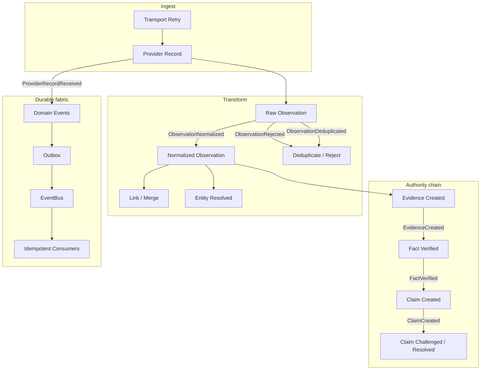

# Wave 4 — Event and Provenance Fabric

This document describes the economic chain-of-custody backbone introduced in Wave 4 Prompt 18. It extends the existing canonical event fabric (`packages/events`) and provider observation envelope (`packages/provider-sdk`) — it does **not** introduce a second event system.

## Purpose

Every meaningful transformation of external economic information must be traceable. SunRey can answer:

- Where did this observation come from?
- When did we receive it?
- What transformations occurred?
- What records were merged?
- What evidence was generated?
- What claim did it support?
- What economic output eventually depended on it?

## Architecture decision summary

| Decision | Outcome |
|---|---|
| Event system | Extend canonical `packages/events` taxonomy and `DurableEventEnvelope` |
| Transport | `DurableLocalEventBus` — outbox-backed, at-least-once; not in-memory emitter alone |
| Kafka | **Deferred** — `EventBus` interface allows broker adapter later without producer changes |
| Apache NiFi | **Not adopted** — orchestration remains in application services; NiFi stays outside deterministic execution |
| Provenance store | In-memory simulation store with cycle-safe graph; Postgres persistence follows existing ledger fabric pattern |
| Idempotency | Transport keys + processing keys via `InMemoryIdempotencyStore` (durable port ready) |
| Dead letter | Canonical `DeadLetterStore` + Wave 4 `QuarantineStore` for failed observations |

## Chain of custody

## Economic event model

Versioned events registered in `packages/events/src/taxonomy.ts`:

| Event | Namespace | Purpose |
|---|---|---|
| `ProviderRecordReceived` | provider | External record arrived (hash-only payload) |
| `ObservationNormalized` | provider | Successful normalization |
| `ObservationRejected` | provider | Failed normalization / integrity |
| `ObservationDeduplicated` | provider | Duplicate suppressed |
| `ObservationLinked` | provider | Many-to-one lineage link |
| `EntityResolved` | provider | Entity resolution complete |
| `EvidenceCreated` | evidence | Evidence artifact registered (`grantsDecision: false`) |
| `FactVerified` | data | Verified economic fact |
| `ClaimCreated` | data | Economic claim opened |
| `ClaimChallenged` | data | Claim disputed |
| `ClaimResolved` | data | Claim outcome sealed |

Payloads contain **digests and references only** — never raw provider bodies, secrets, or PII. Enforced by `assertSafeEventPayload` in `packages/events/src/envelope.ts`.

Event factories live in `packages/provider-sdk/src/economic-events.ts`.

## Durable transport

`packages/events/src/durable-bus.ts` defines:

- `EventBus` — portable publish contract
- `DurableLocalEventBus` — persists to `OutboxStore` before dispatch

**Kafka decision:** Current scale and simulation posture do not warrant Kafka deployment complexity. Producers always write through the transactional outbox; a future `KafkaEventTransport` implements `EventTransport` without changing the fabric.

**NiFi decision:** NiFi could help operational dataflow orchestration for connector fleets, but it must remain outside blockchain deterministic execution and consensus-critical paths. SunRey keeps ingestion orchestration in `EconomicProvenanceFabric` and provider adapters. A future NiFi deployment would sit behind an integration boundary (webhook / object-store handoff), not inside Kernel or ledger code.

## Idempotency

Two layers:

1. **Transport idempotency** — `buildTransportIdempotencyKey(providerId, capability, transportEventId)` prevents duplicate provider receipts on retry.
2. **Processing idempotency** — `buildProcessingIdempotencyKey(stage, nodeId)` prevents duplicate evidence/claims on consumer restart.

Consumers use canonical `InboxProcessor` with `(consumerId, eventId)` deduplication.

## Provenance graph

`packages/external-data/src/wave4/provenance/graph.ts` maintains:

- **Nodes:** `provider_record` → `observation` → `normalized_observation` → `evidence` → `verified_fact` → `economic_claim` → `economic_output`
- **Edges:** `RECEIVED_AS`, `NORMALIZED_TO`, `DEDUPLICATED_TO`, `LINKED_TO`, `MERGED_FROM`, `EVIDENCE_FROM`, `VERIFIED_FROM`, `CLAIM_FROM`, `DEPENDED_ON`
- **Cycle prevention:** `wouldCreateProvenanceCycle` / `assertAcyclicEdges`

Supports many-to-one merges and one-to-many normalized outputs from a single provider record.

## Content hashing

`packages/external-data/src/wave4/provenance/content-hash.ts`:

- `commitPublicContent` — deterministic SHA-256 over canonical JSON
- `commitSensitiveValue` — salted commitment for low-entropy / privacy-sensitive values (digest only in events)
- `commitTransformation` — binds transformation kind, input commitments, and output commitment

Raw secrets are never hashed into public commitments.

## Dead letter and quarantine

Failed observations are **never** silently accepted:

| Failure | Quarantine code | Retryable |
|---|---|---|
| Schema error | `SCHEMA_ERROR` | No |
| Rights failure | `RIGHTS_FAILURE` | No |
| Provider failure | `PROVIDER_FAILURE` | Yes |
| Normalization failure | `NORMALIZATION_FAILURE` | No |
| Integrity failure | `INTEGRITY_FAILURE` | No |
| Duplicate transport | `DUPLICATE_TRANSPORT` | No |

`quarantineFailedObservation` records in `QuarantineStore` and optionally canonical `DeadLetterStore`.

## Provenance query

Read-only internal API in `packages/external-data/src/wave4/provenance/query.ts`:

- `traceClaimToProviderRecords(graph, claimNodeId)` — upstream trace
- `findClaimsForProviderRecord(graph, providerRecordNodeId)` — downstream claims

Returns node kinds, commitments, and hashes — not raw content.

## Integration entry point

`EconomicProvenanceFabric` in `packages/external-data/src/wave4/provenance/fabric.ts` orchestrates:

1. `receiveProviderRecord`
2. `normalizeObservation` / `rejectNormalization`
3. `linkObservations`
4. `buildEvidenceChain`

Wire into provider adapters by calling the fabric after `runNormalizationPipeline` returns.

## Related owners

| Component | Owner |
|---|---|
| Domain events / outbox / inbox | `packages/events` |
| Observation envelope | `packages/provider-sdk` |
| Economic provenance fabric | `packages/external-data/src/wave4/provenance` |
| Asset lineage policy | `packages/economic-asset-registry` |
| Kernel evidence (decisions only) | `packages/evidence` |

## Tests

`tests/wave-4-prompt-18-event-provenance-fabric.test.ts` covers:

- Duplicate provider events
- Consumer restart / idempotency
- Event replay
- Out-of-order publication
- Failed normalization / dead-letter
- Lineage and cycle prevention
- Multiple observations → one claim
- One source → multiple normalized outputs
- Privacy-safe hashing
