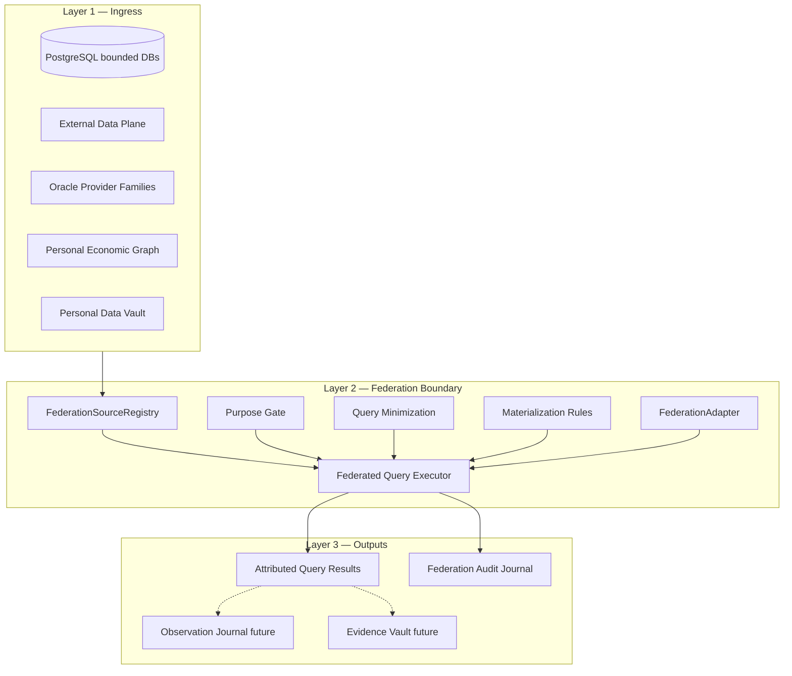

# Wave 4 — Federated Economic Query

SunRey Wave 4 implements a **controlled federation layer** for authorized
cross-source economic information queries. Data may remain where it belongs;
SunRey can query authorized facts without necessarily possessing entire source
datasets.

**Canonical owner:** `packages/sunrey-chain/src/oracle/production/economic-data-fabric/federation/`

**Capability:** extends `sunrey-unified-economic-data-fabric` (Chunk 138)

**Not:** a monetary authority, mint, ledger, second oracle consensus engine,
or unrestricted data scraping plane.

---

## Core principle

> DATA MAY REMAIN WHERE IT BELONGS.

Federated queries express purpose, principal, domain, metrics, source
constraints, time range, geography, and rights context. Arbitrary unrestricted
scraping is forbidden.

---

## Federation architecture



### Components

| Component | Path | Role |
| --- | --- | --- |
| Types | `federation/types.ts` | Query request/result, purposes, materialization levels |
| Source registry | `federation/source-registry.ts` | Audited map of queryable stores |
| FederationAdapter | `federation/adapter.ts` | Engine boundary (in-memory today; Trino placeholder) |
| Purpose gate | `federation/purpose-gate.ts` | Wave 3-aligned purpose propagation |
| Minimization | `federation/minimization.ts` | Field limits, aggregate preference, row caps |
| Materialization | `federation/materialization.ts` | Persistence authorization per license |
| Audit | `federation/audit.ts` | Query receipts without raw payloads |
| Executor | `federation/executor.ts` | Orchestration and failure isolation |
| Fixtures | `federation/fixtures.ts` | Cross-source development scenarios |

---

## Task 1 — Data store audit

The `FederationSourceRegistry` catalogs known stores and access modes:

| Source | Kind | Access | Direct query |
| --- | --- | --- | --- |
| `db.solstice_customer` | PostgreSQL | Connector-mediated | No |
| `db.solstice_ledger` | PostgreSQL | Connector-mediated | No |
| `db.solstice_evidence` | PostgreSQL | Connector-mediated | No |
| `db.solstice_security` | PostgreSQL | Not queryable | No |
| `external-data.plane` | Provider API | Fixture-only | No |
| `oracle.economic-data-fabric` | In-memory | Direct | Yes |
| `oracle.provider-families` | Provider API | Fixture-only | No |
| `productive.economy-data` | In-memory | Direct | Yes |
| `provider-runtime.observation-cache` | In-memory | Connector-mediated | No |
| `personal-economic-graph` | Graph projection | Connector-mediated | No |
| `information-market.hin` | Graph projection | Connector-mediated | No |
| `personal-data-vault` | Connector-mediated | Connector-mediated | No |
| `economic-asset-registry` | In-memory | Direct | Yes |
| `external-data.search-index` | Search index | Direct | Yes |
| `warehouse.lake.placeholder` | Warehouse/lake | Not queryable | No |

Connector-mediated sources require purpose-bound adapters. PDV and clean-room
paths enforce template queries only.

---

## Trino decision (Task 3)

**Decision:** Trino is **not operationally justified** in the current simulation
posture.

| Factor | Assessment |
| --- | --- |
| Simulation transport | Fixture-only; no live warehouse catalogs |
| Wave 3 prerequisite | Evidence/Rights/Policy commitment roots not yet wired |
| Purpose preservation | SunRey requires purpose context on every query; raw SQL federation is insufficient |
| Operational cost | Catalog governance, credential isolation, audit wiring premature |
| Authority risk | Query engines must never become monetary authorities |

**Implementation:** `InMemoryFederationAdapter` is the active engine.
`TrinoFederationAdapterPlaceholder` preserves the integration seam for future
non-consensus economic data sources when:

1. Durable fabric observation journals exist in PostgreSQL
2. Wave 3 commitment model is implemented
3. Production-candidate credential plane (Chunk 149) is counsel-approved
4. Enterprise data licenses are registered

See `TRINO_EVALUATION` in `federation/adapter.ts`.

---

## Rights enforcement (Task 4)

Federation purposes integrate Wave 3 rights/purpose concepts:

| Purpose | Permits | Does not inherit to |
| --- | --- | --- |
| `RESEARCH` | Research, correlation, aggregated analytics | `ECONOMIC_VALUATION`, `MONETARY_PROPOSAL` |
| `FEDERATED_CORRELATION` | Cross-source correlation | Valuation, monetary |
| `ECONOMIC_AWARENESS` | Awareness, monitoring, analytics | `MONETARY_PROPOSAL` |
| `ECONOMIC_VALUATION` | Valuation only | `MONETARY_PROPOSAL` |
| `MONETARY_PROPOSAL` | Explicit monetary proposals only | — |

`evaluateFederationPurpose()` returns `PURPOSE_NOT_INHERITED` when a narrow
authorization is expanded to a heightened purpose.

---

## Query minimization (Task 5)

Defaults and limits:

- Default row limit: 100 (max 1,000)
- Default timeout: 5,000 ms (max 30,000 ms)
- Max fields: 16; max metrics: 8; max sources: 6
- Forbidden broad fields: `*`, `all`, `full_record`, `raw_payload`, etc.
- Non-aggregate metrics require explicit `requestedFields`

Prefer `AGGREGATE_SUM`, `AGGREGATE_AVG`, `AGGREGATE_COUNT`, `DERIVED_RATIO`,
and `PROOF_COMMITMENT` over row-level extracts.

---

## Persistence rules (Task 6)

| Level | Meaning | Default for |
| --- | --- | --- |
| `QUERIED_ONLY` | Ephemeral; not stored | `RESEARCH` |
| `CACHED` | TTL cache | `OPERATIONAL_MONITORING`, `PRODUCT_IMPROVEMENT` |
| `OBSERVATION` | Durable fabric journal | `ECONOMIC_AWARENESS`, `ECONOMIC_VALUATION` |
| `EVIDENCE_VAULT` | Hash-chained evidence | `MONETARY_PROPOSAL` |
| `GRAPH_PROJECTION` | Non-authoritative graph | Rights-gated projections |

A successful federated query does **not** automatically authorize permanent
storage. `resolveMaterialization()` caps requested levels against
`rightsContext.permittedMaterialization`.

---

## Source attribution (Task 7)

Every `FederatedMetricResult` carries `FederatedFactAttribution`:

- `providerId`, `sourceId`, `datasetId`
- `observedAtUnix`, `unit`
- `licenseRef`, `provenanceRef`, `contentCommitment`

Results are never returned as anonymous numbers detached from provenance.

---

## Query receipts (Task 8)

`FederationAuditJournal` records:

- Principal, purpose, domain, sources, metrics, fields
- Time range, geography, rights decision
- Materialization level, persistence authorization
- Result reference hash (`resultReferenceOf`)
- **No raw sensitive payloads** (`payloadLogged: false`)

---

## Cross-source queries (Task 9)

Representative development scenarios in `federation/fixtures.ts`:

| Query ID | Sources | Domain |
| --- | --- | --- |
| `fed.q.energy-weather.v1` | Economic fabric + provider families | Energy + weather |
| `fed.q.mfg-logistics.v1` | Economic fabric + productive economy data | Manufacturing + logistics |
| `fed.q.research-publication.v1` | Search index + economic asset registry | Research + publication metadata |
| `fed.q.workforce-education.v1` | PEG + customer DB | Workforce + education |

Purpose: prove federation architecture. **Not** economic valuation.

---

## Failure modes (Task 10)

| Condition | Behavior |
| --- | --- |
| Source unavailable | Isolated per-source outcome; fails closed unless `allowPartial` |
| Partial result | `completeness: PARTIAL` with `partialWarning`; never silent completeness |
| Timeout | `TIMEOUT` status on source outcome |
| Rights denial | `PURPOSE_DENIED` / `RIGHTS_DENIED` before query |
| License denial | `LICENSE_DENIED` on source outcome |
| Schema mismatch | `SCHEMA_MISMATCH` on source outcome |
| Conflicting sources | Surfaced per-source; no silent merge to single truth |

---

## Privacy principles

1. Subject-bound data (PDV) requires clean-room template queries
2. Purpose is propagated, never inferred upward
3. Minimization defaults reject broad field requests
4. Audit logs reference commitments, not raw payloads
5. Federation does not bypass consent firewall or Kernel gating

---

## Tests

`packages/sunrey-chain/src/oracle/federated-economic-query.test.ts` covers:

- Authorized query
- Unauthorized purpose (valuation, monetary)
- Source unavailable
- Partial federation
- Provider attribution
- License restriction
- Persistence restriction
- Query audit
- Minimum-data request
- Multiple-source queries
- Failure isolation

---

## Related documentation

- `docs/architecture/SUNREY_SOVEREIGN_ARCHITECTURE_UPGRADE_PLAN.md` — Wave 4 Awareness Fabric
- `docs/architecture/SUNREY_ECONOMIC_INFORMATION_FLOW.md` — Information → money boundary
- `docs/economics/chunk-138-unified-economic-data-fabric.md` — Chunk 138 fabric
- `docs/productization/SUNREY_DATA_PURPOSE_REGISTRY.md` — Product purpose catalog

---

## Authority invariants

```typescript
FEDERATION_NOT_MONETARY_AUTHORITY === true
CHUNK_71_REMAINS_MONETARY_AUTHORITY === true
TRINO_OPERATIONALLY_JUSTIFIED === false
```

Federation engines query and correlate. They do not mint, post journals, or issue
Execution Authority.
