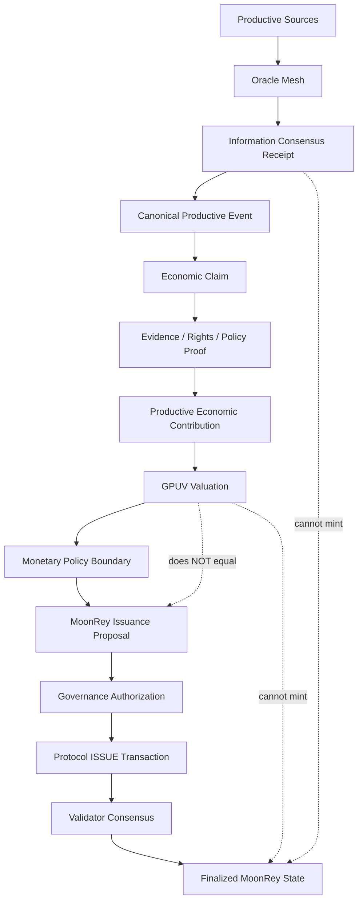

# Wave 5 — MoonRey Monetary Pipeline

**Status:** Implemented in simulation (extends Wave 3 proof-bound issuance)  
**Environment:** `simulation`; all `LIVE_*` flags remain `false`  
**Owner:** `packages/sunrey-chain/src/economics/wave5-moonrey-pipeline`

Wave 5 connects the productive economy output chain to the existing Wave 3 monetary proposal architecture. **No earlier stage may directly mint.** Chunk 71 `MonetaryIssuanceAuthority` remains the sole supply gate.

---

## End-to-End Flow



---

## Stage Responsibilities

| Stage | Role | Can mint? |
| --- | --- | --- |
| Productive Sources | External/provider observations (Wave 5 adapters, oracle mesh) | No |
| Oracle Mesh | Multi-provider collection | No |
| Information Consensus | Quorum receipt over observations | No |
| Canonical Productive Event | Verified productive event identity | No |
| Economic Claim | Canonical claim registry entry | No |
| Evidence / Rights / Policy | Wave 3 commitment proofs | No |
| Productive Economic Contribution | Verified contribution record | No |
| GPUV | Productive Value Function result (simulation) | No |
| Monetary Policy | GPUV → MoonRey quantity conversion (simulation only) | No |
| MoonRey Issuance Proposal | Formal proposal input bundle | No |
| Governance | Human governance authorization reference | No (authorizes proposal only) |
| Protocol ISSUE | `MonetaryIssuanceAuthority` via proof-bound pipeline | Yes |
| Validator Consensus | Block finality + state commitment | Finalizes |

---

## MoonRey Issuance Proposal Input

Schema: `sunrey.moonrey.issuance-proposal.v1`

| Field | Purpose |
| --- | --- |
| `productiveClaimId` | Canonical economic claim reference |
| `claimCommitment` | Privacy-safe claim digest |
| `productiveContributionId` | Verified productive contribution |
| `informationConsensusReceiptId` | Oracle mesh quorum receipt |
| `evidenceProofRef` | Evidence commitment hash |
| `rightsProofRef` | Rights/license commitment hash |
| `policyProofRef` | Policy commitment hash |
| `gpuvValuationId` / `gpuvQuantity` / `gpuvDigest` | GPUV result (not MoonRey quantity) |
| `monetaryPolicyRef` / `monetaryPolicyVersion` | Simulation conversion policy |
| `requestedMoonReyQuantity` | Policy-derived quantity (≠ GPUV) |
| `governanceAuthorizationId` | Human governance reference |
| `monetizationKey` | One-time consumption nonce (Wave 3) |
| `productionEconomicsActive` | Always `false` until approved |

**GPUV quantity does NOT automatically equal requested MoonRey quantity.**

Simulation conversion uses `convertGpuvToMoonRey` with explicit numerator/denominator (default 2/5, floor rounding). Production conversion remains `UNCONFIGURED`.

---

## Valuation → Monetary Policy Boundary

```
Productive Valuation (GPUV)
        ↓
Monetary Policy (simulation conversion policy)
        ↓
Governed MoonRey quantity proposal
        ↓
Proof-bound issuance (Wave 3)
```

Rejected paths:

- GPUV used directly as MoonRey amount (`GPUV_USED_AS_MOONREY_QUANTITY`)
- Exchange last-trade price as issuance authority (`EXCHANGE_PRICE_AS_ISSUANCE_AUTHORITY`)
- Production/mainnet economics (`MONETARY_POLICY_PRODUCTION_DISABLED`)

---

## Governance Boundary

Permitted actors: `PROTOCOL`, `HUMAN_GOVERNANCE` (simulation); `HUMAN_GOVERNANCE` only on mainnet.

Rejected authorization sources:

- `ORACLE`, `AI`, `PRODUCTIVE_VALUE_ENGINE`, `EXCHANGE`, `API`, `DATABASE`, `VALIDATOR` (acting alone)

---

## One-Time Claim Consumption

Wave 3 canonical monetization lock applies:

1. `ClaimRegistry` — claim fingerprint and monetized state
2. `ConsumptionStore` — monetization key one-time consumption
3. Persisted consumption log survives restart/state sync replay

A canonical productive claim cannot support duplicate MoonRey issuance through different provider combinations, GPUV wrappers, API calls, or validator restart.

---

## MoonRey Economic Receipt

Schema: `sunrey.moonrey.economic-receipt.v1`

Read-only audit artifact answering: **WHY DID THIS MOONREY ENTER CIRCULATION?**

Includes:

- Finalized transaction ID and MoonRey quantity
- Productive claim, asset, category, contribution
- Information consensus receipt
- Evidence/rights/policy roots and proof refs
- GPUV valuation and monetary policy reference
- Governance authorization
- Finalized block height and monetary state root

---

## Failure Atomicity

On any failure (claim invalid, duplicate event, rights invalid, oracle quorum insufficient, GPUV invalid, policy invalid, governance missing, transaction invalid, consensus failure):

- **ZERO** MoonRey supply change
- Claim remains **unconsumed** unless protocol transition commits

---

## Legacy Shortcuts Removed / Hardened

| Path | Status |
| --- | --- |
| `proposeMoonReyIssuanceFromObservations` | Deprecated simulation-only guard; always returns `minted: false` |
| `rejectObservationToProposalShortcut` | Explicit rejection of observation → proposal |
| `runMoonReyIssuancePipeline` with `oracleOnly` | Rejected at native-assets layer |
| `MoonReyProductiveSettlementBridge` standalone stages | Each stage alone cannot issue |

Use `executeWave5MoonReyPipeline` for the complete development path.

---

## Development Scenarios

Representative simulation cases in `fixtures.ts`:

| Scenario | Category | Providers |
| --- | --- | --- |
| `renewableEnergyScenario` | ENERGY | energi-data-service, uk-carbon-intensity, national-grid-eso |
| `computeWorkloadScenario` | COMPUTE | fixture compute quorum |
| `manufacturingOutputScenario` | MANUFACTURING | fixture manufacturing quorum |

Entry point: `executeDevScenario(scenario)`.

---

## Canonical Integration Points

| Component | Path |
| --- | --- |
| Wave 5 pipeline | `packages/sunrey-chain/src/economics/wave5-moonrey-pipeline/` |
| Wave 3 proof-bound issuance | `packages/sunrey-chain/src/economics/proof-bound/pipeline.ts` |
| Chunk 71 mint gate | `packages/sunrey-chain/src/economics/issuance.ts` |
| GPUV engine | `packages/sunrey-chain/src/productive/policy-governance/value-function/` |
| GPUV → MoonRey conversion | `packages/sunrey-chain/src/productive/policy-governance/value-settlement/conversion.ts` |
| Deprecated observation interface | `packages/sunrey-chain/src/productive/economy-data/issuance-interface.ts` |

---

## Tests

`packages/sunrey-chain/src/economics/wave5-moonrey-pipeline/wave5-moonrey-pipeline.test.ts`

Covers: valid dev issuance (energy/compute/manufacturing), quorum failures, duplicate claim/event, tampered evidence, expired rights, GPUV/policy/governance rejections, exchange price rejection, AI/oracle/PVE/validator rejection, restart replay, state sync replay, one-time consumption, legacy shortcut deprecation.

---

## Production Activation Status

| Capability | Status |
| --- | --- |
| Development/simulation pipeline | **Active** |
| Production MoonRey issuance economics | **Disabled** (`PRODUCTION_MOONREY_ISSUANCE_DISABLED`) |
| Production conversion policy | **UNCONFIGURED** |
| Mainnet monetary policy | **Blocked** |
| `LIVE_*` flags | **false** |
| `ENVIRONMENT` | **simulation** |

Production activation requires Chunk 143 firewall, Chunk 163 authorization, Chunk 164 freeze, and Chunk 165 ceremony — none of which are satisfied by this Wave 5 implementation.
