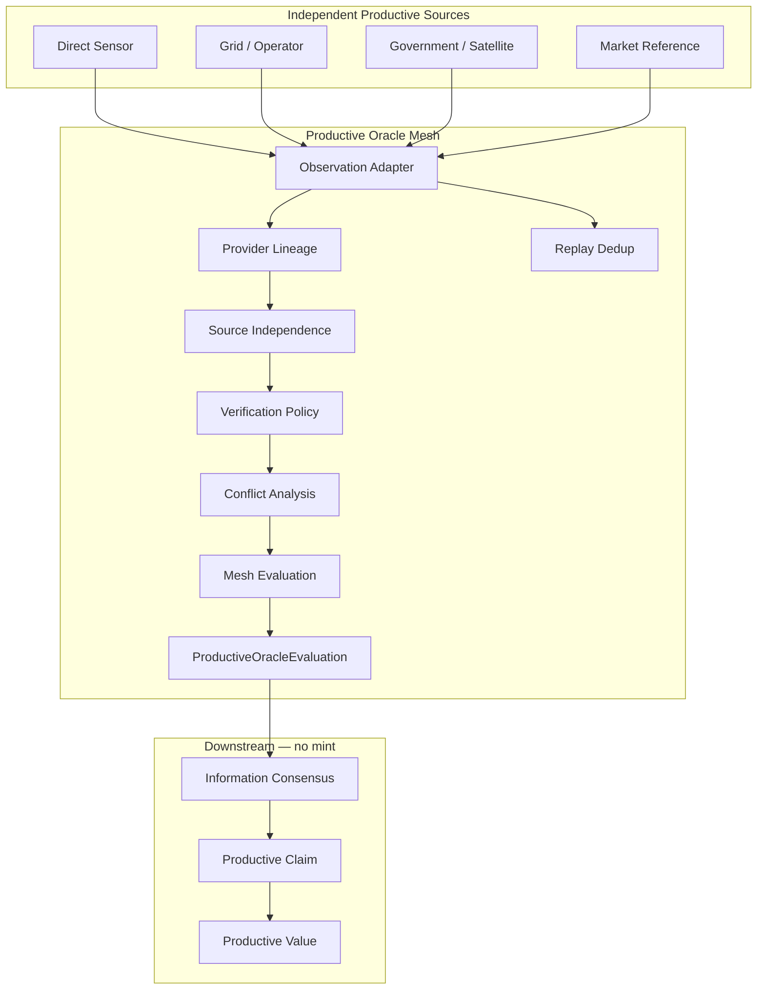

# Wave 5 — MoonRey Productive Oracle Mesh

Capability: `sunrey-productive-oracle-mesh`  
Owner: `packages/sunrey-chain/src/oracle/production/oracle-mesh/`  
Schema: `sunrey.productive.oracle-mesh.v1`

## Purpose

Replace the simplistic mental model:

```
API → value → MoonRey
```

with:

```
INDEPENDENT PRODUCTIVE SOURCES
  → OBSERVATIONS
  → SOURCE-INDEPENDENCE ANALYSIS
  → CORROBORATION
  → PRODUCTIVE FACT
  → CLAIM
  → PRODUCTIVE VALUE
```

An oracle is an **information source**. It is **not** a monetary authority. The mesh produces auditable `ProductiveOracleEvaluation` receipts that feed **Information Consensus**. It does **not** mint MoonRey.

## Architecture



### Safety principles preserved

| Principle | Enforcement |
|-----------|-------------|
| Oracle cannot mint | `mintsMoonRey: false` on every evaluation |
| Single source ≠ consensus | `prohibitSingleSource` on domain policies |
| Configured ≠ trusted | Adapter rejects invalid rights/stale/expired |
| Market reference ≠ production | `MARKET_REFERENCE_CANNOT_SUBSTITUTE` |
| Copied sources ≠ independent | Lineage collapse via `datasetOriginId` |
| Replay ≠ new production | `ReplayLedger` identity key |
| Policy ≠ supply policy | `ProductiveVerificationPolicy` is information-only |

## Source classes

Productive oracle source classes specialize Wave 4 classes for physical economy domains:

| Class | Role |
|-------|------|
| `DIRECT_SENSOR` | On-site meter, IoT, telemetry |
| `PRIMARY_OPERATOR` | Facility or asset operator record |
| `UTILITY_OR_GRID` | Grid, utility, water authority |
| `ENTERPRISE_SYSTEM` | ERP, MES, workload receipt |
| `GOVERNMENT` | Official statistics, permits |
| `SATELLITE` | Remote sensing corroboration |
| `GEOSPATIAL` | Movement, area, hydrology |
| `LOGISTICS_OPERATOR` | Carrier, port, warehouse record |
| `NETWORK_OPERATOR` | Telecom, datacenter network |
| `MARKET_REFERENCE` | Price/index — **not production proof** |
| `ACADEMIC` | Research reference |
| `DERIVED_MODEL` | Model output — corroboration only |
| `AGGREGATOR` | Resyndicated data — lineage tracked |

`MARKET_REFERENCE` is never proof of physical production.

## Domain topologies

Recommended source-class combinations vary by domain. Quorum rules are **not** identical across domains.

### Energy

```text
DIRECT_SENSOR (meter)
  +
UTILITY_OR_GRID / PRIMARY_OPERATOR
  +
SATELLITE / GOVERNMENT / MARKET_REFERENCE (corroboration only)
```

### Compute

```text
DIRECT_SENSOR (datacenter telemetry)
  +
PRIMARY_OPERATOR / ENTERPRISE_SYSTEM (workload receipt)
  +
UTILITY_OR_GRID / NETWORK_OPERATOR (resource corroboration)
```

### Manufacturing

```text
ENTERPRISE_SYSTEM (ERP/MES)
  +
LOGISTICS_OPERATOR
  +
UTILITY_OR_GRID / DIRECT_SENSOR (input/output corroboration)
```

### Agriculture

```text
DIRECT_SENSOR (farm/IoT)
  +
SATELLITE
  +
GOVERNMENT / GEOSPATIAL / ACADEMIC
```

### Logistics

```text
LOGISTICS_OPERATOR
  +
GEOSPATIAL (movement)
  +
PRIMARY_OPERATOR / GOVERNMENT (port/infrastructure)
```

### Water

```text
UTILITY_OR_GRID
  +
DIRECT_SENSOR
  +
GOVERNMENT / GEOSPATIAL / SATELLITE (hydrology)
```

### Resources

```text
PRIMARY_OPERATOR (producer)
  +
GOVERNMENT (geological/regulatory)
  +
LOGISTICS_OPERATOR / GEOSPATIAL / SATELLITE (export evidence)
```

## Source independence

Independence uses **provider lineage** and **dataset lineage**:

- `controllerId` — operational controller
- `datasetOriginId` — ultimate dataset origin
- `copiedFromProviderId` — syndication chain
- `derivedFromDatasetId` — aggregation chain

If government **A** publishes data, website **B** copies A, and aggregator **C** copies B, all three collapse to **one** independent witness keyed by `controllerId:datasetOriginId`.

`endpointCountIsNotIndependence: true` — two API endpoints under one upstream do not automatically count twice.

## Quorum policies

Versioned `ProductiveVerificationPolicy` configurations per domain specify:

- `requiredSourceClasses` / `optionalSourceClasses`
- `minimumIndependentSources`
- `freshnessMaxAgeSeconds`
- `toleranceRangeBps`
- `requiredDirectEvidence`
- `manualReviewTriggers`
- `confidenceThresholdBps`
- `prohibitSingleSource`

Policies govern **information sufficiency**. They are **not** encoded into monetary supply policy.

## Conflict handling

Disagreement levels:

| Level | Meaning |
|-------|---------|
| `AGREEMENT` | Within tolerance |
| `MINOR_VARIANCE` | Above tolerance, below material threshold |
| `OUTLIER` | Provider-specific outlier detected |
| `MATERIAL_CONFLICT` | Spread exceeds material threshold |
| `INSUFFICIENT_EVIDENCE` | Not enough admitted observations |

Conflicting data is **never blindly averaged**.

## Source failure

- **Operational availability**: one provider outage does not necessarily halt the mesh
- **Economic sufficiency**: a claim is not verified unless policy minimums remain satisfied after exclusions

## Oracle replay

Observation identity: `hash(providerId, sourceRecordId, datasetOriginId)`

The same source record returned 100 times remains **one** observation identity.

## Oracle receipt

`ProductiveOracleEvaluation` contains:

- productive asset and candidate event
- canonical `EconomicObservation` envelopes
- providers, source classes, provider lineage
- independent vs raw source counts
- freshness, conflicts, tolerances
- result, methodology/policy version, explanation codes
- `mintsMoonRey: false`, `grantsExecutionAuthority: false`

## Integration points

| Upstream | Role |
|----------|------|
| Provider SDK `ExternalObservation` | Raw external data envelope |
| Economic Proof `EconomicObservation` | Canonical Wave 4 observation envelope |
| Phase H `economy-data` | Productive platform ingestion |
| Chunk 138 Economic Data Fabric | Family routing and certification |
| `issuance-interface.ts` | Refuses oracle → mint path |
| `evaluateOracleSafety` | Hard mint refusal |

## Files

```
packages/sunrey-chain/src/oracle/production/oracle-mesh/
  types.ts           — canonical types
  source-classes.ts  — productive source class taxonomy
  topologies.ts      — domain-specific topologies
  adapter.ts         — observation envelope adapter
  independence.ts    — lineage-based independence
  policies.ts        — ProductiveVerificationPolicy
  conflict.ts        — disagreement classification
  failure.ts         — outage vs sufficiency
  replay.ts          — replay deduplication
  evaluation.ts      — mesh evaluation engine
  receipt.ts         — ProductiveOracleEvaluation builder
  fixtures.ts        — development mesh fixtures
  index.ts           — public exports

tests/wave-5-oracle-mesh.test.ts
```

## Validation

```bash
npm test -- tests/wave-5-oracle-mesh.test.ts
npm test
```
