# Wave 5 — Productive Economy Ontology

**Program:** SunRey Sovereign Architecture — Wave 5 (MoonRey Productive Intelligence)  
**Status:** Implemented in simulation  
**Environment:** `ENVIRONMENT=simulation`; all `LIVE_*` flags remain `false`  
**Owner:** `packages/sunrey-chain/src/productive/ontology`

Wave 5 specializes the Wave 4 Economic Awareness Fabric for the **MoonRey Productive Economy**.
The ontology answers what productive assets exist, what they produced, when and where,
how production was measured, who observed it, whether sources corroborate, what rights apply,
and what methodology may later convert verified productivity into productive economic value.

**The ontology does not define monetary value formulas, GPUV quantities, or MoonRey supply.**

---

## Prerequisites

| Wave | Capability | Status |
| --- | --- | --- |
| Wave 3 | `CanonicalEconomicClaim`, proof lattice, anti-replay | Implemented (simulation) |
| Wave 4 | Economic Awareness Fabric, observation envelope, knowledge graph, information consensus | Implemented (simulation) |
| Chunk 44 / Phase H | Productive registry, economy-data platform, GPUV path | Extended, not replaced |

---

## Non-Negotiable Invariants

| Invariant | Value |
| --- | --- |
| `OBSERVATION_CANNOT_MINT` | `true` |
| `SINGLE_SOURCE_IS_NOT_CONSENSUS` | `true` |
| `CONFIGURED_PROVIDER_IS_NOT_AUTOMATICALLY_TRUSTED` | `true` |
| `GPUV_IS_NOT_MOONREY` | `true` |
| `GPUV_IS_NOT_MARKET_PRICE` | `true` |
| `PRODUCTIVE_VALUE_IS_NOT_SUPPLY_POLICY` | `true` |
| `SUPPLY_POLICY_IS_NOT_EXCHANGE_PRICE` | `true` |
| `ORACLE_CANNOT_MINT` | `true` |

A productive fact may inform valuation. Valuation may inform monetary policy. Neither directly changes supply.

---

## Ontology Version

| Field | Value |
| --- | --- |
| Ontology ID | `sunrey.productive-economy-ontology` |
| Version | `1` |
| Categories | 12 (`PRODUCTIVE_ECONOMY_CATEGORIES`) |
| Entity classes | 33 |
| Event types | 14 |
| Metric derivation classes | 8 |

---

## Category Ontology

Each category defines:

- productive entity classes
- productive event types
- canonical units
- typical source classes
- event boundary notes
- likely corroboration sources

```mermaid
flowchart TB
  subgraph categories [Productive Categories]
    E[ENERGY]
    C[COMPUTE]
    AI[AI_COMPUTE]
    M[MANUFACTURING]
    R[RESOURCES]
    AF[AGRICULTURE_FOOD]
    RE[REAL_ESTATE_INFRASTRUCTURE]
    L[LOGISTICS]
    T[TRANSPORTATION]
    B[BANDWIDTH]
    W[WATER]
    O[OTHER_GOVERNANCE_APPROVED]
  end
  E --> EG[EnergyGenerated / EnergyDelivered]
  C --> CE[ComputeExecuted]
  AI --> AICE[AIComputeExecuted]
  M --> GM[GoodsManufactured]
  R --> RE2[ResourceExtracted / ResourceProcessed]
  AF --> AOP[AgriculturalOutputProduced]
  L --> LMC[LogisticsMovementCompleted]
  T --> TSC[TransportServiceCompleted]
  B --> BD[BandwidthDelivered]
  W --> WP[WaterProduced / WaterDelivered]
  RE --> ICP[InfrastructureCapacityProvided]
```



### Category table

| Category | Entity examples | Event types | Canonical units |
| --- | --- | --- | --- |
| ENERGY | PowerPlant, SolarInstallation, WindInstallation, GridResource | EnergyGenerated, EnergyDelivered | MWh, kWh, GWh |
| COMPUTE | ComputeCluster, DataCenter | ComputeExecuted | GPU_HOUR, CPU_HOUR |
| AI_COMPUTE | AIAcceleratorPool | AIComputeExecuted | GPU_HOUR, INFERENCE_UNIT |
| MANUFACTURING | Factory, ProductionLine, MachineCell | GoodsManufactured | units_produced, kg |
| RESOURCES | Mine, Well, Refinery | ResourceExtracted, ResourceProcessed | tonnes, barrels |
| AGRICULTURE_FOOD | Farm, AgriculturalField, FoodProductionFacility | AgriculturalOutputProduced | kg, tonnes |
| REAL_ESTATE_INFRASTRUCTURE | Property, Building, InfrastructureAsset | InfrastructureCapacityProvided | facility_hour, sqm_hour |
| LOGISTICS | Port, Warehouse, LogisticsHub | LogisticsMovementCompleted | tonne_km, TEU |
| TRANSPORTATION | Vehicle, Fleet, RailAsset, Aircraft, Vessel | TransportServiceCompleted | passenger_km, tonne_km |
| BANDWIDTH | TelecomNode, NetworkSegment | BandwidthDelivered | Gbps_hour, bytes_transferred |
| WATER | WaterPlant, Reservoir, UtilityResource | WaterProduced, WaterDelivered | cubic_meters |
| OTHER_GOVERNANCE_APPROVED | ResourceFacility | InfrastructureCapacityProvided | governance-defined |

---

## Entity Classes

Entity classes are **category-scoped**. Fields are not forced identical across classes.

Each entity class declares:

- `typicalMetrics` — metrics commonly associated with the asset
- `capacityMetrics` — installed or theoretical capacity (not production)
- `flowMetrics` — realized production or service output
- `stockMetrics` — inventory, reserve, or level measurements

Examples:

| Entity class | Category | Capacity | Flow | Stock |
| --- | --- | --- | --- | --- |
| SolarInstallation | ENERGY | INSTALLED_MW | MWh | panel_count |
| ComputeCluster | COMPUTE | GPU_COUNT | GPU_HOUR | — |
| Factory | MANUFACTURING | THEORETICAL_UNITS_PER_DAY | units_produced | wip_inventory |
| Mine | RESOURCES | PROVEN_RESERVE_TONNES | tonnes_extracted | reserve_tonnes |
| Reservoir | WATER | STORAGE_CAPACITY_ML | cubic_meters_delivered | reservoir_level_ml |

---

## Productive Event Types

Productive events are **bounded FLOW measurements** tied to explicit entity classes.
Arbitrary telemetry is rejected.

| Event type | Required metric | Rejects |
| --- | --- | --- |
| EnergyGenerated | ENERGY_GENERATED | cumulative meter, capacity |
| EnergyDelivered | ENERGY_DELIVERED | installed MW |
| ComputeExecuted | COMPUTE_EXECUTED | idle GPU count |
| AIComputeExecuted | AI_COMPUTE_EXECUTED | prompt logs |
| GoodsManufactured | GOODS_MANUFACTURED | line capacity |
| ResourceExtracted | RESOURCE_EXTRACTED | reserve estimate |
| AgriculturalOutputProduced | AGRICULTURAL_OUTPUT | planted area |
| LogisticsMovementCompleted | LOGISTICS_MOVEMENT | warehouse sqm |
| TransportServiceCompleted | TRANSPORT_SERVICE | fleet size |
| BandwidthDelivered | BANDWIDTH_DELIVERED | link capacity |
| WaterProduced / WaterDelivered | WATER_PRODUCED / WATER_DELIVERED | reservoir level |
| InfrastructureCapacityProvided | INFRASTRUCTURE_USE | title / gross sqm |

---

## Measurement Kind Controls

### Capacity vs production

| Example | Kind | Monetizable as production? |
| --- | --- | --- |
| 100 MW installed solar | CAPACITY | No |
| 100 MWh generated in interval | FLOW | Yes (as event input) |
| 10,000 GPUs available | CAPACITY | No |
| 4,000 GPU-hours executed | FLOW | Yes |
| Factory theoretical capacity | CAPACITY | No |
| 500 units manufactured | FLOW | Yes |

Rejection code: `CAPACITY_MASQUERADING_AS_PRODUCTION`

### Stock vs flow

| Example | Kind | Monetizable as new production? |
| --- | --- | --- |
| Resource reserve tonnes | STOCK | No (repeat observation ≠ new extraction) |
| Tonnes extracted in interval | FLOW | Yes |
| Reservoir level ML | STOCK | No |
| Cubic meters delivered | FLOW | Yes |
| Real estate title / gross sqm | STOCK | No |
| facility_hour realized use | FLOW | Yes |

Rejection code: `STOCK_MASQUERADING_AS_FLOW`, `DUPLICATE_STOCK_MONETIZATION`

---

## Metric Derivation Classes

| Class | Meaning | Direct measurement? |
| --- | --- | --- |
| DIRECT_MEASUREMENT | Sensor or meter reading | Yes |
| OPERATOR_REPORTED | Facility operator report | Partial |
| GOVERNMENT_REPORTED | Regulatory filing | Partial |
| ENTERPRISE_REPORTED | Enterprise system export | Partial |
| SATELLITE_DERIVED | Remote sensing estimate | No |
| MODEL_DERIVED | Model output | No |
| MARKET_REFERENCE | Market price or index | No — never production |
| OTHER | Governance-approved other | Context-dependent |

Derived estimates remain distinguishable from direct measurements in claim extensions.

---

## Claim Specialization

`ProductiveEconomicClaimExtension` (`sunrey.productive-economic-claim.v1`) wraps the Wave 3
`CanonicalEconomicClaim` with productive context:

- productive entity + event type
- metric, quantity, unit
- time interval and geography
- observation, evidence, rights, license references
- information-consensus receipt
- productive methodology ID

Claims carry **no supply mutation authority**. `buildProductiveEconomicClaimBundle` validates
event material before claim construction.

---

## Separation Ladder

```text
Observation  →  may inform
Productive Event  →  may inform
CanonicalEconomicClaim  →  may inform
GPUV result  →  may inform
IssuanceProposal  →  requires governance + Chunk 71 gate
MoonRey supply transition  →  monetary consensus only
```

| Transition | Allowed? |
| --- | --- |
| observation → event | Only after validation (FLOW, bounded interval) |
| event → claim | Only with evidence + consensus receipt |
| claim → GPUV | Policy methodology only |
| GPUV → MoonRey | Chunk 71 + governance only |
| market price → production | **Never** |

---

## Canonical Owners (no parallel packages)

| Concern | Owner |
| --- | --- |
| Ontology types + controls | `packages/sunrey-chain/src/productive/ontology` |
| Economy-data observations | `packages/sunrey-chain/src/productive/economy-data` |
| Canonical claims | `packages/sunrey-chain/src/economic-proof` |
| Knowledge graph projection | `packages/economic-asset-registry/src/knowledge-graph` |
| GPUV / value function | `packages/sunrey-chain/src/productive/policy-governance/value-function` |
| MoonRey issuance | Chunk 71 + `packages/sunrey-chain/src/productive/issuance.ts` |

---

## Tests

| Suite | Path |
| --- | --- |
| Unit | `packages/sunrey-chain/src/productive/ontology/productive-ontology.test.ts` |
| Integration | `tests/wave-5-productive-economy-ontology.test.ts` |

Domain fixtures: solar generation, grid delivery, GPU compute, factory production,
agricultural output, resource extraction, logistics movement, water delivery.

---

*End of Wave 5 Productive Economy Ontology specification.*
