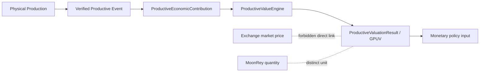

# Wave 5 — Productive Economic Value and GPUV

This document formalizes the Wave 5 transition from verified productive
events to governed productive economic value (GPUV), while preserving the
canonical separation between GPUV, MoonRey quantity, and Exchange market
price.

## Authority and scope

| Component | Canonical owner | Authority |
|-----------|-----------------|-----------|
| `ProductiveEconomicContribution` | `packages/sunrey-chain/src/productive/policy-governance/value-function/wave5` | None — valuation input only |
| `ProductiveValueEngine` | same | Calculates GPUV in simulation; cannot mint |
| GPUV definition | same | Economic valuation unit; not MoonRey |
| MoonRey supply | Chunk 71 `MonetaryIssuanceAuthority` | Only mint path |
| Exchange market price | `packages/sunrey-exchange` | Trading quote; not GPUV |

Production valuation remains **inactive**. All Wave 5 outputs are
`simulation: true` and `productionStatus: false`.

## Pipeline



### Stage 1 — Physical production

Observations from oracle/provider fabrics (energy, compute,
manufacturing, water, logistics, agriculture, etc.) remain non-authoritative
economic inputs. They do not mint MoonRey and do not set Exchange price.

### Stage 2 — Verified productive event

A productive event is verified through:

- canonical productive event identity (Chunk 120)
- productive asset / object binding
- multi-source observation corroboration
- event reconciliation and attribution (Chunks 121–122)
- rights/license proof
- evidence proof

Unresolved or duplicate events fail closed.

### Stage 3 — ProductiveEconomicContribution

`ProductiveEconomicContribution` represents a verified productive event
**accepted for valuation**. It references:

| Field | Purpose |
|-------|---------|
| `canonicalEvent` | Event identity + reconciliation status |
| `productiveAsset` | Productive object/asset binding |
| `economicClaim` | Canonical economic claim reference |
| `informationConsensusReceipt` | Multi-source corroboration receipt |
| `evidenceProofs` | Sealed evidence references |
| `rightsLicenseProof` | Rights/license proof |
| `category`, `quantity`, `unit` | Physical production quantities |
| `measurementPeriod`, `geography` | Time and place binding |
| `verificationMethodologyId/Version` | Verification methodology |

It has **no monetary authority**.

Implementation: `wave5/contribution.ts`

### Stage 4 — ProductiveValueEngine

`ProductiveValueEngine` is the governed boundary over the existing Chunk
124 `evaluateProductiveValue` engine.

**Inputs**

- `ProductiveEconomicContribution`
- versioned `ProductiveValuationMethodology` (from `ProductiveValueFunctionPolicy`)
- deterministic `ProductiveValueInput`

**Outputs**

- `ProductiveValuationResult`
- auditable `ProductiveValueReceipt`

**May**

- calculate governed productive economic value in simulation

**May not**

- change MoonRey supply
- set MoonRey market price
- approve governance
- submit direct mint instructions

Implementation: `wave5/engine.ts`

### Stage 5 — GPUV

`GPUV` (`GovernedProductiveValueUnit`) is the productive economic
valuation unit.

#### What GPUV measures

- governed productive economic value under a versioned methodology
- verified physical production converted through canonical measurement
- attributed share of an event basis
- ordered factor composition (Chunk 123–124)

#### What GPUV does not measure

- MoonRey quantity
- Exchange market price
- fiat value (unless a future governed policy explicitly defines otherwise)
- physical-unit identity (`1 Wh ≠ 1 GPUV` by definition in simulation schedules)
- PEVE / human-contribution scores
- AI-generated uncommitted opinions

#### Precision

- bigint exact rational math via `mulDiv`
- factor scale: `1_000_000`
- output: integer minor GPUV (`integer_minor_gpuv`)
- floating-point forbidden

Implementation: `wave5/gpuv.ts`, existing `value-function/engine.ts`

## Cross-domain methodology

Unlike productive outputs (energy Wh, compute gpu_s, manufacturing UNIT,
water L, logistics t_km, agriculture g, etc.) must normalize into a
standard productive-value representation.

Wave 5 preserves the existing simulation schedules and adds versioned
`DomainMethodologyBinding` interfaces per `ProductiveCategory`. Incomplete
production economics remain simulation-only; no new production assumptions
are invented.

Implementation: `wave5/methodology.ts`, existing `basis.ts` schedules

## Methodology versioning

Every GPUV result references:

| Field | Source |
|-------|--------|
| methodology ID | `policyId` |
| methodology version | `policyVersion` |
| input claims | contribution + economic claim IDs |
| calculation timestamp | `calculatedAtUtc` / `evaluatedAt` |
| output precision | `GPUV_PRECISION_SCALE` |
| policy version | `policyContentHash` |

Historical replay must reproduce the same `resultHash` when the historical
methodology and inputs are supplied.

## Determinism

GPUV evaluation is deterministic when:

- inputs are bigint-only
- methodology version is fixed
- `evaluatedAt` / `calculatedAtUtc` is committed
- no live external API lookup participates
- no AI-generated uncommitted calculations are accepted

Where GPUV influences monetary proposals, results are committed as
`ProductiveValuationResult` / `ProductiveValueReceipt` digests before
downstream settlement (Chunk 125 bridge).

## Market price separation

The following couplings are forbidden:

| Coupling | Status |
|----------|--------|
| `GPUV = MoonRey price` | Forbidden |
| GPUV directly determines Exchange quote | Forbidden |
| Exchange quote feeds GPUV | Forbidden |
| market capitalization determines issuance | Forbidden |
| Exchange API required for GPUV | Forbidden |

Guards: `wave5/market-separation.ts`, existing `invariants.ts`,
`reference-resolution.ts`

## Productive value receipt

`ProductiveValueReceipt` fields:

- `valuationId`
- productive contribution (id, fingerprint, event)
- economic claim
- methodology ID/version
- input quantities
- normalized productive value
- `gpuvQuantity`
- policy reference
- evidence references
- `resultHash`
- simulation/production status

## Explicit separation: GPUV → monetary policy input

GPUV is an input to governed monetary policy — not a substitute for it.

```text
Verified Productive Contribution
  → GPUV (Productive Value Engine)
    → governed conversion policy (Chunk 125)
      → settlement authorization
        → Chunk 71 MonetaryIssuanceAuthority
          → MoonRey quantity
```

Exchange market price is a separate surface:

```text
Exchange order book / last trade
  → consumer market price APIs
    → not GPUV
    → not issuance quantity
```

## Tests

`tests/wave-5-productive-value-gpuv.test.ts` covers:

- same inputs + same methodology ⇒ same GPUV
- different methodology version ⇒ explicitly different binding
- stale/unverified contribution rejected
- unresolved event rejected
- duplicate productive event not valued twice
- market price does not alter GPUV
- Exchange API unavailable does not alter GPUV
- AI response cannot modify deterministic result
- SunRey PEVE methodology cannot be substituted for GPUV

Existing Chunk 123–124 suites remain authoritative for factor math and
engine invariants (`moonrey-productive-value.test.ts`).

## Remaining simulation economics

The following remain **simulation / engineering parameters only**:

- base-value schedule numerators/denominators per category
- factor schedules and caps in `developmentValueFunctionPolicy`
- GPUV → MoonRey conversion (Chunk 125) — inactive in production
- production candidate packages under `production-candidate/`
- cross-domain scarcity/utilization reference fixtures

No production GPUV values, conversion rates, or issuance quantities are
activated by Wave 5.

## Related documents

- `docs/economics/chunk-123-moonrey-productive-value-constitution.md`
- `docs/economics/chunk-124-moonrey-productive-value-engine.md`
- `docs/economics/chunk-125-moonrey-value-settlement-bridge.md`
- `docs/architecture/WAVE3_PROOF_BOUND_MONETARY_TRANSITIONS.md`
- `docs/architecture/SUNREY_ECONOMIC_INFORMATION_FLOW.md`
