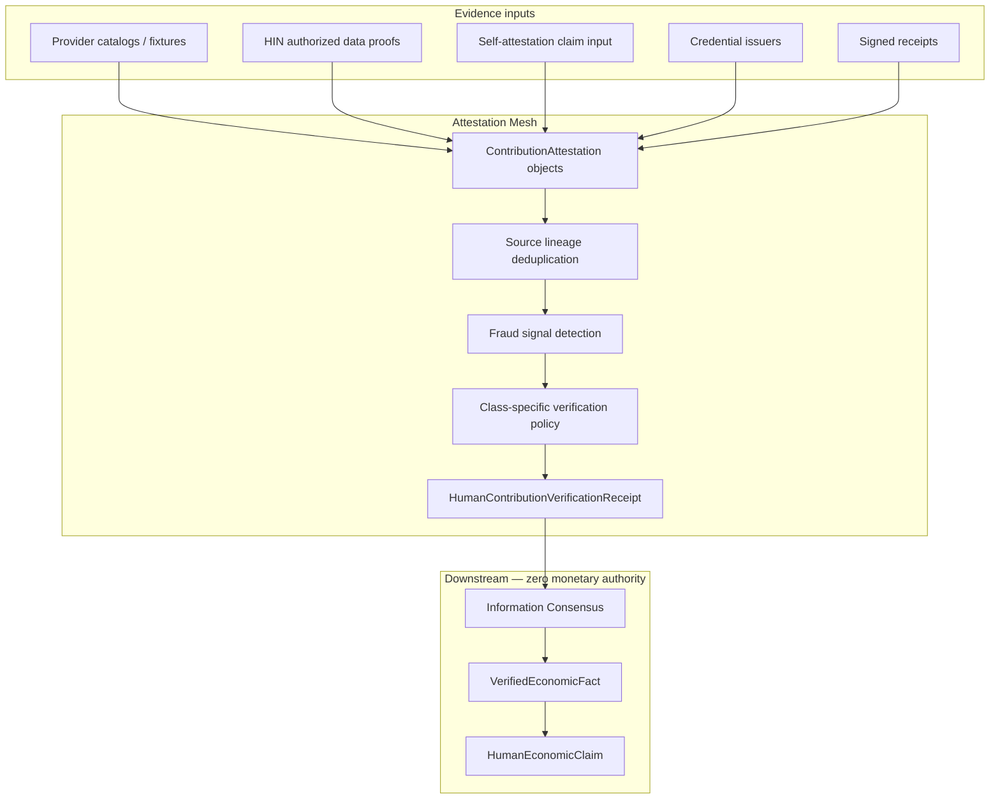

# Wave 6 — SunRey Human Contribution Attestation Mesh

Establish whether a claimed human contribution genuinely occurred using multiple forms of evidence and attestation.

This mesh is conceptually related to the MoonRey Oracle Mesh, but **human contribution verification has fundamentally different semantics**. Productive oracle logic is not reused blindly.

## Core question

For a Human Economy claim:

> What evidence establishes that this pseudonymous participant genuinely made this contribution?

## Architecture



Attestation objects, verification receipts, verified facts, and claims **never** create PEVE, SunRey, or Execution Authority.

## Owner

| Component | Owner |
|-----------|-------|
| Attestation mesh core | `packages/human-economic-contribution/src/attestation-mesh/` |
| HIN-sourced attestations | `packages/information-market/src/network/contribution/` |
| Provider ingestion | `packages/external-data/src/wave6/`, `packages/sunrey-chain/src/health-reference/` |
| IC promotion | `packages/sunrey-chain/src/economic-awareness-fabric/information-consensus/` |

## Task 1 — Provider audit (repository inventory)

Configured human-economy providers are audited in `provider-audit.ts`. Current inventory:

| Domain | Implemented fixtures | Awaiting master list |
|--------|---------------------|----------------------|
| Health / research | ClinicalTrials.gov, openFDA, NPPES, MedlinePlus, HDX, NHS Scotland | PubMed/NCBI, Europe PMC |
| Employment / skills | Arbeitnow, RemoteOK, open-skills, techrole-index, Hacker News, … | O*NET, USAJOBS, CareerOneStop |
| Education | — | College Scorecard, IPEDS |
| Research / publications | SEC EDGAR, Federal Register | OpenAlex, arXiv, OSF, SHARE, PatentsView |
| HIN / computation | HIN Chunk 107, approved computation receipts | — |

Examples referenced in scope (PubMed, Europe PMC, O*NET, USAJOBS, College Scorecard, IPEDS, CareerOneStop) are tracked as **awaiting master list** until present in the authoritative Wave 0 catalog.

## Task 2 — Attestation source classes

Source classes are **not treated equally**:

| Class | Evidentiary weight |
|-------|-------------------|
| PRIMARY_INSTITUTION, RESEARCH_PUBLISHER, RESEARCH_REGISTRY, GOVERNMENT | AUTHORITATIVE |
| EMPLOYER, EDUCATIONAL_INSTITUTION, CREDENTIAL_ISSUER, SIGNED_*_RECEIPT, AUTHORIZED_DATA_PROVIDER | STRONG |
| PEER_ATTESTATION, OTHER_GOVERNANCE_APPROVED | MODERATE |
| USER_SELF_ATTESTATION | WEAK (claim input only) |

## Task 3 — ContributionAttestation

Formal object in `attestation-mesh/types.ts`:

- `attestationId`, `issuer`, `issuerClass`
- pseudonymous `subjectPseudonymousRef`
- `contributionEventRef`, optional `claimRef`
- `statementType`, `issuedAt`, `validity`
- `signatureReference`, evidence and provenance refs
- `rights`, `verificationStatus`, lineage fields
- explicit zero authority flags

## Task 4 — Contribution-specific verification

`HumanContributionAttestationVerificationPolicy` defines per-class requirements in `policy.ts`:

| Contribution class | Required evidence |
|--------------------|-------------------|
| RESEARCH_PARTICIPATION | publication identifier, author relationship, publisher/registry attestation |
| EDUCATION_SKILL_ATTESTATION | credential issuer verification |
| PROFESSIONAL_EXPERTISE / work | employer or signed work receipt |
| MODEL_TRAINING_PARTICIPATION | signed computation receipt, rights, consent, usage proof |
| INFORMATION_RIGHT_CONTRIBUTION | authorized data provider, rights grant, usage proof |

No universal one-size-fits-all rule.

## Task 5 — Self-attestation

Self-attestation (`USER_SELF_ATTESTATION`) may provide a **claim input** only.

Policy explicitly sets `selfAttestationMayVerify: false`. Categories requiring independent evidence cannot be verified from self-attestation alone → `INSUFFICIENT_EVIDENCE`.

## Task 6 — Source independence

Wave 4 lineage principles apply:

```text
Publication DB A  ──┐
Aggregator B (copies A) ──┼──> ONE lineage root
Research profile C (from A) ──┘
```

`analyzeAttestationIndependence()` deduplicates by `lineageRootId` / `upstreamOrganizationId`. Endpoint count is not independence.

## Task 7 — Verification receipt

Auditable `HumanContributionVerificationReceipt` includes:

- human actor, contribution event, class
- attestations evaluated, evidence refs, source classes
- source lineage summaries and independent root count
- identity assurance, rights status, freshness, conflicts
- verification methodology, result, explanation codes, fraud signals

Results: `VERIFIED`, `INSUFFICIENT_EVIDENCE`, `DISPUTED`, `IDENTITY_UNRESOLVED`, `RIGHTS_RESTRICTED`, `STALE`, `INVALID`, `MANUAL_REVIEW_REQUIRED`.

## Task 8 — Information Consensus integration

Successful verification produces promotion payloads via `ic-promotion.ts`:

1. `AttestationMeshIcPromotion` → eligible for `InformationVerifiedEconomicFact`
2. `HumanEconomicClaimPromotion` → `CanonicalEconomicClaim` / `HumanEconomicClaim`

Integration tests wire this in `tests/wave-6-human-contribution-attestation-mesh.test.ts`.

The mesh **must not** create PEVE, SunRey, or authorize issuance.

## Task 9 — Credential verification

`credentials.ts` represents:

- credential issued / valid / revoked / expired
- issuer trusted / recognized / untrusted
- rejection when authoritative verification exists but only screenshots are supplied

## Task 10 — Fraud controls

`fraud.ts` detects:

- forged attestation, duplicate receipt, issuer mismatch
- signature mismatch, impossible timestamp
- same receipt claimed by multiple actors
- same contribution under multiple identities
- publication author mismatch (manual review)

## Task 11 — Tests

| Fixture | Expected result |
|---------|-----------------|
| Verified research | VERIFIED |
| Verified education credential | VERIFIED |
| Verified work | VERIFIED |
| Verified computation | VERIFIED |
| Self-attestation only | INSUFFICIENT_EVIDENCE |
| Copied source lineage | deduplicated; may still verify with one root |
| Forged attestation | INVALID |
| Revoked credential | not VERIFIED |
| Wrong person | INVALID |
| Duplicate signed receipt | INVALID |
| Insufficient evidence | INSUFFICIENT_EVIDENCE |

Package tests: `packages/human-economic-contribution/src/attestation-mesh.test.ts`

Integration tests: `tests/wave-6-human-contribution-attestation-mesh.test.ts`

## Task 12 — Related documentation

- Chunk 109 verification: `docs/economics/chunk-109-human-contribution-verification.md`
- Wave 4 IC: `docs/architecture/WAVE4_INFORMATION_CONSENSUS.md`
- Provider completion: `docs/providers/WAVE_6_COMPLETION_REPORT.md`

## Validation

```bash
npm test --workspace=@solstice/human-economic-contribution
node --experimental-strip-types --disable-warning=ExperimentalWarning --test tests/wave-6-human-contribution-attestation-mesh.test.ts
npm test
```
