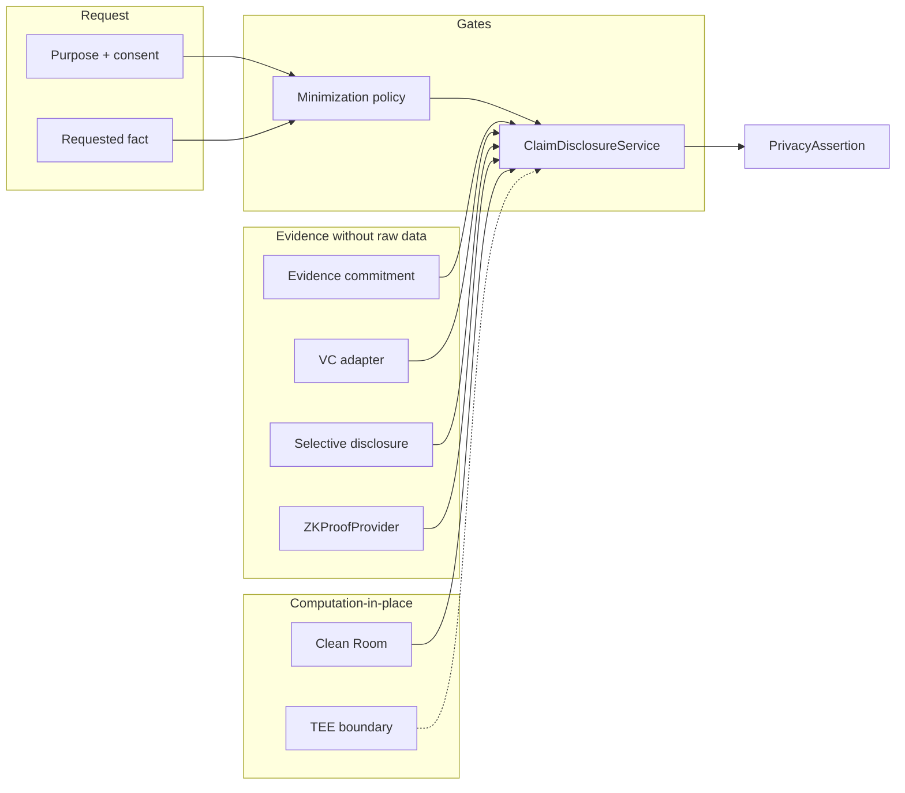

# Wave 7 — Privacy-Preserving Data Access

**Version:** 1.0.0-wave7-privacy  
**Status:** Architectural specification + simulation implementation  
**Owners:** `packages/personal-data-vault`, `packages/identity`, `packages/security`, `packages/clean-room`  
**Companion:** `docs/architecture/WAVE3_RIGHTS_AND_CONSENT_COMMITMENTS.md`, `docs/architecture/WAVE3_EVIDENCE_COMMITMENTS.md`, `docs/architecture/adr/ADR-0030-sunrey-blockchain-privacy-confidentiality.md`

---

## 1. Core principle

SunRey should increasingly prove:

> **A REQUIRED FACT IS TRUE**

without unnecessarily retrieving or exposing:

> **THE ENTIRE UNDERLYING DATASET**

Examples:

| Prove | Do not expose |
| --- | --- |
| credential is valid | full academic transcript |
| participant is over required age | full date of birth |
| authorized computation completed | entire health dataset copy |

This wave hardens privacy-preserving access on top of prior waves:

- Evidence commitments
- Rights commitments
- Consent and purpose
- Pseudonymous identities
- Authorized Data Contribution
- Policy-as-code
- Fine-grained authorization

---

## 2. Task 1 — Data exposure audit

Canonical audit catalog: `packages/personal-data-vault/src/disclosure/audit.ts`

| Surface | Risk | Status |
| --- | --- | --- |
| API responses / BFF adapters | HIGH | PARTIAL — assertion mapping in progress |
| Database queries (PDV persistence) | MEDIUM | MITIGATED — column projection + access broker |
| Federated queries (Economic Awareness Fabric) | HIGH | MITIGATED — fact candidates without raw payloads |
| Graph queries (PEG) | MEDIUM | MITIGATED — pseudonymous refs |
| Structured logs | HIGH | MITIGATED — `packages/security/src/safe-logging.ts` |
| Evidence objects / chain payloads | HIGH | MITIGATED — commitment-only + `scanForForbiddenBlockPayload` |
| Usage receipts (Clean Room) | MEDIUM | MITIGATED — `ContributionComputationReference` |
| Policy inputs (Consent) | MEDIUM | MITIGATED — `proofRef` + commitments only |

---

## 3. Task 2 — Claim-based disclosure

**Owner:** `packages/personal-data-vault/src/disclosure/`

Structured assertion types:

- `CredentialValid`
- `EmploymentVerified`
- `ContributionVerified`
- `AgeThresholdSatisfied`
- `JurisdictionSatisfied`
- `ComputationCompleted`
- `DatasetUsageAuthorized`

Each `PrivacyAssertion`:

- references `evidenceRefs` (commitment hashes / proof refs)
- lists only `disclosedFields`
- sets `rawDataIncluded: false` (typed, not configurable)

`ClaimDisclosureService` enforces purpose binding and minimization before issuing assertions.

---

## 4. Task 3 — Verifiable Credentials

**Owner:** `packages/identity/src/verifiable-credentials/`

| Capability | Classification |
| --- | --- |
| W3C Verifiable Credentials verification | **INTERFACE_ONLY** |
| Simulation fixture verifier | **PARTIAL** |

SunRey does **not** invent a proprietary credential standard. The `VerifiableCredentialVerifier` adapter boundary accepts W3C-aligned credentials and returns disclosed claim names only — never the full `credentialSubject` document.

Production path: plug in a mature VC library (e.g. `@digitalbazaar/vc`, `did-jwt-vc`) behind the adapter without changing domain assertion types.

---

## 5. Task 4 — Selective disclosure

**Owner:** `packages/personal-data-vault/src/disclosure/selective-disclosure.ts`

| Capability | Classification |
| --- | --- |
| Selective disclosure (SD-JWT / BBS+ / mature libraries) | **INTERFACE_ONLY** |

`SelectiveDisclosureProvider` defines the port. SunRey does **not** implement custom cryptographic selective-disclosure protocols.

---

## 6. Task 5 — Zero-knowledge proof boundary

**Owner:** `packages/security/src/zk-proof/`

| Capability | Classification |
| --- | --- |
| `ZKProofProvider` (threshold, membership, credential possession, authorized computation) | **INTERFACE_ONLY** |

No custom ZK circuits are shipped. Future mature libraries bind to `ZKProofProvider.prove` / `verify`.

---

## 7. Task 6 — Differential privacy decision

**Owner:** `packages/clean-room/src/privacy/differential-privacy.ts`

| Capability | Classification |
| --- | --- |
| OpenDP / equivalent aggregate analytics | **INTERFACE_ONLY** |
| Clean Room query budget (non-epsilon) | **PARTIAL** (existing `packages/clean-room/src/budget.ts`) |

**Appropriate for:** population statistics, aggregate economic patterns, research analytics.

**Not appropriate for:** blockchain balances, canonical monetary state, individual economic claims (exactness required).

`DIFFERENTIAL_PRIVACY_NOT_IMPLEMENTED` remains recorded until a governed mechanism is configured. Production epsilon values are **not** fabricated.

---

## 8. Task 7 — Privacy budget model

**Owner:** `packages/clean-room/src/privacy/privacy-budget.ts`

Tracks per budget:

- dataset
- purpose
- query class
- queries consumed / limit
- policy version
- authorized analyst / service refs

`epsilonConsumed` and `epsilonLimit` remain `null` until production parameters are governed/configured.

---

## 9. Task 8 — Computation-in-place

**Owner:** `packages/clean-room/src/privacy/computation-in-place.ts`

Preferred flow:

1. query/computation at authorized source
2. return verified result / proof commitment
3. never copy complete dataset into SunRey

| Venue | Classification |
| --- | --- |
| Secure data clean room | **PARTIAL** — existing Clean Room service |
| Trusted execution environment | **INTERFACE_ONLY** |
| Private computation service | **INTERFACE_ONLY** |

`PrivateComputationProvider` is the integration boundary.

---

## 10. Task 9 — Data minimization

**Owner:** `packages/personal-data-vault/src/disclosure/minimization-policy.ts`

Field-level policies map verification purposes to:

- `required` fields
- `forbidden` fields (transcript, DOB, vault contents, etc.)

`denyOverbroadFieldRequest` fails closed on forbidden or extra fields.

Extends existing `MinimizedReadRequest` in `packages/personal-data-vault/src/service.ts` and `packages/clean-room/src/dataset.ts#minimizePayload`.

---

## 11. Task 10 — Logging / telemetry redaction

**Owners:**

- `packages/security/src/safe-logging.ts` — canonical redaction catalog
- `services/api/src/logging.ts` — Platform API structured logs

Automatically redacts:

- tokens and secrets
- personal identifiers
- health fields
- financial details
- consent documents
- private keys

---

## 12. Capability summary

| Capability | Classification |
| --- | --- |
| Verifiable Credentials | INTERFACE_ONLY (PARTIAL fixture) |
| Selective Disclosure | INTERFACE_ONLY |
| Zero-Knowledge Proofs | INTERFACE_ONLY |
| Differential Privacy | INTERFACE_ONLY |
| Private Computation | INTERFACE_ONLY |
| Clean Rooms | PARTIAL |
| Trusted Execution Environments | INTERFACE_ONLY |

---

## 13. Tests

```bash
node --experimental-strip-types --disable-warning=ExperimentalWarning --test tests/wave-7-privacy-preserving-access.test.ts
```

Coverage:

- minimal assertion
- overbroad field denial
- raw data absent from chain
- raw data absent from logs
- selective disclosure interface
- credential proof failure
- wrong-purpose disclosure
- aggregate DP path vs monetary exactness
- privacy budget exhaustion
- deleted source with verifiable historical commitment
- computation-in-place without dataset copy

---

## 14. Integration map



---

*End of Wave 7 Privacy-Preserving Data Access.*
