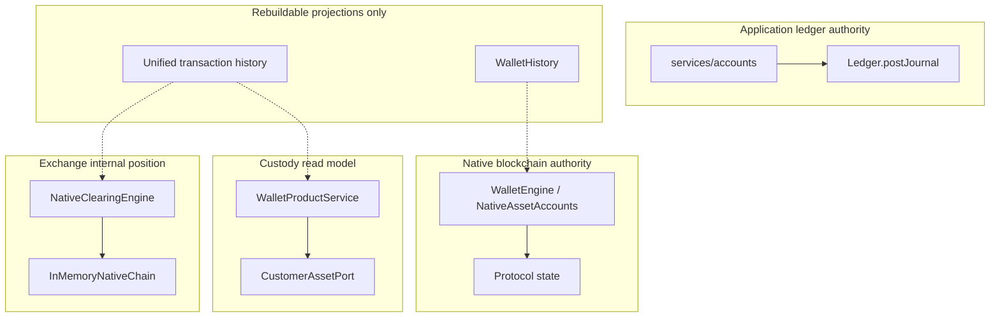
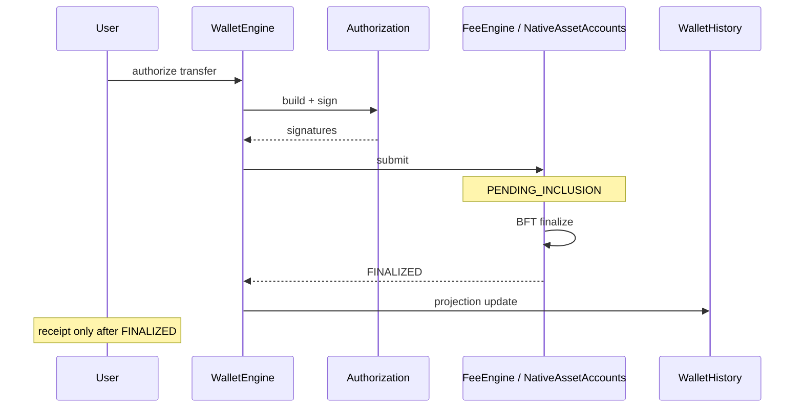
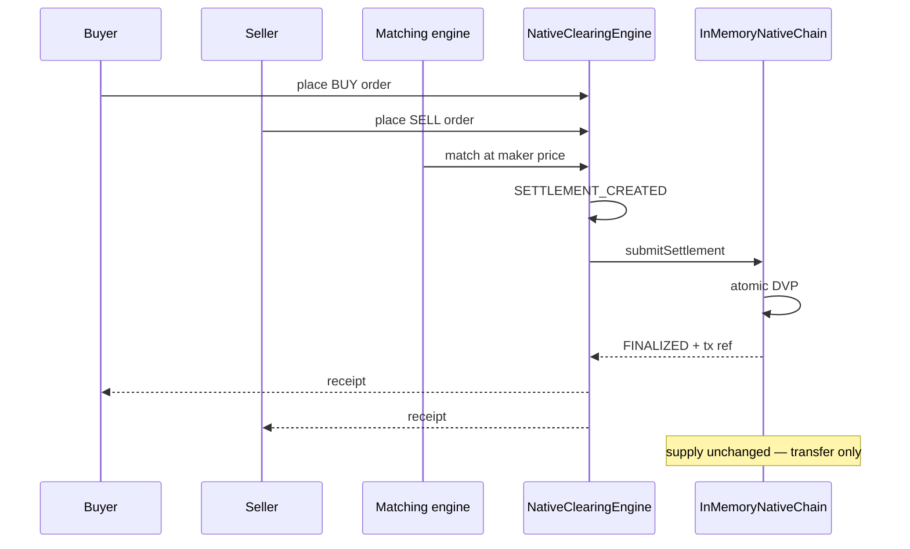

# Wave 8 — Wallet, Ledger, and Exchange Integration

Wave 8 connects the SunRey blockchain, canonical ledger, customer wallets, and Exchange
without allowing any secondary system to become a second monetary ledger.

**Scope:** simulation-grade product integration. `ENVIRONMENT` remains `simulation`.
All `LIVE_*` flags stay `false`. Regulated custody, banking, and live rails are not
connected.

## Authority model

| Surface | Authority | Notes |
| --- | --- | --- |
| Fiat banking balance | `CURRENT_APPLICATION_AUTHORITY` (ledger) | `projectPostedBalance` |
| Chain native SunRey/MoonRey | `NATIVE_BLOCKCHAIN_AUTHORITY` | `WalletEngine.balance()` |
| Consumer wallet API | `CUSTODY_PROVIDER_REPORTED_STATE` | Read model; `providerBalanceIsTruth: false` |
| Exchange holdings | `EXCHANGE_INTERNAL_POSITION` | Native clearing simulation chain |
| Unified history | `REBUILDABLE_PROJECTION` | Never authoritative |

**Conflict rule:** Ledger wins over chain native units until a Kernel-gated migration ADR
runs. Reconciliation never auto-corrects canonical chain state.

## Wallet architecture

| Kind | Description | Balance authority |
| --- | --- | --- |
| `BLOCKCHAIN_ACCOUNT` | Sovereign chain account (`packages/sunrey-chain/src/wallet`) | Native chain |
| `USER_WALLET` | Human-controlled signing boundary | Native chain or custody read model |
| `CUSTODIAL_WALLET` | Customer custody wallet (`SUNREY_NATIVE` model) | Custody read model |
| `NON_CUSTODIAL_WALLET` | User-held keys (simulation) | Native chain |
| `APPLICATION_ACCOUNT` | Domain `Account` + ledger postings | Ledger |
| `FIAT_ACCOUNT` | Banking demand/savings via `services/accounts` | Ledger |
| `EXCHANGE_ACCOUNT` | Exchange clearing account | Exchange internal position |

Regulated custody is **not** implied: `regulatedCustodyConnected: false` on all product
surfaces until production provider binding is authorized.

Implementation: `packages/custody/src/product/wallet-architecture.ts`

## Native balance authority

- Canonical native SunRey/MoonRey balances originate from `NativeAssetAccounts` /
  protocol state.
- Cached projections (`WalletHistory`, mobile sync) are rebuildable from finalized chain
  records.
- No mutable `balance` field may independently establish native-asset truth.

Implementation: `packages/sunrey-chain/src/wallet/balance-projection.ts`

## Ledger integration

- Fiat and application-class movements use `Ledger.postJournal` with verified Execution
  Authority.
- Native asset custody credits in simulation use Kernel-gated `CustodyService`; the
  in-memory asset port is not a second ledger.
- Fiat `Money` journals and native `AssetQuantity` journals are not combined improperly.

## Native transfer lifecycle

States: `AUTHORIZATION_PENDING` → `TRANSACTION_BUILT` → `SIGNED` → `SUBMITTED` →
`PENDING_INCLUSION` → `FINALIZED` | `FAILED` | `REJECTED`.

Transfers are not marked complete before finality. Client transaction id replay is rejected.

Implementation: `packages/sunrey-chain/src/wallet/transfer-lifecycle.ts`

## Exchange architecture

| Concern | Owner | Does NOT own |
| --- | --- | --- |
| Order book / matching | `packages/sunrey-exchange/src/matching.ts` | Canonical supply |
| Market price | Exchange book (`SIMULATION_MARKET_PRICE`) | PEVE, GPUV |
| Custody / positions | Native clearing engine | Fiat ledger |
| Settlement | Native clearing + product coordinator | Mint authority |
| Blockchain supply | `InMemoryNativeChain.issued` | Exchange price |

SunRey and MoonRey markets are separated by canonical asset id (`SUNREY_COIN`,
`MOONREY_COIN`). No ticker, balance, or price collision.

## Settlement model

Unified Wave 8 states map existing vocabularies:

| Wave 8 state | Native clearing | Product clearing | Order |
| --- | --- | --- | --- |
| `ORDER_OPEN` | — | — | `OPEN`, `PARTIALLY_FILLED` |
| `MATCHED` | `MATCHED` | obligation opened | `FILLED` |
| `SETTLEMENT_PENDING` | `SETTLEMENT_CREATED`, `SUBMITTED` | `SETTLING` | — |
| `SETTLED` | `FINALIZED` | `SETTLED` | — |
| `FAILED` | `FAILED`, `RECONCILIATION_REQUIRED` | `FAILED` | — |
| `CANCELLED` | — | — | `CANCELLED` |

On-chain settlement records canonical transaction references. Sandbox simulation is
explicitly labeled (`sandboxSimulation: true`).

Implementation: `packages/sunrey-exchange/src/settlement-lifecycle.ts`

## Market price separation

| Price type | Authority | Exchange market price? |
| --- | --- | --- |
| SunRey market price | Exchange simulation book | Yes (`SIMULATION_MARKET_PRICE`) |
| PEVE (human contribution valuation) | `packages/human-economic-contribution` | **No** |
| MoonRey market price | Exchange simulation book | Yes |
| GPUV (productive value) | Productive policy governance | **No** |
| Native supply | Blockchain protocol | **Not set by Exchange** |

Implementation: `packages/sunrey-exchange/src/market-price-boundary.ts`

## Reconciliation

The reconciliation engine compares:

1. Chain native balances
2. Custody provider / customer read model
3. Exchange internal positions
4. Ledger postings (where applicable)

Detects: missing posting, missing settlement, projection mismatch, duplicate settlement,
unknown transaction, wrong asset.

**Never** rewrites canonical chain state automatically (`chainStateRewritten: false`,
`autoCorrected: false`).

Implementation: `packages/custody/src/product/money-reconciliation.ts`

## Unified transaction history

User-facing history combines:

- Native transfers
- Custody deposits / withdrawals
- Exchange settlements
- Fiat sandbox activities (when present)

Each item preserves `sourceType` and `underlyingRef`.

Implementation: `packages/custody/src/product/unified-transaction-history.ts`

## Consumer BFF endpoints

| Method | Path | Purpose |
| --- | --- | --- |
| GET | `/api/v1/money/holdings` | Holdings with architecture descriptors |
| GET | `/api/v1/money/history` | Unified transaction history |
| GET | `/api/v1/money/settlements` | Wave 8 settlement records |
| POST | `/api/v1/money/reconcile` | Plane reconciliation report |
| GET | `/api/v1/money/market-price-boundary` | PEVE/GPUV/supply separation proof |

Orchestration: `services/api/src/consumer/money-integration/`

## Regulated rail boundaries

| Capability | Status |
| --- | --- |
| Live banking / fiat on-off-ramp | Not connected; sandbox only |
| Regulated crypto custody | Not connected; `productionMoneyMovement: false` |
| Securities / brokerage | Not implemented |
| Production signing | Disabled (`productionSigningAuthorized: false`) |

Interfaces and regulated feature gates exist; sandbox simulations are labeled.

## Exchange trade / settlement diagram

## Tests

`tests/wave-8-wallet-ledger-exchange-integration.test.ts` covers:

- SunRey and MoonRey transfers
- Insufficient balance and replay rejection
- Wallet projection rebuild
- Plane reconciliation
- Exchange sandbox trade without supply mint
- Settlement state mapping
- Market price / PEVE / GPUV separation
- BFF money integration routes

## Related documentation

- `docs/productization/PHASE_G_05_WALLETS_CUSTODY.md`
- `docs/architecture/native-asset-authority-boundary.md` (if present)
- `docs/runbooks/exchange-settlement-reconciliation.md`
