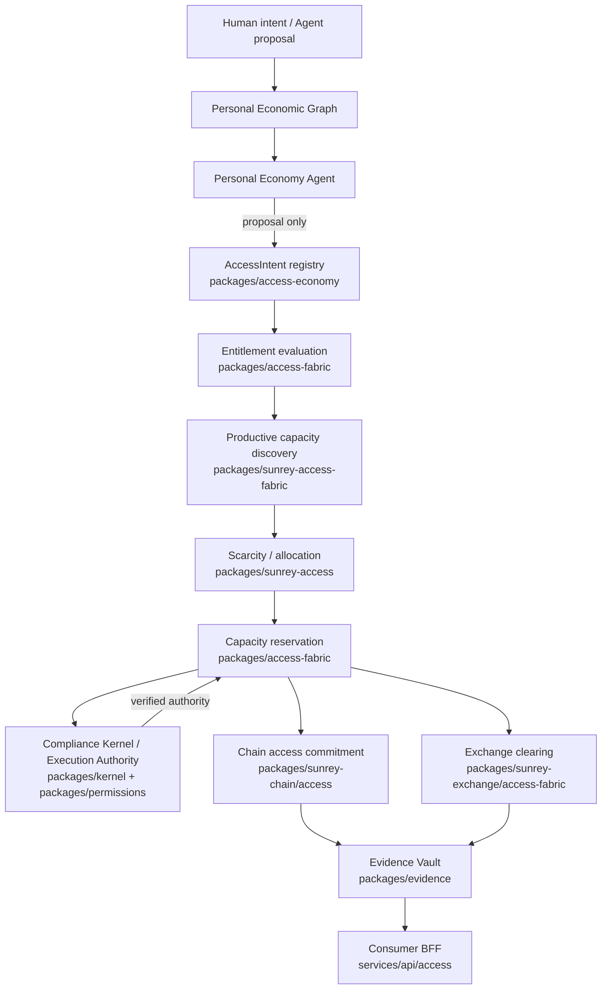

# SunRey Human Access Economy — Access Fabric architecture

Classification: engineering simulation on current `main`. This document describes canonical ownership and data flow after ACCESS-13R integration. It is not legal advice and does not activate production.

## Ownership table

| Capability | Canonical owner | Notes |
| --- | --- | --- |
| ACCESS-01 domain vocabulary and registry | `packages/access-economy` | `AccessFabricIntent`, domain invariants |
| ACCESS-04 entitlements / Personal Access Envelope | `packages/access-fabric` | `AccessEntitlementEngine` |
| ACCESS-05 verified capacity state | `packages/sunrey-access` | Capacity records, evidence refs |
| ACCESS-06 scarcity / allocation intelligence | `packages/sunrey-access` | Quote and allocation bands |
| ACCESS-03 productive capacity discovery | `packages/sunrey-access-fabric` | Experience composer, capacity ports |
| ACCESS-07 capacity reservation (Kernel-gated) | `packages/access-fabric` | `CapacityReservationEngine`, `authorize.ts` |
| ACCESS-08 chain access-right commitments | `packages/sunrey-chain/src/access` | Access rights, reservations on chain |
| ACCESS-09 exchange capacity markets / clearing | `packages/sunrey-exchange/src/access-fabric` | Capacity market simulation |
| ACCESS-10/11 experience composer + completion | `packages/sunrey-access-fabric` + chain access-fabric | Multi-leg sagas, completion evidence |
| ACCESS-13 qualification laboratory | `packages/sunrey-economics/src/access-economy` | Deterministic scenarios and invariants |
| Consumer BFF projection | `packages/human-access-economy` → `services/api/src/consumer/access.ts` | Orchestration only |

Forbidden parallel owners: `packages/access-core`, `packages/access-coin`, `packages/access-ledger`, `packages/entitlements`, and similar peer packages listed in `docs/architecture/manifest.json`.

## Data flow

AI may propose. AI may not self-approve or execute. Consequential transitions require a verified Execution Authority issued by the Compliance Kernel after six proofs combine monotonically.

## Execution Authority boundary

`packages/access-fabric/src/authorize.ts` verifies Kernel-issued Execution Authority for capacity reservations. It is not a second authority mint. The simulation laboratory in `packages/sunrey-economics` consumes canonical entitlement evaluation from `packages/access-fabric` and never posts journals or opens accounts.

## Production posture

| State | Value |
| --- | --- |
| `ENVIRONMENT` | `simulation` |
| `PRODUCTION_READY` | false |
| `LIVE_CONNECTIVITY_ENABLED` | false |
| `PRODUCTION_ACTIVE` | false |
| `ACCESS_FABRIC_CODE_COMPLETE_CANDIDATE` | engineering qualification only |

See `docs/architecture/ACCESS_FABRIC_STATUS.md` for qualification counts, remaining dependencies, and architecture debt.
