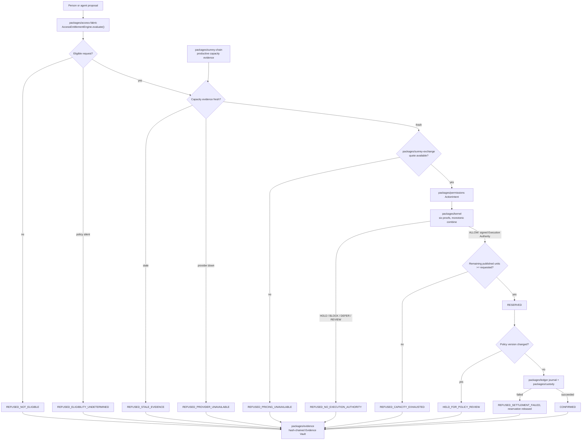
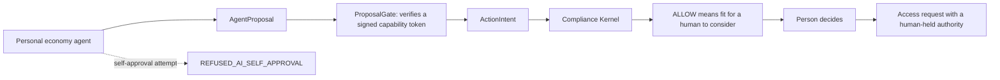
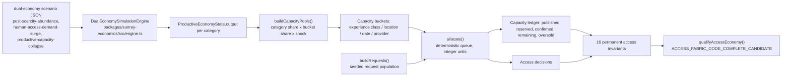

# SunRey Access Fabric — architecture, data flow, and ownership

Status: engineering documentation for ACCESS-04 and ACCESS-13.
Classification: simulation. `ENVIRONMENT` is `simulation` and every
`LIVE_*` flag is `false`.

The Access Fabric answers one question about a person: **what may this
person request right now, and how much of it exists?** It does not answer
what a person is worth, and it does not create a way to pay for access.

## What the Access Economy is not

- Not a currency. There is no Access Coin, access credit, or access-denominated
  balance. An `AccessEntitlement` carries `isMonetaryAsset: false` and
  `isTransferableBalance: false`, and `transferability` defaults to `false`.
- Not a monetary authority. Access activity issues no SunRey and no MoonRey,
  and asserts no fixed SunRey/MoonRey conversion rate.
- Not a scoring system. No decision reads a human-worth, reputation, social
  credit, desirability, or eligibility score.
- Not a second ledger, Exchange, or custody system. Settlement, pricing, and
  key custody are attributed to their canonical owners.
- Not a legal eligibility oracle. When the policy plane cannot determine
  eligibility, the request is refused. Silence is never read as permission.

## Ownership table

Each capability has exactly one owner. Extending an owner is allowed;
creating a parallel owner is not.

| Concern | Canonical owner | Canonical path | Notes |
| --- | --- | --- | --- |
| Access entitlement eligibility, Personal Access Envelope | `packages/access-fabric` | `src/engine.ts` | ACCESS-04. Decides what may be requested. Does not reserve, price, settle, or score. |
| Access entitlement taxonomy, provenance, replenishment | `packages/access-fabric` | `src/taxonomy.ts`, `src/replenishment.ts` | Provenance labels classify origin, not entitlement to exist. |
| Access Economy simulation, invariants, qualification | `packages/sunrey-economics` | `src/access-economy/` | ACCESS-13. Extends the dual-economy simulator and the stress laboratory. |
| Dual-economy macro simulation | `packages/sunrey-economics` | `src/engine.ts` | Supplies productive capacity context per category. |
| Economic stress laboratory | `packages/sunrey-economics` | `src/stress/` | Hosts the `ACCESS` stress domain and `ECON-ACC-001..015`. |
| Money representation | `packages/money` | `src/` | Integer minor units. Access capacity is productive units, not money. |
| `ActionIntent`, Execution Authority | `packages/permissions` | `src/` | The only issuer of Execution Authority. The simulation never mints one. |
| Six-proof decision, monotonic combine | `packages/kernel` | `src/` | Decides. The Access Economy submits and honours the decision unchanged. |
| Append-only journals | `packages/ledger` | `src/journal.ts` | The only settlement writer. |
| Hash-chained Evidence Vault | `packages/evidence` | `src/vault.ts` | The only evidence chain. The simulation seals into it, it does not fork it. |
| Order matching and pricing | `packages/sunrey-exchange` | `src/` | The only quote source. No fallback price exists. |
| Key custody and Travel Rule | `packages/custody` | `src/` | The only custody plane. |
| Productive capacity observation | `packages/sunrey-chain` | `src/oracle/production/` | Capacity evidence and freshness. |
| Monetary constitution and issuance policy | `packages/sunrey-chain` | `src/economics/` | The only mint. |
| Architecture authority | `docs/architecture/manifest.json` | — | Registers owners, capabilities, and forbidden aliases. |

Forbidden parallel owners, registered in
[`manifest.json`](./manifest.json): `packages/access-coin`,
`packages/access-economy`, `packages/access-ledger`,
`packages/access-exchange`, `packages/access-custody`,
`packages/entitlements`, `packages/access-simulation`,
`packages/access-fabric-v2`.

## Data flow: one access request



Every branch, refusal included, seals a record. Refusal is a first-class
correct outcome, not an error to route around.

## Data flow: agent proposal



An agent proposal is not an `ActionIntent`. An agent never holds Execution
Authority, and an agent-originated decision never issues one. In the
simulation, any request flagged `agentSelfApprovalAttempted` is refused
before capacity is even consulted.

## Data flow: capacity derivation in simulation



Capacity is never invented in the Access Economy layer. It is a share of
productive output the dual-economy simulator already produced, so abundance
and scarcity are consequences of the macro scenario rather than of numbers
chosen to make a scenario pass.

## Determinism and replay

- Allocation order is `policyPriorityBand`, then `requestId`. Policy bands
  come from policy, never from a ranking of the person.
- The seeded RNG shapes who asks for what. It never decides who is granted.
- All capacity arithmetic is `bigint` in integer productive units.
- The simulated clock is frozen at `2031-04-01T00:00:00.000Z` and advances
  by a fixed step, so the same seed yields the same evidence head hash.
- `inputFixtureSha256` and `resultDigestSha256` pin inputs and outputs.

## Permanent invariants

Sixteen invariants are checked on every scenario. They are additive: a later
chunk may add one, never remove or loosen one.

| Invariant | Statement |
| --- | --- |
| `NO_OVERSOLD_PRODUCTIVE_CAPACITY` | Committed access never exceeds published productive capacity in any bucket. |
| `NO_AI_SELF_APPROVAL` | An agent proposal is never approved on the agent's own authority. |
| `ACCESS_IS_NOT_A_COIN` | Access is not denominated in a new currency, credit, or transferable unit. |
| `NO_NEW_MONETARY_AUTHORITY` | The Access Economy introduces no issuer, mint, or monetary authority. |
| `NO_HUMAN_WORTH_SCORING` | No decision depends on a score that ranks a person. |
| `NO_RAW_SENSITIVE_PERSONAL_INFORMATION_ON_CHAIN` | No raw sensitive personal information is sealed into the evidence chain. |
| `NO_RESERVATION_WITHOUT_REQUIRED_AUTHORITY` | No reservation, hold, or confirmation exists without a verified Execution Authority. |
| `NO_SILENT_LEGAL_ELIGIBILITY_INFERENCE` | Undetermined legal eligibility refuses; it is never read as permission. |
| `NO_SECOND_LEDGER` | Settlement is attributed only to the canonical ledger owner. |
| `NO_SECOND_EXCHANGE` | Pricing is attributed only to the canonical Exchange owner. |
| `NO_SECOND_CUSTODY_SYSTEM` | Custody is attributed only to the canonical custody owner. |
| `NO_AUTOMATIC_SUNREY_ISSUANCE` | Access activity never issues SunRey. |
| `NO_AUTOMATIC_MOONREY_ISSUANCE` | Access activity never issues MoonRey. |
| `NO_FIXED_SUNREY_MOONREY_PEG` | No fixed SunRey/MoonRey conversion rate is asserted anywhere. |
| `EVERY_CONSEQUENTIAL_TRANSITION_RECONSTRUCTABLE` | Every consequential transition is sealed in a verifiable hash chain. |
| `SIMULATION_CANNOT_ACTIVATE_PRODUCTION` | Running the simulation changes no production posture and flips no `LIVE_*` flag. |

Four of these are additionally enforced inside the Chunk 76 economic stress
laboratory as `ACCESS_CAPACITY_NOT_OVERSOLD`,
`ACCESS_RESERVATION_REQUIRES_EXECUTION_AUTHORITY`,
`ACCESS_ACTIVITY_ISSUES_NO_NATIVE_ASSET`, and
`ACCESS_EVIDENCE_CHAIN_RECONSTRUCTS`, so every stress scenario — access or
not — reports on them.

## Scenario catalog

| Scenario | Macro scenario | Dimension | Expected scarcity | What it proves |
| --- | --- | --- | --- | --- |
| `ACCESS-SIM-01-abundance` | `post-scarcity-abundance` | aggregate | `ABUNDANT` | Scarcity falls and access expands only as policy allows. |
| `ACCESS-SIM-02-demand-surge` | `human-access-demand-surge` | aggregate | `SCARCE` | Allocation is deterministic; capacity is not oversold. |
| `ACCESS-SIM-03-productive-shock` | `productive-capacity-collapse` | aggregate | `CONSTRAINED` | Quotes contract with real capacity; confirmed rights stay honoured. |
| `ACCESS-SIM-04-geographic-scarcity` | `post-scarcity-abundance` | geographic | `SCARCE` | Global surplus does not satisfy a location-bound request. |
| `ACCESS-SIM-05-temporal-scarcity` | `post-scarcity-abundance` | temporal | `SCARCE` | A peak date is scarce while neighbouring dates stay abundant. |
| `ACCESS-SIM-06-provider-failure` | `baseline` | provider | `SCARCE` | A failed provider refuses rather than reassigning silently. |
| `ACCESS-SIM-07-oracle-stale` | `oracle-degradation` | aggregate | `UNAVAILABLE` | Stale capacity evidence fails closed. |
| `ACCESS-SIM-08-exchange-unavailable` | `market-volatility` | aggregate | `UNAVAILABLE` | No fallback price, no invented conversion, no peg. |
| `ACCESS-SIM-09-settlement-failure` | `baseline` | aggregate | `CONSTRAINED` | A failed settlement releases its reservation. |
| `ACCESS-SIM-10-policy-change-during-reservation` | `baseline` | aggregate | `CONSTRAINED` | Confirmed rights honoured; later reservations held for review. |
| `ACCESS-SIM-11-mass-reservation-concurrency` | `human-access-demand-surge` | aggregate | `SCARCE` | 1200 requests on one bucket oversell nothing. |
| `ACCESS-SIM-12-abundant-vehicle-class` | `post-scarcity-abundance` | aggregate | `ABUNDANT` | Abundance still requires authority and eligibility. |
| `ACCESS-SIM-13-premium-scarce-vehicle` | `baseline` | aggregate | `SCARCE` | Genuine scarcity refuses; it is not priced into a new unit. |
| `ACCESS-SIM-14-japan-composite-travel` | `baseline` | temporal | `SCARCE` | Each leg is its own bucket and can refuse independently. |
| `ACCESS-SIM-15-household-food-access` | `baseline` | aggregate | `ABUNDANT` | Essential recurring access never becomes a transferable balance. |

## Commands

```
npm run demo:sunrey-access-economy
npm run sunrey-economics -- access scenario --list
npm run sunrey-economics -- access run --scenario ACCESS-SIM-02-demand-surge
npm run sunrey-economics -- access invariants
npm run sunrey-economics -- access qualify
npm run sunrey-economics -- access qualify --json
npm run sunrey-economics -- stress campaign --id access-economy
```

## Related documents

- [`ACCESS_FABRIC_STATUS.md`](./ACCESS_FABRIC_STATUS.md) — ACCESS-13 status report
- [`constitution.md`](./constitution.md) — machine-enforceable constitution
- [`manifest.json`](./manifest.json) — architecture authority
- [`chunk-dependencies.md`](./chunk-dependencies.md) — capability status table
