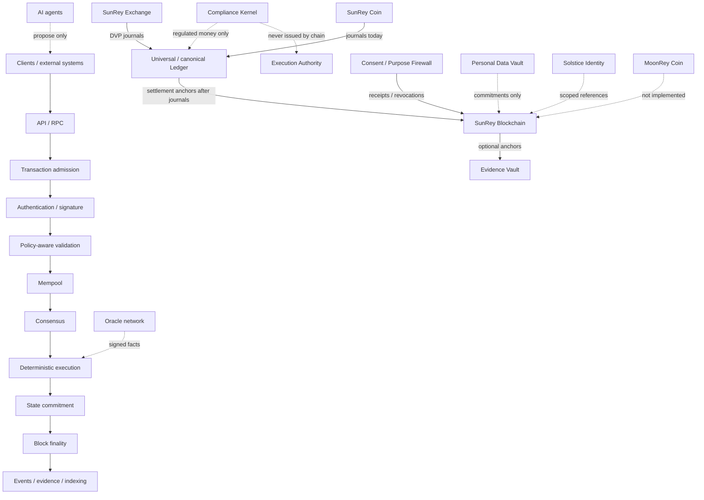

# Chunk 31 — SunRey Blockchain production architecture freeze

This chunk is **architecture, contracts, and ADRs only**.

A production blockchain is **not implemented**.
Mainnet remains disabled.
No public ticker is assigned.
No live asset is activated.
`ENVIRONMENT` remains `simulation`.
Every existing `LIVE_*` flag remains `false`.

Machine-readable specification:
[`sunrey-blockchain-protocol.json`](./sunrey-blockchain-protocol.json).

---

## A. Baseline commit

Inspected from latest `origin/main` before this chunk:

| Field | Value |
| --- | --- |
| Commit | `1f5da9a5669a0cf2c32a2789508dd1659db194f1` |
| Subject | `feat(exchange): Chunk 30R custody, Travel Rule, listing, and surveillance (#58)` |
| Tree | clean, architecture-consistent simulation |

Historical stop documents were not treated as current truth.

---

## B. Current relevant implemented systems

| System | Owner | What exists | What does not |
| --- | --- | --- | --- |
| SunRey Chain | `packages/sunrey-chain` | Simulation trust layer: `ChainWriteIntent`, default-deny gate, scoped commitments, `SimulationChainAdapter`, async finality, reorg observation without ledger rewrite | Consensus, P2P, production storage, native execution, mainnet |
| SunRey Coin | `packages/sunrey-coin` | Kernel-gated issue/transfer/burn on the canonical Ledger; ticker `NOT_ASSIGNED` | Public ticker; chain-native units |
| MoonRey Coin | none | Named in this architecture only | Package, ticker, supply, journals |
| Canonical Ledger | `packages/ledger` | Authority-required journals | Chain posting path |
| Compliance Kernel | `packages/kernel` | Six proofs, Execution Authority | Chain-issued authority |
| Evidence Vault | `packages/evidence` | Hash-chained decisions | Chain as vault replacement |
| Security | `packages/security` | `KeyProvider`, `CHAIN_OPERATION_SIGNING` HMAC | Consensus signatures, PQC |
| Identity | `packages/identity` | ActorContext, KYC metadata | On-chain identity authority |
| Consent / Purpose Firewall | `packages/consent` | Append-only consent, default DENY | Chain as consent DB |
| Personal Data Vault | `packages/personal-data-vault` | Encrypted subject store | On-chain raw data |
| SunRey Exchange | `packages/sunrey-exchange` | Simulation matching and DVP journals | On-chain CLOB |
| Custody / surveillance | `packages/custody`, `packages/market-surveillance` | Simulation control plane | Live VASP / licensed surveillance |
| Persistence | `packages/persistence` | PostgreSQL behind application ports | Production block store |

ADR-0015 remains `PROPOSED` for the simulation foundation. Chunk 31
does not change that historical status. Production *direction* is
recorded in ADR-0016 through ADR-0033 as
`ACCEPTED_FOR_ENGINEERING`.

---

## C. Decisions made

1. One canonical owner: `packages/sunrey-chain` (modular monolith).
2. Memory-safe node-critical language direction: Rust. Current
   TypeScript simulation remains the implemented facade.
3. Tendermint-family BFT over a bonded validator set; consensus
   **interface** frozen; algorithm **not** implemented.
4. Native-module-first execution; no EVM; later constrained WASM
   cannot bypass Kernel, ledger, or asset safety.
5. Versioned transaction/block envelopes; canonical binary encoding.
6. Append-only blocks + authenticated `app_hash` state.
7. Authenticated, permissioned-capable P2P; RPC is untrusted.
8. Cryptographic agility via algorithm IDs; no homegrown crypto.
9. PQC migration shape is hybrid + IDs; no quantum-secure claim.
10. SunRey Coin stays ledger-authoritative today. MoonRey is
    distinct, unimplemented, ticker `NOT_ASSIGNED`.
11. Oracles are signed facts, not official prices.
12. Human-gated, height-activated upgrades. AI cannot activate
    mainnet or change governance.
13. Interoperability off. No wrapped fiat.
14. Commitments on-chain; raw data in PDV; consent in Consent Ledger.
15. Authority matrix is explicit (ADR-0031).
16. Evidence Vault remains authoritative; chain stores optional
    anchors.
17. Explicit `network_id` / `chain_id` / `genesis_hash`. Simulation
    IDs are not production.

---

## D. Decisions deferred

- Library CometBFT versus a constrained Rust Tendermint-class engine.
- Exact timeouts, `n`, and block compute limits.
- Ed25519 versus secp256k1 for the first node.
- Authenticated tree (IAVL / JMT / other).
- Whether any SunRey Coin units ever migrate on-chain.
- MoonRey economic role and future package-versus-module owner.
- PQC algorithm selection (Chunk 33).
- Full threat model expansion (Chunk 33).
- Interop client design.
- WASM interpreter details.

---

## E. ADRs created

| ADR | Topic | Engineering status |
| --- | --- | --- |
| [0016](./adr/ADR-0016-sunrey-blockchain-node-architecture.md) | Node architecture | ACCEPTED_FOR_ENGINEERING |
| [0017](./adr/ADR-0017-sunrey-blockchain-consensus-architecture.md) | Consensus | ACCEPTED_FOR_ENGINEERING |
| [0018](./adr/ADR-0018-sunrey-blockchain-validator-architecture.md) | Validators | ACCEPTED_FOR_ENGINEERING |
| [0019](./adr/ADR-0019-sunrey-blockchain-state-machine-architecture.md) | State machine | ACCEPTED_FOR_ENGINEERING |
| [0020](./adr/ADR-0020-sunrey-blockchain-execution-runtime.md) | Execution runtime | ACCEPTED_FOR_ENGINEERING |
| [0021](./adr/ADR-0021-sunrey-blockchain-transaction-block-encoding.md) | Tx / block encoding | ACCEPTED_FOR_ENGINEERING |
| [0022](./adr/ADR-0022-sunrey-blockchain-storage-model.md) | Storage | ACCEPTED_FOR_ENGINEERING |
| [0023](./adr/ADR-0023-sunrey-blockchain-networking-p2p.md) | Networking / P2P | ACCEPTED_FOR_ENGINEERING |
| [0024](./adr/ADR-0024-sunrey-blockchain-cryptographic-agility.md) | Crypto agility | ACCEPTED_FOR_ENGINEERING |
| [0025](./adr/ADR-0025-sunrey-blockchain-post-quantum-migration.md) | PQC migration shape | ACCEPTED_FOR_ENGINEERING |
| [0026](./adr/ADR-0026-sunrey-blockchain-native-asset-model.md) | Native assets | ACCEPTED_FOR_ENGINEERING |
| [0027](./adr/ADR-0027-sunrey-blockchain-oracle-architecture.md) | Oracles | ACCEPTED_FOR_ENGINEERING |
| [0028](./adr/ADR-0028-sunrey-blockchain-governance-upgrades.md) | Governance / upgrades | ACCEPTED_FOR_ENGINEERING |
| [0029](./adr/ADR-0029-sunrey-blockchain-interoperability.md) | Interoperability | ACCEPTED_FOR_ENGINEERING |
| [0030](./adr/ADR-0030-sunrey-blockchain-privacy-confidentiality.md) | Privacy | ACCEPTED_FOR_ENGINEERING |
| [0031](./adr/ADR-0031-canonical-ledger-vs-blockchain-authority.md) | Ledger vs chain | ACCEPTED_FOR_ENGINEERING |
| [0032](./adr/ADR-0032-sunrey-blockchain-evidence-anchoring.md) | Evidence anchoring | ACCEPTED_FOR_ENGINEERING |
| [0033](./adr/ADR-0033-sunrey-blockchain-identity-genesis.md) | Chain identity / genesis | ACCEPTED_FOR_ENGINEERING |

Legal confidence on every new ADR: `RESEARCH_REQUIRED`. None is
`CONFIRMED_BY_COUNSEL`.

---

## F. Authority matrix

See [`sunrey-chain-authority-matrix.md`](./sunrey-chain-authority-matrix.md).

---

## G. Trust boundaries (preliminary)

Chunk 33 expands this into the full threat / PQC architecture.

| Threat | Preliminary control |
| --- | --- |
| Byzantine validators | BFT `f < n/3`; evidence; bonding (not implemented) |
| Malicious peers | Authenticated P2P; allow-list capable; rate limits |
| Compromised RPC clients | RPC outside TCB; no voting keys on RPC |
| Stolen validator keys | Key separation; epoch rotation; equivocation evidence |
| Compromised hot wallets | Application custody + Kernel; not consensus keys |
| Malicious oracle providers | Quorum; fail-closed; facts are not money |
| Malicious AI agents | Propose only; no EA; no mainnet; no validator vote |
| Compromised internal operators | Dual control on genesis/upgrades; no admin rewrite |
| Replay attacks | `network_id` + `chain_id` domain separation |
| Double spends | Deterministic BFT + native-module conservation |
| Transaction censorship | Distinct gossip path; later diversity metrics |
| Network partitions | Safety over liveness |
| State corruption | `app_hash` replay |
| Supply-chain compromise | Reproducible builds; pinned providers |
| Malicious protocol upgrades | Height activation; human gate; hash pin |
| Future quantum threats | Hybrid migration shape; no quantum-secure claim |

---

## H. Security considerations

- Minimal TCB: consensus, execution, state commitment, crypto
  providers, genesis verification.
- No homegrown crypto.
- Simulation HMAC `CHAIN_OPERATION_SIGNING` is not a consensus
  signature.
- Chain must not import `Ledger.postJournal` or `AuthorityIssuer`.
- Competing blockchain packages are forbidden.

---

## I. Compliance considerations

Nothing in Chunk 31 is legal approval, a VASP registration, a
securities classification, Travel Rule compliance, or counsel
confirmation. Policy and coin legal statuses remain
`RESEARCH_REQUIRED`. Legal statuses cannot auto-promote.

---

## J. Architecture diagram

### ASCII — node pipeline

```text
CLIENTS / EXTERNAL SYSTEMS
  (humans, enterprises, agents*, robots, devices, apps)
        |
        v
API / RPC                         (untrusted)
        |
        v
TRANSACTION ADMISSION
        |
        v
AUTHENTICATION / SIGNATURE        (algorithm IDs)
        |
        v
POLICY-AWARE VALIDATION           (protocol predicates;
        |                          Kernel remains off-chain
        |                          for regulated money)
        v
MEMPOOL
        |
        v
CONSENSUS                         (Tendermint-family interface;
        |                          not implemented)
        v
DETERMINISTIC EXECUTION           (native modules; no EVM)
        |
        v
STATE COMMITMENT                  (app_hash)
        |
        v
BLOCK FINALITY                    (deterministic on commit)
        |
        v
EVENTS / EVIDENCE / INDEXING      (projections; vault anchors)
```

`* agents may propose; they must not execute or activate mainnet.`

### ASCII — relationship to existing systems

```text
                    +---------------------------+
                    |   Compliance Kernel       |
                    |   Execution Authority     |
                    +-------------+-------------+
                                  |
                                  | regulated money
                                  v
+-------------+   journals   +----+----------------+
| Accounts /  | <----------> | Canonical Ledger    |
| Payments /  |              | (fiat, Coin today)  |
| Exchange /  |              +----------+---------+
| Investments |                         |
+------+------+                         | settlement
       |                                | anchors (after)
       |                         +------v-----------+
       |                         | SunRey Blockchain|
       |                         | (future node;    |
       |                         |  sim layer today)|
       |                         +--+-----+-----+---+
       |                            |     |     |
       v                            |     |     |
+------+--------+   receipts        |     |     |
| Consent Ledger|<------------------+     |     |
+---------------+                         |     |
+---------------+   commitments           |     |
| Identity      |<------------------------+     |
+---------------+                               |
+---------------+   no raw payloads             |
| Personal Data |<------------------------------+
| Vault         |
+---------------+
+---------------+   decision hashes
| Evidence Vault|<-- anchors (vault remains SoT)
+---------------+
+---------------+
| Oracle facts  |  (future; not money)
+---------------+
```

### Mermaid — pipeline and companions



---

## K. Future node module structure

Internal modules of `packages/sunrey-chain` — **do not create these
directories in Chunk 31** and **do not create five new packages**:

```text
api-rpc/
transaction-admission/
authentication/
policy-aware-validation/
mempool/
consensus/
execution/
state-commitment/
storage/
p2p/
crypto-provider/
ops-observability/
```

Capability ids `blockchain-node`,
`blockchain-network`, `blockchain-consensus`, and
`blockchain-runtime` remain **PLANNED internal modules**
owned by `packages/sunrey-chain`. `blockchain-protocol` is
`IMPLEMENTED` by Chunk 32R (envelope, codec, objects, vectors)
without a production node.

---

## L. Tests

- `tests/chunk-31-exit-criterion.test.ts`
- `packages/sunrey-chain/src/architecture-guards.test.ts` (extended)
- `tools/architectural-linter` constitution case for CHUNK-31
- `tools/architectural-linter/src/sunrey-blockchain-architecture-guards.ts`

They verify: one canonical architecture, no competing packages,
tickers unassigned, MoonRey distinct, ledger boundary explicit,
chain is not a second fiat ledger, AI cannot activate production,
legal statuses cannot auto-promote, mainnet flags disabled, ADR
pack indexed, manifest and constitution valid.

---

## M. Exact CI results

Recorded on `cursor/sunrey-blockchain-architecture-22c4` after
`npm install` (local `tsc` / `pg` were absent until then).

| Command | Result |
| --- | --- |
| `npm run lint:architecture` | `architectural-linter: ok` |
| `npm test` | 494 tests, 0 fail |
| `npm run typecheck` | `tsc --noEmit` exit 0 |
| `npm run ci` | `CI pipeline: ok` |

`npm run ci` stage transcript:

```text
==> architectural invariants
Architectural invariants: ok
Extraction dry-run: ok (32 package(s))
architectural-linter: ok
==> deployment posture
Deployment posture: ok (simulation-only, live flags off)
==> kernel gating
Kernel gating CI passed (71 registered paths, all Kernel-authorized).
==> tests
ℹ tests 494
ℹ pass 494
ℹ fail 0
==> end-to-end demo
(all registered demos ok, including sunrey-chain / coin / exchange / custody)
==> typecheck
tsc --noEmit -p tsconfig.json
==> secret scan
Secret scan: ok
Secret scan self-test: ok
CI pipeline: ok
```

---

## N. Limitations

- No production node, consensus, P2P, or storage.
- No native chain asset runtime.
- No MoonRey implementation.
- No PQC implementation.
- No interop.
- Build-status historical sections remain messy; this chunk does
  not rewrite unrelated inventory prose except to add Chunk 31.

---

## O. Production blockchain is not implemented

After Chunk 31 the repository still has a **simulation** trust
layer. It does not have a sovereign production blockchain. Do not
claim production-ready, quantum-secure, decentralized, regulator
approved, legally compliant, or mainnet ready.

---

## P. Recommendation for Chunk 32

Implement the **node skeleton and frozen interfaces** inside
`packages/sunrey-chain` (or a clearly internal Rust workspace that
does not create a competing package): `ConsensusEngine` trait,
versioned envelope types, genesis hash, and deterministic
`apply(pre_state, block)` with fixtures.

Do **not** implement production consensus, do **not** enable
mainnet, do **not** assign tickers, do **not** migrate SunRey Coin
off the Ledger, and do **not** start Chunk 33 PQC work except as
algorithm-ID hooks already specified here.
