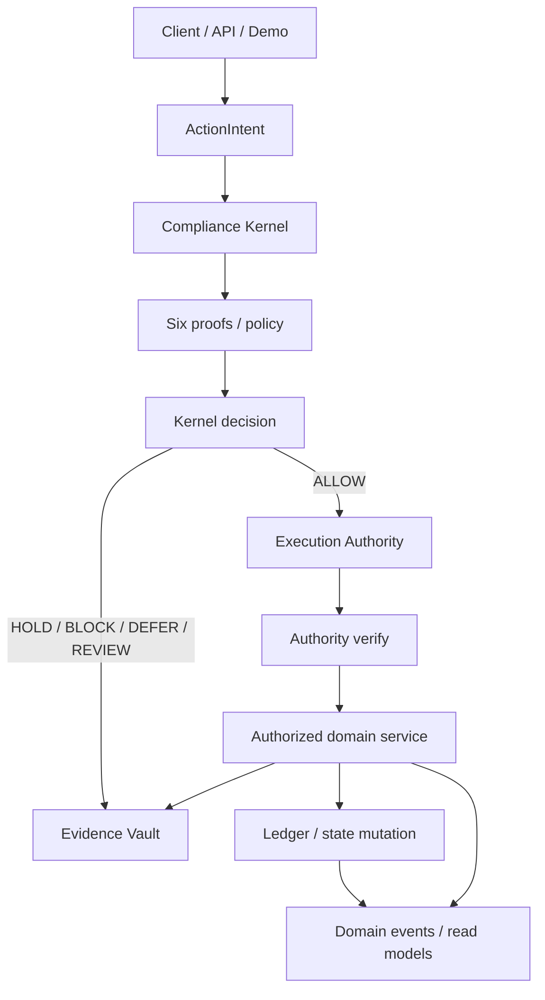
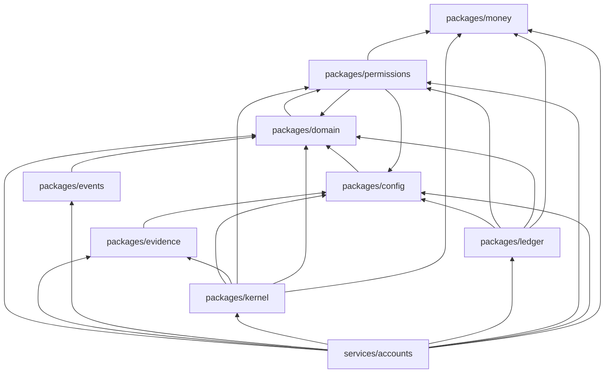

# Solstice canonical architecture constitution

This document is the durable architecture specification for the
consolidated tree on `main`. It describes what the repository actually
contains, which package owns each protected component, and which
dependency directions are legal.

Implementation inventory lives in [`docs/build-status.md`](../build-status.md).
Machine-enforceable ownership, dependencies, and reservations live in
[`manifest.json`](./manifest.json). This file must not be treated as a
second build-status document.

Older and currently open feature PRs are **not** automatically canonical.
See [historical implementation guidance](./historical-implementation.md).

---

## A. Canonical component registry

Each protected component has exactly one authoritative path. There must
never be two implementations of these systems.

| Component | Canonical owner | Authoritative path | Status |
| --- | --- | --- | --- |
| Money | `packages/money` | `packages/money/src/money.ts` | IMPLEMENTED |
| Currencies | `packages/domain` | `packages/domain/src/currency.ts` | IMPLEMENTED |
| Customer domain | `packages/domain` | `packages/domain/src/customer.ts` | IMPLEMENTED |
| Account domain | `packages/domain` | `packages/domain/src/account.ts` | IMPLEMENTED |
| Account classes | `packages/domain` | `packages/domain/src/account-class.ts` | IMPLEMENTED |
| Products | `packages/domain` | `packages/domain/src/product.ts` | IMPLEMENTED |
| Legal entities | `packages/domain` | `packages/domain/src/legal-entity.ts` | IMPLEMENTED |
| ActionIntent | `packages/permissions` | `packages/permissions/src/action-intent.ts` | IMPLEMENTED |
| Action types | `packages/permissions` | `packages/permissions/src/action-types.ts` | IMPLEMENTED |
| Structural intent validation | `packages/permissions` | `packages/permissions/src/structural.ts` | IMPLEMENTED |
| Execution Authority | `packages/permissions` | `packages/permissions/src/execution-authority.ts` | IMPLEMENTED |
| Compliance Kernel | `packages/kernel` | `packages/kernel/src/kernel.ts` | IMPLEMENTED |
| Proof evaluation | `packages/kernel` | `packages/kernel/src/proofs.ts` | IMPLEMENTED |
| Evidence Vault | `packages/evidence` | `packages/evidence/src/vault.ts` | IMPLEMENTED |
| Domain events | `packages/events` | `packages/events/src/events.ts` | IMPLEMENTED |
| Ledger | `packages/ledger` | `packages/ledger/src/journal.ts` | IMPLEMENTED |
| Journals / postings | `packages/ledger` | `packages/ledger/src/journal.ts` | IMPLEMENTED |
| Class bridges | `packages/ledger` | `packages/ledger/src/types.ts` | IMPLEMENTED |
| Account opening | `services/accounts` | `services/accounts/src/open-account.ts` | IMPLEMENTED |
| Money movement | `services/accounts` | `services/accounts/src/money-movement.ts` | IMPLEMENTED |
| Balance projections | `services/accounts` | `services/accounts/src/balances.ts` | IMPLEMENTED |
| Configuration | `packages/config` | `packages/config/src/flags.ts` | IMPLEMENTED |
| Architecture linting | `tools/architectural-linter` | `tools/architectural-linter/src/linter.ts` | IMPLEMENTED |
| PostgreSQL persistence adapter | `packages/persistence` | `packages/persistence/src/index.ts` | IMPLEMENTED |

Companion invariant scripts remain under `scripts/`. They are part of
the same architecture-linting system, not a second linter.

### Current workspace inventory

**Packages:** `money`, `domain`, `permissions`, `kernel`, `ledger`,
`evidence`, `events`, `config`, `persistence`.

**Services:** `accounts`.

**Applications:** none. `apps/` is reserved in the workspace glob and
does not exist. The Phase 1 demo is `packages/domain/src/demo.ts`.

**Tools:** `architectural-linter`.

**Shared libraries:** the packages listed above. There is no separate
`packages/contracts` or `packages/platform` on this tree.

### Action types

The only action types on this tree are declared in
`packages/permissions/src/action-types.ts`:

- `OPEN_ACCOUNT`
- `POST_DEPOSIT`
- `POST_WITHDRAWAL`
- `INTERNAL_TRANSFER`

New action types add a payload that uses the `ActionIntent` envelope.
They do not invent a parallel envelope.

### Locations that may change financial or regulated customer state

| Path | What it mutates | Gate |
| --- | --- | --- |
| `packages/ledger/src/journal.ts` `Ledger.postJournal` | Journals / postings | Verified Execution Authority |
| `packages/domain/src/account.ts` `openAccount` | Account construction | Verified Execution Authority |
| `services/accounts/src/open-account.ts` `AccountsService.open` | Account store + ledger register | Kernel `submit` then verified authority |
| `services/accounts/src/money-movement.ts` `deposit` / `withdraw` / `transfer` | Ledger journals | Kernel `submit` then `Ledger.postJournal` |

In-memory catalog stores (`CustomerStore`, `AccountStore`,
`LegalEntityStore`, `ProductStore`) hold already-authorized values.
They are not a second ledger.

`createProspect` and `transitionCustomerStatus` are pure calculations.
They do not write a store by themselves.

### Locations that may post a ledger journal

Only `Ledger.postJournal` in `packages/ledger/src/journal.ts`.
The only production caller is `services/accounts/src/money-movement.ts`.

### Locations that may issue or verify Execution Authority

- **Issue:** `AuthorityIssuer.issue` is Kernel-private. The only
  production caller is `packages/kernel/src/kernel.ts`.
- **Verify:** `AuthorityIssuer.verify` in
  `packages/permissions/src/execution-authority.ts`. Callers are the
  Kernel-gated accounts service and `Ledger.postJournal`.

### Evidence Vault

One implementation: `packages/evidence/src/vault.ts` (`EvidenceVault`).
Every Kernel decision seals a record. Refusals still seal.

### Money

One implementation: `packages/money/src/money.ts` (`Money`).
Amounts are `bigint` minor units. Floating-point construction is rejected.

### Account classes

One taxonomy: `packages/domain/src/account-class.ts`.

`DEMAND_DEPOSIT`, `SAVINGS_DEPOSIT`, `TIME_DEPOSIT`, `BROKERAGE_CASH`,
`SECURITIES`, `RETIREMENT`, `DIGITAL_ASSET_CUSTODY`,
`STABLECOIN_CUSTODY`, `REWARDS`, `PENDING_SETTLEMENT`, `CLASS_BRIDGE`,
`SIMULATED_FUNDING_SOURCE`, `CORPORATE_OPERATING`.

### Existing CI architectural rules

These checks already exist and remain intact:

1. Python architectural invariants (`scripts/lint-architectural-invariants.py`)
2. Extraction dry-run (`scripts/extraction-dryrun.py`)
3. TypeScript architectural linter (`tools/architectural-linter`)
4. Deployment posture (`scripts/check-deployment-posture.py`)
5. Kernel gating (`scripts/check-kernel-gating.mjs`)
6. Tests, including the Phase 1 exit-criterion test
7. End-to-end demo
8. Typecheck
9. Secret scan

This constitution extends (3). It does not replace (1)–(9).

### ADRs

See the [ADR index](./adr/README.md). ADR-0006, both ADR-0007 files, and
ADR-0008 are **PROPOSED**. None is `CONFIRMED_BY_COUNSEL`.

### LIVE_* flags

Canonical source: `packages/config/src/flags.ts`.

`ENVIRONMENT=simulation`. `SIMULATION_MODE=true`. Every `LIVE_*` and
`REAL_MONEY_ENABLED` flag is `false`.

### External integration abstractions

None are implemented. There is no bank adapter, FX provider port, KYC
provider, payment-rail adapter, or IdP adapter on this tree. The clock
is injectable. That is the only substitution seam.

### Persistence

PostgreSQL is the canonical durable adapter behind the existing ports.
It is not a second Ledger or a second Evidence Vault. ADR-0008 remains
historically PROPOSED; Addendum A records engineering acceptance of
Option A. That is not counsel review.

In-memory maps remain the default for unit tests:

- `Ledger` journals and idempotency map
- `EvidenceVault` records
- `DomainEventLog` events
- `AccountRegister`
- `GrowthAttributionLedger` entries (principal movements must not write)
- `CustomerStore`, `AccountStore`, `LegalEntityStore`, `ProductStore`
- `AccountsService` intent-id idempotency map

Durable rows live in three bounded databases (`solstice_customer`,
`solstice_ledger`, `solstice_evidence`). Restart hydrates the in-memory
objects from those rows. Read models (`balanceOfAccount`,
`projectCustomerPosition`) stay derived from journals and are not
authoritative financial state.

---

## B. System boundaries

Allowed high-level flow for a consequential financial action:

```text
Client / API / Demo
    ↓
ActionIntent
    ↓
Compliance Kernel
    ↓
Proofs / Policy
    ↓
Kernel Decision
    ↓
Execution Authority when permitted
    ↓
Authorized Domain Service
    ↓
Ledger / State Mutation
    ↓
Evidence Vault
    ↓
Domain Events / Read Models
```



No service may bypass this pattern for a consequential financial action.

Rules that follow from the flow:

- An `ActionIntent` is the only envelope that enters the Kernel.
- Structural validation is not authorization.
- HOLD, BLOCK, DEFER, and REQUIRE_MANUAL_REVIEW post nothing and still
  seal evidence. The Kernel statuses actually implemented today are
  `ALLOW`, `REQUIRE_MANUAL_REVIEW`, `DEFER`, and `BLOCK`.
- On ALLOW the Kernel may issue a signed Execution Authority. Callers
  verify that authority before `openAccount` or `Ledger.postJournal`.
- The Kernel does not open accounts or post journals.
- Read models must not become the system of record.
- The Evidence Vault should prefer hashes and references over raw
  sensitive payloads. Today's in-memory vault stores a canonicalized
  decision payload; future persistence must not put raw KYC documents
  or secrets in the chain.

---

## C. Dependency direction

### Allowed package dependencies

These edges match the imports that exist on this tree. Future packages
must be added to `manifest.json` before they appear on disk.

| Package / service | May depend on |
| --- | --- |
| `packages/money` | nothing |
| `packages/config` | `packages/domain` (clock / `UtcInstant` exception) |
| `packages/domain` | `packages/permissions` (`openAccount` seal exception) |
| `packages/events` | `packages/domain` |
| `packages/evidence` | `packages/config` |
| `packages/permissions` | `packages/domain`, `packages/money`, `packages/config` |
| `packages/kernel` | `packages/config`, `packages/evidence`, `packages/permissions`, `packages/domain`, `packages/money` |
| `packages/ledger` | `packages/config`, `packages/permissions`, `packages/domain`, `packages/money` |
| `packages/persistence` | `packages/domain`, `packages/evidence`, `packages/events`, `packages/ledger`, `packages/permissions`, `packages/money` |
| `services/accounts` | the packages above, including `packages/persistence` |
| `tools/architectural-linter` | nothing |

### Hard direction rules

- Low-level Money / domain packages must not depend on application
  services. `packages/domain/src/demo.ts` is a runner, not library
  surface, and is the only documented exception that imports
  `services/accounts`.
- Ledger must not depend on UI or API layers. There is no UI/API layer
  on this tree.
- Domain objects must not call external providers. There are no
  provider adapters on this tree. Future adapters sit behind ports.
- Agents added later must not import Execution Authority issuance,
  must not post journals, and must not depend on `packages/platform`
  from `packages/agent`.
- Read models are projections. They are not authoritative financial
  state.
- Library packages must not import services.
- A new workspace package that is absent from the manifest is illegal
  until it is registered.

### Known cycles

The current tree has two grandfathered cycles:

1. `packages/domain` ↔ `packages/permissions` because `openAccount`
   requires a `VerifiedExecutionAuthority`.
2. `packages/domain` → `packages/permissions` → `packages/config` →
   `packages/domain` because the clock uses `UtcInstant`.

These cycles are listed in `manifest.json` as `allowedCycles`. New
cycles between protected packages or planned bounded contexts are
illegal. Do not expand the existing cycles.



Current convention: packages import each other with relative `src/`
paths. That is the existing style. A later chunk may introduce
`@solstice/*` package dependencies. Until then, "bypass public
interface" means importing a forbidden alias or a package that is not
an allowed dependency — not "must use `index.ts` only."

---

## D. Bounded context roadmap

The following contexts are **reserved**. They are not implemented on
this tree. Later agents must not invent a second owner for a context
that is already reserved, and must not reimplement an IMPLEMENTED
protected dependency because a later phase is absent.

| Context | Status | Reserved paths |
| --- | --- | --- |
| IDENTITY | PLANNED | `packages/identity`, `services/identity` |
| COMPLIANCE | PARTIAL | `packages/kernel`, `packages/permissions`, `packages/evidence` |
| BANKING | PARTIAL | `packages/domain`, `packages/ledger`, `services/accounts` |
| PAYMENTS | PLANNED | `packages/payments` |
| FX | PLANNED | `packages/payments` |
| CARDS | PLANNED | `packages/cards`, `services/cards` |
| TREASURY | PLANNED | `packages/treasury`, `services/treasury` |
| PERSONAL ECONOMIC GRAPH | PLANNED | `packages/personal-economic-graph` |
| PERSONAL ECONOMY AGENT | PLANNED | `packages/agent` |
| GROWTH ORCHESTRATOR | PLANNED | `packages/platform` |
| PERSONAL ECONOMIC VALUE ENGINE | PLANNED | `packages/platform` |
| REGULATORY DIGITAL TWIN | PLANNED | `packages/regulatory-twin` |
| INVESTMENTS | PLANNED | `packages/investments`, `services/investments` |
| RISK | PLANNED | `packages/risk` |
| MODEL REGISTRY | PLANNED | `packages/model-registry` |
| AGENTIC CAPITAL MESH | PLANNED | `packages/agentic-capital-mesh` |
| PERSONAL DATA VAULT | PLANNED | `packages/personal-data-vault` |
| CONSENT | PLANNED | `packages/consent` |
| CLEAN ROOM | PLANNED | `packages/clean-room` |
| PYR | PLANNED | `packages/pyr`, `packages/pyramid` |
| PYRAMID | PLANNED | `packages/pyramid` |
| PYRAMID DATA EXCHANGE | PLANNED | `packages/pyramid-data-exchange` |
| PYRAMID EXCHANGE | PLANNED | `packages/pyramid-exchange` |
| MARKET SURVEILLANCE | PLANNED | `packages/market-surveillance` |
| API / INTEGRATION | PLANNED | `apps/api`, `services/api` |
| SOVEREIGN CELLS | PLANNED | `packages/cells` |

Do not implement these in this chunk. Creating a reserved path on disk
while the manifest still says `PLANNED` is a defect: update the
manifest to `PARTIAL` or `IMPLEMENTED` in the same change that adds
the first real owner, and keep the reserved path. Do not invent a
competing directory.

---

## Agent stop rule

If a task requires a **protected** capability that is not
`IMPLEMENTED` on `main`, the agent must **stop** rather than
reimplement that subsystem.

Details: [chunk dependencies](./chunk-dependencies.md).
