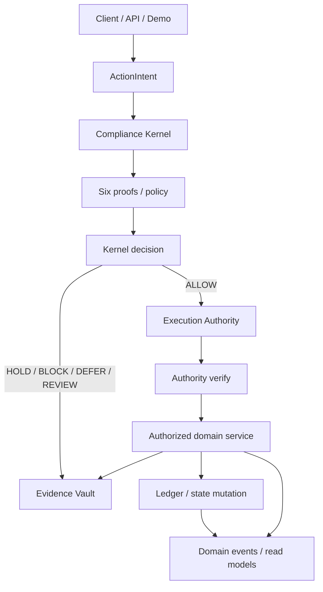

# Solstice canonical architecture constitution

This document is the durable architecture specification for the
consolidated tree on `main`. It describes what the repository actually
contains, which package owns each protected component, and which
dependency directions are legal.

Implementation inventory lives in [`docs/build-status.md`](../build-status.md).
Machine-enforceable ownership, dependencies, and reservations live in
[`manifest.json`](./manifest.json). This file must not be treated as a
second build-status document.

Older and currently open feature PRs are **not** automatically canonical.
See [historical implementation guidance](./historical-implementation.md).

---

## A. Canonical component registry

Each protected component has exactly one authoritative path. There must
never be two implementations of these systems.

| Component | Canonical owner | Authoritative path | Status |
| --- | --- | --- | --- |
| Money | `packages/money` | `packages/money/src/money.ts` | IMPLEMENTED |
| Currencies | `packages/domain` | `packages/domain/src/currency.ts` | IMPLEMENTED |
| Customer domain | `packages/domain` | `packages/domain/src/customer.ts` | IMPLEMENTED |
| Account domain | `packages/domain` | `packages/domain/src/account.ts` | IMPLEMENTED |
| Account classes | `packages/domain` | `packages/domain/src/account-class.ts` | IMPLEMENTED |
| Products | `packages/domain` | `packages/domain/src/product.ts` | IMPLEMENTED |
| Legal entities | `packages/domain` | `packages/domain/src/legal-entity.ts` | IMPLEMENTED |
| ActionIntent | `packages/permissions` | `packages/permissions/src/action-intent.ts` | IMPLEMENTED |
| Action types | `packages/permissions` | `packages/permissions/src/action-types.ts` | IMPLEMENTED |
| Structural intent validation | `packages/permissions` | `packages/permissions/src/structural.ts` | IMPLEMENTED |
| Execution Authority | `packages/permissions` | `packages/permissions/src/execution-authority.ts` | IMPLEMENTED |
| Compliance Kernel | `packages/kernel` | `packages/kernel/src/kernel.ts` | IMPLEMENTED |
| Proof evaluation | `packages/kernel` | `packages/kernel/src/proofs.ts` | IMPLEMENTED |
| Policy engine | `packages/kernel` | `packages/kernel/src/policy/engine.ts` | IMPLEMENTED |
| Evidence Vault | `packages/evidence` | `packages/evidence/src/vault.ts` | IMPLEMENTED |
| Domain events | `packages/events` | `packages/events/src/events.ts` | IMPLEMENTED |
| Event fabric (outbox / inbox / replay) | `packages/events` | `packages/events/src/events.ts` | IMPLEMENTED |
| Ledger | `packages/ledger` | `packages/ledger/src/journal.ts` | IMPLEMENTED |
| Journals / postings | `packages/ledger` | `packages/ledger/src/journal.ts` | IMPLEMENTED |
| Class bridges | `packages/ledger` | `packages/ledger/src/types.ts` | IMPLEMENTED |
| Account opening | `services/accounts` | `services/accounts/src/open-account.ts` | IMPLEMENTED |
| Money movement | `services/accounts` | `services/accounts/src/money-movement.ts` | IMPLEMENTED |
| Balance projections | `services/accounts` | `services/accounts/src/balances.ts` | IMPLEMENTED |
| Configuration | `packages/config` | `packages/config/src/flags.ts` | IMPLEMENTED |
| Architecture linting | `tools/architectural-linter` | `tools/architectural-linter/src/linter.ts` | IMPLEMENTED |
| PostgreSQL persistence adapter | `packages/persistence` | `packages/persistence/src/index.ts` | IMPLEMENTED |
| Cryptographic infrastructure | `packages/security` | `packages/security/src/provider.ts` | IMPLEMENTED |
| Solstice Identity | `packages/identity` | `packages/identity/src/service.ts` | IMPLEMENTED |
| Compliance screening fabric | `packages/kernel` | `packages/kernel/src/compliance/fabric.ts` | IMPLEMENTED |
| Cross-border payments | `packages/payments` | `packages/payments/src/service.ts` | IMPLEMENTED |
| FX quote engine | `packages/payments` | `packages/payments/src/fx-quote.ts` | IMPLEMENTED |
| Bank rail adapter framework | `packages/payments` | `packages/payments/src/rail-port.ts` | IMPLEMENTED |
| Card platform | `packages/cards` | `packages/cards/src/service.ts` | IMPLEMENTED |
| Personal Economic Graph | `packages/personal-economic-graph` | `packages/personal-economic-graph/src/service.ts` | IMPLEMENTED |
| Personal Economy Agent | `packages/agent` | `packages/agent/src/service.ts` | IMPLEMENTED |
| Growth Orchestrator | `packages/platform` | `packages/platform/src/service.ts` | IMPLEMENTED |
| Personal Economic Value Engine | `packages/platform` | `packages/platform/src/value/service.ts` | IMPLEMENTED |
| Treasury | `packages/treasury` | `packages/treasury/src/service.ts` | IMPLEMENTED |
| Investments | `packages/investments` | `packages/investments/src/service.ts` | IMPLEMENTED |
| Regulatory Digital Twin | `packages/regulatory-twin` | `packages/regulatory-twin/src/service.ts` | IMPLEMENTED |
| Investment Risk Engine | `packages/risk` | `packages/risk/src/engine.ts` | IMPLEMENTED |
| Model Registry | `packages/model-registry` | `packages/model-registry/src/registry.ts` | IMPLEMENTED |
| Agentic Capital Mesh | `packages/agentic-capital-mesh` | `packages/agentic-capital-mesh/src/service.ts` | IMPLEMENTED |
| Strategy Lab | `packages/strategy-lab` | `packages/strategy-lab/src/service.ts` | IMPLEMENTED |
| Personal Data Vault | `packages/personal-data-vault` | `packages/personal-data-vault/src/service.ts` | IMPLEMENTED |
| Consent Ledger / Purpose Firewall | `packages/consent` | `packages/consent/src/service.ts` | IMPLEMENTED |
| Privacy Clean Room | `packages/clean-room` | `packages/clean-room/src/service.ts` | IMPLEMENTED |

Companion invariant scripts remain under `scripts/`. They are part of
the same architecture-linting system, not a second linter.

### Current workspace inventory

**Packages:** `money`, `domain`, `permissions`, `security`, `identity`,
`kernel`, `ledger`, `evidence`, `events`, `config`, `persistence`,
`payments`, `cards`, `personal-economic-graph`, `agent`, `platform`,
`treasury`, `investments`, `regulatory-twin`, `risk`, `model-registry`,
`agentic-capital-mesh`, `strategy-lab`, `personal-data-vault`,
`consent`, `clean-room`.

**Services:** `accounts`, `identity`, `compliance`, `cards`, `economic-graph`,
`treasury`, `investments`, `strategy-lab`.

**Applications:** none. `apps/` is reserved in the workspace glob and
does not exist. The Phase 1 demo is `packages/domain/src/demo.ts`.

**Tools:** `architectural-linter`.

**Shared libraries:** the packages listed above. There is no separate
`packages/contracts` on this tree. `packages/platform` is the canonical
Growth Orchestrator owner. The Personal Economic Value Engine is
implemented in `packages/platform/src/value` on that same reserved path.
`packages/regulatory-twin` is the canonical Regulatory Digital Twin.
`packages/investments` is the canonical investment account and paper
portfolio owner. `packages/risk` is the canonical investment Risk
Engine. `packages/model-registry` is the canonical Model Registry.
`packages/agentic-capital-mesh` is the canonical Agentic Capital Mesh.
Strategy Lab is `PARTIAL` at `packages/strategy-lab` and
`services/strategy-lab` (no LIVE stage). Personal Data Vault is
`IMPLEMENTED` at `packages/personal-data-vault`. Consent is
`IMPLEMENTED` at `packages/consent`. Privacy Clean Room is
`IMPLEMENTED` at `packages/clean-room`. SunRey Coin is `IMPLEMENTED`
at `packages/sunrey-coin`. SunRey Chain is `IMPLEMENTED` at
`packages/sunrey-chain`. SunRey Exchange remains reserved and
unimplemented.
Strategy Lab is implemented at the reserved owners:
`STRATEGY_LAB` is `PARTIAL` at `packages/strategy-lab` and
`services/strategy-lab` (no LIVE stage).

### Action types

The only action types on this tree are declared in
`packages/permissions/src/action-types.ts`:

- `OPEN_ACCOUNT`
- `POST_DEPOSIT`
- `POST_WITHDRAWAL`
- `INTERNAL_TRANSFER`
- `CREATE_BENEFICIARY`
- `CREATE_FX_QUOTE`
- `ACCEPT_FX_QUOTE`
- `INITIATE_PAYMENT`
- `CANCEL_PAYMENT`
- `ACCEPT_INBOUND_PAYMENT`
- `CREATE_HOLD`
- `RELEASE_HOLD`
- `CAPTURE_HOLD`
- `CANCEL_HOLD`
- `POST_FEE`
- `POST_REVERSAL`
- `POST_INTEREST`
- `INITIATE_PENDING_SETTLEMENT`
- `SETTLE_PENDING`
- `RETURN_PENDING`
- `REQUEST_CARD`
- `ACTIVATE_CARD`
- `FREEZE_CARD`
- `UNFREEZE_CARD`
- `CLOSE_CARD`
- `UPDATE_CARD_CONTROLS`
- `AUTHORIZE_CARD_PURCHASE`
- `REVERSE_CARD_AUTHORIZATION`
- `CLEAR_CARD_TRANSACTION`
- `REFUND_CARD_TRANSACTION`
- `OPEN_CARD_DISPUTE`
- `DECIDE_CARD_DISPUTE`
- `ASSESS_CARD_FEE`
- `PROVISION_CARD_TO_WALLET`
- `SUSPEND_WALLET_TOKEN`
- `REGISTER_ACCEPTANCE_DEVICE`
- `CREATE_ACCEPTANCE_SESSION`
- `START_ACCEPTANCE_PAYMENT`
- `SETTLE_ACCEPTANCE_PAYMENT`
- `RESERVE_TREASURY_LIQUIDITY`
- `RELEASE_TREASURY_LIQUIDITY`
- `COMMIT_TREASURY_LIQUIDITY`
- `PROPOSE_TREASURY_REBALANCE`
- `EXECUTE_TREASURY_REBALANCE`
- `SET_TREASURY_KILL_SWITCH`
- `OPEN_INVESTMENT_ACCOUNT`
- `FUND_BROKERAGE_CASH`
- `WITHDRAW_BROKERAGE_CASH`
- `CREATE_PAPER_ORDER`
- `CANCEL_PAPER_ORDER`
- `SETTLE_INVESTMENT`
- `PROCESS_CORPORATE_ACTION`
- `ISSUE_SUNREY_COIN`
- `TRANSFER_SUNREY_COIN`
- `BURN_SUNREY_COIN`

New action types add a payload that uses the `ActionIntent` envelope.
They do not invent a parallel envelope.

### Locations that may change financial or regulated customer state

| Path | What it mutates | Gate |
| --- | --- | --- |
| `packages/ledger/src/journal.ts` `Ledger.postJournal` | Journals / postings | Verified Execution Authority |
| `packages/domain/src/account.ts` `openAccount` | Account construction | Verified Execution Authority |
| `services/accounts/src/open-account.ts` `AccountsService.open` | Account store + ledger register | Kernel `submit` then verified authority |
| `services/accounts/src/money-movement.ts` `deposit` / `withdraw` / `transfer` | Ledger journals | Kernel `submit` then `Ledger.postJournal` |
| `services/accounts/src/banking-operations.ts` holds / fees / reversals / interest / pending | Hold records and ledger journals | Kernel `submit` then verified authority; journals only via `Ledger.postJournal` |
| `packages/payments/src/service.ts` beneficiary / quote / payment / inbound mutators | Payment store + journals | Kernel `submit` then verified authority |
| `packages/payments/src/journals.ts` `postPaymentJournal` | Ledger journals | Verified Execution Authority then `Ledger.postJournal` |
| `packages/cards/src/service.ts` card lifecycle / processor callbacks | Card records, holds via banking, journals | Kernel `submit` then verified authority; holds only through `BankingOperationsService`; journals only via `Ledger.postJournal` |
| `packages/cards/src/wallet/service.ts` wallet provisioning / token lifecycle | Device-payment tokens, provider references | Kernel `submit` then verified authority; adapters cannot issue authority |
| `packages/cards/src/acceptance/service.ts` SoftPOS device / session / settlement | Acceptance devices, sessions, merchant payments, journals | Kernel `submit` then verified authority; journals only via `Ledger.postJournal` |
| `packages/cards/src/journals.ts` `postCardJournal` | Ledger journals | Verified Execution Authority then `Ledger.postJournal` |
| `packages/treasury/src/service.ts` reserve / release / commit / rebalance / kill switch | Treasury reservations, proposals, operational controls; rebalance journals | Kernel `submit` then verified authority; journals only via `Ledger.postJournal` |
| `packages/investments/src/service.ts` open / fund / withdraw / paper order / settle / corporate action | Investment profiles, paper orders, positions, lots; brokerage-cash journals | Kernel `submit` then verified authority; journals only via `Ledger.postJournal` |
| `packages/sunrey-coin/src/service.ts` `issue` / `transfer` / `burn` | SunRey Coin simulation journals on the canonical Ledger | Kernel `submit` then verified authority; journals only via `Ledger.postJournal` |

In-memory catalog stores (`CustomerStore`, `AccountStore`,
`LegalEntityStore`, `ProductStore`) hold already-authorized values.
They are not a second ledger.

`createProspect` and `transitionCustomerStatus` are pure calculations.
They do not write a store by themselves.

### Locations that may post a ledger journal

Only `Ledger.postJournal` in `packages/ledger/src/journal.ts`.
Production callers are `services/accounts/src/money-movement.ts` and
`services/accounts/src/banking-operations.ts` and
`packages/payments/src/journals.ts` and
`packages/cards/src/journals.ts` and
`packages/treasury/src/service.ts` (rebalance only) and
`packages/investments/src/journals.ts` and
`packages/sunrey-coin/src/service.ts`.

### Locations that may issue or verify Execution Authority

- **Issue:** `AuthorityIssuer.issue` is Kernel-private. The only
  production caller is `packages/kernel/src/kernel.ts`.
- **Verify:** `AuthorityIssuer.verify` in
  `packages/permissions/src/execution-authority.ts`. Callers are the
  Kernel-gated accounts service, the payments orchestrator,
  `packages/sunrey-coin`, and `Ledger.postJournal`.
- **Signing material:** `AuthorityIssuer` obtains HMAC-SHA256 through
  `packages/security` `KeyProvider`. Business services do not hold the
  raw signing secret.

### Evidence Vault

One implementation: `packages/evidence/src/vault.ts` (`EvidenceVault`).
Every Kernel decision seals a record. Refusals still seal.

### Money

One implementation: `packages/money/src/money.ts` (`Money`).
Amounts are `bigint` minor units. Floating-point construction is rejected.

### Account classes

One taxonomy: `packages/domain/src/account-class.ts`.

`DEMAND_DEPOSIT`, `SAVINGS_DEPOSIT`, `TIME_DEPOSIT`, `BROKERAGE_CASH`,
`SECURITIES`, `RETIREMENT`, `DIGITAL_ASSET_CUSTODY`,
`STABLECOIN_CUSTODY`, `REWARDS`, `PENDING_SETTLEMENT`, `CLASS_BRIDGE`,
`SIMULATED_FUNDING_SOURCE`, `CORPORATE_OPERATING`.

### Existing CI architectural rules

These checks already exist and remain intact:

1. Python architectural invariants (`scripts/lint-architectural-invariants.py`)
2. Extraction dry-run (`scripts/extraction-dryrun.py`)
3. TypeScript architectural linter (`tools/architectural-linter`)
4. Deployment posture (`scripts/check-deployment-posture.py`)
5. Kernel gating (`scripts/check-kernel-gating.mjs`)
6. Tests, including the Phase 1 exit-criterion test
7. End-to-end demo
8. Typecheck
9. Secret scan

This constitution extends (3). It does not replace (1)–(9).

### ADRs

See the [ADR index](./adr/README.md). ADR-0006, both ADR-0007 files, and
ADR-0008 remain **PROPOSED** for human acceptance. ADR-0006 Addendum A
records engineering implementation of Option C in simulation. None is
`CONFIRMED_BY_COUNSEL`.

### LIVE_* flags

Canonical source: `packages/config/src/flags.ts`.

`ENVIRONMENT=simulation`. `SIMULATION_MODE=true`. Every `LIVE_*` and
`REAL_MONEY_ENABLED` flag is `false`.

### External integration abstractions

Simulation-only ports exist for FX liquidity, beneficiary validation,
screening, settlement, and the canonical `RailAdapter` connectivity layer.
There is no live bank, FX, KYC, or payment-rail membership on this tree.
The clock is injectable.

### Persistence

PostgreSQL is the canonical durable adapter behind the existing ports.
It is not a second Ledger or a second Evidence Vault. ADR-0008 remains
historically PROPOSED; Addendum A records engineering acceptance of
Option A. That is not counsel review.

In-memory maps remain the default for unit tests:

- `Ledger` journals and idempotency map
- `EvidenceVault` records
- `DomainEventLog` events
- `AccountRegister`
- `GrowthAttributionLedger` entries (principal movements must not write;
  PEVE economic-benefit attribution lives in `packages/platform/src/value`)
- `CustomerStore`, `AccountStore`, `LegalEntityStore`, `ProductStore`
- `AccountsService` intent-id idempotency map

Durable rows live in four bounded databases (`solstice_customer`,
`solstice_ledger`, `solstice_evidence`, `solstice_security`). Restart
hydrates the in-memory objects from those rows. `solstice_security`
stores key metadata and service-identity references only — never
private key material. Read models (`balanceOfAccount`,
`projectCustomerPosition`) stay derived from journals and are not
authoritative financial state.

---

## B. System boundaries

Allowed high-level flow for a consequential financial action:

```text
Client / API / Demo
    ↓
ActionIntent
    ↓
Compliance Kernel
    ↓
Proofs / Policy
    ↓
Kernel Decision
    ↓
Execution Authority when permitted
    ↓
Authorized Domain Service
    ↓
Ledger / State Mutation
    ↓
Evidence Vault
    ↓
Domain Events / Read Models
```



No service may bypass this pattern for a consequential financial action.

SFF 2.0 intelligence layers sit **after** canonical financial systems and
**before** any future agent. They do not execute:

```text
Canonical Financial Systems
        ↓
Personal Economic Graph
        ↓
Personal Economy Agent (proposal-only)
        ↓
Growth Orchestrator (plans only; does not execute)
        ↓
Agentic Capital Mesh (proposal-only)
        ↓
Execution Control Plane
```

The Personal Economic Graph is a non-authoritative projection. If PEG
says a balance is X and the ledger says Y, the ledger wins. PEG cannot
post journals or issue Execution Authority.

Rules that follow from the flow:

- An `ActionIntent` is the only envelope that enters the Kernel.
- Structural validation is not authorization.
- HOLD, BLOCK, DEFER, and REQUIRE_MANUAL_REVIEW post nothing and still
  seal evidence. The Kernel statuses actually implemented today are
  `ALLOW`, `REQUIRE_MANUAL_REVIEW`, `DEFER`, and `BLOCK`.
- On ALLOW the Kernel may issue a signed Execution Authority. Callers
  verify that authority before `openAccount` or `Ledger.postJournal`.
- The Kernel does not open accounts or post journals.
- Read models must not become the system of record.
- The Evidence Vault should prefer hashes and references over raw
  sensitive payloads. Today's in-memory vault stores a canonicalized
  decision payload; future persistence must not put raw KYC documents
  or secrets in the chain.

---

## C. Dependency direction

### Allowed package dependencies

These edges match the imports that exist on this tree. Future packages
must be added to `manifest.json` before they appear on disk.

| Package / service | May depend on |
| --- | --- |
| `packages/money` | nothing |
| `packages/security` | nothing |
| `packages/config` | `packages/domain` (clock / `UtcInstant` exception) |
| `packages/domain` | `packages/permissions` (`openAccount` seal exception) |
| `packages/events` | `packages/domain`, `packages/permissions` (ActionIntent port for event-handler gating) |
| `packages/evidence` | `packages/config`, `packages/security` (SHA-256 helper only) |
| `packages/permissions` | `packages/domain`, `packages/money`, `packages/config`, `packages/security` |
| `packages/identity` | `packages/domain`, `packages/security`, `packages/permissions`, `packages/config`, `packages/evidence`, `packages/events` |
| `services/identity` | `packages/identity` |
| `packages/kernel` | `packages/config`, `packages/evidence`, `packages/permissions`, `packages/domain`, `packages/money`, `packages/identity`, `packages/security` |
| `services/compliance` | `packages/kernel` |
| `packages/ledger` | `packages/config`, `packages/permissions`, `packages/domain`, `packages/money` |
| `packages/persistence` | `packages/domain`, `packages/evidence`, `packages/events`, `packages/kernel`, `packages/ledger`, `packages/permissions`, `packages/money`, `packages/security`, `packages/identity`, `packages/personal-economic-graph`, `packages/platform`, `packages/treasury`, `packages/investments`, `packages/regulatory-twin`, `packages/risk`, `packages/model-registry`, `packages/agentic-capital-mesh`, `packages/strategy-lab`, `packages/personal-data-vault`, `packages/consent`, `packages/clean-room` |
| `packages/agent` | `packages/domain`, `packages/money`, `packages/identity`, `packages/config` |
| `packages/platform` | `packages/domain`, `packages/money`, `packages/identity`, `packages/events`, `packages/evidence`, `packages/config`, `packages/personal-economic-graph`, `packages/agent`, `packages/permissions`, `packages/security` |
| `services/accounts` | the packages above, including `packages/persistence`, `packages/security`, and `packages/identity` |
| `packages/payments` | `packages/domain`, `packages/money`, `packages/permissions`, `packages/config`, `packages/kernel`, `packages/ledger`, `packages/evidence`, `packages/events`, `packages/identity`, `packages/security` |
| `packages/cards` | `packages/domain`, `packages/money`, `packages/permissions`, `packages/config`, `packages/kernel`, `packages/ledger`, `packages/evidence`, `packages/events`, `packages/identity`, `packages/security` |
| `services/cards` | `packages/cards`, `services/accounts`, and the cards package dependencies needed to wire holds |
| `packages/personal-economic-graph` | `packages/domain`, `packages/money`, `packages/identity`, `packages/events`, `packages/config` |
| `services/economic-graph` | `packages/personal-economic-graph` |
| `packages/treasury` | `packages/domain`, `packages/money`, `packages/permissions`, `packages/config`, `packages/kernel`, `packages/ledger`, `packages/evidence`, `packages/events`, `packages/identity`, `packages/security`, `packages/payments` |
| `services/treasury` | `packages/treasury` |
| `packages/investments` | `packages/domain`, `packages/money`, `packages/permissions`, `packages/config`, `packages/kernel`, `packages/ledger`, `packages/evidence`, `packages/events`, `packages/identity`, `packages/security` |
| `services/investments` | `packages/investments` |
| `packages/risk` | `packages/domain`, `packages/money`, `packages/config`, `packages/evidence`, `packages/events`, `packages/model-registry`, `packages/permissions` |
| `packages/model-registry` | `packages/domain`, `packages/identity` |
| `packages/agentic-capital-mesh` | `packages/domain`, `packages/money`, `packages/identity`, `packages/config`, `packages/events`, `packages/evidence`, `packages/agent`, `packages/risk`, `packages/model-registry`, `packages/investments` |
| `packages/strategy-lab` | `packages/domain`, `packages/money`, `packages/permissions`, `packages/config`, `packages/kernel`, `packages/evidence`, `packages/events`, `packages/identity`, `packages/risk`, `packages/model-registry`, `packages/regulatory-twin` |
| `services/strategy-lab` | `packages/strategy-lab` |
| `packages/personal-data-vault` | `packages/domain`, `packages/config`, `packages/security`, `packages/identity`, `packages/evidence`, `packages/events` |
| `packages/consent` | `packages/domain`, `packages/config`, `packages/security`, `packages/identity`, `packages/evidence`, `packages/events`, `packages/personal-data-vault` |
| `packages/clean-room` | `packages/domain`, `packages/config`, `packages/security`, `packages/identity`, `packages/evidence`, `packages/events`, `packages/personal-data-vault`, `packages/consent`, `packages/personal-economic-graph` |
| `packages/regulatory-twin` | `packages/domain`, `packages/money`, `packages/permissions`, `packages/config`, `packages/kernel`, `packages/evidence`, `packages/events`, `packages/identity`, `packages/security` |
| `tools/architectural-linter` | nothing |

### Hard direction rules

- Low-level Money / domain packages must not depend on application
  services. `packages/domain/src/demo.ts` is a runner, not library
  surface, and is the only documented exception that imports
  `services/accounts`.
- Ledger must not depend on UI or API layers. There is no UI/API layer
  on this tree.
- Domain objects must not call external providers. There are no
  provider adapters on this tree. Future adapters sit behind ports.
- Agents added later must not import Execution Authority issuance,
  must not post journals, and must not depend on `packages/platform`
  from `packages/agent`.
- Read models are projections. They are not authoritative financial
  state.
- Library packages must not import services.
- A new workspace package that is absent from the manifest is illegal
  until it is registered.

### Known cycles

The current tree has two grandfathered cycles:

1. `packages/domain` ↔ `packages/permissions` because `openAccount`
   requires a `VerifiedExecutionAuthority`.
2. `packages/domain` → `packages/permissions` → `packages/config` →
   `packages/domain` because the clock uses `UtcInstant`.

These cycles are listed in `manifest.json` as `allowedCycles`. New
cycles between protected packages or planned bounded contexts are
illegal. Do not expand the existing cycles.

```mermaid
flowchart BT
  money["packages/money"]
  security["packages/security"]
  config["packages/config"]
  domain["packages/domain"]
  events["packages/events"]
  evidence["packages/evidence"]
  permissions["packages/permissions"]
  identity["packages/identity"]
  kernel["packages/kernel"]
  ledger["packages/ledger"]
  payments["packages/payments"]
  cards["packages/cards"]
  peg["packages/personal-economic-graph"]
  agent["packages/agent"]
  platform["packages/platform"]
  accounts["services/accounts"]
  identitySvc["services/identity"]
  complianceSvc["services/compliance"]
  cardsSvc["services/cards"]
  pegSvc["services/economic-graph"]

  config --> domain
  domain --> permissions
  permissions --> domain
  permissions --> money
  permissions --> config
  permissions --> security
  events --> domain
  events --> permissions
  persistence["packages/persistence"]
  persistence --> domain
  persistence --> evidence
  persistence --> events
  persistence --> ledger
  persistence --> permissions
  persistence --> money
  persistence --> kernel
  persistence --> security
  persistence --> identity
  persistence --> peg
  persistence --> platform
  accounts --> persistence
  accounts --> security
  evidence --> config
  evidence --> security
  identity --> domain
  identity --> security
  identity --> permissions
  identity --> config
  identity --> evidence
  identity --> events
  identitySvc --> identity
  complianceSvc --> kernel
  kernel --> config
  kernel --> evidence
  kernel --> permissions
  kernel --> domain
  kernel --> money
  kernel --> identity
  kernel --> security
  ledger --> config
  ledger --> permissions
  ledger --> domain
  ledger --> money
  payments --> domain
  payments --> money
  payments --> permissions
  payments --> config
  payments --> kernel
  payments --> ledger
  payments --> evidence
  payments --> events
  payments --> identity
  payments --> security
  cards --> domain
  cards --> money
  cards --> permissions
  cards --> config
  cards --> kernel
  cards --> ledger
  cards --> evidence
  cards --> events
  cards --> identity
  cards --> security
  cardsSvc --> cards
  cardsSvc --> accounts
  peg --> domain
  peg --> money
  peg --> identity
  peg --> events
  peg --> config
  pegSvc --> peg
  agent --> domain
  agent --> money
  agent --> identity
  agent --> config
  platform --> domain
  platform --> money
  platform --> identity
  platform --> events
  platform --> evidence
  platform --> config
  platform --> peg
  platform --> agent
  platform --> permissions
  platform --> security
  treasury["packages/treasury"]
  treasurySvc["services/treasury"]
  rdt["packages/regulatory-twin"]
  treasury --> domain
  treasury --> money
  treasury --> permissions
  treasury --> config
  treasury --> kernel
  treasury --> ledger
  treasury --> evidence
  treasury --> events
  treasury --> identity
  treasury --> security
  treasury --> payments
  treasurySvc --> treasury
  persistence --> treasury
  investments["packages/investments"]
  investmentsSvc["services/investments"]
  investments --> domain
  investments --> money
  investments --> permissions
  investments --> config
  investments --> kernel
  investments --> ledger
  investments --> evidence
  investments --> events
  investments --> identity
  investments --> security
  investmentsSvc --> investments
  persistence --> investments
  persistence --> rdt
  rdt --> domain
  rdt --> money
  rdt --> permissions
  rdt --> config
  rdt --> kernel
  rdt --> evidence
  rdt --> events
  rdt --> identity
  rdt --> security
  accounts --> domain
  accounts --> evidence
  accounts --> events
  accounts --> kernel
  accounts --> ledger
  accounts --> permissions
  accounts --> config
  accounts --> money
  accounts --> identity
```



Current convention: packages import each other with relative `src/`
paths. That is the existing style. A later chunk may introduce
`@solstice/*` package dependencies. Until then, "bypass public
interface" means importing a forbidden alias or a package that is not
an allowed dependency — not "must use `index.ts` only."

---

## D. Bounded context roadmap

The following contexts are **reserved**. Status is the current
implementation state on this tree. Later agents must not invent a
second owner for a context that is already reserved, and must not
reimplement an IMPLEMENTED protected dependency because a later
phase is absent.

| Context | Status | Reserved paths |
| --- | --- | --- |
| SECURITY | IMPLEMENTED | `packages/security` |
| IDENTITY | IMPLEMENTED | `packages/identity`, `services/identity` |
| COMPLIANCE | PARTIAL | `packages/kernel`, `packages/permissions`, `packages/evidence`, `services/compliance` |
| BANKING | PARTIAL | `packages/domain`, `packages/ledger`, `services/accounts` |
| PAYMENTS | PARTIAL | `packages/payments` |
| FX | PARTIAL | `packages/payments` |
| CARDS | PARTIAL | `packages/cards`, `services/cards` |
| TREASURY | PARTIAL | `packages/treasury`, `services/treasury` |
| PERSONAL ECONOMIC GRAPH | IMPLEMENTED | `packages/personal-economic-graph`, `services/economic-graph` |
| PERSONAL ECONOMY AGENT | IMPLEMENTED | `packages/agent` |
| GROWTH ORCHESTRATOR | IMPLEMENTED | `packages/platform` |
| PERSONAL ECONOMIC VALUE ENGINE | IMPLEMENTED | `packages/platform` |
| REGULATORY DIGITAL TWIN | IMPLEMENTED | `packages/regulatory-twin` |
| INVESTMENTS | PARTIAL | `packages/investments`, `services/investments` |
| RISK | IMPLEMENTED | `packages/risk` |
| MODEL REGISTRY | IMPLEMENTED | `packages/model-registry` |
| AGENTIC CAPITAL MESH | IMPLEMENTED | `packages/agentic-capital-mesh` |
| STRATEGY LAB | PARTIAL | `packages/strategy-lab`, `services/strategy-lab` |
| PERSONAL DATA VAULT | IMPLEMENTED | `packages/personal-data-vault` |
| CONSENT | IMPLEMENTED | `packages/consent` |
| CLEAN ROOM | IMPLEMENTED | `packages/clean-room` |
| PYR | PLANNED | `packages/pyr`, `packages/pyramid` |
| SUNREY COIN | IMPLEMENTED | `packages/sunrey-coin` |
| SUNREY INFORMATION MARKET | IMPLEMENTED | `packages/information-market` |
| SUNREY EXCHANGE | PLANNED | `packages/sunrey-exchange` |
| SUNREY CHAIN | IMPLEMENTED | `packages/sunrey-chain` |
| MARKET SURVEILLANCE | PLANNED | `packages/market-surveillance` |
| API / INTEGRATION | PLANNED | `apps/api`, `services/api` |
| SOVEREIGN CELLS | PLANNED | `packages/cells` |

Product branding for the digital-asset context is **SunRey** /
**SunRey Coin** / **SunRey Exchange** / **SunRey Chain**. The public
ticker is UNDECIDED / `NOT_ASSIGNED`. Do not invent `SUNREY`, `SRN`,
`SRY`, `REYN`, `RYN`, or `RCOIN`. Historical architecture names
`PYRAMID`, `PYRAMID_EXCHANGE`, `REYN_COIN`, and `REYN_EXCHANGE` are
replaced by the reservations above. `PYRAMID_DATA_EXCHANGE` is
migrated to `SUNREY_INFORMATION_MARKET` at
`packages/information-market`. `PYR` is a historical ticker/alias
reservation only.

Chunk 26R implements SunRey Coin at `packages/sunrey-coin`:
[`chunk-26-resume.md`](./chunk-26-resume.md). Historical stop:
[`chunk-26-stop.md`](./chunk-26-stop.md). Do not create
`packages/reyn-coin`, `packages/sunrey-ledger`, `packages/reyn-ledger`,
`packages/token-ledger`, or `packages/crypto-ledger-v2`. Do not
implement SunRey Exchange or SunRey Chain in this chunk.

Chunk 27 implements the Human Information Network marketplace
foundation at `packages/information-market`. Public brand is
**SunRey Exchange**. Do not implement the Exchange matching engine
or SunRey Chain here. Do not create `packages/pyramid-data-exchange`,
`packages/data-exchange`, `packages/sunrey-data-exchange`,
`packages/personal-oracle`, or a second data-market package.

Chunk 28 implements the SunRey Chain foundation at
`packages/sunrey-chain`. Simulation trust layer only. The canonical
ledger remains the financial source of truth. Do not invent a ticker.
Do not connect a live RPC, mainnet, or testnet. Do not implement
SunRey Exchange matching. Do not create `packages/sunrey-chain-v2`,
`packages/blockchain`, `packages/reyn-chain`,
`packages/on-chain-ledger`, or `packages/crypto-chain`.

Do not implement these in this chunk. Creating a reserved path on disk
while the manifest still says `PLANNED` is a defect: update the
manifest to `PARTIAL` or `IMPLEMENTED` in the same change that adds
the first real owner, and keep the reserved path. Do not invent a
competing directory.

---

## Agent stop rule

If a task requires a **protected** capability that is not
`IMPLEMENTED` on `main`, the agent must **stop** rather than
reimplement that subsystem.

Details: [chunk dependencies](./chunk-dependencies.md).
