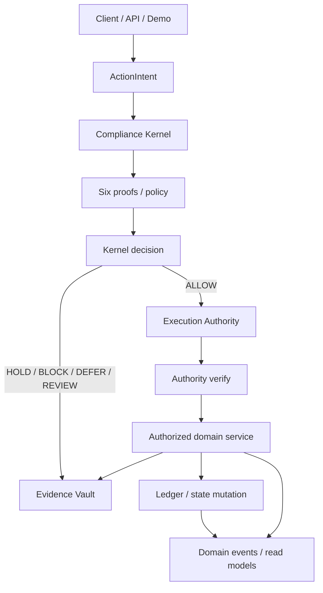

# SunRey canonical architecture constitution

This document is the durable architecture specification for the
consolidated tree on `main`. It describes what the repository actually
contains, which package owns each protected component, and which
dependency directions are legal.

Implementation inventory lives in [`docs/build-status.md`](../build-status.md).
Machine-enforceable ownership, dependencies, and reservations live in
[`manifest.json`](./manifest.json). This file must not be treated as a
second build-status document.

Older and currently open feature PRs are **not** automatically canonical.
See [historical implementation guidance](./historical-implementation.md).

---

## A. Canonical component registry

Each protected component has exactly one authoritative path. There must
never be two implementations of these systems.

| Component | Canonical owner | Authoritative path | Status |
| --- | --- | --- | --- |
| Money | `packages/money` | `packages/money/src/money.ts` | IMPLEMENTED |
| Currencies | `packages/domain` | `packages/domain/src/currency.ts` | IMPLEMENTED |
| Customer domain | `packages/domain` | `packages/domain/src/customer.ts` | IMPLEMENTED |
| Account domain | `packages/domain` | `packages/domain/src/account.ts` | IMPLEMENTED |
| Account classes | `packages/domain` | `packages/domain/src/account-class.ts` | IMPLEMENTED |
| Products | `packages/domain` | `packages/domain/src/product.ts` | IMPLEMENTED |
| Legal entities | `packages/domain` | `packages/domain/src/legal-entity.ts` | IMPLEMENTED |
| ActionIntent | `packages/permissions` | `packages/permissions/src/action-intent.ts` | IMPLEMENTED |
| Action types | `packages/permissions` | `packages/permissions/src/action-types.ts` | IMPLEMENTED |
| Structural intent validation | `packages/permissions` | `packages/permissions/src/structural.ts` | IMPLEMENTED |
| Execution Authority | `packages/permissions` | `packages/permissions/src/execution-authority.ts` | IMPLEMENTED |
| Compliance Kernel | `packages/kernel` | `packages/kernel/src/kernel.ts` | IMPLEMENTED |
| Proof evaluation | `packages/kernel` | `packages/kernel/src/proofs.ts` | IMPLEMENTED |
| Policy engine | `packages/kernel` | `packages/kernel/src/policy/engine.ts` | IMPLEMENTED |
| Evidence Vault | `packages/evidence` | `packages/evidence/src/vault.ts` | IMPLEMENTED |
| Domain events | `packages/events` | `packages/events/src/events.ts` | IMPLEMENTED |
| Event fabric (outbox / inbox / replay) | `packages/events` | `packages/events/src/events.ts` | IMPLEMENTED |
| Ledger | `packages/ledger` | `packages/ledger/src/journal.ts` | IMPLEMENTED |
| Journals / postings | `packages/ledger` | `packages/ledger/src/journal.ts` | IMPLEMENTED |
| Class bridges | `packages/ledger` | `packages/ledger/src/types.ts` | IMPLEMENTED |
| Account opening | `services/accounts` | `services/accounts/src/open-account.ts` | IMPLEMENTED |
| Money movement | `services/accounts` | `services/accounts/src/money-movement.ts` | IMPLEMENTED |
| Balance projections | `services/accounts` | `services/accounts/src/balances.ts` | IMPLEMENTED |
| Configuration | `packages/config` | `packages/config/src/flags.ts` | IMPLEMENTED |
| Canonical product identity | `packages/config` | `packages/config/src/product-identity.ts` | IMPLEMENTED |
| Architecture linting | `tools/architectural-linter` | `tools/architectural-linter/src/linter.ts` | IMPLEMENTED |
| PostgreSQL persistence adapter | `packages/persistence` | `packages/persistence/src/index.ts` | IMPLEMENTED |
| Cryptographic infrastructure | `packages/security` | `packages/security/src/provider.ts` | IMPLEMENTED |
| CryptoSuite registry | `packages/security` | `packages/security/src/crypto-suite.ts` | IMPLEMENTED |
| SunRey Identity | `packages/identity` | `packages/identity/src/service.ts` | IMPLEMENTED |
| Compliance screening fabric | `packages/kernel` | `packages/kernel/src/compliance/fabric.ts` | IMPLEMENTED |
| Cross-border payments | `packages/payments` | `packages/payments/src/service.ts` | IMPLEMENTED |
| FX quote engine | `packages/payments` | `packages/payments/src/fx-quote.ts` | IMPLEMENTED |
| Bank rail adapter framework | `packages/payments` | `packages/payments/src/rail-port.ts` | IMPLEMENTED |
| Banking / payment / FX provider candidates | `packages/payments` | `packages/payments/src/production-candidate/index.ts` | IMPLEMENTED |
| Card platform | `packages/cards` | `packages/cards/src/service.ts` | IMPLEMENTED |
| Personal Economic Graph | `packages/personal-economic-graph` | `packages/personal-economic-graph/src/service.ts` | IMPLEMENTED |
| Personal Economy Agent | `packages/agent` | `packages/agent/src/service.ts` | IMPLEMENTED |
| User-controlled agent mandates | `packages/sunrey-agent` | `packages/sunrey-agent/src/engine.ts` | IMPLEMENTED |
| SunRey AI runtime | `packages/ai-runtime` | `packages/ai-runtime/src/runtime.ts` | IMPLEMENTED |
| S3M primary inference provider | `packages/ai-runtime` | `packages/ai-runtime/src/providers/s3m/adapter.ts` | IMPLEMENTED |
| Growth Orchestrator | `packages/platform` | `packages/platform/src/service.ts` | IMPLEMENTED |
| Personal Economic Value Engine | `packages/platform` | `packages/platform/src/value/service.ts` | IMPLEMENTED |
| Treasury | `packages/treasury` | `packages/treasury/src/service.ts` | IMPLEMENTED |
| Investments | `packages/investments` | `packages/investments/src/service.ts` | IMPLEMENTED |
| Regulatory Digital Twin | `packages/regulatory-twin` | `packages/regulatory-twin/src/service.ts` | IMPLEMENTED |
| Investment Risk Engine | `packages/risk` | `packages/risk/src/engine.ts` | IMPLEMENTED |
| Model Registry | `packages/model-registry` | `packages/model-registry/src/registry.ts` | IMPLEMENTED |
| Agentic Capital Mesh | `packages/agentic-capital-mesh` | `packages/agentic-capital-mesh/src/service.ts` | IMPLEMENTED |
| Strategy Lab | `packages/strategy-lab` | `packages/strategy-lab/src/service.ts` | IMPLEMENTED |
| Personal Data Vault | `packages/personal-data-vault` | `packages/personal-data-vault/src/service.ts` | IMPLEMENTED |
| Consent Ledger / Purpose Firewall | `packages/consent` | `packages/consent/src/service.ts` | IMPLEMENTED |
| Privacy Clean Room | `packages/clean-room` | `packages/clean-room/src/service.ts` | IMPLEMENTED |
| SunRey oracle network | `packages/sunrey-chain` | `packages/sunrey-chain/src/oracle/engine.ts` | IMPLEMENTED |
| SunRey explorer | `packages/sunrey-explorer` | `packages/sunrey-explorer/src/indexer.ts` | IMPLEMENTED |
| SunRey developer platform | `packages/sunrey-sdk` | `packages/sunrey-sdk/src/index.ts` | IMPLEMENTED |
| SunRey developer application platform | `packages/sunrey-sdk` | `packages/sunrey-sdk/src/developer-platform/index.ts` | IMPLEMENTED |
| SunRey software supply chain | `packages/sunrey-chain` | `packages/sunrey-chain/src/supply-chain/index.ts` | IMPLEMENTED |
| SunRey performance engineering | `packages/sunrey-chain` | `packages/sunrey-chain/src/perf/runner.ts` | IMPLEMENTED |
| SunRey adversarial range | `packages/sunrey-range` | `packages/sunrey-range/src/types.ts` | IMPLEMENTED |
| SunRey fuzzing / property assurance | `packages/sunrey-chain` | `packages/sunrey-chain/src/assurance/index.ts` | IMPLEMENTED |
| SunRey mainnet readiness | `packages/sunrey-chain` | `packages/sunrey-chain/src/mainnet/types.ts` | IMPLEMENTED |
| SunRey production storage | `packages/sunrey-chain` | `packages/sunrey-chain/rust/crates/storage/src/lib.rs` | IMPLEMENTED |
| SunRey production infrastructure | `packages/sunrey-chain` | `packages/sunrey-chain/src/infra/provider.ts` | IMPLEMENTED |
| SunRey production handoff | `packages/sunrey-chain` | `packages/sunrey-chain/src/production-handoff/types.ts` | IMPLEMENTED |
| Economic data provider certification | `packages/sunrey-chain` | `packages/sunrey-chain/src/oracle/production/certification/types.ts` | IMPLEMENTED |
| Manufacturing robotics data fabric | `packages/sunrey-chain` | `packages/sunrey-chain/src/oracle/production/provider-families/manufacturing/types.ts` | IMPLEMENTED |
| Compute and AI economic data fabric | `packages/sunrey-chain` | `packages/sunrey-chain/src/oracle/production/provider-families/compute/types.ts` | IMPLEMENTED |
| Minerals / resource extraction data fabric | `packages/sunrey-chain` | `packages/sunrey-chain/src/oracle/production/provider-families/resources/types.ts` | IMPLEMENTED |
| Goods / commerce / service delivery data fabric | `packages/sunrey-chain` | `packages/sunrey-chain/src/oracle/production/provider-families/goods/types.ts` | IMPLEMENTED |
| Bandwidth / telecom / digital-network data fabric | `packages/sunrey-chain` | `packages/sunrey-chain/src/oracle/production/provider-families/bandwidth/types.ts` | IMPLEMENTED |
| Real-estate / infrastructure data fabric | `packages/sunrey-chain` | `packages/sunrey-chain/src/oracle/production/provider-families/real-estate/types.ts` | IMPLEMENTED |
| Unified economic data fabric | `packages/sunrey-chain` | `packages/sunrey-chain/src/oracle/production/economic-data-fabric/types.ts` | IMPLEMENTED |
| Production economic activation firewall | `packages/sunrey-chain` | `packages/sunrey-chain/src/economics/production-activation/types.ts` | IMPLEMENTED |
| SunRey production issuance policy candidate | `packages/sunrey-chain` | `packages/sunrey-chain/src/economics/production-activation/sunrey-package/types.ts` | IMPLEMENTED |
| SunRey public data plane | `packages/sunrey-chain` | `packages/sunrey-chain/src/public-data-plane/types.ts` | IMPLEMENTED |
| SunRey Human Information Network | `packages/information-market` | `packages/information-market/src/network/engine.ts` | IMPLEMENTED |
| HIN → SunRey Chain anchoring | `packages/information-market` | `packages/information-market/src/network/chain-anchor/adapter.ts` | IMPLEMENTED |
| Human contribution monetary evidence bridge | `packages/sunrey-chain` | `packages/sunrey-chain/src/economics/human-contribution-bridge/gate.ts` | IMPLEMENTED |
| SunRey Human Economic Contribution | `packages/human-economic-contribution` | `packages/human-economic-contribution/src/registry.ts` | IMPLEMENTED |
| SunRey Dataset and Economic Asset Registry | `packages/economic-asset-registry` | `packages/economic-asset-registry/src/registry.ts` | IMPLEMENTED |
| MoonRey source-to-productive taxonomy | `packages/sunrey-chain` | `packages/sunrey-chain/src/productive/source-taxonomy/registry.ts` | IMPLEMENTED |
| MoonRey Productive Value Function constitution | `packages/sunrey-chain` | `packages/sunrey-chain/src/productive/policy-governance/value-function/registry.ts` | IMPLEMENTED |
| MoonRey V2 shadow evaluation and migration | `packages/sunrey-chain` | `packages/sunrey-chain/src/productive/policy-governance/shadow-economics/evaluator.ts` | IMPLEMENTED |
| MoonRey productive value settlement bridge | `packages/sunrey-chain` | `packages/sunrey-chain/src/productive/policy-governance/value-settlement/bridge.ts` | IMPLEMENTED |
| MoonRey production-candidate issuance policy | `packages/sunrey-chain` | `packages/sunrey-chain/src/productive/policy-governance/value-function/production-candidate/index.ts` | IMPLEMENTED |
| MoonRey Productive Value Function engine | `packages/sunrey-chain` | `packages/sunrey-chain/src/productive/policy-governance/value-function/engine.ts` | IMPLEMENTED |
| MoonRey cross-domain attribution policy | `packages/sunrey-chain` | `packages/sunrey-chain/src/productive/policy-governance/attribution/engine.ts` | IMPLEMENTED |
| MoonRey productive economic event attribution | `packages/sunrey-chain` | `packages/sunrey-chain/src/productive/policy-governance/attribution/store.ts` | IMPLEMENTED |
| Economic asset rights and provenance verification | `packages/economic-asset-registry` | `packages/economic-asset-registry/src/verification/engine.ts` | IMPLEMENTED |
| Human contribution valuation engine | `packages/human-economic-contribution` | `packages/human-economic-contribution/src/valuation/engine.ts` | IMPLEMENTED |
| Human contribution valuation constitution | `packages/human-economic-contribution` | `packages/human-economic-contribution/src/valuation/registry.ts` | IMPLEMENTED |
| Human contribution evidence verification | `packages/human-economic-contribution` | `packages/human-economic-contribution/src/verification/engine.ts` | IMPLEMENTED |
| Production provider credential plane | `packages/security` | `packages/security/src/regulated/credentials/types.ts` | IMPLEMENTED |
| SunRey mobile wallet sync | `packages/sunrey-chain` | `packages/sunrey-chain/src/wallet/mobile-sync/types.ts` | IMPLEMENTED |
| Regulated provider candidates | `packages/kernel` | `packages/kernel/src/compliance/provider-candidate/types.ts` | IMPLEMENTED |

Companion invariant scripts remain under `scripts/`. They are part of
the same architecture-linting system, not a second linter.

### Current workspace inventory

**Packages:** `money`, `domain`, `permissions`, `security`, `identity`,
`kernel`, `ledger`, `evidence`, `events`, `config`, `persistence`,
`payments`, `cards`, `personal-economic-graph`, `agent`, `platform`,
`treasury`, `investments`, `regulatory-twin`, `risk`, `model-registry`,
`agentic-capital-mesh`, `sunrey-agent`, `ai-runtime`, `strategy-lab`, `personal-data-vault`,
`consent`, `clean-room`, `sunrey-coin`, `information-market`,
`human-economic-contribution`, `economic-asset-registry`,
`sunrey-chain`, `sunrey-explorer`, `sunrey-exchange`, `sunrey-range`, `custody`,
`market-surveillance`.
`consent`, `clean-room`, `sunrey-sdk`.

**Services:** `accounts`, `identity`, `compliance`, `cards`, `economic-graph`,
`treasury`, `investments`, `strategy-lab`.

**Applications:** `apps/explorer` is the functional SunRey explorer
web interface. It is a projection UI, not an authoritative ledger.
The Phase 1 demo remains `packages/domain/src/demo.ts`.

**Tools:** `architectural-linter`.

**Shared libraries:** the packages listed above. There is no separate
`packages/contracts` on this tree. `packages/platform` is the canonical
Growth Orchestrator owner. The Personal Economic Value Engine is
implemented in `packages/platform/src/value` on that same reserved path.
`packages/regulatory-twin` is the canonical Regulatory Digital Twin.
`packages/investments` is the canonical investment account and paper
portfolio owner. `packages/risk` is the canonical investment Risk
Engine. `packages/model-registry` is the canonical Model Registry.
`packages/agentic-capital-mesh` is the canonical Agentic Capital Mesh.
Strategy Lab is `PARTIAL` at `packages/strategy-lab` and
`services/strategy-lab` (no LIVE stage). Personal Data Vault is
`IMPLEMENTED` at `packages/personal-data-vault`. Consent is
`IMPLEMENTED` at `packages/consent`. Privacy Clean Room is
`IMPLEMENTED` at `packages/clean-room`. SunRey Coin is `IMPLEMENTED`
at `packages/sunrey-coin`. SunRey Chain is `IMPLEMENTED` at
`packages/sunrey-chain`. SunRey Exchange is `IMPLEMENTED` at
`packages/sunrey-exchange`. SunRey Testnet 1 (`net_sunrey_testnet_1`)
is a public TEST NETWORK package at `packages/sunrey-chain/src/testnet`.
It is not mainnet. Tickers remain `NOT_ASSIGNED`.
`packages/sunrey-exchange`. SunRey Explorer is `IMPLEMENTED` at
`packages/sunrey-explorer`.
`packages/sunrey-exchange`. The official developer SDK is
`IMPLEMENTED` at `packages/sunrey-sdk`.
Strategy Lab is implemented at the reserved owners:
`STRATEGY_LAB` is `PARTIAL` at `packages/strategy-lab` and
`services/strategy-lab` (no LIVE stage).

### Action types

The only action types on this tree are declared in
`packages/permissions/src/action-types.ts`:

- `OPEN_ACCOUNT`
- `POST_DEPOSIT`
- `POST_WITHDRAWAL`
- `INTERNAL_TRANSFER`
- `CREATE_BENEFICIARY`
- `CREATE_FX_QUOTE`
- `ACCEPT_FX_QUOTE`
- `INITIATE_PAYMENT`
- `CANCEL_PAYMENT`
- `ACCEPT_INBOUND_PAYMENT`
- `CREATE_HOLD`
- `RELEASE_HOLD`
- `CAPTURE_HOLD`
- `CANCEL_HOLD`
- `POST_FEE`
- `POST_REVERSAL`
- `POST_INTEREST`
- `INITIATE_PENDING_SETTLEMENT`
- `SETTLE_PENDING`
- `RETURN_PENDING`
- `REQUEST_CARD`
- `ACTIVATE_CARD`
- `FREEZE_CARD`
- `UNFREEZE_CARD`
- `CLOSE_CARD`
- `UPDATE_CARD_CONTROLS`
- `AUTHORIZE_CARD_PURCHASE`
- `REVERSE_CARD_AUTHORIZATION`
- `CLEAR_CARD_TRANSACTION`
- `REFUND_CARD_TRANSACTION`
- `OPEN_CARD_DISPUTE`
- `DECIDE_CARD_DISPUTE`
- `ASSESS_CARD_FEE`
- `PROVISION_CARD_TO_WALLET`
- `SUSPEND_WALLET_TOKEN`
- `REGISTER_ACCEPTANCE_DEVICE`
- `CREATE_ACCEPTANCE_SESSION`
- `START_ACCEPTANCE_PAYMENT`
- `SETTLE_ACCEPTANCE_PAYMENT`
- `RESERVE_TREASURY_LIQUIDITY`
- `RELEASE_TREASURY_LIQUIDITY`
- `COMMIT_TREASURY_LIQUIDITY`
- `PROPOSE_TREASURY_REBALANCE`
- `EXECUTE_TREASURY_REBALANCE`
- `SET_TREASURY_KILL_SWITCH`
- `OPEN_INVESTMENT_ACCOUNT`
- `FUND_BROKERAGE_CASH`
- `WITHDRAW_BROKERAGE_CASH`
- `CREATE_PAPER_ORDER`
- `CANCEL_PAPER_ORDER`
- `SETTLE_INVESTMENT`
- `PROCESS_CORPORATE_ACTION`
- `ISSUE_SUNREY_COIN`
- `TRANSFER_SUNREY_COIN`
- `BURN_SUNREY_COIN`
- `OPEN_EXCHANGE_ACCOUNT`
- `PLACE_EXCHANGE_ORDER`
- `CANCEL_EXCHANGE_ORDER`
- `SETTLE_EXCHANGE_TRADE`
- `HALT_EXCHANGE`

New action types add a payload that uses the `ActionIntent` envelope.
They do not invent a parallel envelope.

### Locations that may change financial or regulated customer state

| Path | What it mutates | Gate |
| --- | --- | --- |
| `packages/ledger/src/journal.ts` `Ledger.postJournal` | Journals / postings | Verified Execution Authority |
| `packages/domain/src/account.ts` `openAccount` | Account construction | Verified Execution Authority |
| `services/accounts/src/open-account.ts` `AccountsService.open` | Account store + ledger register | Kernel `submit` then verified authority |
| `services/accounts/src/money-movement.ts` `deposit` / `withdraw` / `transfer` | Ledger journals | Kernel `submit` then `Ledger.postJournal` |
| `services/accounts/src/banking-operations.ts` holds / fees / reversals / interest / pending | Hold records and ledger journals | Kernel `submit` then verified authority; journals only via `Ledger.postJournal` |
| `packages/payments/src/service.ts` beneficiary / quote / payment / inbound mutators | Payment store + journals | Kernel `submit` then verified authority |
| `packages/payments/src/journals.ts` `postPaymentJournal` | Ledger journals | Verified Execution Authority then `Ledger.postJournal` |
| `packages/cards/src/service.ts` card lifecycle / processor callbacks | Card records, holds via banking, journals | Kernel `submit` then verified authority; holds only through `BankingOperationsService`; journals only via `Ledger.postJournal` |
| `packages/cards/src/wallet/service.ts` wallet provisioning / token lifecycle | Device-payment tokens, provider references | Kernel `submit` then verified authority; adapters cannot issue authority |
| `packages/cards/src/acceptance/service.ts` SoftPOS device / session / settlement | Acceptance devices, sessions, merchant payments, journals | Kernel `submit` then verified authority; journals only via `Ledger.postJournal` |
| `packages/cards/src/journals.ts` `postCardJournal` | Ledger journals | Verified Execution Authority then `Ledger.postJournal` |
| `packages/treasury/src/service.ts` reserve / release / commit / rebalance / kill switch | Treasury reservations, proposals, operational controls; rebalance journals | Kernel `submit` then verified authority; journals only via `Ledger.postJournal` |
| `packages/investments/src/service.ts` open / fund / withdraw / paper order / settle / corporate action | Investment profiles, paper orders, positions, lots; brokerage-cash journals | Kernel `submit` then verified authority; journals only via `Ledger.postJournal` |
| `packages/sunrey-coin/src/service.ts` `issue` / `transfer` / `burn` | SunRey Coin simulation journals on the canonical Ledger | Kernel `submit` then verified authority; journals only via `Ledger.postJournal` |
| `packages/sunrey-exchange/src/service.ts` `openExchangeAccount` / `placeDigitalOrder` / `cancelDigitalOrder` / `halt` | Exchange accounts, orders, holds, trades, simulation settlement | Kernel `submit` then verified authority; journals only via CoinPort/FiatPort onto the canonical Ledger |

In-memory catalog stores (`CustomerStore`, `AccountStore`,
`LegalEntityStore`, `ProductStore`) hold already-authorized values.
They are not a second ledger.

`createProspect` and `transitionCustomerStatus` are pure calculations.
They do not write a store by themselves.

### Locations that may post a ledger journal

Only `Ledger.postJournal` in `packages/ledger/src/journal.ts`.
Production callers are `services/accounts/src/money-movement.ts` and
`services/accounts/src/banking-operations.ts` and
`packages/payments/src/journals.ts` and
`packages/cards/src/journals.ts` and
`packages/treasury/src/service.ts` (rebalance only) and
`packages/investments/src/journals.ts` and
`packages/sunrey-coin/src/service.ts`.

### Locations that may issue or verify Execution Authority

- **Issue:** `AuthorityIssuer.issue` is Kernel-private. The only
  production caller is `packages/kernel/src/kernel.ts`.
- **Verify:** `AuthorityIssuer.verify` in
  `packages/permissions/src/execution-authority.ts`. Callers are the
  Kernel-gated accounts service, the payments orchestrator,
  `packages/sunrey-coin`, and `Ledger.postJournal`.
- **Signing material:** `AuthorityIssuer` obtains HMAC-SHA256 through
  `packages/security` `KeyProvider`. Business services do not hold the
  raw signing secret.

### Evidence Vault

One implementation: `packages/evidence/src/vault.ts` (`EvidenceVault`).
Every Kernel decision seals a record. Refusals still seal.

### Money

One implementation: `packages/money/src/money.ts` (`Money`).
Amounts are `bigint` minor units. Floating-point construction is rejected.

### Account classes

One taxonomy: `packages/domain/src/account-class.ts`.

`DEMAND_DEPOSIT`, `SAVINGS_DEPOSIT`, `TIME_DEPOSIT`, `BROKERAGE_CASH`,
`SECURITIES`, `RETIREMENT`, `DIGITAL_ASSET_CUSTODY`,
`STABLECOIN_CUSTODY`, `REWARDS`, `PENDING_SETTLEMENT`, `CLASS_BRIDGE`,
`SIMULATED_FUNDING_SOURCE`, `CORPORATE_OPERATING`.

### Existing CI architectural rules

These checks already exist and remain intact:

1. Python architectural invariants (`scripts/lint-architectural-invariants.py`)
2. Extraction dry-run (`scripts/extraction-dryrun.py`)
3. TypeScript architectural linter (`tools/architectural-linter`)
4. Deployment posture (`scripts/check-deployment-posture.py`)
5. Kernel gating (`scripts/check-kernel-gating.mjs`)
6. Tests, including the Phase 1 exit-criterion test
7. End-to-end demo
8. Typecheck
9. Secret scan

This constitution extends (3). It does not replace (1)–(9).

### ADRs

See the [ADR index](./adr/README.md). ADR-0006, both ADR-0007 files, and
ADR-0008 remain **PROPOSED** for human acceptance. ADR-0006 Addendum A
records engineering implementation of Option C in simulation. ADR-0015
remains **PROPOSED** for the simulation chain foundation. ADR-0016
through ADR-0033 are **ACCEPTED_FOR_ENGINEERING** architecture freezes
for a future production node; they do not implement that node. None is
`CONFIRMED_BY_COUNSEL`.

### LIVE_* flags

Canonical source: `packages/config/src/flags.ts`.

`ENVIRONMENT=simulation`. `SIMULATION_MODE=true`. Every `LIVE_*` and
`REAL_MONEY_ENABLED` flag is `false`.

### External integration abstractions

Simulation-only ports exist for FX liquidity, beneficiary validation,
screening, settlement, and the canonical `RailAdapter` connectivity layer.
There is no live bank, FX, KYC, or payment-rail membership on this tree.
The clock is injectable.

### Persistence

PostgreSQL is the canonical durable adapter behind the existing ports.
It is not a second Ledger or a second Evidence Vault. ADR-0008 remains
historically PROPOSED; Addendum A records engineering acceptance of
Option A. That is not counsel review.

In-memory maps remain the default for unit tests:

- `Ledger` journals and idempotency map
- `EvidenceVault` records
- `DomainEventLog` events
- `AccountRegister`
- `GrowthAttributionLedger` entries (principal movements must not write;
  PEVE economic-benefit attribution lives in `packages/platform/src/value`)
- `CustomerStore`, `AccountStore`, `LegalEntityStore`, `ProductStore`
- `AccountsService` intent-id idempotency map

Durable rows live in four bounded databases (`solstice_customer`,
`solstice_ledger`, `solstice_evidence`, `solstice_security`). Restart
hydrates the in-memory objects from those rows. `solstice_security`
stores key metadata and service-identity references only — never
private key material. Read models (`balanceOfAccount`,
`projectCustomerPosition`) stay derived from journals and are not
authoritative financial state.

---

## B. System boundaries

Allowed high-level flow for a consequential financial action:

```text
Client / API / Demo
    ↓
ActionIntent
    ↓
Compliance Kernel
    ↓
Proofs / Policy
    ↓
Kernel Decision
    ↓
Execution Authority when permitted
    ↓
Authorized Domain Service
    ↓
Ledger / State Mutation
    ↓
Evidence Vault
    ↓
Domain Events / Read Models
```



No service may bypass this pattern for a consequential financial action.

SFF 2.0 intelligence layers sit **after** canonical financial systems and
**before** any future agent. They do not execute:

```text
Canonical Financial Systems
        ↓
Personal Economic Graph
        ↓
Personal Economy Agent (proposal-only)
        ↓
Growth Orchestrator (plans only; does not execute)
        ↓
Agentic Capital Mesh (proposal-only)
        ↓
Execution Control Plane
```

The Personal Economic Graph is a non-authoritative projection. If PEG
says a balance is X and the ledger says Y, the ledger wins. PEG cannot
post journals or issue Execution Authority.

Rules that follow from the flow:

- An `ActionIntent` is the only envelope that enters the Kernel.
- Structural validation is not authorization.
- HOLD, BLOCK, DEFER, and REQUIRE_MANUAL_REVIEW post nothing and still
  seal evidence. The Kernel statuses actually implemented today are
  `ALLOW`, `REQUIRE_MANUAL_REVIEW`, `DEFER`, and `BLOCK`.
- On ALLOW the Kernel may issue a signed Execution Authority. Callers
  verify that authority before `openAccount` or `Ledger.postJournal`.
- The Kernel does not open accounts or post journals.
- Read models must not become the system of record.
- The Evidence Vault should prefer hashes and references over raw
  sensitive payloads. Today's in-memory vault stores a canonicalized
  decision payload; future persistence must not put raw KYC documents
  or secrets in the chain.

---

## C. Dependency direction

### Allowed package dependencies

These edges match the imports that exist on this tree. Future packages
must be added to `manifest.json` before they appear on disk.

| Package / service | May depend on |
| --- | --- |
| `packages/money` | nothing |
| `packages/security` | nothing |
| `packages/config` | `packages/domain` (clock / `UtcInstant` exception) |
| `packages/domain` | `packages/permissions` (`openAccount` seal exception) |
| `packages/events` | `packages/domain`, `packages/permissions` (ActionIntent port for event-handler gating) |
| `packages/evidence` | `packages/config`, `packages/security` (SHA-256 helper only) |
| `packages/permissions` | `packages/domain`, `packages/money`, `packages/config`, `packages/security` |
| `packages/identity` | `packages/domain`, `packages/security`, `packages/permissions`, `packages/config`, `packages/evidence`, `packages/events` |
| `services/identity` | `packages/identity` |
| `packages/kernel` | `packages/config`, `packages/evidence`, `packages/permissions`, `packages/domain`, `packages/money`, `packages/identity`, `packages/security` |
| `services/compliance` | `packages/kernel` |
| `packages/ledger` | `packages/config`, `packages/permissions`, `packages/domain`, `packages/money` |
| `packages/persistence` | `packages/domain`, `packages/evidence`, `packages/events`, `packages/kernel`, `packages/ledger`, `packages/permissions`, `packages/money`, `packages/security`, `packages/identity`, `packages/personal-economic-graph`, `packages/platform`, `packages/treasury`, `packages/investments`, `packages/regulatory-twin`, `packages/risk`, `packages/model-registry`, `packages/agentic-capital-mesh`, `packages/strategy-lab`, `packages/personal-data-vault`, `packages/consent`, `packages/clean-room` |
| `packages/agent` | `packages/domain`, `packages/money`, `packages/identity`, `packages/config` |
| `packages/sunrey-agent` | `packages/domain`, `packages/money`, `packages/identity`, `packages/config`, `packages/events`, `packages/evidence`, `packages/agent`, `packages/permissions`, `packages/kernel`, `packages/security`, `packages/risk`, `packages/model-registry`, `packages/sunrey-chain`, `packages/sunrey-exchange`, `packages/custody`, `packages/ai-runtime` |
| `packages/ai-runtime` | `packages/domain`, `packages/money`, `packages/config`, `packages/security`, `packages/identity`, `packages/model-registry` |
| `packages/platform` | `packages/domain`, `packages/money`, `packages/identity`, `packages/events`, `packages/evidence`, `packages/config`, `packages/personal-economic-graph`, `packages/agent`, `packages/permissions`, `packages/security` |
| `services/accounts` | the packages above, including `packages/persistence`, `packages/security`, and `packages/identity` |
| `packages/payments` | `packages/domain`, `packages/money`, `packages/permissions`, `packages/config`, `packages/kernel`, `packages/ledger`, `packages/evidence`, `packages/events`, `packages/identity`, `packages/security` |
| `packages/cards` | `packages/domain`, `packages/money`, `packages/permissions`, `packages/config`, `packages/kernel`, `packages/ledger`, `packages/evidence`, `packages/events`, `packages/identity`, `packages/security` |
| `services/cards` | `packages/cards`, `services/accounts`, and the cards package dependencies needed to wire holds |
| `packages/personal-economic-graph` | `packages/domain`, `packages/money`, `packages/identity`, `packages/events`, `packages/config` |
| `services/economic-graph` | `packages/personal-economic-graph` |
| `packages/treasury` | `packages/domain`, `packages/money`, `packages/permissions`, `packages/config`, `packages/kernel`, `packages/ledger`, `packages/evidence`, `packages/events`, `packages/identity`, `packages/security`, `packages/payments` |
| `services/treasury` | `packages/treasury` |
| `packages/investments` | `packages/domain`, `packages/money`, `packages/permissions`, `packages/config`, `packages/kernel`, `packages/ledger`, `packages/evidence`, `packages/events`, `packages/identity`, `packages/security` |
| `services/investments` | `packages/investments` |
| `packages/risk` | `packages/domain`, `packages/money`, `packages/config`, `packages/evidence`, `packages/events`, `packages/model-registry`, `packages/permissions` |
| `packages/model-registry` | `packages/domain`, `packages/identity` |
| `packages/agentic-capital-mesh` | `packages/domain`, `packages/money`, `packages/identity`, `packages/config`, `packages/events`, `packages/evidence`, `packages/agent`, `packages/risk`, `packages/model-registry`, `packages/investments` |
| `packages/strategy-lab` | `packages/domain`, `packages/money`, `packages/permissions`, `packages/config`, `packages/kernel`, `packages/evidence`, `packages/events`, `packages/identity`, `packages/risk`, `packages/model-registry`, `packages/regulatory-twin` |
| `services/strategy-lab` | `packages/strategy-lab` |
| `packages/personal-data-vault` | `packages/domain`, `packages/config`, `packages/security`, `packages/identity`, `packages/evidence`, `packages/events` |
| `packages/consent` | `packages/domain`, `packages/config`, `packages/security`, `packages/identity`, `packages/evidence`, `packages/events`, `packages/personal-data-vault` |
| `packages/clean-room` | `packages/domain`, `packages/config`, `packages/security`, `packages/identity`, `packages/evidence`, `packages/events`, `packages/personal-data-vault`, `packages/consent`, `packages/personal-economic-graph` |
| `packages/regulatory-twin` | `packages/domain`, `packages/money`, `packages/permissions`, `packages/config`, `packages/kernel`, `packages/evidence`, `packages/events`, `packages/identity`, `packages/security` |
| `packages/sunrey-chain` | `packages/domain`, `packages/config`, `packages/security`, `packages/identity`, `packages/evidence`, `packages/events`, `packages/money` |
| `tools/architectural-linter` | nothing |

### Hard direction rules

- Low-level Money / domain packages must not depend on application
  services. `packages/domain/src/demo.ts` is a runner, not library
  surface, and is the only documented exception that imports
  `services/accounts`.
- Ledger must not depend on UI or API layers. There is no UI/API layer
  on this tree.
- Domain objects must not call external providers. There are no
  provider adapters on this tree. Future adapters sit behind ports.
- Agents added later must not import Execution Authority issuance,
  must not post journals, and must not depend on `packages/platform`
  from `packages/agent`.
- Read models are projections. They are not authoritative financial
  state.
- Library packages must not import services.
- A new workspace package that is absent from the manifest is illegal
  until it is registered.

### Known cycles

The current tree has two grandfathered cycles:

1. `packages/domain` ↔ `packages/permissions` because `openAccount`
   requires a `VerifiedExecutionAuthority`.
2. `packages/domain` → `packages/permissions` → `packages/config` →
   `packages/domain` because the clock uses `UtcInstant`.

These cycles are listed in `manifest.json` as `allowedCycles`. New
cycles between protected packages or planned bounded contexts are
illegal. Do not expand the existing cycles.

```mermaid
flowchart BT
  money["packages/money"]
  security["packages/security"]
  config["packages/config"]
  domain["packages/domain"]
  events["packages/events"]
  evidence["packages/evidence"]
  permissions["packages/permissions"]
  identity["packages/identity"]
  kernel["packages/kernel"]
  ledger["packages/ledger"]
  payments["packages/payments"]
  cards["packages/cards"]
  peg["packages/personal-economic-graph"]
  agent["packages/agent"]
  platform["packages/platform"]
  accounts["services/accounts"]
  identitySvc["services/identity"]
  complianceSvc["services/compliance"]
  cardsSvc["services/cards"]
  pegSvc["services/economic-graph"]

  config --> domain
  domain --> permissions
  permissions --> domain
  permissions --> money
  permissions --> config
  permissions --> security
  events --> domain
  events --> permissions
  persistence["packages/persistence"]
  persistence --> domain
  persistence --> evidence
  persistence --> events
  persistence --> ledger
  persistence --> permissions
  persistence --> money
  persistence --> kernel
  persistence --> security
  persistence --> identity
  persistence --> peg
  persistence --> platform
  accounts --> persistence
  accounts --> security
  evidence --> config
  evidence --> security
  identity --> domain
  identity --> security
  identity --> permissions
  identity --> config
  identity --> evidence
  identity --> events
  identitySvc --> identity
  complianceSvc --> kernel
  kernel --> config
  kernel --> evidence
  kernel --> permissions
  kernel --> domain
  kernel --> money
  kernel --> identity
  kernel --> security
  ledger --> config
  ledger --> permissions
  ledger --> domain
  ledger --> money
  payments --> domain
  payments --> money
  payments --> permissions
  payments --> config
  payments --> kernel
  payments --> ledger
  payments --> evidence
  payments --> events
  payments --> identity
  payments --> security
  cards --> domain
  cards --> money
  cards --> permissions
  cards --> config
  cards --> kernel
  cards --> ledger
  cards --> evidence
  cards --> events
  cards --> identity
  cards --> security
  cardsSvc --> cards
  cardsSvc --> accounts
  peg --> domain
  peg --> money
  peg --> identity
  peg --> events
  peg --> config
  pegSvc --> peg
  agent --> domain
  agent --> money
  agent --> identity
  agent --> config
  platform --> domain
  platform --> money
  platform --> identity
  platform --> events
  platform --> evidence
  platform --> config
  platform --> peg
  platform --> agent
  platform --> permissions
  platform --> security
  treasury["packages/treasury"]
  treasurySvc["services/treasury"]
  rdt["packages/regulatory-twin"]
  treasury --> domain
  treasury --> money
  treasury --> permissions
  treasury --> config
  treasury --> kernel
  treasury --> ledger
  treasury --> evidence
  treasury --> events
  treasury --> identity
  treasury --> security
  treasury --> payments
  treasurySvc --> treasury
  persistence --> treasury
  investments["packages/investments"]
  investmentsSvc["services/investments"]
  investments --> domain
  investments --> money
  investments --> permissions
  investments --> config
  investments --> kernel
  investments --> ledger
  investments --> evidence
  investments --> events
  investments --> identity
  investments --> security
  investmentsSvc --> investments
  persistence --> investments
  persistence --> rdt
  rdt --> domain
  rdt --> money
  rdt --> permissions
  rdt --> config
  rdt --> kernel
  rdt --> evidence
  rdt --> events
  rdt --> identity
  rdt --> security
  accounts --> domain
  accounts --> evidence
  accounts --> events
  accounts --> kernel
  accounts --> ledger
  accounts --> permissions
  accounts --> config
  accounts --> money
  accounts --> identity
```



Current convention: packages import each other with relative `src/`
paths. That is the existing style. A later chunk may introduce
`@solstice/*` package dependencies. Until then, "bypass public
interface" means importing a forbidden alias or a package that is not
an allowed dependency — not "must use `index.ts` only."

---

## D. Bounded context roadmap

The following contexts are **reserved**. Status is the current
implementation state on this tree. Later agents must not invent a
second owner for a context that is already reserved, and must not
reimplement an IMPLEMENTED protected dependency because a later
phase is absent.

| Context | Status | Reserved paths |
| --- | --- | --- |
| SECURITY | IMPLEMENTED | `packages/security` |
| IDENTITY | IMPLEMENTED | `packages/identity`, `services/identity` |
| COMPLIANCE | PARTIAL | `packages/kernel`, `packages/permissions`, `packages/evidence`, `services/compliance` |
| BANKING | PARTIAL | `packages/domain`, `packages/ledger`, `services/accounts` |
| PAYMENTS | PARTIAL | `packages/payments` |
| FX | PARTIAL | `packages/payments` |
| CARDS | PARTIAL | `packages/cards`, `services/cards` |
| TREASURY | PARTIAL | `packages/treasury`, `services/treasury` |
| PERSONAL ECONOMIC GRAPH | IMPLEMENTED | `packages/personal-economic-graph`, `services/economic-graph` |
| PERSONAL ECONOMY AGENT | IMPLEMENTED | `packages/agent` |
| USER AGENT MANDATES | IMPLEMENTED | `packages/sunrey-agent` |
| AI RUNTIME | IMPLEMENTED | `packages/ai-runtime` |
| GROWTH ORCHESTRATOR | IMPLEMENTED | `packages/platform` |
| PERSONAL ECONOMIC VALUE ENGINE | IMPLEMENTED | `packages/platform` |
| REGULATORY DIGITAL TWIN | IMPLEMENTED | `packages/regulatory-twin` |
| INVESTMENTS | PARTIAL | `packages/investments`, `services/investments` |
| RISK | IMPLEMENTED | `packages/risk` |
| MODEL REGISTRY | IMPLEMENTED | `packages/model-registry` |
| AGENTIC CAPITAL MESH | IMPLEMENTED | `packages/agentic-capital-mesh` |
| STRATEGY LAB | PARTIAL | `packages/strategy-lab`, `services/strategy-lab` |
| PERSONAL DATA VAULT | IMPLEMENTED | `packages/personal-data-vault` |
| CONSENT | IMPLEMENTED | `packages/consent` |
| CLEAN ROOM | IMPLEMENTED | `packages/clean-room` |
| PYR | PLANNED | `packages/pyr`, `packages/pyramid` |
| SUNREY COIN | IMPLEMENTED | `packages/sunrey-coin` |
| SUNREY INFORMATION MARKET | IMPLEMENTED | `packages/information-market` |
| SUNREY EXCHANGE | IMPLEMENTED | `packages/sunrey-exchange` |
| SUNREY CHAIN | IMPLEMENTED | `packages/sunrey-chain` |
| CUSTODY | IMPLEMENTED | `packages/custody` |
| MARKET SURVEILLANCE | IMPLEMENTED | `packages/market-surveillance` |
| API / INTEGRATION | PLANNED | `apps/api`, `services/api` |
| SOVEREIGN CELLS | PLANNED | `packages/cells` |

Product branding for the digital-asset context is **SunRey** /
**SunRey Coin** / **SunRey Exchange** / **SunRey Chain**. The public
ticker is UNDECIDED / `NOT_ASSIGNED`. Do not invent `SUNREY`, `SRN`,
`SRY`, `REYN`, `RYN`, or `RCOIN`. Historical architecture names
`PYRAMID`, `PYRAMID_EXCHANGE`, `REYN_COIN`, and `REYN_EXCHANGE` are
replaced by the reservations above. `PYRAMID_DATA_EXCHANGE` is
migrated to `SUNREY_INFORMATION_MARKET` at
`packages/information-market`. `PYR` is a historical ticker/alias
reservation only.

Chunk 26R implements SunRey Coin at `packages/sunrey-coin`:
[`chunk-26-resume.md`](./chunk-26-resume.md). Historical stop:
[`chunk-26-stop.md`](./chunk-26-stop.md). Do not create
`packages/reyn-coin`, `packages/sunrey-ledger`, `packages/reyn-ledger`,
`packages/token-ledger`, or `packages/crypto-ledger-v2`.

Chunk 27 implements the Human Information Network marketplace
foundation at `packages/information-market`. Public brand is
**SunRey Exchange**. Do not create `packages/pyramid-data-exchange`,
`packages/data-exchange`, `packages/sunrey-data-exchange`,
`packages/personal-oracle`, or a second data-market package.

Chunk 28 implements the SunRey Chain foundation at
`packages/sunrey-chain`. Simulation trust layer only. The canonical
ledger remains the financial source of truth. Do not invent a ticker.
Do not connect a live RPC, mainnet, or testnet. Do not create
`packages/sunrey-chain-v2`, `packages/blockchain`,
`packages/reyn-chain`, `packages/on-chain-ledger`, or
`packages/crypto-chain`.

Chunk 29 implements the SunRey Exchange core at
`packages/sunrey-exchange`. Simulation matching, holds, DVP
settlement, and market data only. Last trade is labeled
`SIMULATION_MARKET_PRICE`. Do not enable `LIVE_EXCHANGE_ENABLED`.
Do not invent a ticker. Do not create `packages/exchange-v2`,
`packages/orderbook`, `packages/matching-engine-v2`,
`packages/crypto-exchange`, or `packages/reyn-exchange`.
Chunk 49 extends that same owner with four market families —
digital assets, human-information rights, intelligence/compute,
and productive capacity — plus two-stage eligibility, auctions,
native DVP, and delivery-versus-right. See
[`chunk-49-universal-economic-exchange.md`](./chunk-49-universal-economic-exchange.md).

Chunk 30R implements the exchange control plane at
`packages/custody` and `packages/market-surveillance`, extending
listing governance and kill switches on `packages/sunrey-exchange`.
Simulation only. Custody provider state is not ledger truth. Alerts
are candidates, not legal conclusions. Historical stop:
[`chunk-30-stop.md`](./chunk-30-stop.md). Resume:
[`chunk-30-resume.md`](./chunk-30-resume.md). Do not create
`packages/exchange-compliance-v2`, `packages/travel-rule-v2`,
`packages/crypto-aml`, `packages/surveillance-v2`, or
`packages/custody-ledger`.

Chunk 40 implements development protocol governance and
height-activated upgrades at `packages/sunrey-chain` and
`packages/sunrey-chain/rust/crates/governance`. Capability
`sunrey-protocol-governance` is `IMPLEMENTED`. There is no
governance token. Do not create `packages/governance` or
`packages/sunrey-governance`. Production governance is not
implemented.
Chunk 45 implements machine economic identity and
machine-to-machine commerce at
`packages/sunrey-chain/src/machine-economy`. Capability
`sunrey-machine-economy` is `IMPLEMENTED`. Machines are
controller-bound, capability-limited economic actors. They cannot
validate, govern, issue Execution Authority, or issue MoonRey.
Do not create `packages/machine-economy` or
`packages/machine-identity`. See
[`chunk-45-machine-economy.md`](./chunk-45-machine-economy.md).
Chunk 43 implements the sovereign oracle network and verified
economic-fact protocol at `packages/sunrey-chain` and
`packages/sunrey-chain/rust/crates/oracle`. Capability
`sunrey-oracle-network` is `IMPLEMENTED`. Consensus never calls
external APIs. Facts are not money and do not authorize MoonRey
issuance. Do not create `packages/oracle`, `packages/sunrey-oracle`,
or `packages/oracle-network`. Production market-data networks are
not connected.
Chunk 41 implements the dual native asset protocol for SunRey Coin
and MoonRey Coin at `packages/sunrey-chain/rust/crates/native-assets`.
Capability `sunrey-native-assets` is `IMPLEMENTED`. Public tickers
remain `NOT_ASSIGNED`. Application SunRey Coin supply is not
imported. Do not create `packages/moonrey-coin` or a competing
chain. See
[`chunk-41-dual-native-assets.md`](./chunk-41-dual-native-assets.md).

Chunk 42 implements deterministic native fees and resource
metering at `packages/sunrey-chain` and
`packages/sunrey-chain/rust/crates/fees`. Capability
`sunrey-native-fees` is `IMPLEMENTED`. Fees are native-asset
minor units, not fiat ledger debits. Do not create
`packages/fees`, `packages/sunrey-fees`, or `packages/gas`.
Chunk 46 implements sovereign wallets, versioned addresses,
and account recovery at `packages/sunrey-chain/src/wallet` and
`packages/sunrey-chain/rust/crates/wallet`. Capability
`sunrey-sovereign-wallets` is `IMPLEMENTED`. A BlockchainAccount
is not a fiat Account. Wallet metadata is not a second ledger.
Do not create `packages/wallet-v2` or `packages/blockchain-wallet`.
See [`chunk-46-sovereign-wallets.md`](./chunk-46-sovereign-wallets.md).

Chunk 48 connects the canonical SunRey Exchange to native-chain
clearing and atomic DVP at `packages/sunrey-exchange` and
`packages/sunrey-chain`. Capability
`sunrey-exchange-native-settlement` is `IMPLEMENTED`. Exchange
positions are derived. Matching stays off-chain. Public tickers
remain `NOT_ASSIGNED`. See
[`chunk-48-exchange-native-settlement.md`](./chunk-48-exchange-native-settlement.md).
Do not create `packages/sunrey-exchange-ledger` or a second
exchange.

Chunk 36R implements the development validator registry, lifecycle,
integer voting power, epoch-boundary set transitions, CryptoSuite
consensus signer, and durable signer safety at
`packages/sunrey-chain`. Capability `sunrey-validators` is
`IMPLEMENTED` on that owner. `evaluateChunkRequirements` returns
`mustStop: false`. Historical stop:
[`chunk-36-stop.md`](./chunk-36-stop.md). Resume:
[`chunk-36-resume.md`](./chunk-36-resume.md). Do not create
`packages/validators`, `packages/staking`, or
`packages/validator-v2`.
Chunk 37 implements a development Tendermint-class BFT
`ConsensusEngine` at `packages/sunrey-chain/rust/crates/consensus`.
Capability `blockchain-consensus` is `IMPLEMENTED` on that owner.
Production consensus remains not implemented. Do not create
`packages/tendermint`, `packages/consensus-engine`, or
`packages/blockchain-consensus`. See
[`chunk-37-bft-consensus-core.md`](./chunk-37-bft-consensus-core.md).
Chunk 38 networks that engine across the four-validator P2P
devnet at `packages/sunrey-chain/node`. See
[`chunk-38-networked-consensus.md`](./chunk-38-networked-consensus.md).
Chunk 39 implements equivocation evidence, jail, tombstone, and
simulation-bond penalties. Capability
`sunrey-validator-accountability` is `IMPLEMENTED`. See
[`chunk-39-validator-accountability.md`](./chunk-39-validator-accountability.md).
Penalties never debit customer fiat, SunRey Coin, or MoonRey.
Chunk 72 implements governed validator bonding, rewards, and
accountability economics at `packages/sunrey-chain`. Capability
`sunrey-validator-economics` is `IMPLEMENTED`. Production bond
asset remains `UNCONFIGURED`. No public delegation, customer
staking, or second native-asset ledger. See
[`chunk-72-validator-economics.md`](./chunk-72-validator-economics.md).
Chunk 35R implements the P2P development network, mempool, and
state sync at `packages/sunrey-chain/node`. Capabilities
`sunrey-local-node` and `sunrey-p2p` are `IMPLEMENTED` on that
owner. Historical stop: [`chunk-35-stop.md`](./chunk-35-stop.md).
Resume: [`chunk-35-resume.md`](./chunk-35-resume.md). Do not create
`packages/sunrey-node`, `packages/sunrey-p2p`, `packages/p2p`,
`packages/mempool`, or a second chain. Production consensus,
public testnet, and mainnet remain not implemented.
Chunk 34R implements the local development node inside
`packages/sunrey-chain/rust`. The earlier documentation-only stop is
historical: [`chunk-34-stop.md`](./chunk-34-stop.md). Resume:
[`chunk-34-resume.md`](./chunk-34-resume.md). Do not create
`packages/blockchain-v2`, `packages/new-chain`, `packages/l1`,
`packages/ledger-chain`, `packages/sunrey-node`, or
`packages/web3-chain`. Do not replace `packages/sunrey-chain`.
Production BFT is not implemented.
Chunk 32R implements the canonical SunRey transaction and
economic-state protocol at `packages/sunrey-chain`. Historical
stop: [`chunk-32-stop.md`](./chunk-32-stop.md). Resume:
[`chunk-32-resume.md`](./chunk-32-resume.md). Capability
`blockchain-protocol` is `IMPLEMENTED`. Do not invent a second
codec package, ticker, second Money type, or second SunRey Coin
ledger. Do not create
`packages/sunrey-chain-v2`, `packages/sunrey-protocol`,
`packages/sunrey-tx`, `packages/moonrey`, or `packages/moonrey-coin`.
Chunk 44 implements development MoonRey issuance from verified
productive contributions inside `packages/sunrey-chain`. Arbitrary
`NATIVE_ASSET ISSUE` remains inactive. The public MoonRey Coin
product remains unimplemented. See
[`chunk-44-productive-capacity-moonrey.md`](./chunk-44-productive-capacity-moonrey.md).
Chunk 31 freezes the **production architecture** for SunRey
Blockchain. It does not implement a production node. The canonical
owner remains `packages/sunrey-chain` as a modular monolith.
Consensus, runtime, storage, and P2P are future internal modules,
not five microservices. Public tickers for SunRey Coin and MoonRey
Coin remain `NOT_ASSIGNED`. MoonRey Coin is distinct and not a
public product. The canonical Ledger remains authoritative for fiat
and current SunRey Coin journals. See
[`chunk-31-sunrey-blockchain-production-architecture.md`](./chunk-31-sunrey-blockchain-production-architecture.md),
[`sunrey-chain-authority-matrix.md`](./sunrey-chain-authority-matrix.md),
and [`sunrey-blockchain-protocol.json`](./sunrey-blockchain-protocol.json).
Do not create `packages/blockchain-node`,
`packages/blockchain-protocol`, `packages/blockchain-network`,
`packages/blockchain-consensus`, `packages/blockchain-runtime`,
`packages/sunrey-node`, `packages/sunrey-blockchain`, or
`packages/moonrey-coin` in this chunk.
Chunk 33R implements the CryptoSuite registry, Ed25519 provider,
PQ ports, hybrid envelope, and crypto policy at
`packages/security`, with validator key separation at
`packages/sunrey-chain`. Historical stop:
[`chunk-33-stop.md`](./chunk-33-stop.md). Implementation:
[`chunk-33-crypto-agility.md`](./chunk-33-crypto-agility.md).
Do not create `packages/quantum-security`, `packages/crypto-v2`,
or `packages/pqc-core`. Do not claim quantum-proof cryptography.
Chunk 47 implements institutional native-asset custody at
`packages/custody`, HSM/KMS contracts at `packages/security`, and
the native-chain custody port at `packages/sunrey-chain`.
Capability `sunrey-institutional-custody` is `IMPLEMENTED`.
Canonical native quantity remains on SunRey Blockchain. Do not
create `packages/custody-v2`, `packages/blockchain-custody`,
`packages/institutional-custody-v2`, or `packages/hsm-security-v2`.
See
[`chunk-47-institutional-custody.md`](./chunk-47-institutional-custody.md).
Chunk 54 implements validator operator infrastructure, sentry
topology, authenticated remote signer, double-sign backup, and
governed rolling upgrades at `packages/sunrey-chain/src/ops`.
Capability `sunrey-validator-operations` is `IMPLEMENTED`. It does
not reimplement the validator registry or consensus engine. Do not
create `packages/sunrey-ops`, `packages/validator-ops`,
`packages/sentry`, or `packages/remote-signer`. See
[`chunk-54-validator-operations.md`](./chunk-54-validator-operations.md).
Chunk 51 implements the official developer platform at
`packages/sunrey-sdk` with a Rust client at
`packages/sunrey-chain/rust/crates/sdk`. Capability
`sunrey-developer-sdk` is `IMPLEMENTED`. The SDK is an adapter.
Do not create `packages/blockchain-v2`,
`packages/sunrey-chain-sdk-ledger`, `packages/sdk-ledger`, or
`packages/exchange-v2`. See
[`chunk-51-developer-platform.md`](./chunk-51-developer-platform.md).
Chunk 59 implements software supply-chain security at
`packages/sunrey-chain/src/supply-chain`. Capability
`sunrey-supply-chain` is `IMPLEMENTED`. `ReleaseAuthority` signs
artifacts only. It is not Execution Authority and does not activate
protocol change. Do not create `packages/supply-chain`,
`packages/sunrey-release`, `packages/sbom`, or
`packages/reproducible-builds`. See
[`chunk-59-supply-chain.md`](./chunk-59-supply-chain.md).
Chunk 58 implements sunrey-bench load, soak, and capacity engineering
at `packages/sunrey-chain/src/perf`. Capability
`sunrey-performance-engineering` is `IMPLEMENTED`. Do not create
`packages/sunrey-bench`, `packages/performance`, or
`packages/load-test`. See
[`chunk-58-performance.md`](./chunk-58-performance.md).
Chunk 57 implements the isolated adversarial cyber-economic test
range at `packages/sunrey-range`. Capability
`sunrey-adversarial-range` is `IMPLEMENTED`. Red actors are
in-process test doubles. Detector output is not legal guilt. Do not
create `packages/red-team`, `packages/attack-sim`, or
`packages/sunrey-pentest`. See
[`chunk-57-adversarial-range.md`](./chunk-57-adversarial-range.md).
Chunk 56 implements protocol fuzzing, property tests, differential
TypeScript/Rust drivers, and deterministic replay at
`packages/sunrey-chain/src/assurance` and
`packages/sunrey-chain/rust/crates/assurance`. Capability
`sunrey-assurance` is `IMPLEMENTED`. It is test infrastructure, not
a second ledger, consensus engine, or formal-verification product.
Do not create `packages/sunrey-test`, `packages/fuzz`,
`packages/assurance`, or `tools/sunrey-test`. See
[`chunk-56-assurance-fuzzing.md`](./chunk-56-assurance-fuzzing.md).
Chunk 70 implements the SunRey full mainnet launch rehearsal at
`packages/sunrey-chain/src/launch-rehearsal`. Capability
`sunrey-launch-rehearsal` is `IMPLEMENTED`. It is a production-like
dry run. It does not launch mainnet, enable `LIVE_*` flags, or
authorize production funds. Do not create `packages/sunrey-launch`,
`packages/launch-rehearsal`, or `packages/mainnet-rehearsal`. See
[`chunk-70-launch-rehearsal.md`](./chunk-70-launch-rehearsal.md).
Chunk 71 implements the SunRey dual-native-asset monetary
constitution at `packages/sunrey-chain/src/economics`. Capability
`sunrey-monetary-constitution` is `IMPLEMENTED`. It governs how
SunRey Coin and MoonRey Coin may be created, allocated, issued,
locked, burned, audited, and governed. Production quantities remain
`UNCONFIGURED`. Do not create `packages/sunrey-economics`,
`packages/monetary-policy`, `packages/tokenomics`, or
`packages/genesis-economy`. See
[`chunk-71-monetary-constitution.md`](./chunk-71-monetary-constitution.md).
Chunk 65 implements mainnet readiness evidence, activation control,
and genesis-candidate engineering at
`packages/sunrey-chain/src/mainnet`. Capability
`sunrey-mainnet-readiness` is `IMPLEMENTED`. It does not launch
mainnet, enable `LIVE_*` flags, or fabricate external legal or
audit evidence. Do not create `packages/mainnet`,
`packages/sunrey-mainnet`, `packages/genesis-candidate`,
`packages/readiness-registry`, or `packages/activation-control`.
See [`chunk-65-mainnet-readiness.md`](./chunk-65-mainnet-readiness.md).
Chunk 66 implements provider-neutral production infrastructure,
secret/KMS/HSM adapters, workload identity, and network zoning at
`packages/sunrey-chain/src/infra`. Capability
`sunrey-production-infrastructure` is `IMPLEMENTED`. It does not
launch mainnet, enable `LIVE_*` flags, or couple consensus to a
cloud vendor. Do not create `packages/sunrey-infra`,
`packages/infrastructure`, `packages/production-infrastructure`,
`packages/cloud-adapters`, or `packages/sunrey-cloud`. See
[`chunk-66-production-infrastructure.md`](./chunk-66-production-infrastructure.md).
Chunk 68 implements production-candidate oracle provider onboarding,
off-chain collection, provenance, independence, and MoonRey
eligibility at `packages/sunrey-chain/src/oracle/production`.
Capability `sunrey-production-oracles` is `IMPLEMENTED`. Consensus
never calls external APIs. Oracle facts never mint MoonRey. Missing
provider agreements are never confirmed. Do not create
`packages/production-oracles`, `packages/oracle-onboarding`, or
`packages/oracle-collector`. See
[`chunk-68-production-oracles.md`](./chunk-68-production-oracles.md).
Chunk 64 implements production-class root-of-trust and key-ceremony
architecture at `packages/security/src/ceremony`. Capability
`sunrey-root-of-trust` is `IMPLEMENTED`. CI uses simulation
providers only. Do not create real production private keys. Do not
create `packages/ceremony`, `packages/hsm-v2`,
`packages/root-of-trust`, or `packages/key-ceremony`. See
[`chunk-64-root-of-trust.md`](./chunk-64-root-of-trust.md).
Chunk 63 implements Testnet release-candidate freeze, qualification,
and release control at `packages/sunrey-chain/src/release-candidate`.
Capability `sunrey-testnet-rc` is `IMPLEMENTED`. It remains TESTNET
work. No RC status implies mainnet readiness. Tickers remain
`NOT_ASSIGNED`. `ReleaseAuthority` signs the candidate bundle only.
Do not create `packages/sunrey-rc`, `packages/release-candidate`,
`packages/testnet-rc`, `packages/sunrey-qualification`, or
`packages/rc-control`. See
[`chunk-63-testnet-rc.md`](./chunk-63-testnet-rc.md).
Chunk 62 implements independent security-review preparation at
`packages/sunrey-chain/src/audit`. Capability
`sunrey-audit-readiness` is `IMPLEMENTED`. The generated bundle is
an engineering package. It does not claim that an external audit
has occurred or passed. Do not create `packages/sunrey-audit`,
`packages/audit`, `packages/security-review`, or
`packages/audit-evidence`. See
[`chunk-62-audit-readiness.md`](./chunk-62-audit-readiness.md).
Chunk 83 implements independent security-review findings ingestion,
remediation, regression, retest packaging, and risk-acceptance
workflow at `packages/sunrey-chain/src/audit/remediation`. Capability
`sunrey-audit-remediation` is `IMPLEMENTED`. It extends Chunk 62 and
does not create a second audit-bundle owner. It does not claim that
an external audit has occurred or passed. Fictional fixtures are
labeled `TEST_FIXTURE_NOT_EXTERNAL_AUDIT` and cannot satisfy real
external-review readiness. Do not create
`packages/audit-remediation` or `packages/security-audit-v2`. See
[`chunk-83-audit-remediation.md`](./chunk-83-audit-remediation.md).
Chunk 61 implements bounded TLA+/TLC protocol models, selected Rust
bounded verification, and implementation-trace conformance at
`packages/sunrey-chain/formal`. Capability
`sunrey-formal-assurance` is `IMPLEMENTED`. Results are model
checked within stated bounds. This is not whole-system formal
verification. Do not create `packages/formal`, `packages/tla`,
`packages/model-checker`, `packages/sunrey-formal`, or
`tools/formal`. See
[`chunk-61-formal-models.md`](./chunk-61-formal-models.md).
Chunk 69 implements the production-candidate adapter framework that
connects SunRey Exchange and custody to provider-neutral identity,
screening, Travel Rule, HSM/custody, surveillance, and
case-management interfaces. Capability
`sunrey-regulated-integration` is `IMPLEMENTED` at
`packages/sunrey-exchange`, `packages/custody`, `packages/kernel`,
`packages/security`, and `packages/sunrey-chain`. It does not
activate live regulated services or enable `LIVE_*` flags. Do not
create `packages/regulated-exchange`, `packages/provider-registry`,
`packages/travel-rule-production`, `packages/custody-activation`, or
`packages/exchange-kyc`. See
[`chunk-69-regulated-integration.md`](./chunk-69-regulated-integration.md).
Chunk 67 implements production-candidate blockchain storage and
application PostgreSQL durability at
`packages/sunrey-chain/rust/crates/storage` and
`packages/persistence/src/production`. Capability
`sunrey-production-storage` is `IMPLEMENTED`. The selected engine is
redb 2.4. Application PostgreSQL is not consensus authority. Do not
create `packages/blockchain-db`, `packages/chain-storage-v2`, or
`packages/sunrey-ledger-db`. See
[`chunk-67-production-storage.md`](./chunk-67-production-storage.md).

Do not implement these in this chunk. Creating a reserved path on disk
while the manifest still says `PLANNED` is a defect: update the
manifest to `PARTIAL` or `IMPLEMENTED` in the same change that adds
the first real owner, and keep the reserved path. Do not invent a
competing directory.

---

Chunk 75 implements the SunRey / MoonRey dual-economy simulation
laboratory at `packages/sunrey-economics`. Capability
`sunrey-dual-economy-simulator` is `IMPLEMENTED`. It models the
human SunRey layer and autonomous MoonRey productive layer for
engineering analysis. It does not predict prices, promise returns,
or activate production monetary policy. Do not create
`packages/dual-economy`, `packages/moonrey-macro`, or
`packages/economic-bridge`. See
[`chunk-75-dual-economy.md`](./chunk-75-dual-economy.md).

Chunk 80 implements the complete SunRey economic mainnet rehearsal at
`packages/sunrey-chain/src/economic-rehearsal`. Capability
`sunrey-economic-mainnet-rehearsal` is `IMPLEMENTED`. It is a
production-like dry run of the dual-native-asset economy. It does not
activate SunRey mainnet, customer funds, live Exchange, live custody,
fiat rails, tickers, or `LIVE_*` flags. Do not create
`packages/sunrey-economic-rehearsal`, `packages/economic-mainnet`,
`packages/economic-rehearsal`, or `packages/sunrey-economic-mainnet`.
See
[`chunk-80-economic-mainnet-rehearsal.md`](./chunk-80-economic-mainnet-rehearsal.md).
Chunk 147 extends that same owner at
`packages/sunrey-chain/src/economic-rehearsal/parameterized-candidate`.
It rehearses a complete fixture parameter package through the real
production validators, SunRey and MoonRey candidate policies, Exchange
DVP, and dual-economy stress. Every value is `REHEARSAL_FIXTURE`.
NOT RECOMMENDED TOKENOMICS. NOT A PRODUCTION PROPOSAL. NO ECONOMIC
MEANING OUTSIDE REHEARSAL. The Chunk 143 firewall remains production
blocked. Do not create `packages/parameterized-rehearsal` or
`packages/dual-economy-rehearsal`. See
[`docs/economics/chunk-147-parameterized-dual-economy-rehearsal.md`](../economics/chunk-147-parameterized-dual-economy-rehearsal.md).
Chunk 78 implements economic release-candidate freeze, policy freeze,
and qualification at
`packages/sunrey-chain/src/release-candidate/economic`. Capability
`sunrey-economic-rc` is `IMPLEMENTED`. It remains TESTNET /
PRODUCTION-CANDIDATE economic qualification. No economic RC status
implies mainnet authorization. Production parameters remain
`UNCONFIGURED`. Qualification is not regulatory approval.
`ReleaseAuthority` signs the economic bundle only and does not
activate economic policy. Chunk 148 extends this owner with a
versioned production economic constitution candidate at
`production-constitution/`. Do not create `packages/sunrey-economic-rc`,
`packages/economic-rc`, `packages/economic-qualification`,
`packages/sunrey-economic-release`, or
`packages/economic-policy-freeze`. See
[`chunk-78-economic-rc.md`](./chunk-78-economic-rc.md).
Chunk 84 implements the SunRey Mainnet Release Candidate freeze,
full-system qualification, and release evidence bundle at
`packages/sunrey-chain/src/release-candidate/mainnet`. Capability
`sunrey-mainnet-rc` is `IMPLEMENTED`. It creates a cryptographically
identified Mainnet RC. It does not launch mainnet, enable `LIVE_*`
flags, or treat `ENGINEERING_QUALIFIED` as `AUTHORIZED_CANDIDATE`.
`ReleaseAuthority` signs the bundle only and cannot activate the
network. Do not create `packages/sunrey-mainnet-rc`,
`packages/mainnet-rc`, `packages/mainnet-qualification`,
`packages/sunrey-mainnet-release`, or
`packages/mainnet-release-candidate`. See
[`chunk-84-mainnet-rc.md`](./chunk-84-mainnet-rc.md).
Chunk 79 implements SunRey production governance operations, economic
policy change control, and bounded emergency authority at
`packages/sunrey-chain/src/governance-ops`. Capability
`sunrey-governance-operations` is `IMPLEMENTED`. It orchestrates
existing Chunk 40 protocol governance and does not introduce a
governance token, AI voting, a competing governance engine, or an
authority that can rewrite finalized history. Do not create
`packages/governance-ops`, `packages/sunrey-governance`, or
`packages/governance-token`. See
[`chunk-79-governance-operations.md`](./chunk-79-governance-operations.md).
Chunk 77 implements the blockchain-native SunRey protocol treasury
and reserve architecture at
`packages/sunrey-chain/src/economics/treasury`. Capability
`sunrey-protocol-treasury` is `IMPLEMENTED`. It is distinct from
the fiat/application owner `packages/treasury`. It does not create
a second financial Ledger, a new native asset, a price peg, or a
treasury mint. Production treasury remains inactive. Do not create
`packages/sunrey-protocol-treasury`, `packages/native-treasury`, or
`packages/reserve-bank`. See
[`chunk-77-protocol-treasury.md`](./chunk-77-protocol-treasury.md).

Chunk 86 implements the SunRey production-environment provisioning
control plane at `packages/sunrey-chain/src/infra/provisioning`.
Capability `sunrey-production-provisioning` is `IMPLEMENTED`. It
extends Chunk 66. It binds the actual merged Chunk 81–85 artifacts,
produces a deterministic plan before any infrastructure mutation, and
does not execute genesis, enable `LIVE_*` flags, or activate customer
financial capabilities. Do not create
`packages/sunrey-production-platform`,
`packages/mainnet-infrastructure-v2`, or
`packages/cloud-control-plane`. See
[`chunk-86-production-provisioning.md`](./chunk-86-production-provisioning.md).
Chunk 85 implements the SunRey production genesis ceremony, validator
onboarding, and launch-authorization package at
`packages/sunrey-chain/src/production-ceremony`. Capability
`sunrey-production-genesis-ceremony` is `IMPLEMENTED`. CI uses
rehearsal and simulation credentials only. It does not launch mainnet,
create real production private keys, or enable `LIVE_*` flags. Do not
create `packages/sunrey-ceremony`, `packages/production-genesis`,
`packages/genesis-ceremony`, `packages/launch-authorization`, or
`packages/production-ceremony`. See
[`chunk-85-production-genesis-ceremony.md`](./chunk-85-production-genesis-ceremony.md).

Chunk 90 implements the SunRey production handoff and day-2 operations
control plane at `packages/sunrey-chain/src/production-handoff`.
Capability `sunrey-production-handoff` is `IMPLEMENTED`. It does not
launch mainnet, convert rehearsal into observed production, enable
`LIVE_*` flags, or let AI satisfy required human accountability roles.
Do not create `packages/production-handoff`, `packages/sunrey-handoff`,
`packages/day-2-ops`, `packages/production-ops`, or
`packages/operator-acceptance`. See
[`chunk-90-production-handoff.md`](./chunk-90-production-handoff.md).
Chunk 88 implements the SunRey authorized production genesis execution
engine and launch control room at
`packages/sunrey-chain/src/genesis-execution`. Capability
`sunrey-production-genesis-execution` is `IMPLEMENTED`. The complete
real-production path exists in code. Automated tests use isolated
rehearsal inputs only. Engineering qualification is not authorization.
AI cannot occupy a human role. Chain genesis does not automatically
enable customer financial capabilities or `LIVE_*` flags. Do not create
`packages/genesis-execution`, `packages/sunrey-genesis-execution`,
`packages/production-genesis-execution`, `packages/mainnet-execution`,
or `packages/launch-execution`. See
[`chunk-88-genesis-execution.md`](./chunk-88-genesis-execution.md).
Chunk 82 implements external production provider onboarding,
acceptance testing, and evidence qualification at
`packages/sunrey-chain/src/providers`. Capability
`sunrey-production-provider-acceptance` is `IMPLEMENTED`. It reuses
canonical infrastructure, oracle, regulated, and HSM registries.
It does not fabricate contracts, licenses, commercial HSM
certification, or human approvals. Do not create
`packages/provider-acceptance`, `packages/production-providers`,
`packages/external-providers`, or `packages/sunrey-providers`. See
[`chunk-82-production-provider-acceptance.md`](./chunk-82-production-provider-acceptance.md).
Chunk 87 implements the isolated SunRey pre-genesis production shadow
network and operational qualification system at
`packages/sunrey-chain/src/pregenesis`. Capability
`sunrey-pregenesis-qualification` is `IMPLEMENTED`. It uses distinct
network ID, chain ID, genesis, keys, and address HRP. It does not
launch mainnet, enable `LIVE_*` flags, or treat
`PREGENESIS_ENGINEERING_QUALIFIED` as production authorization. Do not
create `packages/sunrey-pregenesis`, `packages/pregenesis`,
`packages/shadow-network`, `packages/pregenesis-qualification`, or
`packages/sunrey-shadow`. See
[`chunk-87-pregenesis-qualification.md`](./chunk-87-pregenesis-qualification.md).

Chunk 89 implements SunRey post-genesis stabilization, safe-mode
operations, and progressive production capability activation at
`packages/sunrey-chain/src/post-genesis`. Capability
`sunrey-post-genesis-stabilization` is `IMPLEMENTED`. Automated tests
use rehearsal networks. It does not launch mainnet, enable `LIVE_*`
flags, or activate real production capabilities. Genesis does not
automatically enable regulated or high-risk financial services. Do not
create `packages/post-genesis`, `packages/sunrey-post-genesis`,
`packages/stabilization`, `packages/capability-activation`, or
`packages/production-activation`. See
[`chunk-89-post-genesis-stabilization.md`](./chunk-89-post-genesis-stabilization.md).
Chunk 94 implements the SunRey developer application platform,
credentials, signed webhooks, Testnet/sandbox, and local developer
environment at `packages/sunrey-sdk/src/developer-platform`. Capability
`sunrey-developer-platform` is `IMPLEMENTED`. It extends Chunk 51 and
does not create a second SDK, chain, or EVM layer. Developer
credentials cannot sign user funds. Production application
registration does not activate production financial capabilities.
Do not create `packages/sunrey-developer-platform`,
`packages/developer-portal`, `packages/app-registry`,
`packages/webhook-service`, or `packages/developer-platform-v2`. See
[`chunk-94-developer-platform.md`](./chunk-94-developer-platform.md).

Chunk 93 implements the SunRey public RPC edge, high-availability
Explorer, and production network data plane at
`packages/sunrey-chain/src/public-data-plane`. Capability
`sunrey-public-data-plane` is `IMPLEMENTED`. RPC reads canonical chain
state. Explorer projections are rebuildable and non-authoritative. It
does not create a second consensus, second financial ledger,
authoritative Explorer database, or public validator admin endpoints.
Do not create `packages/public-rpc`, `packages/sunrey-rpc-edge`,
`packages/rpc-gateway`, `packages/explorer-ha`, or
`packages/public-data-plane`. See
[`chunk-93-public-data-plane.md`](./chunk-93-public-data-plane.md).
Chunk 92 implements the SunRey validator operator platform, fleet
management, and production operator control plane at
`packages/sunrey-chain/src/validator-operator`. Capability
`sunrey-validator-operator-platform` is `IMPLEMENTED`. It is an
operational projection. Canonical validator-set state remains
authoritative. It does not create a second registry, consensus
engine, public delegated staking, or governance token. Do not create
`packages/validator-operator`, `packages/sunrey-validator-ops`,
`packages/operator-platform`, `packages/validator-fleet`, or
`packages/delegated-staking`. See
[`chunk-92-validator-operator-platform.md`](./chunk-92-validator-operator-platform.md).
Chunk 91 implements the SunRey executable production provider runtime
and credential-injected integration framework at
`packages/sunrey-chain/src/provider-runtime`. Capability
`sunrey-provider-runtime` is `IMPLEMENTED`. It extends Chunks 66, 68,
69, 82, and 90. Local mocks are the CI path. Sandbox credentials are
optional `SecretReference` bindings. Adapter success is not legal or
commercial approval. `PRODUCTION_AUTHORIZED` requires configured
evidence and human authority. Do not create
`packages/provider-runtime`, `packages/sunrey-provider-runtime`,
`packages/executable-providers`, `packages/provider-adapters`, or
`packages/integration-providers`. See
[`chunk-91-provider-runtime.md`](./chunk-91-provider-runtime.md).

Chunk 95 implements SunRey Exchange production-candidate market
operations at `packages/sunrey-exchange/src/ops`. Capability
`sunrey-exchange-market-operations` is `IMPLEMENTED`. It extends
the canonical Exchange with an institutional gateway, sequenced
market data, liquidity metrics, market-maker sessions, circuit
breakers, and reopening auctions. It does not create a second
Exchange or native-asset balance ledger. Production regulated
trading remains independently gated by legal, licensing, custody,
and human evidence. Do not create `packages/market-operations`,
`packages/institutional-gateway`, `packages/exchange-ops`, or
`packages/sunrey-exchange-ops`. See
[`chunk-95-market-operations.md`](./chunk-95-market-operations.md).

Chunk 100 implements SunRey Human Information Network
production-candidate interfaces at
`packages/information-market/src/network`. Capability
`sunrey-human-information-network` is `IMPLEMENTED`. It extends the
canonical information-market, Consent, Clean Room, Personal Data Vault,
and Exchange `HUMAN_INFORMATION_RIGHT` family. Sensitive source data
remains off-chain. Engineering completion does not activate production.
Do not create `packages/human-information-network`,
`packages/information-market-v2`, `packages/human-information-v2`,
`packages/data-marketplace`, or `packages/sunrey-information-network`.
See
[`chunk-100-human-information-network.md`](./chunk-100-human-information-network.md).
Chunk 108 implements the Human Contribution to SunRey monetary
evidence bridge at
`packages/sunrey-chain/src/economics/human-contribution-bridge`.
Capability `sunrey-human-contribution-monetary-bridge` is
`IMPLEMENTED`. It adapts privacy-safe verified contribution fields
into existing Chunk 71 `HumanEconomicEvidence` and then the existing
`MonetaryIssuanceAuthority`. It is not a second mint. Chunk 112 extends the same bridge with an
engineering-implemented valuation-to-settlement path. Production
valuation and issuance remain unavailable. PEVE, HIN consent, HIN usage receipts,
clean-room results, AI, and Financial Agents cannot authorize
issuance. Do not create `packages/human-contribution-mint`,
`packages/human-valuation-engine`, `packages/contribution-issuance`,
`packages/human-worth-token`, or `packages/peve-mint`. See
[`chunk-108-human-contribution-monetary-bridge.md`](./chunk-108-human-contribution-monetary-bridge.md).
Chunk 104 implements the canonical SunRey Human Economic Contribution
ontology at `packages/human-economic-contribution`. Capability
`sunrey-human-economic-contributions` is `IMPLEMENTED`. It defines
contribution classes, source classes, provenance, and reference-safe
events. It does not calculate SunRey quantities, value contributions
with PEVE, mint, issue Execution Authority, or replace PEG, HIN,
consent, clean-room, or the Chunk 71 monetary constitution. Do not
create `packages/human-contribution`,
`packages/human-economic-contribution-v2`,
`packages/contribution-ontology`, `packages/human-worth`,
`packages/contribution-valuation`,
`packages/human-contribution-score`, or
`packages/sunrey-contribution`. See
[`chunk-104-human-contribution-ontology.md`](./chunk-104-human-contribution-ontology.md).
Chunk 106 extends that same owner with the canonical verified
contribution registry. Capability
`sunrey-human-economic-contributions` remains singular. See
[`chunk-106-human-contribution-registry.md`](./chunk-106-human-contribution-registry.md).
Chunk 113 implements the canonical SunRey Dataset and Economic Asset
Registry at `packages/economic-asset-registry`. Capability
`sunrey-economic-asset-registry` is `IMPLEMENTED`. It is the master
metadata, rights, provenance, lineage, and policy registry sitting
above HIN, PDV, PEG, the Human Economic Contribution Registry, the
Oracle Network, productive registries, and the monetary constitution.
It does not store raw datasets, value assets, mint, or replace those
owners. Native SunRey and MoonRey supply remain outside this
registry. Chunk 115 adds the cross-domain integration fabric and
`EconomicAssetRegistryPort` on that same owner. Source-domain adapters
live in HIN, the Human Contribution Registry, the Oracle Network, and
the productive economy. The registry remains an index, not the source
of truth for consent, verification, oracle facts, productive
eligibility, or native supply. Do not create `packages/dataset-registry`,
`packages/economic-assets`, `packages/data-assets-v2`,
`packages/universal-data-registry`, or `packages/tokenized-data`. See
[`chunk-113-economic-asset-registry-foundation.md`](./chunk-113-economic-asset-registry-foundation.md).
Chunk 116 implements the canonical MoonRey source-to-productive
taxonomy at `packages/sunrey-chain/src/productive/source-taxonomy`.
Capability `moonrey-source-taxonomy` is `IMPLEMENTED`. It is the
exhaustive `DataSourceCategory → FactType → ProductiveCategory →
source unit → ClaimType` mapping. It does not connect live providers,
value output, or mint MoonRey. Chunk 71 remains the issuance
authority. Do not create `packages/moonrey-taxonomy`,
`packages/source-taxonomy`, `packages/productive-taxonomy`, or
`packages/moonrey-source-taxonomy`. See
[`chunk-116-moonrey-source-taxonomy.md`](./chunk-116-moonrey-source-taxonomy.md).
Chunk 114 extends that same owner with a deterministic rights,
provenance, lineage, and storage verification layer at
`packages/economic-asset-registry/src/verification`. Capability
`sunrey-economic-asset-verification` names that layer. `VERIFIED`
means the descriptor passed a versioned policy. It does not infer
legal ownership, store raw datasets, value assets, mint, or issue
Execution Authority. Do not create `packages/dataset-verification`,
`packages/data-rights-registry`, `packages/economic-provenance`,
`packages/asset-rights`, or `packages/economic-assets-v2`. See
[`chunk-114-economic-asset-verification.md`](./chunk-114-economic-asset-verification.md).
Chunk 115 adds the cross-domain integration fabric on that same owner.
See [`chunk-115-economic-asset-integration-fabric.md`](./chunk-115-economic-asset-integration-fabric.md).
Chunk 111 implements the Deterministic Human Contribution Valuation
Engine at `packages/human-economic-contribution/src/valuation`.
Capability `sunrey-human-contribution-valuation` is `IMPLEMENTED`.
It evaluates a VERIFIED contribution under an active versioned
valuation policy and produces a simulation reference settlement
value plus an explainability receipt. A valuation result is not
settlement authorization, SunRey issuance, PEVE, or a human-worth
score. Do not create `packages/human-valuation-engine`,
`packages/contribution-valuation`, or
`packages/human-contribution-valuation`. See
[`chunk-111-human-contribution-valuation-engine.md`](./chunk-111-human-contribution-valuation-engine.md).
Chunk 110 extends that same owner with the Human Contribution
Valuation constitution and methodology registry at
`packages/human-economic-contribution/src/valuation`. Capability
`sunrey-human-contribution-valuation` is `IMPLEMENTED`. It assigns
versioned reference values to particular verified contribution
events. It is not PEVE, not a human-worth score, not a SunRey
quantity, and not a mint. Production valuation remains unconfigured.
Do not create `packages/human-valuation-engine`,
`packages/contribution-valuation`, or `packages/human-valuation`. See
[`chunk-110-human-contribution-valuation-constitution.md`](./chunk-110-human-contribution-valuation-constitution.md).
Chunk 109 hardens verification on that same owner so VERIFIED means
the contribution passed a versioned, contribution-class-specific
evidence policy. Capability
`sunrey-human-contribution-verification` names that layer.
See [`chunk-109-human-contribution-verification.md`](./chunk-109-human-contribution-verification.md).
Chunk 118 implements the canonical SunRey/MoonRey economic unit
normalization constitution at `packages/sunrey-chain/src/units`.
Capability `sunrey-economic-unit-normalization` is `IMPLEMENTED`.
It extends the Chunk 43 protocol unit contract. The productive
`UnitRegistry` remains a compatibility facade. Conversion is exact
rational arithmetic only. It does not issue MoonRey, change valuation
weights, or activate live providers. Do not create
`packages/unit-registry`, `packages/economic-units`,
`packages/sunrey-units`, `packages/normalization`, or
`packages/canonical-units`. See
[`chunk-118-canonical-economic-units.md`](./chunk-118-canonical-economic-units.md).
Chunk 126 implements MoonRey governed-value V2 shadow evaluation,
migration readiness, and economic stress hardening at
`packages/sunrey-chain/src/productive/policy-governance/shadow-economics`.
Capability `moonrey-v2-shadow-economics` is `IMPLEMENTED` on the
existing MoonRey policy-governance owner. V1 remains
`LEGACY_ENGINEERING_SIMULATION_V1`. V2 is
`GOVERNED_PRODUCTIVE_VALUE_SIMULATION_V2`. The production path remains
`UNCONFIGURED`. Passing tests cannot activate V2. Do not create
`packages/moonrey-shadow`, `packages/value-migration`,
`packages/moonrey-v2-engine`, `packages/shadow-economics`, or
`packages/moonrey-cutover`. See
[`chunk-126-moonrey-v2-shadow-migration.md`](./chunk-126-moonrey-v2-shadow-migration.md)
and
[`docs/economics/chunk-126-moonrey-v2-shadow-migration.md`](../economics/chunk-126-moonrey-v2-shadow-migration.md).
Chunk 123 implements the governed MoonRey Productive Value Function
constitution at
`packages/sunrey-chain/src/productive/policy-governance/value-function`.
Capability `moonrey-productive-value-function` is `IMPLEMENTED` as a
policy layer on the existing MoonRey policy-governance owner. It does
not mint, does not replace `moonrey.issuance.formula.v1`, and does not
activate production valuation. Do not create `packages/moonrey-value`,
`packages/productive-value`, `packages/moonrey-tokenomics`,
`packages/moonrey-pricing`, or `packages/value-function-v2`. See
[`chunk-123-moonrey-productive-value-constitution.md`](../economics/chunk-123-moonrey-productive-value-constitution.md).
Chunk 127 implements the off-chain production economic data connector
runtime at `packages/sunrey-chain/src/oracle/production`. Capability
`sunrey-economic-data-connector-runtime` is `IMPLEMENTED` on the
existing production-oracle owner. Consensus never calls HTTP. A
successful fetch is not a verified economic fact and does not mint
MoonRey. Do not create `packages/oracle-connectors`,
`packages/data-ingestion`, `packages/moonrey-connectors`, or
`packages/provider-runtime-v2`. See
[`chunk-127-economic-data-connector-runtime.md`](./chunk-127-economic-data-connector-runtime.md).
Chunk 125 implements the Productive Value → MoonRey settlement
conversion bridge at
`packages/sunrey-chain/src/productive/policy-governance/value-settlement`.
Capability `moonrey-productive-value-settlement` is `IMPLEMENTED`.
GPUV is not MoonRey Coin. The V2 path is
`GOVERNED_VALUE_SIMULATION_V2`. Legacy
`moonrey.issuance.formula.v1` remains `LEGACY_ENGINEERING_SIMULATION_V1`.
Chunk 71 `MonetaryIssuanceAuthority` remains the only mint.
Production V2 is unavailable. Do not create `packages/moonrey-mint`,
`packages/gpuv-token`, `packages/value-settlement`,
`packages/moonrey-conversion`, or `packages/productive-settlement`.
See
[`chunk-125-moonrey-value-settlement-bridge.md`](../economics/chunk-125-moonrey-value-settlement-bridge.md).
Chunk 124 adds the deterministic Productive Value Function engine
inside the same owner. Engineering implementation is not production
activation. The engine evaluates GPUV in simulation only. It does not
mint, does not produce MoonRey quantity, and does not replace
`moonrey.issuance.formula.v1`. Do not create
`packages/moonrey-value-engine`, `packages/productive-valuation`,
`packages/moonrey-valuation`, or `packages/economic-value-engine`. See
[`chunk-124-moonrey-productive-value-engine.md`](../economics/chunk-124-moonrey-productive-value-engine.md).
Chunk 122 extends `moonrey-policy-governance` with
`ProductiveAttributionBook` at
`packages/sunrey-chain/src/productive/policy-governance/attribution-accounting`.
The book records reserved and finalized attribution shares. It is not
a second monetary ledger, AssetSupplyBook, customer ledger, wallet, or
MoonRey supply. It does not calculate Productive Value or change
MoonRey quantities. Do not create `packages/attribution-ledger`,
`packages/moonrey-attribution-book`, or
`packages/productive-attribution-ledger`. See
[`chunk-122-moonrey-attribution-reconciliation.md`](./chunk-122-moonrey-attribution-reconciliation.md).
Chunk 121 extends the existing MoonRey policy-governance owner with
the cross-domain productive attribution policy engine at
`packages/sunrey-chain/src/productive/policy-governance/attribution`.
Capability `moonrey-policy-governance` remains `IMPLEMENTED`.
Attribution assigns eligibility shares for claims bound to the same
or related economic events. It is not the Productive Value Function,
not MoonRey issuance, and not a second policy registry. AI may
propose policy; AI cannot activate it. Production remains inactive.
Do not create `packages/attribution-policy`,
`packages/moonrey-attribution`, `packages/productive-attribution`,
or `packages/attribution-engine`. See
[`chunk-121-moonrey-attribution-policy.md`](./chunk-121-moonrey-attribution-policy.md).
Chunk 120 implements canonical productive economic event identity and
the rebuildable attribution graph at
`packages/sunrey-chain/src/productive/policy-governance/attribution`.
Capability `moonrey-economic-event-attribution` is `IMPLEMENTED`. It
extends Chunk 74 policy-governance. Event fingerprint v3 strengthens
existing v1/v2 fingerprints without replacing them. The graph is a
projection, not a ledger or mint. Event identity cannot authorize
issuance. Do not create `packages/moonrey-attribution`,
`packages/economic-event-graph`, `packages/deduplication-engine`, or
`packages/productive-attribution-v2`. See
[`chunk-120-productive-economic-event-identity.md`](./chunk-120-productive-economic-event-identity.md).
Chunk 119 migrates the MoonRey productive pipeline onto that same
unit authority through `CanonicalProductiveMeasurement`. New
observations, facts, claim candidates, and verified contributions
retain source quantity, canonical quantity, and a normalization
receipt. Physical measurement is not economic weighting and is not
MoonRey issuance. Historical v1 fingerprints stay reproducible.
Do not create `packages/moonrey-units`, `packages/productive-units-v2`,
`packages/economic-normalization-v2`, `packages/measurement-engine`,
or `packages/unit-registry-v2`. See
[`chunk-119-canonical-unit-migration.md`](./chunk-119-canonical-unit-migration.md).
Chunk 99 implements the SunRey consumer Exchange, portfolio, quote,
and simple trading experience backend at
`packages/sunrey-exchange/src/consumer`. Capability
`sunrey-exchange-consumer-trading` is `IMPLEMENTED`. It is a UX/API
projection over the canonical Exchange, custody, and chain. It does
not match orders, hold independent balances, or settle independently.
Production consumer trading remains independently gated by legal,
licensing, custody, and human evidence. Do not create
`packages/consumer-exchange`, `packages/sunrey-consumer-exchange`,
`packages/retail-exchange`, or `packages/consumer-trading`. See
[`chunk-99-consumer-exchange.md`](./chunk-99-consumer-exchange.md).
Chunk 97 implements SunRey mobile wallet synchronization at
`packages/sunrey-chain/src/wallet/mobile-sync`. Capability
`sunrey-mobile-wallet-sync` is `IMPLEMENTED`. It extends Chunk 46
wallets, Chunk 51 SDK, Chunk 93 public RPC, Chunk 94 developer APIs,
and Chunk 96 device trust. Wallet projections are rebuildable from
canonical chain APIs. Backend sync servers must not obtain
self-custody master private keys. Do not create
`packages/mobile-wallet-sync`, `packages/sunrey-mobile-sync`,
`packages/wallet-sync`, `packages/mobile-wallet-v2`, or
`packages/sunrey-push`. See
[`chunk-97-mobile-sync.md`](./chunk-97-mobile-sync.md).
Chunk 96 implements SunRey advanced wallet security, recovery,
device trust, and transaction authorization at
`packages/sunrey-chain/src/wallet/security`. Capability
`sunrey-wallet-security` is `IMPLEMENTED`. It extends Chunk 46
sovereign wallets. Application authentication is not native
signing. Passkeys are not blockchain private keys. Recovery
cannot rewrite finalized transfers. Do not create
`packages/wallet-security`, `packages/sunrey-wallet-security`,
`packages/wallet-auth`, `packages/device-trust`, or
`packages/wallet-recovery-v2`. See
[`chunk-96-wallet-security.md`](./chunk-96-wallet-security.md).

Chunk 107 implements the Human Information Network to Human
Economic Contribution Registry adapter at
`packages/information-market/src/network/contribution`. Capability
`sunrey-hin-contribution-integration` is `IMPLEMENTED`. HIN depends
on `HumanContributionRegistryPort`. The adapter stores privacy-safe
references and hashes only. Merely owning data or granting consent
does not create a verified contribution or mint SunRey. Do not
create `packages/hin-contribution-registry`,
`packages/information-contribution-v2`, or
`packages/human-information-contribution`. See
[`chunk-107-hin-contribution-integration.md`](./chunk-107-hin-contribution-integration.md).

Chunk 139 implements the Human Information Network → SunRey Chain
anchoring foundation at
`packages/information-market/src/network/chain-anchor`. Capability
`sunrey-hin-chain-anchoring` is `IMPLEMENTED`. HIN remains the rights
owner. Existing `SunReyChainService` remains the only chain owner.
The adapter creates privacy-safe `ChainWriteIntent` records. Chunk 140
completes submit, finality, reorg, and reconciliation. Anchors do not
mint, transfer ownership, or rewrite historical HIN records. Do not
create `packages/hin-chain`, `packages/information-blockchain`,
`packages/privacy-chain`, `packages/consent-chain`, or
`packages/human-data-ledger`. See
[`chunk-139-hin-chain-anchor-foundation.md`](./chunk-139-hin-chain-anchor-foundation.md).

Chunk 128 implements economic data provider certification, the
conformance sandbox, and the source admission gate at
`packages/sunrey-chain/src/oracle/production/certification`.
Capability `sunrey-provider-certification` is `IMPLEMENTED` on the
existing `sunrey-production-oracles` owner. Certification is an
admission control. It does not finalize an oracle fact, create a
productive contribution, mint MoonRey, or activate production
ingestion. There is no `PRODUCTION_APPROVED` state. Commercial
`CONFIRMED` is never inferred from fixture strings. Do not create
`packages/provider-certification`, `packages/oracle-certification`,
`packages/conformance-sandbox`, or a second oracle registry. See
[`chunk-128-provider-certification.md`](./chunk-128-provider-certification.md).

Chunk 132 implements the logistics, freight, delivery, and storage
economic data fabric at
`packages/sunrey-chain/src/oracle/production/provider-families/logistics`.
Capability `sunrey-logistics-storage-data-fabric` is `IMPLEMENTED` on
the existing `sunrey-production-oracles` owner. The fabric preserves
the difference between goods production, transportation, delivery
completion, storage service, and capacity. Tonne-km requires mass and
distance or attested tonne-km. Warehouse available volume is not
realized storage. Digital byte storage and warehouse cubic volume stay
distinct. Named carriers are not contacted. Logistics and storage
facts cannot auto-mint MoonRey. Do not create
`packages/logistics-data-fabric`, `packages/freight-oracles`,
`packages/warehouse-storage-oracles`, or `packages/moonrey-logistics`.
See
[`chunk-132-logistics-storage-data-fabric.md`](./chunk-132-logistics-storage-data-fabric.md).
Chunk 131 implements the read-only manufacturing, industrial
automation, and robotics economic data fabric at
`packages/sunrey-chain/src/oracle/production/provider-families/manufacturing`.
Capability `sunrey-manufacturing-robotics-data-fabric` is `IMPLEMENTED`
on the existing `sunrey-production-oracles` owner. The fabric observes
MES, robot telemetry, quality, and ERP evidence. It does not command
industrial equipment, contact a real factory, activate production
ingestion, or mint MoonRey. Do not create
`packages/manufacturing-oracle`, `packages/industrial-data-fabric`,
`packages/robotics-oracle`, or `packages/factory-connectors`. See
[`chunk-131-manufacturing-robotics-data-fabric.md`](./chunk-131-manufacturing-robotics-data-fabric.md).
Chunk 130 implements the provider-neutral compute and AI compute
economic data fabric at
`packages/sunrey-chain/src/oracle/production/provider-families/compute`.
Capability `sunrey-compute-ai-data-fabric` is `IMPLEMENTED` on the
existing production-oracle owner. It meters general compute, GPU
compute, AI inference, AI training, and compute capacity without
storing prompts, model outputs, or private workloads. Tokens are not
GPU-time. Capacity is not realized output. Facts do not mint MoonRey.
Do not create `packages/compute-oracle`, `packages/ai-compute-provider`,
`packages/gpu-metering`, or `packages/compute-data-fabric`. See
[`chunk-130-compute-ai-data-fabric.md`](./chunk-130-compute-ai-data-fabric.md).
Chunk 129 implements the provider-neutral energy and electrical-grid
economic data fabric at
`packages/sunrey-chain/src/oracle/production/provider-families/energy`.
It extends the existing `sunrey-production-oracles` owner. Energy
observations use Chunk 118/119 units, Chunk 116/117 taxonomy, and the
Chunk 127 connector runtime through injected sandbox transports.
Reference price cannot create a claim or mint MoonRey. Installed
capacity in MW/kW remains `UNIT_EXTENSION_REQUIRED` until the unit
constitution is extended. Do not create `packages/energy-oracle`,
`packages/grid-oracle`, `packages/moonrey-energy`,
`packages/power-data`, or `packages/utility-integration`. See
[`docs/economics/chunk-129-energy-data-fabric.md`](../economics/chunk-129-energy-data-fabric.md).

Chunk 133 implements the minerals, natural resources, and extraction
economic data fabric at
`packages/sunrey-chain/src/oracle/production/provider-families/resources`.
Capability `sunrey-resource-extraction-data-fabric` is `IMPLEMENTED` on
the existing `sunrey-production-oracles` owner. `RESOURCE_RESERVE` is
not `RESOURCE_EXTRACTION` and cannot create OUTPUT or mint MoonRey.
`REFERENCE_PRICE` stays reference-only. Do not create
`packages/resource-oracles`, `packages/minerals-data`,
`packages/extraction-fabric`, or a second oracle owner. See
[`chunk-133-resource-extraction-data-fabric.md`](./chunk-133-resource-extraction-data-fabric.md).
Chunk 134 implements the agriculture, food, and water economic data
fabrics at
`packages/sunrey-chain/src/oracle/production/provider-families/agriculture`
and
`packages/sunrey-chain/src/oracle/production/provider-families/water`.
Capabilities `sunrey-agriculture-food-data-fabric` and
`sunrey-water-data-fabric` are `IMPLEMENTED` on the existing
`sunrey-production-oracles` owner. Planted area and forecast yield are
not production. `WATER_AVAILABILITY` is not water production.
Irrigation consumption is an agricultural input and does not claim the
utility production event. Facts do not mint MoonRey. Do not create
`packages/agriculture-oracle`, `packages/food-data-fabric`,
`packages/water-oracle`, `packages/water-data-fabric`, or a second
oracle owner. See
[`chunk-134-agriculture-food-water-data-fabric.md`](./chunk-134-agriculture-food-water-data-fabric.md).
Chunk 136 implements the bandwidth, telecom, and digital-network
economic data fabric at
`packages/sunrey-chain/src/oracle/production/provider-families/bandwidth`.
Capability `sunrey-bandwidth-network-data-fabric` is `IMPLEMENTED` on
the existing `sunrey-production-oracles` owner. `BANDWIDTH_CAPACITY` is
a `DATA_RATE`. `BANDWIDTH_USAGE` V2 is transferred `DATA_VOLUME`.
`BANDWIDTH_USAGE_SCHEMA_V1` remains historical `GB_s` compatibility.
Capacity is not realized usage. Packet payloads and browsing history
are not stored. Facts do not mint MoonRey. Do not create
`packages/bandwidth-oracle`, `packages/telecom-data-fabric`,
`packages/network-oracles`, or `packages/cdn-metering`. See
[`chunk-136-bandwidth-network-data-fabric.md`](./chunk-136-bandwidth-network-data-fabric.md).
Chunk 138 implements the unified multi-provider economic data fabric,
coverage, and cross-domain reconciliation at
`packages/sunrey-chain/src/oracle/production/economic-data-fabric`.
Capability `sunrey-unified-economic-data-fabric` is `IMPLEMENTED` on
the existing `sunrey-production-oracles` owner. The fabric routes,
admits, observes, and reconciles envelopes above provider-family
adapters. It does not finalize oracle facts, mint MoonRey, contact
live providers, or replace Chunk 116 taxonomy, oracle consensus,
event identity, attribution, Productive Value, or Chunk 71. Do not
create `packages/economic-data-fabric`, `packages/unified-oracles`,
`packages/cross-domain-reconciliation`, or
`packages/moonrey-data-fabric`. See
[`chunk-138-unified-economic-data-fabric.md`](./chunk-138-unified-economic-data-fabric.md).
Chunk 150 implements external economic oracle provider
production-candidate profiles, approved endpoint blueprints, injected
transports, onboarding packets, and revalidation at
`packages/sunrey-chain/src/oracle/production/external-provider-candidate`.
It extends `sunrey-production-oracles`, `sunrey-provider-certification`,
and `sunrey-economic-data-connector-runtime`. It does not create a
second oracle capability, contact a real provider, flip LIVE_* flags,
or mint. `productionAuthorized` remains false. Do not create
`packages/external-oracle-providers`,
`packages/oracle-provider-candidates`, or
`packages/external-economic-oracles`. See
[`chunk-150-external-economic-provider-candidates.md`](./chunk-150-external-economic-provider-candidates.md).

Chunk 135 implements the real-estate use and infrastructure economic
data fabric at
`packages/sunrey-chain/src/oracle/production/provider-families/real-estate`
and
`packages/sunrey-chain/src/oracle/production/provider-families/infrastructure`.
Capability `sunrey-real-estate-infrastructure-data-fabric` is
`IMPLEMENTED` on the existing `sunrey-production-oracles` owner.
`REAL_ESTATE_USAGE` is the governed realized-use fact; historical
`REAL_ESTATE_USE_CAPACITY` records stay capacity. New infrastructure
feeds use `facility_hour` (`INFRASTRUCTURE_FACILITY_TIME_V2`); stored
`machine_h` remains `LEGACY_INFRASTRUCTURE_MACHINE_H_V1`. Vacancy,
listing, appraisal, and ownership are not productive use. Do not create
`packages/real-estate-oracles`, `packages/infrastructure-oracles`,
`packages/property-data-fabric`, or `packages/facility-data-fabric`.
See
[`chunk-135-real-estate-infrastructure-data-fabric.md`](./chunk-135-real-estate-infrastructure-data-fabric.md).

Chunk 137 implements the goods, commerce, and service-delivery
economic data fabric at
`packages/sunrey-chain/src/oracle/production/provider-families/goods`
and
`packages/sunrey-chain/src/oracle/production/provider-families/service-delivery`.
Capability `sunrey-goods-services-data-fabric` is `IMPLEMENTED` on
the existing `sunrey-production-oracles` owner. Order, invoice, and
payment are not productive output. Manufacturing and agriculture goods
registrations are not automatic second full credits. Merchant
`GOODS_DELIVERY` and carrier `DELIVERY_COMPLETION` remain
attribution-linked. `SERVICE_DELIVERY` allows `service_hour` for
time-based services; historical `machine_h` records are preserved.
The fabric does not score human worth, contact live providers, or
mint MoonRey. Do not create `packages/goods-oracles`,
`packages/commerce-data-fabric`, `packages/services-oracle`, or
`packages/moonrey-commerce`. See
[`chunk-137-goods-services-data-fabric.md`](./chunk-137-goods-services-data-fabric.md).

Chunk 143 implements the production economic activation firewall at
`packages/sunrey-chain/src/economics/production-activation`.
Capability `sunrey-production-economic-activation-firewall` is
`IMPLEMENTED` on the existing monetary/economic owner. The firewall
evaluates whether engineering systems, external evidence, human
authorization, and production economic parameters are ready to be
presented to authorized humans. It does not activate production, flip
`LIVE_*` flags, invent tokenomics, or create a second mint. Chunk 65
remains the mainnet readiness owner. Chunk 71 remains the monetary
constitution. `PRODUCTION_ACTIVE` is not an achievable state. Do not
create `packages/production-economics`, `packages/monetary-activation`,
`packages/mainnet-economics`, `packages/tokenomics-v2`, or
`packages/launch-economics`. See
[`docs/economics/chunk-143-production-economic-activation-firewall.md`](../economics/chunk-143-production-economic-activation-firewall.md).
Chunk 148 implements the production economic constitution candidate
bundle, cross-policy reconciliation, and economic release-candidate
gate at
`packages/sunrey-chain/src/release-candidate/economic/production-constitution`.
Capability `sunrey-economic-rc` remains `IMPLEMENTED` on the existing
economic release-candidate owner. Chunk 148 creates a new versioned
candidate bundle and does not rewrite historical Economic RC hashes.
The firewall decision is included by hash and cannot be overridden.
Parameter selection is not final activation authorization. Current
production parameters remain `UNCONFIGURED`. `PRODUCTION_ACTIVE` is
not an achievable state. Do not create `packages/economic-constitution`,
`packages/economic-rc-v2`, `packages/tokenomics-release`, or
`packages/dual-economy-release`. See
[`docs/economics/chunk-148-production-economic-constitution-candidate.md`](../economics/chunk-148-production-economic-constitution-candidate.md).
Chunk 146 defines the MoonRey production-candidate Productive Value,
GPUV conversion, category-cap, and issuance parameter package inside
the existing value-function, value-settlement, and
production-activation owners. Capability
`moonrey-production-issuance-policy-candidate` is `IMPLEMENTED`.
GPUV remains not physical, not fiat, not market price, not MoonRey,
and not a guarantee of economic value. Production GPUV values and
conversion rates stay unconfigured. Chunk 71 remains the mint. Do not
create `packages/moonrey-production-tokenomics`,
`packages/gpuv-conversion`, `packages/moonrey-issuance-policy`,
`packages/production-value-function`, or
`packages/moonrey-production-policy`. See
[`docs/economics/chunk-146-moonrey-production-policy-candidate.md`](../economics/chunk-146-moonrey-production-policy-candidate.md).
Chunk 145 defines the SunRey Coin production-candidate valuation,
conversion, supply, and issuance parameter package at
`packages/human-economic-contribution/src/valuation/production-candidate`,
`packages/sunrey-chain/src/economics/human-contribution-bridge/production-candidate`,
and
`packages/sunrey-chain/src/economics/production-activation/sunrey-package`.
Capability `sunrey-production-issuance-policy-candidate` is
`IMPLEMENTED` on those existing owners. It does not select production
quantities, activate issuance, flip `LIVE_*` flags, or create a second
mint. Fixture packages cannot authorize production. Chunk 71 remains
the monetary authority. Do not create `packages/sunrey-tokenomics`,
`packages/production-valuation`, `packages/issuance-parameters`, or
`packages/human-worth-token`. See
[`docs/economics/chunk-145-sunrey-production-policy-candidate.md`](../economics/chunk-145-sunrey-production-policy-candidate.md).
Chunk 144 implements the canonical production economic parameter
registry at
`packages/sunrey-chain/src/economics/production-activation/parameter-package`.
Capability `sunrey-production-economic-parameters` is `IMPLEMENTED` on
the existing monetary/economic owner. It reuses the Chunk 143
parameter IDs and supplies typed values, packages, hashes, coverage,
and validation receipts. It does not choose production tokenomics,
activate production, flip `LIVE_*` flags, mint, or mutate
`AssetSupplyBook`. `CONFIGURED` candidate is not `PRODUCTION
ACTIVATED`. Do not create `packages/tokenomics`,
`packages/economic-parameters`, `packages/monetary-policy-v2`,
`packages/coin-supply`, or `packages/production-mint`. See
[`docs/economics/chunk-144-production-economic-parameter-registry.md`](../economics/chunk-144-production-economic-parameter-registry.md).
Chunk 142 migrates current public runtime and display identity to
SunRey at `packages/config`. Capability
`sunrey-canonical-product-identity` is `IMPLEMENTED`. `SUNREY_*` is
the canonical env prefix; official legacy environment-name aliases
remain temporary. Conflicting values fail with `LEGACY_ENV_CONFLICT`.
Historical event schema refs, hash domains, protocol IDs, applied
migrations, and the GitHub repository path are unchanged. The reserved
historical identity-id type alias remains a deprecated alias of
`SunReyIdentityId`. Do not create
`packages/branding`, `packages/product-identity`,
`packages/sunrey-naming`, or `packages/legacy-compat`. See
[`sunrey-naming-migration.md`](./sunrey-naming-migration.md).
Chunk 141 implements the canonical SunRey product identity, legacy
Solstice inventory, and migration guardrails at
`packages/config/src/product-identity.ts`. Capability
`sunrey-canonical-product-identity` is `IMPLEMENTED` on the existing
`packages/config` owner. Display names are SunRey / SunRey Blockchain /
SunRey Coin / MoonRey Coin / SunRey Exchange / SunRey AI Agent.
Tickers remain `NOT_ASSIGNED`. Protocol IDs `SUNREY_COIN` and
`MOONREY_COIN` stay distinct from display names. This chunk inventories
and classifies historical Solstice identifiers; it does not rewrite
protocol history or rename the GitHub repository. Do not create
`packages/branding`, `packages/product-identity`, or
`packages/sunrey-brand`. See
[`sunrey-naming-constitution.md`](./sunrey-naming-constitution.md).
Chunk 149 implements the production-candidate provider credential
and secret-control plane at
`packages/security/src/regulated/credentials`. Capability
`sunrey-production-provider-credential-plane` is `IMPLEMENTED` on the
existing `packages/security` owner. Provider runtime remains
`packages/sunrey-chain`. Raw credentials never enter domain
configuration. A credential is not provider approval, Execution
Authority, a mint, or a ledger journal. `PRODUCTION_AUTHORIZED`
remains unavailable while `ENVIRONMENT=simulation` and every
`LIVE_*` flag stays false. Do not create `packages/secrets`,
`packages/credentials`, `packages/provider-security`,
`packages/provider-runtime-v2`, `packages/external-connectivity`, or
`packages/vendor-runtime`. See
[`chunk-149-provider-credential-plane.md`](./chunk-149-provider-credential-plane.md).

Chunk 152 connects fixture Identity/KYC, sanctions/PEP, AML,
Travel Rule, case-management, and market-surveillance
provider-candidate adapters to existing domain ports.
Capability `sunrey-regulated-provider-candidates` is `IMPLEMENTED`.
It does not replace `identity`, `compliance-screening`, `custody`,
or `market-surveillance`. Provider output never issues Execution
Authority. `LIVE_EXTERNAL_KYC` remains `false`. Do not create
`packages/kyc`, `packages/aml`, `packages/sanctions`,
`packages/compliance-v2`, `packages/regtech`, `packages/travel-rule-v2`,
or `packages/surveillance-v2`. See
[`docs/compliance/chunk-152-regulated-provider-candidates.md`](../compliance/chunk-152-regulated-provider-candidates.md).
Chunk 153 hardens dual-native-asset institutional custody and adds a
custody provider-candidate framework at
`packages/custody/src/provider-candidate`. Capability
`sunrey-dual-asset-custody-provider-candidate` is `IMPLEMENTED` on
`packages/custody`. HSM/KMS remain `packages/security`. Canonical
native quantity remains SunRey Chain / `AssetSupplyBook`.
`schemaVersion` 1 stays SunRey-only. `schemaVersion` 2 authorizes
`SUNREY_COIN` and `MOONREY_COIN`. Production remains unauthorized.
Do not create `packages/moonrey-custody`, `packages/sunrey-custody-v2`,
`packages/key-vault`, `packages/hsm-v2`, `packages/mpc-v2`, or
`packages/custody-provider-v2`. See
[`docs/custody/chunk-153-dual-asset-custody-provider-candidate.md`](../custody/chunk-153-dual-asset-custody-provider-candidate.md).
Chunk 157 extends the isolated adversarial range at
`packages/sunrey-range` with a production-safety campaign against
credential, provider, payment, compliance, Travel Rule, oracle,
productive-economy, human-economy, custody, persistence, event,
distributed-idempotency, economic-constitution, AI-authority,
observability, and control-room failure modes. Capability
`sunrey-adversarial-range` remains `IMPLEMENTED` on the same owner.
Red actors are in-process fixture doubles. This is not live
penetration testing and does not contact external targets. Do not
create `packages/red-team`, `packages/chaos-v2`,
`packages/security-range-v2`, `packages/pentest`, or
`packages/adversarial-v2`. See
[`docs/security/chunk-157-production-adversarial-resilience.md`](../security/chunk-157-production-adversarial-resilience.md).

## Agent stop rule

If a task requires a **protected** capability that is not
`IMPLEMENTED` on `main`, the agent must **stop** rather than
reimplement that subsystem.

Details: [chunk dependencies](./chunk-dependencies.md).
