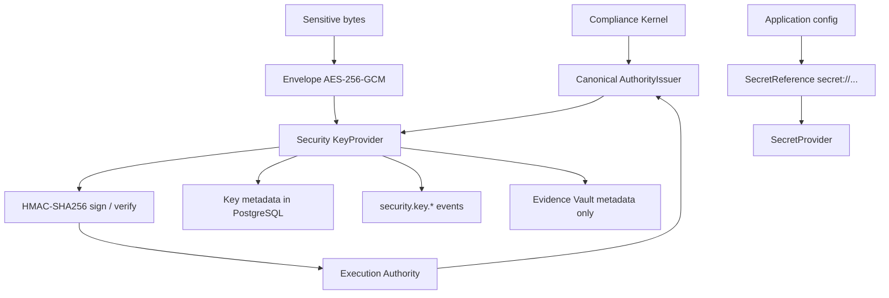

# Canonical security and cryptographic infrastructure

Owner: `packages/security`. This is the only cryptographic control plane
on this tree. Do not add `packages/crypto`, `packages/kms`, or
`packages/secrets`.

Implementation inventory: [`docs/build-status.md`](../build-status.md).

## Trust boundaries

```text
Business / domain service
    ↓  (no raw keys)
AuthorityIssuer / envelope API / SecretProvider
    ↓
KeyProvider port
    ↓
Simulation provider (this chunk)  |  future KMS / HSM / Vault adapter
```



Business code receives signatures, envelopes, and redacted types. It
does not receive raw signing keys.

## Key purposes

Typed only. Arbitrary strings are not cryptographic authority.

| Purpose | Algorithm | Use |
| --- | --- | --- |
| `EXECUTION_AUTHORITY_SIGNING` | HMAC-SHA256 | Kernel-issued authorities |
| `EVIDENCE_INTEGRITY` | SHA-256 | Deterministic vault hashing helper |
| `SESSION_SIGNING` | HMAC-SHA256 | Reserved session MAC |
| `DATA_ENCRYPTION` | AES-256-GCM | Envelope encryption |
| `SERVICE_AUTHENTICATION` | HMAC-SHA256 | Service credentials |
| `WEBHOOK_SIGNING` | HMAC-SHA256 | Outbound webhook MAC |
| `PYRAMID_CUSTODY_FUTURE` | HMAC-SHA256 | Historical reserved purpose; no custody keys here. Reyn Coin custody keys are not implemented. |
| `CHAIN_OPERATION_SIGNING` | HMAC-SHA256 | SunRey Chain simulation operation MAC. No raw chain keys in source or customer tables. |

## Algorithms

Solstice does not invent cryptography. See
`packages/security/src/algorithms.ts`.

- **HMAC-SHA256** — existing Execution Authority contract; FIPS MAC.
- **SHA-256** — existing Evidence Vault hash chain; must stay deterministic.
- **AES-256-GCM** — NIST AEAD for envelopes and DEK wrap.
- **CSPRNG** — `crypto.randomBytes` / `randomUUID` for tokens, IVs, DEKs.

Domain IDs and idempotency keys are not replaced by random tokens.

## Key lifecycle

| State | Sign / encrypt | Verify / decrypt |
| --- | --- | --- |
| PENDING | no | no |
| ACTIVE | yes | yes |
| DEPRECATED | no | yes (historical) |
| RETIRED | no | no |
| REVOKED | no | no |

- **Rotation** creates a new ACTIVE version and marks the previous ACTIVE
  version DEPRECATED. Historical signatures still verify.
- **Retirement** is a planned end of life after deprecation. It does not
  rewrite Evidence Vault records. Vault integrity is SHA-256 chaining,
  not a rotating MAC key.
- **Revocation** is a compromise kill. Every operation fails closed.

## Envelope format

```text
schemaVersion=1
algorithm=AES-256-GCM
wrappingAlgorithm=AES-256-GCM
keyId, keyVersion, purpose
iv, authTag
wrappedDek, wrappedDekIv, wrappedDekAuthTag
ciphertext
```

Never log plaintext.

## Secret references

Configuration holds `secret://<provider>/<path>`, not plaintext.
`InMemorySecretProvider` / simulation provider resolve behind the
security boundary. `SecretValue.toString()` is `[REDACTED]`.

## Local development

`SimulationKeyProvider` is labeled
`DEVELOPMENT/SIMULATION — generated local keys; not for production; no cloud KMS`.

Optional filesystem persist uses mode `0600` under a gitignored path.
Tests do not require a cloud account.

## Production-provider expectations

Future adapters (`AWS_KMS`, `GCP_KMS`, `AZURE_KEY_VAULT`,
`HASHICORP_VAULT`, `HSM`, `MPC_CUSTODY`) implement `KeyProvider` +
`SecretProvider`. This chunk does not add those SDKs and does not
connect to a live provider. `LIVE_*` stays false. `ENVIRONMENT` stays
`simulation`.

## Execution Authority

```text
Compliance Kernel → AuthorityIssuer → KeyProvider.sign
Execution Authority → AuthorityIssuer.verify → KeyProvider.verify
```

There is still one `AuthorityIssuer`. A string constructor argument is a
test convenience that builds a simulation HMAC key. Composition roots
pass a `KeyProvider`.

## Evidence Vault

Hash-chain behavior is unchanged. `sha256Hex` is the shared helper.
Key rotation does not invalidate historical evidence records.

## Prohibited practices

- Custom ciphers, MACs, password hashes, KDFs, or signature schemes
- Production secrets or private keys in Git or PostgreSQL
- Second crypto packages (`packages/crypto`, `packages/kms`, `packages/secrets`)
- Competing post-quantum roots (`packages/quantum-security`,
  `packages/crypto-v2`, `packages/pqc-core`, `packages/crypto-agility`,
  `packages/post-quantum`)
- Business services importing `SimulationKeyProvider`
- Catching a provider failure and allowing the action
- Putting key material, secrets, or plaintext in events or evidence
- Claiming quantum-proof, quantum-secure, or production-certified
  cryptography from this tree

Chunk 33 (crypto-agility / post-quantum foundation) is **stopped**
until Chunks 31 and 32 merge. See
[`chunk-33-stop.md`](./chunk-33-stop.md). Resume only by extending
this package.
