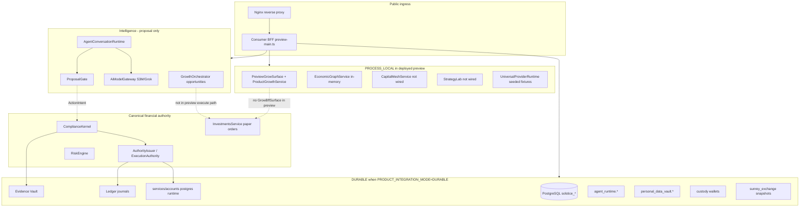

# H01 — HELIOS Repository and Runtime Truth Map

**Audit date:** 2026-09-15 UTC  
**Base SHA:** `3c13beb3df000c25b8e81b953058387d9b04774d` (`origin/main`, local clean)  
**Workspace:** `sunrey@0.1.0`  
**Posture:** `ENVIRONMENT=simulation`; all `LIVE_*` and `PRODUCTION_*` activation flags compile to `false`

---

## 1. Executive summary

HELIOS-relevant intelligence and orchestration already exists on `main` through canonical SunRey owners. There is **no** `HELIOS` package or namespace in source; the string appears only as a compute-provider fixture in Access Fabric (`provider:helios-compute`).

The **deployed public runtime** (Hetzner sandbox at `api.sunrey.xyz`) is the **Consumer BFF** (`services/api/src/preview-main.ts`), not the Platform API. It runs in simulation with `SUNREY_PRODUCT_INTEGRATION_MODE=DURABLE` by default, wiring PostgreSQL-backed accounts, ledger, evidence, agent runtime, vault, wallets, and exchange snapshots — while **Grow execution lifecycle remains in-memory** via `PreviewGrowSurface` + `ProductGrowthService`.

The **full Grow execution path** (`GrowBffSurface` → `GrowLifecycleService` → Kernel-gated paper investment) is implemented and tested in Phase E fixtures but **is not the deployed preview composition root**.

---

## 2. Fresh baseline

| Item | Value |
|------|-------|
| Current branch at audit | `main` → `cursor/helios-h01-truth-map-703d` |
| HEAD SHA | `3c13beb3df000c25b8e81b953058387d9b04774d` |
| `origin/main` SHA | `3c13beb3df000c25b8e81b953058387d9b04774d` |
| Local vs remote | Clean (`main...origin/main`) |
| Package version | `0.1.0` |
| Customer DB migration head | `V046__consumer_alpha_exchange_persistence.sql` |
| Ledger DB migration head | `V010__chain_reference_anchor.sql` |
| Evidence DB migration head | `V001__evidence.sql` |
| Security DB migration head | `V002__credential_descriptor_refs.sql` |

### Deployment configuration (relevant)

| Surface | Composition root | Mode |
|---------|------------------|------|
| Hetzner sandbox | `deploy/sunrey-sandbox-hetzner/docker-compose.yml` → `preview-main.ts` | `ENVIRONMENT=simulation`, `SUNREY_PRODUCT_INTEGRATION_MODE=DURABLE` |
| Local integrated sandbox | `infra/sandbox/docker-compose.yml` | Platform API `:8080` + Consumer BFF `:8443` |
| Local DB only | `infra/postgres/docker-compose.yml` | PostgreSQL `:5432` |
| Cloud Run | **No deploy manifests** | Secret-provider naming only (`CloudRunSecretProvider`) |
| Production IaC | `infra/sunrey-production/` | Rehearsal/fixtures; `production_authorized=false` |

---

## 3. HELIOS-relevant architecture on `main`

### A. Growth Orchestrator

| Attribute | Evidence |
|-----------|----------|
| Owner | `packages/platform` |
| Planning | `GrowthOrchestrator` (`packages/platform/src/service.ts`) |
| Product illustrations | `ProductGrowthService` (`packages/platform/src/growth/product/`) |
| Execution lifecycle | `GrowLifecycleService` (`packages/platform/src/grow/service.ts`) — proposals/commands only; no EA issuance |
| BFF full surface | `GrowBffSurface` (`services/api/src/consumer/grow.ts`) |
| Deployed preview surface | `PreviewGrowSurface` (`services/api/src/consumer/preview-grow.ts`) |
| ADR | `docs/architecture/adr/ADR-0012-mandates-and-growth-orchestrator.md` (PROPOSED, PARTIAL) |

### B. Personal Economic Graph (PEG)

| Attribute | Evidence |
|-----------|----------|
| Owner | `packages/personal-economic-graph` |
| Service | `EconomicGraphService` |
| Persistence schema | `economic_graph.*` (`V009`, `V034`) |
| PG adapter | `packages/persistence/src/economic-graph/pg-economic-graph-store.ts` |
| Authority | Non-authoritative intelligence; does not execute or hold balances |

### C. Agentic Capital Mesh

| Attribute | Evidence |
|-----------|----------|
| Owner | `packages/agentic-capital-mesh` |
| Service | `CapitalMeshService` (`src/service.ts`) |
| Persistence | `capital_mesh.*` (`V017`); PG via `pg-capital-mesh-store.ts` |
| Runtime | In-memory default; not wired into deployed BFF |
| Boundary | Cannot submit paper orders (`refusePaperOrderFromMesh`) |

### D. Strategy Lab

| Attribute | Evidence |
|-----------|----------|
| Owner | `packages/strategy-lab` |
| Service | `StrategyLab` — backtest, walk-forward, shadow, paper |
| Persistence | `strategy_lab.*` (`V018`) |
| Facade | `services/strategy-lab` (re-export only) |
| Live gate | `LIVE_STRATEGY_EXECUTION = false` |

### E. Financial Agent / Agent runtime

| Package | Role |
|---------|------|
| `packages/agent` | Personal Economy Agent — ideas/explanations only; cannot import `ActionIntent` |
| `packages/sunrey-agent` | Financial Agent — mandates, conversations, `ProposalGate` |
| BFF routes | `/api/v1/agent/*`, `/api/v1/agents/*` |
| Deployed default | `createSandboxAgentRuntime()` with `SIMULATION_ONLY` mandates |

### F. AI / model runtime

| Attribute | Evidence |
|-----------|----------|
| Owner | `packages/ai-runtime` |
| Gateway | `AiModelGateway` — S3M primary, Grok sandbox, local test |
| Posture | `AI_PRODUCTION_ACTIVE=false`, `AI_LIVE_CONNECTIVITY_ENABLED=false` |
| Preview Grok | `SUNREY_EXTERNAL_AI_PREVIEW_ENABLED` env gate in `preview-ai.ts` |
| BFF rule | Raw public LLM paths forbidden (`FORBIDDEN_PUBLIC_LLM_PATHS`) |

### G–P. Financial authority layer

See [helios-authority-matrix.json](./helios-authority-matrix.json) and section 6 below.

---

## 4. Runtime composition diagram



### Composition roots

| Root | File | Instantiates |
|------|------|--------------|
| **Deployed preview** | `services/api/src/preview-main.ts` | Durable accounts + `createSunReyPreviewRuntime()` |
| Preview runtime factory | `services/api/src/preview.ts` | `createSandboxWorld()` + durable overlays |
| Sandbox world | `services/api/src/consumer/fixtures.ts` | In-memory simulation + provider seed |
| Phase E E2E | `tests/phase-e-world.ts` | Full `GrowBffSurface` + investments + kernel |
| Platform API | `services/api/src/main.ts` | Operator/internal routes; not public Grow surface |
| Product integration durable | `services/api/src/product-integration/runtime.ts` | PG-backed accounts, agent, vault |

---

## 5. Trace: representative call paths

### 5.1 Grow request (deployed preview)

```
GET /api/v1/grow
  → handler.dispatchGrow()
  → PreviewGrowSurface.home()
  → ProductGrowthService (in-memory plans)
  → GrowOpportunityPort → GrowthOrchestrator.listOpportunities()
  → simulationPolicyPort (blocks live investment)
  → response: productionMoneyMovement=false, environment=simulation
```

**Not reached in deployed preview:** `POST /api/v1/grow/proposals/{id}/execute` via `GrowBffSurface` → Kernel → paper order.

### 5.2 Grow request (Phase E / test composition)

```
POST /api/v1/grow/proposals/{id}/execute
  → GrowBffSurface.executeProposal()
  → GrowLifecycleService.createCommand() + revalidate()
  → selectSandboxInvestmentProvider(environment: SANDBOX)
  → executeGrowInvestmentCommand()
  → InvestmentsService.createPaperOrder()
  → RiskEngine.assessPreTrade → ComplianceKernel.submit()
  → AuthorityIssuer.issue() → Ledger.postJournal()
  → GrowthAttributionLedger.skipPrincipalMovement()
  → EvidenceVault.seal()
```

### 5.3 Agent proposal

```
POST /api/v1/agent/conversations/{id}/messages
  → AgentConversationRuntime
  → AiModelGateway (S3M or optional Grok preview)
  → UserAgentMandateEngine.createProposal()
  → ProposalGate.toActionIntent() [blocks SIMULATION_ONLY]
  → ProposalGate.submitToKernel() [no EA issued by gate]
  → response: productionMoneyMovement=false
```

### 5.4 Investment / paper path (canonical)

```
InvestmentsService.createPaperOrder()
  → paperOnlyRiskControl → RiskEngine
  → ComplianceKernel.submit(investmentRisk facts)
  → AuthorityIssuer.issue()
  → PaperBrokerProvider.submitPaperOrder + produceDeterministicFill
  → applyFill → postInvestmentJournal → Ledger.postJournal
```

---

## 6. Runtime classification matrix

| Subsystem | State | Evidence |
|-----------|-------|----------|
| Compliance Kernel | DURABLE_SIMULATED | `packages/kernel`; PG evidence when durable |
| Execution Authority | DURABLE_SIMULATED | HMAC via `SimulationKeyProvider`; `PRODUCTION_HSM_KMS_CONFIGURED=false` |
| Risk Engine | DURABLE_SIMULATED / PROCESS_LOCAL | PG `V015` exists; default in-memory in sandbox |
| Ledger | DURABLE_SIMULATED | `solstice_ledger` when durable mode |
| Evidence Vault | DURABLE_SIMULATED | `solstice_evidence` when durable |
| Banking accounts | DURABLE_SIMULATED | Hetzner default DURABLE |
| Grow product plans | PROCESS_LOCAL | `ProductGrowthService` in-memory store |
| Grow execution lifecycle | FIXTURE_BACKED | PG schema `V036`; adapters exist but **not wired to preview** |
| Growth Orchestrator planning | PROCESS_LOCAL | `InMemoryGrowthStore` in preview |
| PEG | PROCESS_LOCAL / DURABLE_SIMULATED | PG adapter exists; preview uses in-memory `EconomicGraphService` |
| Agent runtime | DURABLE_SIMULATED | PG `V037`; hydrated in durable product integration |
| AI runtime (S3M) | FIXTURE_BACKED | `S3mAiProvider` simulator |
| AI runtime (Grok) | PREVIEW_ONLY / DISABLED | `SUNREY_EXTERNAL_AI_PREVIEW_ENABLED` default false |
| Strategy Lab | FIXTURE_BACKED | Not in deployed BFF |
| Capital Mesh | FIXTURE_BACKED | Not in deployed BFF |
| Exchange consumer | DURABLE_SIMULATED | Durable snapshots when `durableExchange` wired |
| Custody wallets | DURABLE_SIMULATED | `V044`; durable in Hetzner |
| Provider runtime | EXTERNAL_SANDBOX | `seedSimulationProviders()`; `LIVE_CONNECTIVITY_ENABLED=false` |
| Investments paper | DURABLE_SIMULATED | Kernel-gated; only in Phase E / direct service calls |
| Platform API | PREVIEW_ONLY | Internal/operator; not public Grow ingress |
| Cloud Run | UNAVAILABLE | No service manifests |
| Production mainnet | DISABLED | All activation flags false |

---

## 7. Simulation / live separation

### Compile-time gates (`packages/config/src/flags.ts`)

All monetary and connectivity flags are `false` constants. `assertSimulationOnly()` throws on drift.

### Service gates

| Gate | Location | Effect |
|------|----------|--------|
| `simulationPolicyPort` | `packages/platform/src/policy-port.ts` | Blocks live `INVESTMENT_EXECUTION` |
| `SIMULATION_ONLY` mandates | `services/api/src/consumer/agent.ts` | Agent cannot submit real transactions |
| `ProposalGate` | `packages/sunrey-agent/src/gate.ts` | Refuses `SIMULATION_ONLY` kernel submit |
| `selectSandboxInvestmentProvider` | `packages/investments/src/grow-adapter.ts` | Rejects non-SANDBOX providers |
| `CustodyService` constructor | `packages/custody/src/service.ts` | Throws if live flags or non-simulation providers |
| BFF domain catalog | `services/api/src/consumer/domains.ts` | Grow classified `SIMULATION` |
| AI posture | `packages/ai-runtime/src/posture.ts` | All production AI flags false |

### Silent-substitution risks (documented, not fixed in H01)

| Risk | Finding |
|------|---------|
| Fixture data vs real market data | `SUNREY_DATA_MODE` defaults to `simulation`; world external data uses fixture inventory |
| Simulated execution appearing live | BFF responses include `productionMoneyMovement: false` on Grow/Agent surfaces |
| Paper fills appearing provider-backed | Paper broker is deterministic; provider ID is sandbox routing label only |
| AI provider failure → fabricated success | Gateway returns structured refusal; `agentModelOutageIsNotFinancial` |
| Persistent vs process-local confusion | **P0 gap:** Deployed preview durably persists accounts but Grow plans/proposals are in-memory |
| Frontend cannot distinguish modes | Responses carry `environment`, `productionMoneyMovement`, `state: SIMULATION_ONLY` where implemented |

---

## 8. Persistence map

| Object | Canonical owner | Durable store | Survives restart (deployed) | In-memory alternative |
|--------|-----------------|---------------|----------------------------|------------------------|
| Customer identity | `packages/identity` | `customer.*` | Yes (DURABLE mode) | Yes |
| Economic graph | `packages/personal-economic-graph` | `economic_graph.*` | Adapter exists; preview uses memory | Yes |
| Mandate versions | `packages/platform` | `growth.mandate_version` | Adapter exists; not preview-wired | Yes |
| Grow plans (product) | `packages/platform` | None | **No** | `InMemoryProductGrowthStore` |
| Grow proposals/executions | `packages/platform` | `growth.financial_proposal`, `growth.execution_*` | Adapter exists; not preview-wired | Yes |
| Agent mandates/conversations | `packages/sunrey-agent` | `agent_runtime.*` | Yes (DURABLE mode) | Yes |
| ActionIntents | `packages/permissions` | Not stored (transient) | N/A | N/A |
| Strategies | `packages/strategy-lab` | `strategy_lab.*` | Not in BFF | Yes |
| Capital mesh candidates | `packages/agentic-capital-mesh` | `capital_mesh.*` | Not in BFF | Yes |
| Portfolios/positions (investments) | `packages/investments` | `investments.*` | When investments service wired | Yes |
| Ledger journals | `packages/ledger` | `solstice_ledger` | Yes (DURABLE mode) | Yes |
| Exchange state | `packages/sunrey-exchange` | `sunrey_exchange` + snapshots | Yes (durable exchange) | Yes |
| Custody wallets | `packages/custody` | `custody` tables `V044` | Yes (durable wallets) | Yes |
| Evidence | `packages/evidence` | `solstice_evidence` | Yes | Yes |
| Holds | `services/accounts` | **None** | **No** | Ephemeral only |
| Provider runtime control plane | `packages/sunrey-chain` | `provider_runtime.*` `V033` | Schema only in preview | In-process runtime |

---

## 9. Failure / restart survival

| Event | Survives | Gap |
|-------|----------|-----|
| BFF container restart | Accounts, ledger, agent, vault, wallets, exchange (DURABLE) | Grow plans/proposals lost |
| Worker restart | Same as BFF if shared PG | No separate worker for Grow execution |
| PostgreSQL restart | All durable domains | Requires health gate (`SUNREY_FEATURE_REQUIRE_PERSISTENCE_FOR_READY`) |
| Provider timeout | No financial mutation | Provider health recorded; sandbox fixtures may degrade |
| AI provider failure | No financial mutation | Conversation may error; no silent EA |
| Idempotency | Ledger, internal payments, wallets, exchange | Grow execution idempotency in-memory only in preview |

---

## 10. Customer isolation

Grow, agent, and PEG types carry `customerId` / `subjectId` scoping (`packages/platform/src/grow/*`, `packages/sunrey-agent`). BFF handlers derive principal from session (`BffPrincipal`). Stores filter by customer (`InMemoryGrowStore.listExecutions(customerId)`).

**No P0 cross-customer leakage identified** in inspected store query patterns. Durable exchange and wallet surfaces key by `customerId`.

---

## 11. Duplicate / legacy / compatibility paths

| Path | Status |
|------|--------|
| `GrowBffSurface` vs `PreviewGrowSurface` vs `ProductGrowthService` | Three Grow HTTP shapes; preview uses weakest (no execute) |
| Two `GrowthAttributionLedger` classes | Intentional split: banking (`packages/ledger`) vs PEVE (`packages/platform`) |
| Exchange `InMemoryCoinPort` | Simulation double; not canonical ledger |
| `/api/v1/portfolio` vs `/api/v1/grow/portfolio` | Legacy alias in domain catalog |
| `/api/v1/agents` vs `/api/v1/agent` | Parallel agent route families |
| `resources.ts` unreachable duplicate `return` rows | Dead code after early `return` in `GROW` case (cleanup) |
| Platform API vs Consumer BFF | Two HTTP entrypoints; public deploy uses BFF only |

---

## 12. Can the runtime distinguish lifecycle stages?

| Stage | Distinguishable? | Evidence |
|-------|------------------|----------|
| Research | Yes | Agent tools read-only; mesh/strategy lab simulation flags |
| Proposal | Yes | `FinancialProposal`, `AgentTransactionProposal`; explicit schemas |
| Authorization | Yes | Human approval records; Kernel decision sealed |
| Simulated/paper execution | Yes | `MARKET_SIMULATION`, `PaperBrokerProvider`, `productionMoneyMovement: false` |
| Provider execution | Partially | Sandbox provider routing; no live provider path enabled |
| Settlement | Partially | Exchange/custody simulation adapters; not live rails |
| Reconciliation | Partially | Money integration reconciliation in simulation; no live bank recon |

**Deployed preview gap:** Full execute path exists in code/tests but not in `preview-main.ts` composition — UI may expose execute routes that hit `PreviewGrowSurface` limitations.

---

## 13. Tests run (H01)

| Check | Result |
|-------|--------|
| `npm run lint:architecture` | Pass |
| `npm run check:authority-map` | Pass |
| `npm run check:production-safety` | Pass |
| Grow unit (`packages/platform/src/grow`, `growth`) | Pass |
| Agent runtime (`packages/sunrey-agent`) | Pass |
| Risk (`packages/risk`) | Pass |
| Kernel (`packages/kernel`) | Pass |
| Ledger (`packages/ledger`) | Pass |
| Consumer Grow BFF tests | Pass |
| Preview tests | Pass |
| Phase E Grow E2E | Pass |
| Persistence growth test | Skipped (`SUNREY_PERSISTENCE_TEST` not set) |
| Full `npm run ci` | Not run (scope: Phase 1 relevant suites) |
| `npm run test:persistence` | Not run (requires PostgreSQL) |
| `npm run typecheck` | Pre-existing errors in `tests/wave5-moonrey-productive-intelligence-red-team.test.ts` (unrelated) |

---

## 14. Related canonical docs

- `docs/architecture/constitution.md`
- `docs/productization/sunrey-authority-map.json`
- `docs/architecture/persistence.md`
- `docs/architecture/WAVE8_CONSUMER_API_AND_BFF.md`
- `docs/deployment/SUNREY_HETZNER_SANDBOX_DEPLOYMENT.md`
