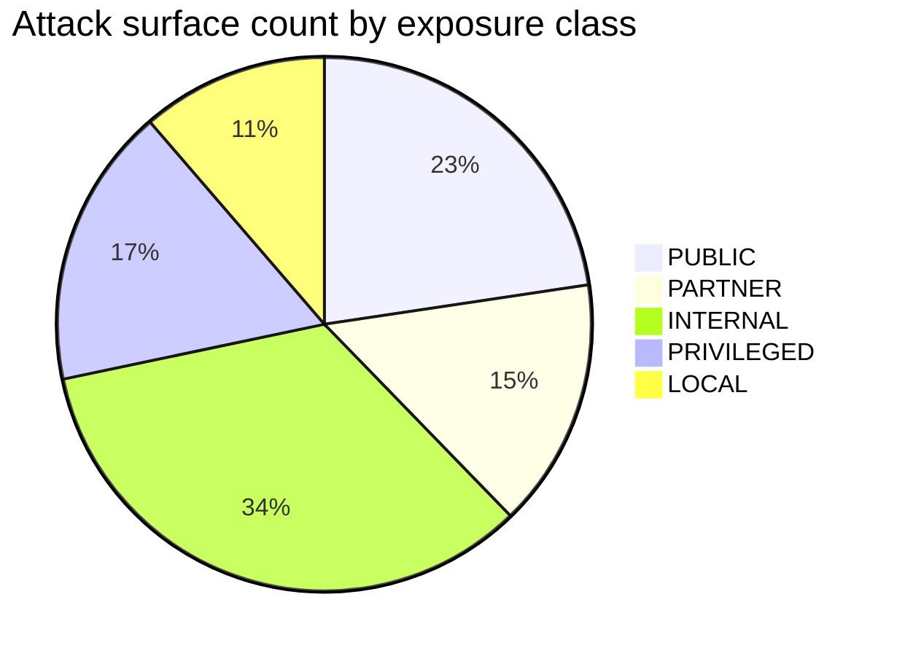

# SunRey Attack Surface Matrix

**Program:** SunRey Sovereign Architecture — Wave 9  
**Version:** 1.0.0-wave9  
**Date:** 2026-09-02  
**Companion:** `SUNREY_SYSTEM_THREAT_MODEL.md`, `SUNREY_SECURITY_TEST_PLAN.md`

This matrix inventories **attack surfaces** across the integrated SunRey platform. Each row maps exposure to controls, tests, and residual risk. Status reflects repository state on `main` as of Wave 9 audit.

**Legend**

| Exposure | Meaning |
| --- | --- |
| **PUBLIC** | Internet-reachable in production candidate |
| **PARTNER** | Authenticated third-party (providers, merchants) |
| **INTERNAL** | Application network only |
| **PRIVILEGED** | Admin, governance, KMS |
| **LOCAL** | Dev/test host only |

| Maturity | Meaning |
| --- | --- |
| **IMPLEMENTED** | Control exists with automated test |
| **PARTIAL** | Control exists; gaps documented |
| **PLANNED** | Architecture only |
| **NOT_IMPL** | Not built |

---

## 1. Summary by zone

| Zone | Surface count | Highest severity surfaces |
| --- | --- | --- |
| Public edge | 12 | Consumer API, RPC, WebSocket, OAuth callbacks |
| Partner | 8 | Provider webhooks, oracle connectors, merchant API |
| Internal | 18 | Kernel submit, ledger, Exchange, Agent, event bus |
| Privileged | 9 | Admin, governance ceremony, KMS, CI/CD |
| Local/dev | 6 | Dev P2P, local RPC, fixture transports |

---

## 2. Public HTTP APIs

| ID | Surface | Path / owner | Exposure | AuthN | AuthZ | Input validation | Rate limit | Test evidence | Residual |
| --- | --- | --- | --- | --- | --- | --- | --- | --- | --- |
| ASM-HTTP-01 | Consumer BFF | `services/api` consumer routes | PUBLIC | Bearer JWT | Server authZ context | Schema + redaction | PARTIAL | `consumer.test.ts`, range `api` | Kernel wiring gap on some mutations |
| ASM-HTTP-02 | Platform API `/api/v1` | `services/api` platform | PUBLIC | Bearer + API key | Capability model | OpenAPI validation | PARTIAL | Wave 17 malformed tests | Edge WAF external |
| ASM-HTTP-03 | Accounts orchestration | `services/accounts` | INTERNAL | Service + user | Kernel ALLOW + EA | Money integer minor | INTERNAL | accounts tests | Indirect via API |
| ASM-HTTP-04 | Identity registration/login | `packages/identity` | PUBLIC | Password/MFA/OAuth fixture | Session issuance | Argon hash | PARTIAL | `authentication-service.test.ts` | Credential stuffing |
| ASM-HTTP-05 | Grow / money agents | `packages/platform/grow` | PUBLIC | Session | Proposal bind | contentHash | PARTIAL | `grow.test.ts` | User social engineering |
| ASM-HTTP-06 | Exchange consumer | `sunrey-exchange/src/consumer` | PUBLIC | Session | Ownership | Order schema | PARTIAL | range `exchange` | Market manipulation |
| ASM-HTTP-07 | HIN consent flows | `information-market` | PUBLIC | Subject session | Purpose | Consent schema | PARTIAL | HIN tests | Consent UX bypass |
| ASM-HTTP-08 | Developer sandbox | `sunrey-sdk/developer-platform` | PARTNER | API key | App registry | Webhook schema | SIMULATION | SDK tests | Key leak |
| ASM-HTTP-09 | Health/readiness | API `/health` | PUBLIC | None | None | N/A | None | smoke tests | Info disclosure low |
| ASM-HTTP-10 | Error envelopes | All APIs | PUBLIC | N/A | N/A | Stack suppress | N/A | redaction tests | Misconfigured debug |

---

## 3. WebSockets / SSE / streaming

| ID | Surface | Owner | Exposure | Controls | Test | Residual |
| --- | --- | --- | --- | --- | --- | --- |
| ASM-WS-01 | Real-time quotes / portfolio | Exchange consumer | PUBLIC | Session bind | consumer tests | Subscription flood |
| ASM-WS-02 | Agent streaming responses | `ai-runtime` | PUBLIC | Session + mandate | productization-security | Prompt injection volume |
| ASM-WS-03 | Control room live metrics | `src/ops/control-room` | PRIVILEGED | Staff auth | control-room range | Read-only default |

---

## 4. RPC and blockchain interfaces

| ID | Surface | Protocol | Exposure | Controls | Test | Residual |
| --- | --- | --- | --- | --- | --- | --- |
| ASM-RPC-01 | Dev chain RPC | JSON-RPC | LOCAL | chain_id bind | Rust rpc tests | Untrusted if exposed publicly |
| ASM-RPC-02 | Wallet sign RPC | Internal | INTERNAL | Non-exportable key | wallet range | Endpoint on wrong host |
| ASM-RPC-03 | Light client queries | `sunrey-chain` | PUBLIC (future) | Proof verify | interop security | False header if not verified |
| ASM-RPC-04 | Mobile sync | `wallet/mobile-sync` | PUBLIC | Device binding | chunk-97 tests | Device theft |

---

## 5. P2P and validator interfaces

| ID | Surface | Owner | Exposure | Controls | Test | Residual |
| --- | --- | --- | --- | --- | --- | --- |
| ASM-P2P-01 | Block gossip | `node/src/p2p` | PARTNER (validators) | Peer identity | network range | Eclipse (dev only) |
| ASM-P2P-02 | Consensus messages | `consensus/` | INTERNAL | BFT signatures | byzantine range | >f Byzantine |
| ASM-P2P-03 | Validator admission | validators set | PRIVILEGED | Governance allowlist | governance tests | Rogue validator join |
| ASM-P2P-04 | State sync (future) | ADR-0016 | INTERNAL | Snapshot verify | NOT_IMPL | Snapshot poison |

---

## 6. Provider APIs and webhooks

| ID | Surface | Direction | Exposure | Controls | Test | Residual |
| --- | --- | --- | --- | --- | --- | --- |
| ASM-PRV-01 | Outbound bank/payment | `packages/payments` | PARTNER | SSRF, sandbox host | transport tests | Live misconfig (blocked) |
| ASM-PRV-02 | Inbound webhooks | `security/regulated/webhook` | PARTNER | HMAC, replay window | webhook tests | Stolen signing secret |
| ASM-PRV-03 | KYC provider callback | identity provider-candidate | PARTNER | Fixture only | identity tests | Fake verification |
| ASM-PRV-04 | Oracle economic feeds | `oracle/production/` | PARTNER | Certification + quorum | oracle-adversarial | Compromised certified provider |
| ASM-PRV-05 | FX / rail adapters | `payments/production-candidate` | PARTNER | Conformance sandbox | payments tests | Production flag (blocked) |
| ASM-PRV-06 | AI inference egress | `ai-runtime` | PARTNER | Egress policy | productization-security | Prompt exfil |
| ASM-PRV-07 | Blockchain analytics | kernel compliance provider-candidate | PARTNER | Fixture | compliance tests | False positive AML |

---

## 7. Database and persistence

| ID | Surface | Store | Exposure | Controls | Test | Residual |
| --- | --- | --- | --- | --- | --- | --- |
| ASM-DB-01 | PostgreSQL customer | `db/` migrations | INTERNAL | TLS, cred rotation | persistence integration | SQL injection via ORM gap |
| ASM-DB-02 | Ledger journals | ledger schema | INTERNAL | Append-only port | ledger tests | Direct DB bypass (ops) |
| ASM-DB-03 | Chain redb store | `rust/crates/storage` | INTERNAL | File permissions | storage tests | Host compromise |
| ASM-DB-04 | Evidence Vault | evidence store | INTERNAL | Hash chain | evidence tests | Partial write window |
| ASM-DB-05 | In-memory replay books | economics supply | LOCAL | **GAP: not durable** | wave3/6 red-team | Restart replay |
| ASM-DB-06 | Exchange in-memory book | exchange sim | LOCAL | No supply authority | exchange range | Not production |
| ASM-DB-07 | Recovery snapshots | `production/recovery` | PRIVILEGED | Integrity gate | persistence-attack | Corrupt snapshot restore |

---

## 8. Message / event bus

| ID | Surface | Owner | Exposure | Controls | Test | Residual |
| --- | --- | --- | --- | --- | --- | --- |
| ASM-EVT-01 | Domain events envelope | `packages/events` | INTERNAL | Versioned schema, redaction | envelope tests | PII in payload |
| ASM-EVT-02 | Outbox/inbox | events durable | INTERNAL | Idempotent consumers | event-attack range | Duplicate delivery |
| ASM-EVT-03 | Kernel decision events | evidence | INTERNAL | Sealed | kernel tests | — |
| ASM-EVT-04 | Provider quality events | provider-sdk | INTERNAL | Typed | wave4 tests | Flood |

---

## 9. Admin and governance endpoints

| ID | Surface | Owner | Exposure | Controls | Test | Residual |
| --- | --- | --- | --- | --- | --- | --- |
| ASM-ADM-01 | Control room API | `src/ops/control-room` | PRIVILEGED | Read-only default | control-room range | Break-glass write |
| ASM-ADM-02 | Staff admin routes | identity staff | PRIVILEGED | SoD, step-up | wave-7 red-team | Compromised admin |
| ASM-ADM-03 | Governance ops | `governance-ops` | PRIVILEGED | Multi-party | governance range | Ceremony key theft |
| ASM-ADM-04 | Launch ceremony | `production-ceremony` | PRIVILEGED | Offline signing rehearsal | chunk-165 tests | Not production keys |
| ASM-ADM-05 | Launch abort / recovery | chunk-167 | PRIVILEGED | Domain-scoped | staged-activation | Manual error |
| ASM-ADM-06 | Provider disable | kernel compliance | PRIVILEGED | SoD | wave-7 tests | Insider abuse |

---

## 10. Wallet, Exchange, and agent surfaces

| ID | Surface | Operation | Exposure | Controls | Test | Residual |
| --- | --- | --- | --- | --- | --- | --- |
| ASM-WAL-01 | Transaction signing | wallet | USER | Purpose-separated keys | wallet range | Malware on device |
| ASM-WAL-02 | Delegated authorization | wallet/authorization | USER | Narrowing only | wallet tests | Over-delegation |
| ASM-EXC-01 | Order submit | exchange consumer | PUBLIC | Balance check | exchange range | Wash trading |
| ASM-EXC-02 | Settlement | exchange + custody | INTERNAL | Isolated ports | custody-attack | Race |
| ASM-AGT-01 | Proposal submit | sunrey-agent | PUBLIC | Mandate + token | ai-authority range | ALLOW confusion |
| ASM-AGT-02 | Tool catalog | agent | INTERNAL | No mint tools | structural tests | New tool review |

---

## 11. Vault, identity federation, policy engine

| ID | Surface | Owner | Exposure | Controls | Test | Residual |
| --- | --- | --- | --- | --- | --- | --- |
| ASM-VLT-01 | PDV read/write | personal-data-vault | INTERNAL | Purpose + consent | wave-7 privacy | Service identity abuse |
| ASM-VLT-02 | Clean-room egress | clean-room | INTERNAL | Aggregate only | privacy range | Re-identification |
| ASM-IDF-01 | OAuth/OIDC fixture | identity provider-candidate | PARTNER | Fixture only | identity tests | Live IdP (blocked) |
| ASM-IDF-02 | Service identity mint | security/identity | PRIVILEGED | Registry | credential range | Rogue service |
| ASM-POL-01 | Policy pack load | kernel/policy | INTERNAL | Version + hash | wave-7 red-team | Pack tamper |
| ASM-POL-02 | Jurisdiction resolver | kernel | INTERNAL | DEFER unresolved | kernel tests | Wrong corridor |

---

## 12. File imports and batch ingress

| ID | Surface | Format | Exposure | Controls | Test | Residual |
| --- | --- | --- | --- | --- | --- | --- |
| ASM-IMP-01 | Economic data fabric batch | JSON envelope | PARTNER | Schema + idempotent keys | wave4 exit-gate | Poison batch |
| ASM-IMP-02 | Provider catalog YAML | config | INTERNAL | Integrity check | integrity:check | Supply-chain edit |
| ASM-IMP-03 | Genesis / snapshot import | binary | PRIVILEGED | Hash verify | recovery tests | Malicious snapshot |
| ASM-IMP-04 | Migration SQL | `db/` | PRIVILEGED | Versioned | db:migrate | Destructive migration |

---

## 13. Deployment pipeline and infrastructure

| ID | Surface | Component | Exposure | Controls | Test | Residual |
| --- | --- | --- | --- | --- | --- | --- |
| ASM-DEP-01 | GitHub Actions CI | `.github/workflows` | PRIVILEGED | Ordered stages, secret scan | `npm run ci` | Runner compromise |
| ASM-DEP-02 | Container images | deploy artifacts | PRIVILEGED | Digest pin (target) | reproducible-builds.md | Image tamper |
| ASM-DEP-03 | npm registry | dependencies | EXTERNAL | lockfile, audit | dependency-policy | Dependency CVE |
| ASM-DEP-04 | DNS / TLS | edge | PUBLIC | Cert management | external | Mis-issuance |
| ASM-DEP-05 | Secret manager | KMS port | PRIVILEGED | SecretReference | wave-7 prompt 28 | KMS misconfig |
| ASM-DEP-06 | Environment flags | config | PRIVILEGED | simulation enforced | deployment posture CI | LIVE_* flip (blocked) |

---

## 14. Secrets and cryptographic material

| ID | Secret class | Storage | Exposure | Controls | Test | Residual |
| --- | --- | --- | --- | --- | --- | --- |
| ASM-SEC-01 | Session signing keys | KeyProvider | PRIVILEGED | Rotation overlap | security tests | Key leak |
| ASM-SEC-02 | Webhook HMAC secrets | SecretReference | INTERNAL | Versioned | webhook tests | Log exposure |
| ASM-SEC-03 | DB credentials | deploy mount | PRIVILEGED | Never in repo | secret scan | Host access |
| ASM-SEC-04 | Validator private keys | validator zone | PRIVILEGED | Ceremony | signer range | Host compromise |
| ASM-SEC-05 | Wallet keys | HSM contract sim | USER | Non-exportable | chunk-96 | Endpoint bug |
| ASM-SEC-06 | API keys (merchant/dev) | hashed / ref | PARTNER | Scope | SDK tests | Client-side leak |

---

## 15. Cross-surface attack chains

High-impact chains combine multiple surfaces:

| Chain ID | Steps | Goal | Mitigation depth |
| --- | --- | --- | --- |
| CHAIN-01 | Stolen API key → IDOR attempt → Kernel submit | Unauthorized transfer | AuthZ + Kernel (defense in depth) |
| CHAIN-02 | Webhook spoof → payment state advance | Fake deposit | HMAC + idempotency (no EA without Kernel) |
| CHAIN-03 | Agent prompt inject → tool call → proposal | Unauthorized intent | ProposalGate; no EA |
| CHAIN-04 | Provider poison → fabric → oracle quorum | Skew productive path | Quarantine + no auto-mint |
| CHAIN-05 | Restart → replay claim → Chunk 71 | Double SunRey | **GAP:** durable replay |
| CHAIN-06 | CI compromise → malicious deploy → flag flip | Production activation | Layered gates + scan |
| CHAIN-07 | Admin session → break-glass → parameter change | Governance abuse | SoD + evidence + ceremony |
| CHAIN-08 | Eclipse + partition → double-spend on RPC | User confusion | Light client verify (future) |

---

## 16. Surface × threat taxonomy heat map

Rows = surface groups; columns = threat classes. **H** = high relevance, **M** = medium, **L** = low.

| Surface ↓ / Threat → | AUTHN | AUTHZ | SUPPLY | REPLAY | ORACLE | SYBIL | PRIVACY | KEYS | DOS | SUPPLY_CHAIN |
| --- | --- | --- | --- | --- | --- | --- | --- | --- | --- | --- |
| Public HTTP | H | H | M | M | L | M | M | L | H | L |
| RPC/P2P | M | M | H | H | L | L | L | H | H | L |
| Provider/webhook | H | M | M | H | H | L | M | M | M | M |
| Kernel/Ledger | M | H | H | H | L | L | L | M | M | L |
| Database | L | M | M | H | L | M | H | M | M | L |
| Admin/Gov | H | H | H | L | L | L | M | H | L | M |
| Agent/AI | M | H | M | M | L | M | M | L | H | L |
| Exchange | H | H | M | M | M | L | L | M | M | L |
| CI/CD | M | H | H | L | L | L | L | H | L | H |

---

## 17. Hardening backlog (from surface review)

| Priority | Surface | Gap | Wave / owner |
| --- | --- | --- | --- |
| P0 | ASM-DB-05 | Durable replay registry | Wave 3/6 |
| P0 | ASM-HTTP-01 | Kernel → postJournal on all financial BFF paths | Wave 8 |
| P1 | ASM-PRV-04 | Durable fabric journal | Wave 4 |
| P1 | ASM-RPC-01 | Production RPC hardening + rate limits | Pre-mainnet |
| P1 | ASM-WS-02 | Agent cost circuit breaker | ai-runtime |
| P2 | ASM-DEP-02 | Image digest enforcement in deploy | Ops |
| P2 | ASM-HTTP-* | Edge WAF | Infrastructure |
| P2 | ASM-P2P-01 | Eclipse resistance | Chain networking |

---

## 18. Document history

| Version | Date | Change |
| --- | --- | --- |
| 1.0.0-wave9 | 2026-09-02 | Initial attack surface matrix (Wave 9 Task 4 / 11) |
