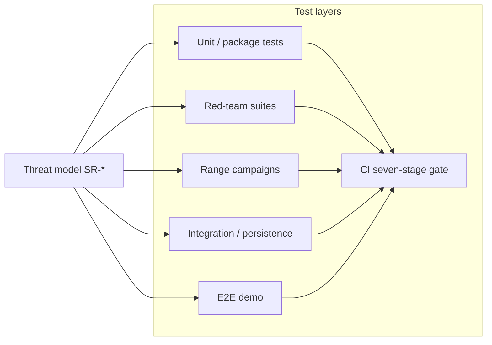

# SunRey Security Test Plan

**Program:** SunRey Sovereign Architecture — Wave 9 (Master Adversarial Testing Plan)  
**Version:** 1.0.0-wave9  
**Date:** 2026-09-02  
**Companion:** `SUNREY_SYSTEM_THREAT_MODEL.md`, `SUNREY_ATTACK_SURFACE_MATRIX.md`

This plan maps **threats and security requirements** to **executable tests** across Waves 2–8 building blocks. All execution is confined to **local, sandbox, testnet, and isolated range environments**. **No destructive attacks against real or public infrastructure.**

**Constraints (non-negotiable):**

- `ENVIRONMENT=simulation`; all `LIVE_*` flags remain `false`
- No real network calls to banks, FX, or live providers
- No weakening of CI, Kernel gating, or ledger invariants
- No production HSM/KMS activation (`PRODUCTION_HSM_KMS_CONFIGURED=false`)

---

## 1. Test strategy overview



| Layer | Purpose | Frequency | Owner |
| --- | --- | --- | --- |
| L1 Unit | Function-level invariants | Every PR | Package owners |
| L2 Red-team | Cross-cutting attack scenarios | Wave completion + regression | `tests/wave-*-red-team*` |
| L3 Range | Compound adversarial campaigns | CI smoke + nightly extended | `packages/sunrey-range` |
| L4 Integration | PostgreSQL, recovery, wiring | CI persistence job | `test:persistence` |
| L5 E2E | Product demo path | CI stage 5 | `npm run demo` |
| L6 CI gate | Architecture, gating, secrets | Every PR | `npm run ci` |
| L7 External | Independent audit, pentest | Pre-mainnet (external) | Not in repo |

---

## 2. Risk-based test prioritization

Tests are prioritized by threat model severity (see `SUNREY_SYSTEM_THREAT_MODEL.md` §8.3):

| Priority | Threat IDs | Minimum test coverage |
| --- | --- | --- |
| P0 | R-W9-01, R-W9-02, R-W9-03 | Durable replay, proof roots, Kernel HTTP wiring |
| P1 | R-W9-04, R-W9-06, R-W9-09 | Sybil, admin abuse, agent ALLOW |
| P2 | R-W9-05, R-W9-07, R-W9-08, R-W9-10 | Fabric, validator, supply-chain, webhooks |

---

## 3. Wave mapping — what each wave contributes to adversarial testing

| Wave | Focus | Exit gate (audit) | Primary test artifacts | Wave 9 reliance |
| --- | --- | --- | --- | --- |
| Wave 2 | Blockchain core | PASS | `phase-g-red-team`, `wave-3-prompt-8-blockchain-security`, Rust `abuse.rs` | Supply, consensus, replay on chain |
| Wave 3 | Economic proof | FAIL | `wave3-economic-proof-red-team` | Claim fingerprint, proof types (gaps explicit) |
| Wave 4 | Economic Awareness | FAIL | `wave-4-economic-awareness-exit-gate` | Provider quarantine, observation envelope |
| Wave 5 | MoonRey productive | PASS | `wave5-moonrey-productive-intelligence-red-team` | GPUV path, oracle quorum |
| Wave 6 | Human economy | FAIL | HEC package tests (286), `human-economy` range | Consent, human-worth firewall |
| Wave 7 | Privacy/identity/policy | PASS | `wave-7-privacy-identity-policy-red-team`, prompt-28 privileged | IDOR, SoD, KMS simulation |
| Wave 8 | Product integration | **NOT VERIFIED** | `consumer.test.ts`, persistence job | BFF wiring, PostgreSQL default |

---

## 4. Security requirement → test matrix

| Req ID | Requirement (summary) | Automated test(s) | Range scenario(s) | Manual / future |
| --- | --- | --- | --- | --- |
| SR-01 | Chunk 71 sole supply gate | `phase-g-red-team`, economics issuance tests | `CHUNK_71`, `constitution-attack`, `moonrey`, `protocol-treasury` | External economic audit |
| SR-02 | Durable claim consumption | `wave3-economic-proof-red-team` (simulation) | `human-economy`, `productive-attack` | **Add:** restart replay test (P0) |
| SR-03 | Cross-source dedup | economic-proof package tests | `productive-attack`, `human-economy` | Wire bridge integration test |
| SR-04 | Oracle quorum | wave5 red-team, oracle engine tests | `oracle`, `oracle-adversarial` | Provider compromise drill |
| SR-05 | Human contribution gates | HEC taxonomy tests | `human-economy` | Attestation mesh (future) |
| SR-06 | Agent no EA | agent structural tests, import guards | `ai-authority` | Red-team workshop |
| SR-07 | Kernel gating CI | `scripts/check-kernel-gating.mjs` | `compliance-attack` | — |
| SR-08 | Ledger append-only | ledger package tests | `persistence-attack` | DB pentest (external) |
| SR-09 | AuthZ / IDOR | `wave-7-privacy-identity-policy-red-team` | `api`, `endpoint`, `credential` | — |
| SR-10 | Privacy / forbidden keys | wave6/7 privacy tests | `privacy` | Log scanning in staging |
| SR-11 | Validator accountability | Rust consensus tests | `byzantine`, `signer`, `network` | Multi-region BFT testnet |
| SR-12 | Exchange settlement | exchange consumer tests | `exchange`, `custody-attack` | — |
| SR-13 | Secret scan | CI stage 7 | — | Git history audit |
| SR-14 | Recovery integrity | `test:persistence` | `persistence-attack` | DR tabletop |
| SR-15 | Production activation firewall | production-activation tests | `governance`, `compound-production` | Ceremony rehearsal |
| SR-16 | Supply chain | `npm run security:test`, integrity checks | — | SBOM diff on release |
| SR-17 | DoS / rate limits | API malformed tests | `endpoint` | Load test staging |
| SR-18 | Vault consent | wave7 red-team | `privacy` | Subject access audit |

---

## 5. Master test catalog by attack tree

| Attack tree | Objective | Primary tests | Pass criteria |
| --- | --- | --- | --- |
| AT-01 | Unauthorized SunRey | phase-g, wave3/6 red-team, range CHUNK_71 | No supply increase without `authorizeIssuance` |
| AT-02 | Unauthorized MoonRey | wave5 red-team, moonrey range | `moonreyIssuanceActivated()` false; oracle-only rejected |
| AT-03 | Double monetization | wave3 red-team Task 4, human-economy range | `DUPLICATE_CONTRIBUTION` or replay block |
| AT-04 | Fake productive output | wave5 Tasks 4–5, productive-attack | Quorum/staleness/category rejection |
| AT-05 | Fake human contribution | HEC tests, human-economy range | Class/consent/attestation denial |
| AT-06 | Governance authority | governance range, chunk 164–165 tests | Freeze hash binding; no PRODUCTION_ACTIVE |
| AT-07 | Consensus compromise | byzantine range, Rust abuse | Invalid blocks rejected; app_hash deterministic |
| AT-08 | Steal user assets | wave-7 red-team, grow tests, wallet range | IDOR denied; EA required |
| AT-09 | Vault consent bypass | wave7 privacy, privacy range | Purpose violation codes |
| AT-10 | Agent unauthorized execute | ai-authority range, agent isolation | No journal post from agent path |
| AT-11 | Exchange settlement corrupt | exchange + custody-attack range | No supply mutation; settlement reconcile |

---

## 6. Range campaign plan (`packages/sunrey-range`)

### 6.1 CI smoke (every PR / `npm run ci` subset)

```bash
sunrey-range -- campaign --production-safety-smoke
```

| Invariant set | Scenarios (representative) |
| --- | --- |
| `CHUNK_71_MONETARY_AUTHORITY` | constitution-attack, moonrey, protocol-treasury |
| `KERNEL_CANNOT_BE_BYPASSED` | compliance-attack |
| `AI_CANNOT_EXECUTE` | ai-authority |
| `ASSET_SUPPLYBOOK_CANONICAL` | economic-stress |
| `PRODUCTION_NOT_ACTIVE` | compound-production |

**Pass:** All scenarios `PROTECTED` or `DEGRADED_BUT_SAFE`; zero `INVARIANT_BREACH`.

### 6.2 Nightly extended

```bash
sunrey-range -- campaign --production-safety-extended
```

Includes full `SCENARIO_CATALOG` (53+ scenario families):

| Family | Prefix | Threat focus |
| --- | --- | --- |
| Byzantine | BFT | Consensus, equivocation |
| Network | NET | Partition, flood |
| Signer | SIGNER | Key purpose confusion |
| Wallet | WALLET | Signing boundary |
| Oracle | ORACLE | Observation manipulation |
| MoonRey | MOONREY | Productive issuance path |
| Machine | MACHINE | Automated output abuse |
| Exchange | EXCHANGE | Settlement integrity |
| Privacy | PRIVACY | PII leak |
| Custody | CUSTODY | Travel rule, isolation |
| Governance | GOV | Parameter abuse |
| Interop | INTEROP | Cross-chain packets |
| API | API | HTTP abuse |
| Compound | COMPOUND | Multi-step chains |
| Human economy | HUMAN | SunRey bridge |
| Payment | PAYMENT | Corridor abuse |
| Persistence | PERSIST | Crash, replay |
| Control room | CONTROL | Admin read-only |

### 6.3 Wave 9 new scenarios (scaffolding — implement in Prompt 2+)

| Scenario ID (proposed) | Threat | Seed fixture | Status |
| --- | --- | --- | --- |
| W9-REPLAY-RESTART | Process restart clears replay Set | `sunrey.range.fixture.v157` | **PLANNED** |
| W9-BFF-KERNEL-WIRE | BFF financial path without Kernel | API integration | **PLANNED** |
| W9-FABRIC-POISON-DURABLE | Durable fabric batch poison | wave4 envelope | **PLANNED** |
| W9-SYBIL-MESH | Many subjects same fingerprint | human-economy | **PLANNED** |
| W9-PROOF-BUNDLE-MISSING | Issuance without EconomicProofBundle | economic-proof | **PLANNED** |

---

## 7. Package-level test inventory

### 7.1 Wave red-team suites

| File | Tests | Wave | Run command |
| --- | --- | --- | --- |
| `tests/phase-g-red-team.test.ts` | Authority, tx, state | 2 | `npm test -- phase-g` |
| `tests/wave-3-prompt-8-blockchain-security.test.ts` | Chain security | 2/3 | `npm test -- wave-3-prompt-8` |
| `tests/wave3-economic-proof-red-team.test.ts` | Claims, roots gaps | 3 | `npm test -- wave3-economic` |
| `tests/wave-4-economic-awareness-exit-gate.test.ts` | Fabric, providers | 4 | `npm test -- wave-4-economic` |
| `tests/wave5-moonrey-productive-intelligence-red-team.test.ts` | MoonRey path | 5 | `npm test -- wave5-moonrey` |
| `tests/wave-7-privacy-identity-policy-red-team.test.ts` | Policy, authZ | 7 | `npm test -- wave-7-privacy` |
| `tests/wave-7-prompt-28-privileged-security.test.ts` | KMS, secrets | 7 | `npm test -- prompt-28` |

### 7.2 Rust / chain adversarial

| Path | Focus |
| --- | --- |
| `packages/sunrey-chain/node/tests/abuse.rs` | Invalid blocks, admission |
| `packages/sunrey-chain/node/tests/determinism.rs` | State determinism |
| `packages/sunrey-chain/rust/crates/*/tests/` | Crypto, consensus, storage |

### 7.3 Property and fuzz targets

From `docs/security/audit-readiness/threat-model-stride.md`:

| Target | Tool | CI | Extended |
| --- | --- | --- | --- |
| SRCB transaction decode | libFuzzer (recommended) | assurance corpus | 24h campaign |
| PQC hybrid envelope | property tests | unit | 8h fuzz |
| Interop packets | `security.rs` | yes | 12h cargo fuzz |
| Provider JSON | transport mutating fixtures | yes | 4h |
| API bodies | Wave 17 malformed | yes | DAST staging only |

---

## 8. CI validation pipeline (repository checks)

Wave 9 documentation validation runs the **existing** CI sequence without modification:

```bash
npm run integrity:check    # JSON + merge integrity preflight
npm run ci                 # Seven stages (see AGENTS.md)
npm run test:persistence   # Separate job: db:up, migrate, persistence tests
```

| Stage | Validates | Threat coverage |
| --- | --- | --- |
| 1 Architecture | Linter, constitution | Authority boundaries |
| 2 Deployment posture | simulation flags | LIVE_* manipulation |
| 3 Kernel gating | Mutator registry | SR-07 |
| 4 Tests | Unit + red-team | SR-01–SR-18 partial |
| 5 Demo | E2E product path | Integration |
| 6 Typecheck | Type safety | Injection/tamper classes |
| 7 Secret scan | No secrets in git | SR-13 |

**Do not reorder, skip, or weaken these stages.**

---

## 9. Test environments

| Environment | Use | Network | Data |
| --- | --- | --- | --- |
| Local unit | Developer, CI | None / mocked | Synthetic |
| Sandbox providers | Payment, KYC, oracle | Fixture transports only | Catalog fixtures |
| Dev four-validator chain | Consensus abuse | Local P2P | Genesis sim |
| PostgreSQL CI job | Persistence, recovery | Docker localhost | Migrated schema |
| `sunrey-range` | Compound attacks | Isolated | `fixtureVersion` pinned |
| Staging (future) | DAST, load | TLS, WAF | Anonymized |

---

## 10. Manual and external test phases (pre-mainnet)

| Phase | Activity | Owner | Gate |
| --- | --- | --- | --- |
| M1 | Independent threat model workshop | External | Sign-off on SR-* |
| M2 | Application pentest (staging) | External firm | `INDEPENDENT_SECURITY_AUDIT_SCOPE.md` |
| M3 | Ceremony rehearsal (Chunks 164–165) | Governance ops | Transcript integrity |
| M4 | Launch abort drill (Chunk 167) | Governance ops | Recovery gates |
| M5 | DR / reconciliation tabletop | Ops + persistence | SR-14 |
| M6 | Provider compromise simulation | Security + oracles | SR-04 |

---

## 11. Test execution schedule (Wave 9 program)

| When | Action | Command / artifact |
| --- | --- | --- |
| Every PR | Full CI + integrity | `npm run ci` |
| Every PR | Architecture lint | stage 1 |
| Daily | Extended range campaign | `sunrey-range -- campaign --production-safety-extended` |
| Wave 9 Prompt 2+ | Implement W9-* scenarios | `packages/sunrey-range/src/scenarios/` |
| Pre-PR Wave 9 | Document drift check | Threat model ↔ test matrix reconcile |
| Pre-mainnet | External pentest | Out of repo |

---

## 12. Failure handling

| Result | Action |
| --- | --- |
| `INVARIANT_BREACH` in range | Block merge; file incident; map to SR-* |
| Red-team regression | Bisect; no "fix" by weakening gate |
| Persistence test fail | Block Wave 8/9 integration claims |
| Secret scan hit | Rotate secret; rewrite history if needed |
| Known gap test (durable replay) | Record as **expected fail** until implemented; do not delete test |

---

## 13. Reporting template (Wave 9 test run)

```markdown
## Wave 9 adversarial test report

**Date:** YYYY-MM-DD
**Commit:** <sha>
**Environment:** simulation

### CI
- integrity:check: PASS/FAIL
- ci seven stages: PASS/FAIL
- persistence job: PASS/FAIL

### Range smoke
- INVARIANT_BREACH count: 0
- DEGRADED_BUT_SAFE: <list>

### Red-team suites
| Suite | Pass | Fail | Skip |
| --- | --- | --- | --- |

### Known expected failures (documented gaps)
- <test id>: <reason / wave blocker>

### Recommendation
- Proceed to Prompt N / Block on <SR-*>
```

---

## 14. Prompt 2+ implementation checklist

Wave 9 Prompt 1 (this document) is **analysis and scaffolding only**. Prompt 2+ should:

1. Add `W9-REPLAY-RESTART` range scenario with explicit expected-fail until durable registry lands.
2. Add integration test asserting BFF financial mutations route through Kernel (Wave 8 prerequisite).
3. Extend `wave3-economic-proof-red-team` with restart harness.
4. Wire threat IDs into `packages/security/src/productization/threat-model.ts` machine catalog.
5. Update `vulnerability-register.json` for any new findings (open ≠ accepted for production).

**Do not execute Prompt 2 automatically from Prompt 1.**

---

## 15. Document history

| Version | Date | Change |
| --- | --- | --- |
| 1.0.0-wave9 | 2026-09-02 | Initial master security test plan (Wave 9 Task 10 / 11) |
