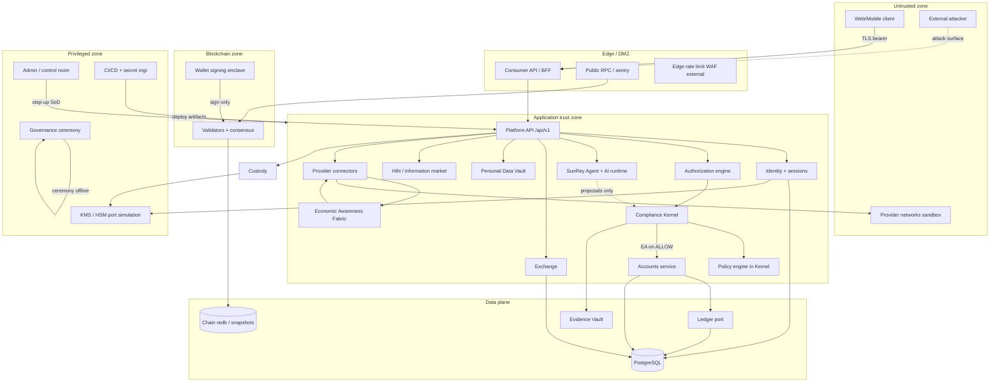

# SunRey System Threat Model

**Program:** SunRey Sovereign Architecture — Wave 9 (Adversarial Security & Production Readiness)  
**Version:** 1.0.0-wave9  
**Date:** 2026-09-02  
**Status:** Engineering analysis — does **not** activate mainnet, flip `LIVE_*` flags, or claim external audit completion  
**Environment:** `ENVIRONMENT=simulation`; all `LIVE_*` flags `false`; `PRODUCTION_HSM_KMS_CONFIGURED=false`

**Companion documents:**

| Document | Role |
| --- | --- |
| `SUNREY_ATTACK_SURFACE_MATRIX.md` | Enumerated surfaces, protocols, and exposure classes |
| `SUNREY_SECURITY_TEST_PLAN.md` | Adversarial test mapping to Waves 2–8 and range campaigns |
| `docs/architecture/SUNREY_MONETARY_AUTHORITY_CONTRACT.md` | Canonical supply authority contract |
| `docs/security/audit-readiness/threat-model-stride.md` | Prior STRIDE catalog (Wave 6 Prompt 17) |
| `docs/security/chunk-157-production-adversarial-resilience.md` | Range campaign invariants |

**Wave exit-gate context (read before relying on this model):**

| Wave | Exit gate | Implication for threat model |
| --- | --- | --- |
| Wave 2 Blockchain | PASS | Consensus, replay, supply boundary controls are test-backed |
| Wave 3 Economic Proof | FAIL | Durable claim registry, five roots, proof bundles not implemented |
| Wave 4 Economic Awareness | FAIL | Durable fabric journal, federation not implemented |
| Wave 5 MoonRey | PASS (simulation) | Productive path fail-closed; in-memory persistence residual |
| Wave 6 Human Economy | FAIL | Durable anti-replay, attestation mesh, proof-bundle wiring incomplete |
| Wave 7 Privacy/Identity/Policy | PASS (simulation) | Kernel policy boundary holds; durability gaps on some BFF paths |
| Wave 8 Product Integration | **NOT VERIFIED** | Required completion report absent on `main`; Kernel HTTP wiring gaps documented |

This threat model assumes **sophisticated adversaries** and models both implemented controls and **known gaps** from prior wave audits. Residual risk is elevated where durable persistence, proof roots, and product integration remain incomplete.

---

## 1. Purpose and scope

### 1.1 Objectives

1. Provide a **formal, repeatable** threat model for the entire SunRey platform.
2. Classify assets, actors, trust boundaries, attack surfaces, and abuse cases.
3. Score risk with a consistent methodology suitable for production readiness review.
4. Convert threats into **security requirements** with control, test, monitoring, and incident-response mappings.
5. Inform Wave 9 adversarial testing without weakening production controls.

### 1.2 In scope

- Monetary supply (`SUNREY_COIN`, `MOONREY_COIN`)
- Validator consensus and blockchain state
- Transaction authorization and Execution Authority
- Economic Claims, Evidence/Rights/Policy commitments
- Oracle Mesh and provider connectors
- Human Contribution verification and Sybil resistance
- Identity, privacy, consent, and PDV
- Agents (ProposalGate only)
- Exchange settlement
- Consumer and Platform APIs
- Databases and persistence recovery
- Governance and admin/control-room surfaces
- Provider integrations (sandbox/fixture only)
- Infrastructure, CI/CD, secrets, and supply chain

### 1.3 Out of scope (explicit)

- Live penetration testing against public infrastructure
- Legal/regulatory certification claims
- Formal verification proofs (property tests and range campaigns substitute)
- Activation of mainnet or any `LIVE_*` capability

---

## 2. Critical assets (Task 1)

Assets are classified by **confidentiality**, **integrity**, and **availability** impact. Monetary and consensus assets are tier **T0** (existential).

| Asset ID | Asset | Tier | Primary owner | Integrity requirement | Confidentiality |
| --- | --- | --- | --- | --- | --- |
| A-01 | `SUNREY_COIN` canonical supply (`AssetSupplyBook`) | T0 | `packages/sunrey-chain/src/economics/` | Append-only issuance via Chunk 71 only | Public aggregates; issuance evidence restricted |
| A-02 | `MOONREY_COIN` canonical supply | T0 | Same | Same | Same |
| A-03 | User fiat ledger balances (customer positions) | T0 | `packages/ledger`, `services/accounts` | Kernel-gated journals only | Account owner + authorized staff |
| A-04 | Native chain wallet balances (simulation custody) | T1 | `packages/custody`, chain wallet | Authorized transfers only | Owner keys |
| A-05 | Validator keys (consensus, proposal, P2P) | T0 | `packages/sunrey-chain/src/validators/` | Non-exportable; purpose-separated | Highly restricted |
| A-06 | Governance keys / ceremony signers | T0 | `src/governance-ops/`, `src/production-ceremony/` | Ceremony-bound; multi-party | Offline / HSM candidate |
| A-07 | Wallet signing keys | T0 | `packages/custody`, chain wallet | Sign-only; no API export | User/HSM boundary |
| A-08 | Economic Claims (human + productive) | T1 | `human-economic-contribution`, `productive/` | Fingerprint + monetization lock | Minimized; no raw PDV |
| A-09 | Evidence commitments (Kernel + economic) | T1 | `packages/evidence`, `economic-proof/` | Hash-chained / sealed | Redacted payloads |
| A-10 | Rights commitments (ACCESS-08) | T1 | `packages/sunrey-chain/src/access/` | Domain-scoped; no title transfer | Off-chain raw data |
| A-11 | Policy commitments | T1 | `packages/kernel/src/policy/` | Versioned packs; monotonic proofs | Decision receipts |
| A-12 | Identity records (login, KYC metadata) | T1 | `packages/identity` | SoD + step-up | PII minimized in logs |
| A-13 | Consent records | T1 | `packages/consent`, HIN | Purpose-bound; revocable | Subject-bound |
| A-14 | PEVE (human valuation evidence) | T2 | `human-economic-contribution/src/valuation/` | Non-authoritative for mint alone | Sensitive |
| A-15 | GPUV (productive value evidence) | T2 | `productive/policy-governance/value-function/` | Non-authoritative for mint alone | Operational |
| A-16 | Provider data / oracle observations | T2 | `packages/external-data`, oracles | Provenance + certification gate | License + purpose |
| A-17 | Exchange order books / positions | T1 | `packages/sunrey-exchange` | Matching integrity | Customer scoped |
| A-18 | Ledger journal history | T0 | `packages/ledger` | Append-only | Internal + audit |
| A-19 | Transaction history (chain + API) | T1 | chain node, API | Deterministic ordering | User scoped |
| A-20 | Evidence Vault (hash chain) | T0 | `packages/evidence` | Immutable seals | Structured metadata |
| A-21 | API credentials (merchant, developer) | T1 | `packages/sunrey-sdk`, API | Scoped capabilities | Secret |
| A-22 | Service identities | T1 | `packages/security/src/identity.ts` | Capability-bound | Rotatable |
| A-23 | Admin / staff credentials | T0 | `packages/identity` staff | SoD, dual-control | Highly restricted |
| A-24 | Deployment secrets | T0 | `packages/security`, `packages/config` | SecretReference only | Never in domain config |
| A-25 | Provider credentials | T1 | regulated provider-candidate adapters | Fixture/sandbox only | `secret://` refs |
| A-26 | Customer personal information (PDV, HIN) | T0 | `packages/personal-data-vault`, HIN | Encrypted; purpose firewall | Never on public chain |

**Conservation invariants (must hold under attack):**

- Chunk 71 gate is the sole native supply mutator.
- Ledger journals require verified Execution Authority.
- Agent proposals never receive Execution Authority for monetary mutation.
- Oracle observations alone cannot mint.
- PEVE/GPUV/reference values do not equal authorized coin quantity.

---

## 3. Actor model (Task 2)

| Actor ID | Actor | Capability | Typical objective | Trust level |
| --- | --- | --- | --- | --- |
| ACT-01 | Ordinary user | Authenticated API, wallet | Legitimate use | Trusted with own resources |
| ACT-02 | Malicious user | Same as ACT-01 | IDOR, fraud, double-claim | Untrusted |
| ACT-03 | Sybil attacker | Many identities | Multiply human rewards | Untrusted |
| ACT-04 | Fraudulent contributor | Fake human/productive events | Unauthorized issuance | Untrusted |
| ACT-05 | Malicious productive asset operator | Provider-side data | Inflate GPUV / productive claims | Untrusted |
| ACT-06 | Malicious oracle/provider | Signed observations | Manipulate consensus inputs | Untrusted until certified |
| ACT-07 | Compromised provider | Valid credentials | Silent data poisoning | Semi-trusted → hostile |
| ACT-08 | Malicious employee | Limited staff role | Escalate, exfiltrate | Insider threat |
| ACT-09 | Compromised administrator | Stolen admin session | Break-glass abuse | Insider threat |
| ACT-10 | Malicious administrator | Rogue operator | Supply/governance manipulation | Insider threat |
| ACT-11 | Compromised API service | Service identity theft | Lateral movement | Infrastructure threat |
| ACT-12 | Compromised AI agent | Mandate + token | Unauthorized proposals | Bounded; no EA |
| ACT-13 | Malicious AI prompt/input | User-supplied content | Injection, policy exfil | Untrusted input |
| ACT-14 | Validator operator | Node operations | Liveness, censorship | Semi-trusted |
| ACT-15 | Malicious validator | Signing keys | Equivocation, fork | Untrusted (BFT assumed) |
| ACT-16 | Byzantine validator set | >f malicious | Consensus violation | Threat model assumes <f |
| ACT-17 | Governance participant | Ceremony signer | Parameter change | Highly trusted process |
| ACT-18 | Compromised governance signer | Stolen ceremony key | Unauthorized parameter auth | Critical insider |
| ACT-19 | Exchange attacker | Order flow access | Manipulation, front-run | Untrusted |
| ACT-20 | External network attacker | Internet reach | DDoS, exploit, credential stuffing | Untrusted |
| ACT-21 | Supply-chain attacker | CI/npm/image | Backdoor, secret theft | Infrastructure threat |

**Authority rule:** No actor below `HUMAN_GOVERNANCE` with valid `MonetaryIssuanceAuthority` may mutate `AssetSupplyBook`. Consensus finality alone is not issuance authority (Wave 2 red-team verified).

---

## 4. Trust boundaries (Task 3)

### 4.1 Boundary diagram



### 4.2 Boundary control summary

| Boundary | Crosses | Required controls |
| --- | --- | --- |
| Untrusted → Edge | HTTP/WebSocket | TLS 1.2+, authN, rate limits, CORS, input validation |
| Edge → Application | Internal RPC/HTTP | Service identity, no shared god key, server-derived authZ context |
| Application → Kernel | ActionIntent | Six proofs; monotonic combine; no client-supplied ALLOW |
| Kernel → Ledger | postJournal | Verified Execution Authority; idempotency keys |
| Application → Chain | Native asset ops | Signed txs; Chunk 71 authorization; replay registry |
| Application → PDV/HIN | Reads/writes | Purpose firewall; consent; clean-room egress |
| Application → Providers | Outbound HTTP | SSRF policy, approved hosts, fixture-only in simulation |
| Privileged → Application | Admin mutations | SoD, dual-control, evidence sealing, read-only control room default |
| CI/CD → Runtime | Deploy | Signed artifacts, secret scan, immutable tags, no prod secrets in git |

**Known gap (Wave 8):** Consumer BFF may not route all financial mutations through Kernel → `postJournal` HTTP path (`services/api` consumer test asserts absence). This is a **trust-boundary wiring gap**, not an authority leak in the Kernel itself.

---

## 5. Threat taxonomy (Task 5)

| Class | Description | Primary assets | Example abuse |
| --- | --- | --- | --- |
| AUTHENTICATION | Identity spoofing | Sessions, API keys, validator keys | Stolen bearer, forged webhook |
| AUTHORIZATION | Policy/capability bypass | All mutation paths | IDOR, agent impersonation |
| PRIVILEGE_ESCALATION | Role or scope expansion | Admin, service identity | Support → provider disable |
| SUPPLY_MANIPULATION | Unauthorized mint/burn | A-01, A-02 | Forge issuance authority |
| CONSENSUS_FAILURE | BFT violation | Validators, chain state | Equivocation, fork |
| REPLAY | Reuse of valid artifacts | Claims, txs, tokens | Duplicate settlement |
| DOUBLE_SPEND | Same value spent twice | Balances, native assets | Replay + race |
| DOUBLE_MONETIZATION | Same claim → two issuances | A-08 | Cross-source duplicate |
| ORACLE_MANIPULATION | Bad observations | A-16 | Single-source mint attempt |
| SYBIL | Many fake identities | A-12, A-08 | Multiply human rewards |
| DATA_POISONING | Corrupt inputs | Fabric, providers | Inflate productive output |
| CLAIM_FRAUD | Fake contributions | Human/productive claims | Self-attestation |
| MODEL_AI_ABUSE | Prompt/tool injection | Agent, AI runtime | Exfil policy, flood cost |
| EXCHANGE_MANIPULATION | Order book abuse | A-17 | Wash trade, settlement skew |
| PRIVACY_LEAK | PII disclosure | A-26, consent | Chain anchor of forbidden keys |
| KEY_COMPROMISE | Signing material theft | A-05–A-07 | Forge transfers |
| SECRET_LEAK | Credential exposure | A-21–A-25 | Log/git leak |
| DENIAL_OF_SERVICE | Availability attack | APIs, validators | Login flood, RPC spam |
| STATE_CORRUPTION | DB/chain desync | PG, chain store | Partial write, reorg mishandling |
| SUPPLY_CHAIN_ATTACK | Build compromise | CICD, dependencies | Malicious npm package |
| DEPENDENCY_COMPROMISE | Third-party lib | All | CVE in crypto lib |
| INSIDER_THREAT | Trusted actor abuse | Admin, operator | Break-glass without evidence |
| RECOVERY_FAILURE | DR restores unsafe state | Snapshots, WAL | Replay book loss |

---

## 6. STRIDE and economic abuse-case analysis (Task 6)

STRIDE applies to **control-plane and API surfaces**. **Economic abuse-case modeling** applies to monetary and claim paths.

### 6.1 STRIDE matrix (selected)

| Surface | S | T | R | I | D | E |
| --- | --- | --- | --- | --- | --- | --- |
| Consumer API | Stolen session | Body tampering after sign | Kernel receipts | IDOR responses | Rate limits | Client `userId` ignored |
| Kernel submit | Fake actor context | Intent field swap | Evidence Vault | Decision leak | Policy engine DoS | Agent as human |
| Ledger postJournal | Forged EA | Journal line edit | Append-only audit | Balance leak | DB lock | Direct SQL |
| Validator P2P | Impersonate peer | Block header tamper | Commit certs | — | Gossip flood | — |
| Provider webhook | Fake bank callback | Amount change | HMAC + replay window | — | Webhook flood | — |
| Agent ProposalGate | Mandate forgery | Proposal hash swap | — | Prompt in logs | AI cost abuse | Self-approve |

### 6.2 Economic abuse-case template

Each economic threat documents:

| Field | Question |
| --- | --- |
| Attacker profit | What do they gain? |
| Invariant violated | Which conservation or authority rule breaks? |
| Evidence manipulated | What seal, fingerprint, or attestation is forged? |
| Identity exploited | Human, service, provider, or validator? |
| Detection | What signal fires? |
| Current control | What blocks it today? |
| Gap | What Wave 3/4/6/8 item remains? |

**Example — Economic Claim replay (human):**

| Field | Value |
| --- | --- |
| Attacker profit | Second SunRey issuance for same contribution |
| Invariant | One monetization per canonical fingerprint |
| Evidence | Re-submit same `replayIdentifier` / settlement auth |
| Identity | Sybil or same subject multiple wallets |
| Detection | `replayIdentifier` collision; supply book audit |
| Control | In-memory `usedReplayIds`; Chunk 71 gate |
| Gap | **Durable** replay book across restart (Wave 6 FAIL) |

---

## 7. Attack trees (Task 7)

Notation: `AND` = all children required; `OR` = any child sufficient.

### 7.1 AT-01: Create unauthorized SunRey

```text
GOAL: Increase SUNREY_COIN supply without valid Chunk 71 authorization
├── OR: Bypass Chunk 71 gate
│   ├── AND: Reach authorizeIssuance() caller
│   │   ├── OR: Compromise governance ceremony signer (ACT-18)
│   │   ├── OR: Exploit MAINNET activation bug (blocked: layered gates)
│   │   └── OR: SQL/injection into supply book (blocked: no PG supply authority)
│   ├── OR: Mutate AssetSupplyBook directly
│   │   ├── OR: Exchange DB write (blocked: FORBIDDEN_SUPPLY_MUTATORS)
│   │   ├── OR: Frontend/API mint endpoint (blocked: no such path)
│   │   └── OR: AI/Agent tool (blocked: structural isolation)
│   └── OR: Consensus-only mint
│       └── Forge block without MonetaryIssuanceAuthority (blocked: Wave 2)
└── OR: Replay valid issuance
    ├── Reuse replayIdentifier (mitigated in-memory; gap: durable)
    └── Restore snapshot with old replay state (recovery threat)
```

**Residual risk:** HIGH until durable replay + proof-bundle wiring (Waves 3/6).

### 7.2 AT-02: Create unauthorized MoonRey

```text
GOAL: MoonRey issuance without productive authorization path
├── OR: Oracle-only path
│   └── Standalone observation → mint (blocked: rejectOracleOnlyMint)
├── OR: GPUV auto-mint
│   └── Reference value → quantity (blocked: separate authorized quantity)
├── OR: V1 formula bypass
│   └── Coexistence with V2 (mitigated: V2 path tested; deprecate V1)
└── OR: Production activation flip
    └── LIVE_MOONREY flag (blocked: hardcoded false + Chunk 143)
```

### 7.3 AT-03: Monetize same Economic Claim twice

```text
GOAL: Two issuances for one economic event
├── OR: Same fingerprint, different claim IDs
│   └── DUPLICATE_CONTRIBUTION (simulation engine)
├── OR: Cross-source same event, different canonical IDs
│   └── Entity resolution gap (Wave 4 FAIL)
├── OR: Human + productive both monetize
│   └── Cross-domain lock (partial)
├── OR: Restart clears replay Set
│   └── Process restart (KNOWN GAP)
└── OR: Multi-validator duplicate submit
    └── No durable claim registry (Wave 3 FAIL)
```

### 7.4 AT-04: Create fake productive output

```text
GOAL: Inflate MoonRey pipeline inputs
├── OR: Fabricate oracle observation
│   ├── Uncertified provider (blocked: admission gate)
│   └── Compromised certified provider (quarantine + independence analysis)
├── OR: Relabel capacity as output
│   └── Category guards (blocked: CLAIM_TYPES)
├── OR: Single-source quorum
│   └── Quorum minimum (blocked)
└── OR: Poison Economic Awareness Fabric
    └── In-memory journal only (gap: durable fabric — Wave 4)
```

### 7.5 AT-05: Create fake human contribution

```text
GOAL: SunRey from non-contribution
├── OR: Monetize profile/demographics (blocked: class taxonomy)
├── OR: Self-attestation only (blocked: independent attestation required)
├── OR: HIN without consent (blocked: purpose firewall)
├── OR: Human-worth score path (blocked: structural refusal)
└── OR: Sybil many subjects
    └── Partial: fingerprint; no attestation mesh (Wave 6 gap)
```

### 7.6 AT-06: Gain governance authority

```text
GOAL: Control production parameters / launch
├── OR: Steal ceremony signer key
├── OR: Bypass Chunk 164 freeze hash binding
├── OR: Flip staging config to PRODUCTION_ACTIVE (blocked: firewall)
├── OR: Staff SUPER_ADMIN (blocked: no such role)
└── OR: AI approves governance (blocked: aiAttemptedApproval)
```

### 7.7 AT-07: Compromise validator consensus

```text
GOAL: Finalize invalid app_hash or censor
├── OR: >f Byzantine validators (out of BFT assumption)
├── OR: Equivocation without evidence (mitigated: evidence_root semantics)
├── OR: Network partition / eclipse (PARTIAL: dev P2P only)
└── OR: Invalid state transition in block
    └── Deterministic state machine rejects (Wave 2)
```

### 7.8 AT-08: Steal another user's assets

```text
GOAL: Transfer fiat or native assets from victim
├── OR: Session hijack → API transfer
│   └── MFA, refresh rotation, ownership registry
├── OR: IDOR on accountId (blocked: RESOURCE_NOT_OWNED)
├── OR: Forge Execution Authority
│   └── HMAC scope + TTL (Kernel only issuer)
├── OR: Wallet key exfiltration
│   └── Non-exportable HSM contract (simulation)
└── OR: Exchange settlement redirect
    └── Custody isolation + order binding
```

### 7.9 AT-09: Bypass Vault consent

```text
GOAL: Read/write PDV without subject consent
├── OR: API purpose mismatch (blocked: purpose registry)
├── OR: Chain anchor of raw PDV (blocked: forbidden keys policy)
├── OR: Log/redaction leak (mitigated: Prompt 17 redaction)
├── OR: Clean-room aggregate bypass (simulation port)
└── OR: Compromised service identity with vault:read
    └── Capability scoping + audit
```

### 7.10 AT-10: Make AI Agent execute unauthorized action

```text
GOAL: Financial mutation via agent
├── OR: Agent receives Execution Authority (blocked: structural)
├── OR: ProposalGate bypass (blocked: capability token verify)
├── OR: Kernel ALLOW interpreted as execute (blocked: agent path never posts)
├── OR: Prompt injection → tool abuse
│   └── Injection detect; no mint tools in catalog
└── OR: Mandate wider than human intent
    └── Mandate may only narrow authority
```

### 7.11 AT-11: Corrupt Exchange settlement

```text
GOAL: Trade without funds or wrong asset
├── OR: Double-fill same order (idempotency + state machine)
├── OR: Cross-asset confusion SunRey/MoonRey (separate ports)
├── OR: Exchange mints native coin (blocked: red-team)
├── OR: Price oracle → issuance (blocked: valuation ≠ price)
└── OR: Settlement race with custody (isolation tests)
```

---

## 8. Risk scoring methodology (Task 8)

### 8.1 Severity scale

| Level | Definition | Monetary | Privacy | Consensus |
| --- | --- | --- | --- | --- |
| **CRITICAL** | Unauthorized supply change, ledger rewrite, or >f consensus break | Direct loss / inflation | Mass PII breach | Chain halt or fork |
| **HIGH** | AuthZ bypass on financial mutate, durable replay fail, key compromise | Customer loss | Sensitive leak | Degraded finality |
| **MEDIUM** | IDOR read, DoS, partial desync | Indirect / contained | Limited exposure | Liveness only |
| **LOW** | Informational leak, misconfiguration w/o exploit | Negligible | Metadata | None |
| **INFORMATIONAL** | Hardening opportunity | None | None | None |

### 8.2 Rating formula (qualitative)

```
Risk = f(Impact, Exploitability, Detectability, Scope)
```

| Factor | 1 (low) | 3 (medium) | 5 (high) |
| --- | --- | --- | --- |
| Impact | No user funds | Single account | Protocol supply |
| Exploitability | Requires ceremony + insider | Stolen session | Unauthenticated |
| Detectability | Immediate invariant alarm | Audit within hours | Silent until reconcile |
| Scope | Single tenant | Service-wide | Cross-plane |

**Priority band:** CRITICAL if Impact=5 and Exploitability≥3. **Do not fabricate CVSS** unless computed with consistent vector for all items.

### 8.3 Top risks (ranked)

| ID | Threat | Severity | Likelihood | Residual |
| --- | --- | --- | --- | --- |
| R-W9-01 | Durable replay book absent (restart double-monetize) | CRITICAL | Medium (ops restart) | HIGH until Wave 3/6 durable registry |
| R-W9-02 | Economic proof roots not block-committed | HIGH | Low (simulation) | HIGH for mainnet |
| R-W9-03 | Kernel HTTP path disconnected on some BFF flows | HIGH | Medium | MEDIUM until Wave 8 wiring |
| R-W9-04 | Sybil / attestation mesh incomplete | HIGH | Medium | HIGH for human issuance scale |
| R-W9-05 | Fabric journal ephemeral | MEDIUM | Medium | MEDIUM for oracle poisoning |
| R-W9-06 | Stolen admin credentials | CRITICAL | Low | MEDIUM (SoD + evidence) |
| R-W9-07 | Compromised validator (<f) | HIGH | Low in dev | LOW in 4-node sim; HIGH at scale |
| R-W9-08 | Supply-chain / CI compromise | CRITICAL | Low | MEDIUM (scan + SBOM) |
| R-W9-09 | Agent ALLOW misunderstanding | HIGH | Medium | LOW (no EA) |
| R-W9-10 | Provider webhook spoof | HIGH | Medium | LOW (HMAC + sandbox) |

---

## 9. Security requirements (Task 9)

Format: **THREAT → REQUIREMENT → CONTROL → TEST → MONITORING → IR**

| Req ID | Threat | Requirement | Control | Test | Monitoring | Incident response |
| --- | --- | --- | --- | --- | --- | --- |
| SR-01 | Unauthorized SunRey/MoonRey | Only Chunk 71 `authorizeIssuance` mutates supply | `FORBIDDEN_SUPPLY_MUTATORS`, `refuseForbiddenMutator` | `phase-g-red-team`, `wave5-moonrey-*`, range `CHUNK_71` | Supply reconciliation job; `issuedPostGenesis` delta alerts | Freeze issuance; governance review; evidence export |
| SR-02 | Economic Claim replay | Claim consumption canonical, durable, atomic with monetary transition | `replayIdentifier` + durable registry (target) | `wave3-economic-proof-red-team`, range human-economy | Replay collision metric | Halt bridge; compensating burn proposal |
| SR-03 | Double monetization cross-source | Single monetization lock per fingerprint cluster | `DUPLICATE_CONTRIBUTION`, economic-proof clustering (target wire) | Wave 3 red-team Task 4 | Fingerprint collision rate | Invalidate claim; manual review |
| SR-04 | Oracle manipulation | No single-source mint; quorum + independence | `evaluateOracleSafety`, certification gate | `oracle-adversarial`, wave5 oracle tests | Provider quarantine events | Disable provider; rollback observations |
| SR-05 | Fake human contribution | Contribution class + attestation + consent gates | HEC taxonomy, HIN engine, bridge refusal | `wave-6` package tests, range human-economy | `CONTRIBUTION_NOT_HUMAN_WORTH` denials | Suspend subject; audit consent |
| SR-06 | Agent unauthorized execute | Agent proposals ≠ ActionIntent; no EA on agent path | ProposalGate, import isolation | `ai-authority` range, agent structural tests | Agent proposal → Kernel decision ratio | Revoke mandate; kill agent session |
| SR-07 | Kernel bypass | All mutators kernel-gated in CI | `check-kernel-gating.mjs` | CI stage 3 | New mutator without gate fails build | Block deploy; revert commit |
| SR-08 | Ledger tamper | Append-only; EA required | `Ledger.postJournal` | ledger invariant tests | Journal hash chain verify | Point-in-time restore; forensic journal |
| SR-09 | IDOR / authZ bypass | Server-derived `AuthorizationContext` | `ResourceOwnershipRegistry`, SoD | `wave-7-privacy-identity-policy-red-team` | `RESOURCE_NOT_OWNED` rate | Disable account; force re-auth |
| SR-10 | Privacy leak | Forbidden keys never on chain/logs | PDV firewall, log redaction | Wave 6/7 privacy tests | Redaction violation alerts | Purge logs; notify subject |
| SR-11 | Validator equivocation | Evidence + slashing semantics | `evidence_root`, accountability tests | `byzantine` range, Rust abuse tests | Equivocation detector | Isolate validator; ceremony rotate |
| SR-12 | Exchange settlement corrupt | Idempotent order state machine | Exchange consumer ops | `exchange` range scenarios | Settlement mismatch reconcile | Halt matching; custody freeze |
| SR-13 | Secret leak | No raw secrets in config/git | SecretReference, secret scan CI | CI stage 7 | Secret scan fail | Rotate all affected refs |
| SR-14 | Recovery unsafe state | Replay book restored with snapshot integrity | `production/recovery` integrity gate | `persistence-attack` range | Snapshot hash mismatch | Fail closed; refuse traffic |
| SR-15 | Governance unauthorized activation | AUTHORIZED_CANDIDATE ≠ PRODUCTION_ACTIVE | Chunks 143–167 firewall | `governance`, `constitution-attack` range | `PRODUCTION_NOT_ACTIVE` invariant | Abort ceremony; launch-abort playbook |
| SR-16 | Supply-chain compromise | Lockfiles, SBOM, reproducible builds | `dependency-policy.md`, CI scan | `npm run security:test` | Dependency advisory feed | Pin rollback; rebuild from known good |
| SR-17 | DoS | Rate limits + circuit breakers | API classes, provider SDK | `endpoint` range | 429/503 rates | Enable WAF; scale edge |
| SR-18 | Vault consent bypass | Purpose-bound PDV access | consent + purpose registry | Wave 7 red-team | Purpose violation codes | Revoke token; audit access log |

---

## 10. Detection and response (summary)

### 10.1 Detection layers

| Layer | Mechanism | Owner |
| --- | --- | --- |
| Invariant | Range campaigns, property tests | `packages/sunrey-range` |
| Authorization | Kernel decision codes, authZ denials | `packages/kernel`, identity |
| Economic | Supply book reconcile, replay collisions | `economics/supply.ts` |
| Evidence | Hash chain verify | `packages/evidence` |
| Privacy | Forbidden field scanner | PDV, HIN |
| Ops | Control room read-only default | `src/ops/control-room` |

### 10.2 Incident response phases

1. **Contain** — Halt issuance, freeze exchange matching, revoke credentials (no auto mainnet resume per Chunk 167).
2. **Assess** — Export Evidence Vault chain; compare ledger vs supply book vs chain `app_hash`.
3. **Eradicate** — Patch; rotate keys; quarantine providers.
4. **Recover** — Snapshot restore only after integrity gate; replay book must reconcile.
5. **Learn** — Update threat model, range scenario, vulnerability register.

---

## 11. Residual risk statement

SunRey **simulation** demonstrates strong **authority boundaries** (Chunk 71, Kernel gating, agent isolation, oracle non-mint). **Production readiness** remains blocked by:

1. Incomplete sovereign economic proof (Wave 3 FAIL)
2. Non-durable monetization replay protection (Waves 3/6)
3. Incomplete Economic Awareness durability (Wave 4)
4. Unverified Wave 8 product integration
5. No external audit, pentest, or production HSM/KMS
6. `ENVIRONMENT=simulation` and all `LIVE_*` false by design

This document **does not** authorize mainnet activation. Wave 9 Prompt 2 executes adversarial tests per `SUNREY_SECURITY_TEST_PLAN.md`.

---

## 12. Document history

| Version | Date | Change |
| --- | --- | --- |
| 1.0.0-wave9 | 2026-09-02 | Initial system threat model (Wave 9 Task 11) |
