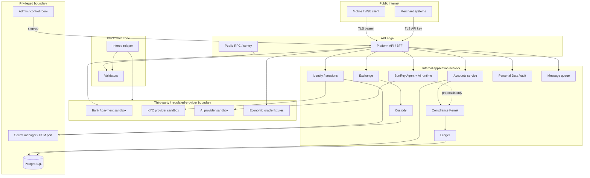

# Trust boundaries

## Diagram

## Boundary crossings

| Crossing | From → To | Control |
| --- | --- | --- |
| Public internet | Client → API edge | TLS, bearer auth, rate limits, CORS policy |
| Public internet | Client → RPC | replay guards, chain ID, no admin |
| Internal network | API → services | service identity / mTLS refs, no shared god key |
| Third-party | Provider adapters → vendors | SSRF policy, approved base URL, SecretReference |
| Regulated-provider | Custody/payments → bank sandbox | fixture-only, LIVE_* false |
| Privileged | Admin → operations | named roles, step-up, break-glass evidence |
| Privileged | Services → HSM/KMS | KeyProvider port, no export |
| Privileged | Services → database | role-scoped SQL, no public route |

## Default deny

Public API and public RPC cannot reach databases, HSM, or admin surfaces directly.
See `docs/productization/SUNREY_SECURITY_BASELINE.md` §7.

## Logging / telemetry boundary

Structured logs exit the API with redaction (`services/api/src/logging.ts`).
Provider transport logs use `packages/provider-sdk/src/redaction.ts`.

## Simulation posture

`ENVIRONMENT=simulation`. All `LIVE_*` flags false. Interop production paths fail closed unless separately authorized.
